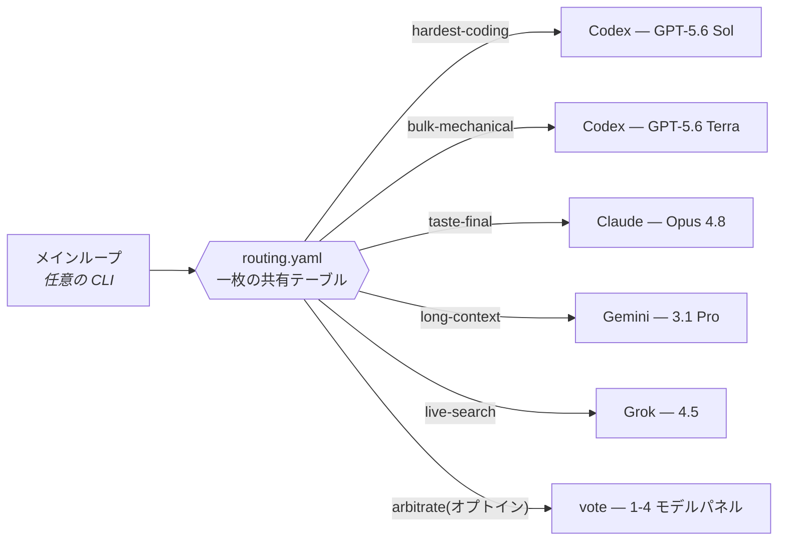

<div align="center">

# omnilane

### ルーティングテーブルは一枚、ハーネスは全部。

*メインループはもう、どのモデルを使うか迷わない。*<br/>
すべてのサブタスクを、その作業が本当に得意なモデルへ——<br/>
**Claude Code · Codex · Grok Build · Antigravity** を横断、いまのサブスクリプションのままで。

[](https://github.com/Seraphim0916/omnilane/actions/workflows/ci.yml)
[](LICENSE)
[](https://github.com/Seraphim0916/omnilane/tags)

[English](README.md) · [繁體中文](README.zh-TW.md) · [简体中文](README.zh-CN.md) · **日本語** · [한국어](README.ko.md)

</div>

---

```bash
git clone https://github.com/Seraphim0916/omnilane && cd omnilane
./install.sh          # CLI を検出、スキルを接続、あなたの言語で対話
omnilane route hardest-coding "auth トークン更新テストの不安定さを修正"
```

omnilane は、**どの** agentic CLI のメインループでも、サブタスクをレーンに
分類し、各レーンをその作業が最も得意なベンダー CLI へヘッドレスで
ディスパッチさせる仕組みです。既存のサブスクリプションログインをそのまま使います:



<div align="center">

| | | |
|:---:|:---:|:---:|
| 🧭 **一枚のテーブル**<br/>四つのハーネスで共有 | 🪂 **フォールバックチェーン**<br/>手持ちの CLI へ自動降格 | 🗳️ **オピニオンパネル**<br/>重大な判断はマルチモデル投票 |
| 🔒 **安全機構**<br/>ロック · ウォッチドッグ · ネスト禁止 | 🌏 **五言語対応**<br/>インストーラーが母語で対話 | ↩️ **完全可逆**<br/>`--uninstall` で全て元通り |

</div>

## 🧭 仕組み

- **`routing.yaml`** — レーン → ベンダー+モデル+推論エフォート。
  一つのファイルを四つのハーネスが共有します。
- **フォールバックチェーン** — レーンには複数の候補を並べられます
  (`codex … | claude … | off`)。実際にインストールされている最初のベンダー
  CLI が選ばれるため、一〜二社の契約でも同じテーブルが機能します。
- **`scripts/dispatch.sh <レーン> "<タスク>"`** — テーブルを解決し、
  該当ベンダーの CLI をヘッドレスで起動します。
- **`skills/omnilane/SKILL.md`** — 四つのハーネス共通のスキル:
  自分のモデルを特定し、自分のレーンは自前で実行、残りはディスパッチ。

## 🛤️ レーン一覧(デフォルト。実効値は `scripts/dispatch.sh --list` で確認)

| レーン | 第一候補 | バックアップ | 用途 |
|---|---|---|---|
| 🔥 hardest-coding | GPT-5.6 Sol (xhigh) | Claude Opus 4.8 (high) | 最難関の実装、根本原因デバッグ、正確性が要の変更 |
| 🏗️ bulk-mechanical | GPT-5.6 Terra (max) | Claude Sonnet 5 (high) | リファクタ、移行、テスト、大規模スイープ |
| 🧹 triage | GPT-5.6 Luna (medium) | Gemini 3.5 Flash (Low) | 大量の一次スクリーニング |
| ⚖️ hard-judgment | GPT-5.6 Sol (max) | Claude Opus 4.8 (high) | アーキテクチャ裁定、深い推論、セカンドオピニオン |
| ✒️ taste-final | Claude Opus 4.8 (high) | GPT-5.6 Sol (max) | 対外文章、prompt/ドキュメント推敲、スタイル最終審 |
| 🎨 ui-draft | GPT-5.6 Sol (xhigh) | Claude Opus 4.8 (high) | デザインシステム/参考画像がある場合の UI ドラフト |
| 📚 long-context | Gemini 3.1 Pro (High) | Claude Opus 4.8 (high) | 100 万トークン級の長文統合——分析専用、agentic ループ禁止 |
| ⚡ fast-agentic | Gemini 3.5 Flash (High) | GPT-5.6 Luna (high) | 高速なマルチステップ agentic ループ、マルチモーダル確認 |
| 📡 live-search | Grok 4.5 | —(off) | リアルタイム X/ウェブ検索とソーシャル文脈 |
| 🚰 coding-overflow | Grok 4.5 | —(off) | Codex クォータ逼迫時の中級コーディング逃し弁 |
| 🗳️ arbitrate | off(オプトイン) | — | 内蔵オピニオンパネル(重大な判断用)——デフォルト無効。`routing.local.yaml` で有効化;投票者×ラウンドごとに 1 コール消費 |

**バックアップ**はチェーンの次の候補——第一候補のベンダー CLI が未インストールの
ときにディスパッチが降格する先です。

> **Claude Fable 5 はどこ?** 意図的にデフォルト表に入れていません:Claude の
> 最上位ティアは通常*メインループ自身*であり、ディスパッチされるワーカーでは
> ないため(価格も Opus より上)。設定メニューのモデル一覧には載っているので、
> 使いたければ自分でルーティングできます(例:`routing.local.yaml` に
> `taste-final: claude claude-fable-5 high`)。

<details>
<summary><b>👉 どのレーンを自分で実行する?メインモデルを選択</b></summary>

<br/>

上の表はベンダー非依存です——レーンの*最適*モデルは、誰が操縦していても
変わりません。変わるのは、どのレーンを**自分で実行**するか(すでにそのモデル
なので追加コールなし)、どれを**ディスパッチ**するか。CLI の `omnilane` スキルが
該当行を自動適用します。これはその人間向けビューです。

- **Claude Code · Fable 5** — 自分で実行:hard-judgment、taste-final、正確性が最重要の難修正。ディスパッチ:機械的コーディング量 → Codex、長文 → Gemini、リアルタイム検索 → Grok。
- **Claude Code · Opus 4.8** — 自分で実行:taste-final。hard-judgment は Codex Sol へ(素の知能スコアが Opus より上)、コーディングは全て Codex レーン、長文 → Gemini、リアルタイム検索 → Grok。
- **Codex · Sol** — 自分で実行:hardest-coding、hard-judgment、ui-draft。ディスパッチ:taste-final → Claude、長文 → Gemini、リアルタイム検索 → Grok、大量作業 → Codex Terra。
- **Codex · Terra** — 自分で実行:bulk-mechanical。本当に最難関の部分は Sol へエスカレーション;taste → Claude、長文 → Gemini、リアルタイム検索 → Grok。
- **Grok Build · Grok 4.5** — 自分で実行:live-search、coding-overflow(中級コーディング)。難しい作業は全て Codex/Claude/Gemini へ——先に全 API シグネチャと引用事実を検証。
- **Antigravity · Gemini** — 自分で実行:long-context(3.1 Pro)、fast-agentic(Flash)。コーディング/判断/文章は Codex/Claude へ;リアルタイム検索 → Grok。3.1 Pro では agentic ツールループチェーンを決して受けない。

</details>

## 🚀 インストール

前提:ルーティングしたいベンダー CLI(`codex`、`claude`、`grok`、`agy`)が
ログイン済みで `PATH` 上にあること——**持っている分だけで OK**、
足りないレーンは自動的に降格します。

最速:`./install.sh` — 本機の CLI を検出してスキルを接続し、残りのプラグイン
コマンドを表示、実効ルーティングを出力し、最後に対話式設定メニューを
提案します(`--uninstall` で元に戻せます)。インストーラーはシステム言語に
合わせて英/繁中/簡中/日/韓を自動選択(`OMNILANE_LANG=ja` で強制可)。
さらに任意で、各 CLI の指示ファイル(`~/.claude/CLAUDE.md`、
`~/.codex/AGENTS.md`、`~/.grok/Agents.md`、`~/.gemini/GEMINI.md`——パスは
CLI バージョンにより異なる場合あり)へマーカー付きの可逆な
**常駐ルーティングリマインダー**を追記できます。非対話インストールは
`OMNILANE_HOOKS=all|none|claude,codex` を指定。手動接続:

- **Claude Code**:プラグインとしてインストール(`/route`、`/route-jobs`
  コマンド付き)、または `skills/omnilane` を `~/.claude/skills/` へ。
- **Codex**:`skills/omnilane` を `~/.codex/skills/` へ配置/リンク。
- **Grok Build**:`grok plugin install <このリポジトリ> --trust`
- **Antigravity**:`agy plugin install <このリポジトリ>`(先に
  `agy plugin validate` で確認)

## ⚙️ カスタマイズ

三層、すべて任意:

1. **対話メニュー** — `scripts/configure.sh` が全レーンを表示し、レーンごとに
   ベンダー → モデル → エフォートを選択(候補リスト+自由入力)、結果を
   `~/.omnilane/routing.local.yaml` に書き込みます。
2. **`~/.omnilane/routing.local.yaml`** — 手書きのオーバーライド。
   書式は `routing.yaml` と同じで、ローカルが優先。
3. **`~/.omnilane/local.sh`** — マシン固有のバイナリパス、プロキシ、認証
   ラッパー。全ランナーが読み込み、コミットされません。

確認はいつでも:

```
scripts/dispatch.sh --list     # 実効テーブル(フォールバック解決を注記)
```

## 📖 コマンドリファレンス

```
dispatch.sh [--background] [--mode advise|work] [--workdir DIR]
            [--model M] [--effort E] LANE "TASK"   # "-" で stdin から読む
dispatch.sh --list
jobs.sh list | status ID | result ID
configure.sh                                        # 対話式レーンメニュー
```

終了コード:`2` 使い方エラー、`3` レーン無効(off)、`4` チェーン内に利用可能な
CLI なし、`86` ネストディスパッチ拒否、`87` ロック待ちタイムアウト。
それ以外はワーカー自身の終了コードを透過。

## 🎭 モード

- **advise(デフォルト)** — 読み取り専用ワーカー。Codex は read-only
  サンドボックス、Claude は Read/Glob/Grep のみ、Grok は plan モード。
- **work** — 指定した `--workdir` 内でのみファイル編集可。Codex は
  workspace-write、Claude は編集自動承認、Gemini は accept-edits モード。

## 🔒 安全機構

- **ネストディスパッチ禁止** — ワーカーの再ディスパッチを拒否
  (`OMNILANE_DEPTH` ガード、終了コード 86)。
- **Codex 直列化ロック** — 同一ターゲットディレクトリへの codex
  ディスパッチはキューイング。クラッシュ残留ロックは所有者 PID で検出し
  安全に奪取。
- **ウォッチドッグ** — 全ワーカーは `timeout`/`gtimeout`、どちらも無ければ
  perl-alarm フォールバック下で実行(素の macOS がこのケース)。
- **バックグラウンドジョブ** — `--background` ワーカーは独立した process
  group で動き、呼び出し元の終了後も生存。kill された場合は終了コードを
  記録し、`jobs.sh status` が `dead` を報告。
- **ペイロード上限** — 巨大なタスクテキストは自動で頭尾トランケート。

## 📊 デフォルト値と出典

デフォルトのレーン割当は Artificial Analysis の 2026-07 スナップショット
(AA サイトの生レコードと各社公式価格ページで照合済み)と公開の比較レビューに
基づきます。これは意見であって法則ではありません——設定メニューと
`routing.local.yaml` はそのためにあります。

## ⚠️ 既知の制限

- **Antigravity の print モードにおけるツール呼び出しは現行 CLI ビルドで
  不安定**(拒否または invalid-argument)。long-context レーンの本来の用途
  (本文をタスクに貼り込む長文統合)には影響しません。
- **Grok に推論エフォートのつまみはありません**。effort 欄はインターフェース
  互換のためだけに存在し、無視されます。
- Codex の work モードは非 git ディレクトリで一度ハングしました。
  原因判明まで git 作業ディレクトリ(通常のケース)で使ってください。

## 🌱 ステータス

初期段階ですがレビュー済み:shell コアは外部モデルレビュー(11 件の指摘を
全修正)と敵対的検証を通過。Grok/Antigravity のコマンドシェル挙動は CLI の
バージョンで変わる可能性があります。issue と PR を歓迎します。
