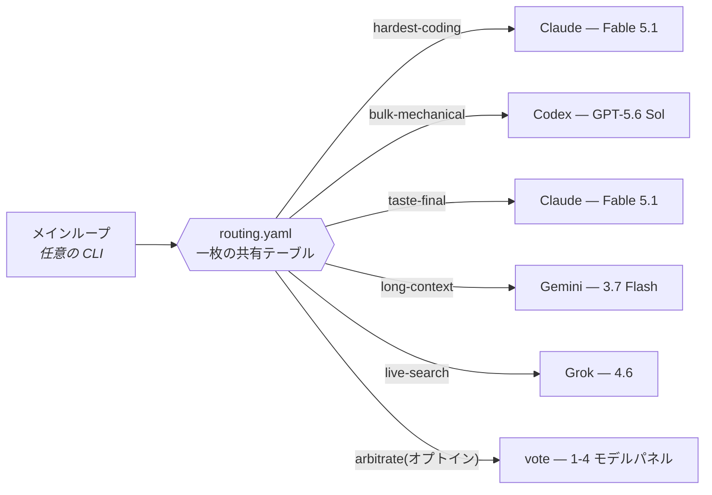

<div align="center">

# omnilane

### ルーティングテーブルは一枚、ハーネスは全部。

*メインループはもう、どのモデルを使うか迷わない。*<br/>
**Claude Code · Codex · Grok Build · Antigravity** のどれから操縦しても、すべてのサブタスクを<br/>
その作業が本当に得意なモデルへ——Codex、Claude、Grok、Gemini、Kimi、Qwen、OpenCode、<br/>
さらに OpenRouter 経由の任意のホスト型モデル——いまのサブスクリプションのまま、または API キー一つで。


[](https://github.com/Seraphim0916/omnilane/actions/workflows/ci.yml)
[](LICENSE)
[](https://github.com/Seraphim0916/omnilane/tags)

[English](README.md) · [繁體中文](README.zh-TW.md) · [简体中文](README.zh-CN.md) · **日本語** · [한국어](README.ko.md)

</div>

---

## 🤔 omnilane とは

**何が問題か。** すでに AI コーディングアシスタント——**Claude Code、Codex、
Cursor、Gemini CLI** など——を使っていますよね。どれも一つのモデルファミリー
としかやり取りしません。つまり、頼んだ作業はすべて同じモデルで走ります。適任か
どうかに関係なく——使い捨てのファイル名変更が最も高価なモデルを消費し、本当に
難しい設計上の問いは、たまたま開いていたモデルに当たります。

**omnilane がすること。** アシスタントにルーティング表を渡します。作業は
**レーン**——最難関のコーディング、機械的な物量、トリアージ、難しい判断、
最終的な仕上げ——に振り分けられ、各レーンにはそれに最も強く(そして最も安い)
モデルが指定されています。アシスタントは自分の得意なレーンを自分で処理し、
残りは既存のログインを使って別ベンダーの CLI にバックグラウンドで渡します。

**omnilane ではないもの。** プロキシでも、新しいサブスクでも、常時面倒を見る
サービスでもありません。表一枚とディスパッチスクリプト一本が、既存ツールの裏で
動くだけです。`./install.sh --uninstall` で痕跡なく削除できます。

**すべてのサブスクは不要です。** 各レーンはフォールバックチェーンであり、実際に
インストール済みの最初の候補が選ばれます。CLI が一つでも七つでも動作し、どれも
無いレーンは失敗せず単にオフになります。サブスク一つでも、デフォルト表はその
ベンダーに収束します。

**[⬇ 60 秒クイックスタートへ](#-60-秒クイックスタート)** · **[❓ FAQ を読む](#-faq)**

## ⚡ 60 秒クイックスタート

**一番早い方法——npm でインストール:**

```bash
npm i -g omnilane                                    # CLI をインストール
export OMNILANE_AA_OPERATOR_ASSERTED_HUMAN=1         # 呼び出しているのは人間の操作者
omnilane route hardest-coding "auth トークン更新テストの不安定さを修正"
omnilane doctor                                      # 使える AI CLI / キーを確認
omnilane ui start                                    # 任意:ブラウザでジョブをライブ表示
```

**またはリポジトリを clone**(ルーティングテーブルとカスタマイズ用スキルが手に入る):

```bash
git clone https://github.com/Seraphim0916/omnilane && cd omnilane
./install.sh          # CLI を検出、スキルを接続、あなたの言語で対話
export OMNILANE_AA_OPERATOR_ASSERTED_HUMAN=1         # 呼び出しているのは人間の操作者
omnilane route hardest-coding "auth トークン更新テストの不安定さを修正"
```

> **あの export は何のため?** omnilane は呼び出し元自身の能力スコアで各ディスパッチを
> ゲートするため、「誰が依頼しているか」を必ず示す必要があります。端末の前にいる人間は
> `OMNILANE_AA_OPERATOR_ASSERTED_HUMAN=1` を一度設定するか、呼び出しごとに
> `--operator-asserted-human` を付けます。omnilane を動かすモデルは**自分でこれを主張
> できません**。モデルの識別情報は、それを起動した CLI のモデル・effort フラグから自動で
> 読み取られるため、通常のセッションは何も渡す必要がありません。`omnilane whoami` はその
> 識別情報を `--caller-context FILE` として出力します。主張も読み取れる識別情報も無い場合、
> ジョブ生成前に `missing-caller-context` で拒否されます。

> はじめての方は、まず `omnilane doctor` を実行してください。omnilane が今どのモデル CLI と
> API キーに接続できるかがわかり、実際に何が動くか把握できます。

## 🧭 仕組み

omnilane は、**どの** agentic CLI のメインループでも、サブタスクをレーンに
分類し、各レーンをその作業が最も得意なベンダーへヘッドレスで
ディスパッチさせる仕組みです。既存のサブスクリプションログインをそのまま
使います(`openrouter` vendor は例外:CLI 不要、API キー一つで直接接続):


```mermaid
flowchart LR
    M["メインループ<br/><i>任意の CLI</i>"] --> T{{"routing.yaml<br/>一枚の共有テーブル"}}
    T -->|hardest-coding| C1["Claude — Fable 5.1"]
    T -->|bulk-mechanical| C2["Codex — GPT-5.6 Sol"]
    T -->|taste-final| C3["Claude — Fable 5.1"]
    T -->|long-context| C4["Gemini — 3.7 Flash"]
    T -->|live-search| C5["Grok — 4.6"]
    T -->|"arbitrate(オプトイン)"| C6["vote — 1-4 モデルパネル"]
```

- **`routing.yaml`** — レーン → ベンダー+モデル+推論エフォート。
  一つのファイルを四つのハーネスが共有します。
- **フォールバックチェーン** — レーンには複数の候補を並べられます
  (`codex … | claude … | off`)。実際にインストールされている最初のベンダー
  CLI が選ばれるため、一〜二社の契約でも同じテーブルが機能します。
- **`scripts/dispatch.sh [--vendor V] <レーン> "<タスク>"`** — テーブルを
  解決し、該当ベンダーの CLI をヘッドレスで起動します。`--vendor` は
  指定ベンダーに固定し、フォールバックしません。
- **`skills/omnilane/SKILL.md`** — 四つのハーネス共通のスキル:
  自分のモデルを特定し、自分のレーンは自前で実行、残りはディスパッチ。
- **`omnilane mcp`** — 同じルーティングを MCP stdio サーバーとして提供。
  スキルではなく MCP で統合するホスト向け。

<div align="center">

| | | |
|:---:|:---:|:---:|
| 🧭 **一枚のテーブル**<br/>四つのハーネスで共有 | 🪂 **フォールバックチェーン**<br/>手持ちの CLI へ自動降格 | 🗳️ **オピニオンパネル**<br/>重大な判断はマルチモデル投票 |
| 🔒 **安全機構**<br/>ロック · ウォッチドッグ · ネスト禁止 | 🌏 **五言語対応**<br/>インストーラーが母語で対話 | ↩️ **完全可逆**<br/>`--uninstall` で全て元通り |

</div>

## 🛤️ レーン一覧(デフォルト。実効値は `scripts/dispatch.sh --list` で確認)

| レーン | 第一候補 | バックアップ | 用途 |
|---|---|---|---|
| 🔥 hardest-coding | Claude Fable 5.1 (max) | GPT-6 Astra (xhigh) → Grok 4.6 → Gemini 3.8 Flash (High) | 最難関の実装、深い根本原因調査、正確性が重要な修正 |
| 🏗️ bulk-mechanical | GPT-5.6 Sol (high) | Gemini 3.8 Flash (High) → Claude Sonnet 5 (high) | リファクタリング、移行、テスト、大規模レビュー——機械的な持久作業 |
| 🧹 triage | GPT-5.6 Luna (high) | Gemini 3.8 Flash (Low) → Claude Haiku 4.5 | 大量スキャン、一次選別 |
| ⚖️ hard-judgment | Claude Fable 5.1 (xhigh) | GPT-6 Astra (xhigh) → Grok 4.6 | アーキテクチャ判断、深い推論、セカンドオピニオン |
| ✒️ taste-final | Claude Fable 5.1 (xhigh) | GPT-6 Astra (xhigh) → Grok 4.6 → Gemini 3.8 Flash (High) | ユーザー向け文章、プロンプト／文書の仕上げ、文体判断 |
| 💬 consult | GPT-6 Astra (xhigh) | Claude Fable 5.1 (xhigh) → Grok 4.6 → Gemini 3.8 Flash (Medium) | 指名モデルへの直接相談。フォールバック防止のため `--vendor` を維持 |
| 🎨 ui-draft | GPT-5.6 Sol (high) | Claude Fable 5.1 (xhigh) → Gemini 3.8 Flash (High) | デザインシステム／参照画像がある場合だけの UI ドラフト |
| 📚 long-context | Gemini 3.8 Flash (Medium) | GPT-5.6 Terra (max) → Claude Opus 5 (medium) | 長文書の抽出と統合。AA-LCR、コスト、スループット順 |
| ⚡ fast-agentic | Gemini 3.8 Flash (Low) | GPT-5.6 Luna (high) → Claude Haiku 4.5 | 高速なマルチステップ agentic ループ、マルチモーダル確認 |
| 📡 live-search | Grok 4.6 | Gemini 3.8 Flash (High) → Claude Sonnet 5 (high) | リアルタイム X／Web 検索とソーシャル文脈 |
| 🚰 coding-overflow | Grok 4.6 | Gemini 3.8 Flash (High) → Kimi K3 → Qwen3 Coder Plus → OpenCode | Codex クォータ不足時の中級コーディング逃がし弁 |
| 🗳️ arbitrate | off (opt-in vote panel) | — | 重大判断用の内蔵意見パネル。デフォルト無効、`routing.local.yaml` で有効化し、投票者・ラウンドごとに 1 コール |

**バックアップ**はチェーンの次の候補——第一候補のベンダー CLI が未インストールの
ときにディスパッチが降格する先です。どのレーンもこうしたチェーンで、チェーン内に
何もインストールされていなければレーンは `off` に降格します。

> **Fable 5.1 はデフォルトに入りました——Opus 5 が今も適する場所。** 3 者比較と Opus の override は [FAQ](#-faq) を参照してください。

### 自然言語コンサルテーション

`omnilane` スキルまたは `/route` では、普通に
**「Opus にこのアーキテクチャを厳しく検討してもらって。」** と頼めます。
自然言語を解釈するのは Agent Skill であり、`dispatch.sh` に自由文の shell
パーサーを追加するものではありません。

- 能力だけを尋ねる質問には、該当レーンで現在最初に利用可能なモデルを回答し、
  モデル呼び出しは行いません。
- 一般的なベンダー名は、そのベンダー用に `consult` で設定された候補を使います。
- Opus などの標準モデル別名はスキル表の正確なモデルファミリーに固定します。
  明示した対象が存在しない、または CLI が使えない場合は明確に失敗し、別の
  ベンダーやモデルファミリーへフォールバックしません。

<details>
<summary><b>👉 どのレーンを自分で実行する?メインモデルを選択</b></summary>

<br/>

上の表はベンダー非依存です——レーンの*最適*モデルは、誰が操縦していても
変わりません。変わるのは、どのレーンを**自分で実行**するか(すでにそのモデル
なので追加コールなし)、どれを**ディスパッチ**するか。CLI の `omnilane` スキルが
該当行を自動適用します。これはその人間向けビューです。

- **Claude Code · Fable 5.1**——自分で実行：taste-final、hardest-coding。ディスパッチ：hard-judgment → Opus 5、bulk → Codex Sol high、long-context／高速ループ → Gemini 3.7 Flash、live-search → Grok。
- **Claude Code · Opus 5**——自分で実行：hard-judgment(これがデフォルトのレーン)。低いハルシネーション率や価格を優先するときはローカル override で taste-final も担当。最難関コーディング → Fable 5.1 または Sol、bulk → Sol high、long-context／高速ループ → Gemini 3.7 Flash、live-search → Grok。
- **Codex · Sol**——自分で実行：hardest-coding、bulk-mechanical、hard-judgment、ui-draft。ディスパッチ：taste-final → Claude、long-context／高速ループ → Gemini 3.7 Flash、live-search → Grok。
- **Codex · Terra**——long-context の Codex フォールバックを自分で実行。bulk-mechanical のデフォルトは Sol high に移動。最難関は Sol xhigh、taste → Claude、高速ループ → Gemini 3.7 Flash、live-search → Grok。
- **Grok Build · Grok 4.6**——live-search と coding-overflow を自分で実行し、hardest-coding・hard-judgment・taste-final のフォールバックも兼任。第一候補が使えるときは難しいコーディング／判断／文章を Codex、Claude、Gemini へ送り、API シグネチャと引用事実は検証します。
- **Antigravity · Gemini 3.7 Flash**——Medium の long-context／高速ループ、High の bulk／overflow、Low の triage を自分で実行し、High で hardest-coding・taste-final・ui-draft・live-search のフォールバックも兼任。第一候補が使えるときは最難関のコーディング／判断／文章を Codex、Claude へ。

</details>

## 🖥️ Live Board

すべてのディスパッチは——フォアグラウンドでも `--background` でも——ディスク上の
ジョブとして記録されます。Live Board はそのジョブストアの上に載る、任意かつ
読み取り専用のローカルワークベンチです:各モデルに何を頼み、何が返り、どう
ルーティングされ、まだ実行中かを一目で確認できます。

<div align="center">


</div>

```bash
omnilane ui start    # サーバーを起動または再利用し、認証済み URL を表示
omnilane ui status   # ローカルサーバーの状態を確認
omnilane ui url      # 現在の認証済み URL を表示
omnilane ui stop     # 正常に停止
```

デスクトップではジョブ一覧と詳細ペインを別々にスクロールでき、モバイルでは
一覧／詳細の切り替えと戻る操作、Esc に対応します。Server-Sent Events(SSE)は
フォーカス中の行を作り直さず更新し、短い切断では最後のスナップショットを保持して
再接続します。読み込み済みジョブを参照として固定し、別のジョブを選ぶと、モデル
経路と公開結果を横並びで比較できます。参照スナップショットはブラウザのメモリ内
だけに保持され、ページを閉じると消えます。`127.0.0.1` のみにバインドし、
ランダムトークンで保護された読み取り専用画面です。`task.txt` と公開用 `out.txt`
のみを表示し、ワーカーや
ベンダーの生ログは表示しません。

画面は英語・日本語・韓国語・繁体字中国語・簡体字中国語で読めます。初回はブラウザ
の言語に従い、ヘッダーの切り替えで上書きでき、選んだ言語はローカルに記憶されます。

コアルーティングに Python は不要で、この UI のみ Python 3.9 以降が必要です。

## 📦 インストール

前提:ルーティングしたいベンダー CLI(`codex`、`claude`、`grok`、`agy`、
任意で `kimi`、`qwen`、`opencode`)がログイン済みで `PATH` 上にあること——
**持っている分だけで OK**、足りないレーンは自動的に降格します。
`openrouter` vendor は例外で、CLI は不要——`curl` と環境変数の
`OPENROUTER_API_KEY` だけで動きます。

最速:`./install.sh` — 本機の CLI を検出してスキルを接続し、残りのプラグイン
コマンドを表示、実効ルーティングを出力し、最後に対話式設定メニューを
提案します(`--uninstall` で元に戻せます)。インストーラーはシステム言語に
合わせて英/繁中/簡中/日/韓を自動選択(`OMNILANE_LANG=ja` で強制可)。
さらに任意で、各 CLI の指示ファイル(`~/.claude/CLAUDE.md`、
`~/.codex/AGENTS.md`、`~/.grok/Agents.md`、`~/.gemini/GEMINI.md`——パスは
CLI バージョンにより異なる場合あり)へマーカー付きの可逆な
**常駐ルーティングリマインダー**を追記できます。非対話インストールは
`OMNILANE_HOOKS=all|none|claude,codex` を指定。手動接続:

`./install.sh --check` は変更せずドリフトを検査します。インストールまたは
`--uninstall` に `--dry-run` を加えると所有対象の操作を事前表示します。
インストーラー所有のリンクとマーカー付きリマインダーを戻すには、
`./install.sh --uninstall` を実行します。

- **Claude Code**:プラグインとしてインストール(`/route`、`/route-jobs`
  コマンドに加え、セッション開始時にルーティングリマインダーを自動注入する
  `SessionStart` フック付き。CLAUDE.md の編集は不要)、または
  `skills/omnilane` を `~/.claude/skills/` へ。
- **Codex**:`skills/omnilane` を `~/.codex/skills/` へ配置/リンク。
- **Grok Build**:`grok plugin install <このリポジトリ> --trust`
- **Antigravity**:`agy plugin install <このリポジトリ>`(先に
  `agy plugin validate` で確認)

### MCP サーバー

`omnilane mcp` は依存ゼロでローカル実行される MCP stdio サーバーを起動し、
MCP 対応ホストがスキルの導入やルーティングリマインダーなしで omnilane を
発見・呼び出しできるようにします。ホスト側の設定でインストール済み CLI を
指定してください:

```json
{
  "mcpServers": {
    "omnilane": {
      "command": "omnilane",
      "args": ["mcp"]
    }
  }
}
```

サーバーは `route` に加えて、読み取り専用の照会ツール `list_lanes`、`explain`、`validate`、`dry_run`、`jobs_list`、`jobs_status`、`jobs_result`、`jobs_stats`、`jobs_audit`、`doctor` を公開します。
`route` のデフォルトは読み取り専用の `advise` モードで、`work` を選ぶ呼び
出しには明示的な `workdir` が必須です。

実行時に必要なのは Node.js のみ(npm パッケージは不要)。npm 派なら
`npm install -g omnilane` で MCP サーバーごと CLI をインストールできます。

## ⚙️ カスタマイズ

三層、すべて任意:

1. **対話メニュー** — `scripts/configure.sh` が設定可能なレーンを表示し、レーンごとに
   ベンダー → モデル → エフォートを選択(候補リスト+自由入力)、結果を
   `~/.omnilane/routing.local.yaml` に書き込みます。複数ベンダーの `consult`
   は意図的に除外されるため、変更する場合は手動編集します。
2. **`~/.omnilane/routing.local.yaml`** — 手書きのオーバーライド。
   書式は `routing.yaml` と同じで、ローカルが優先。
3. **`~/.omnilane/local.sh`** — マシン固有のバイナリパス、プロキシ、認証
   ラッパー。全ランナーが読み込み、コミットされません。

確認はいつでも:

```
scripts/dispatch.sh --list     # 実効テーブル(フォールバック解決を注記)
```

## 📖 コマンドリファレンス

```
eval "$(omnilane completion bash)"             # 現在の Bash で補完を有効化
source <(omnilane completion zsh)               # 現在の Zsh で補完を有効化
omnilane completion fish | source              # 現在の Fish で補完を有効化
omnilane mcp                                   # MCP stdio サーバー(Node.js が必要)
omnilane release-audit [--target VERSION] [--json] # オフライン・読み取り専用のリリースゲート
omnilane ui start                              # ローカル Live UI を起動または再利用し、URL を表示
omnilane ui status                             # Live UI の稼働状態を表示
omnilane ui url                                # 現在の認証済みローカル URL を表示
omnilane ui stop                               # Live UI を停止
omnilane doctor [--json]                       # ルーティングとローカル実行環境を読み取り専用で診断
dispatch.sh [--background] [--dry-run] [--thread NAME] [--mode advise|work|sysops] [--workdir DIR]
            [--vendor V] [--model M] [--effort E] [--timeout SEC] [--job-timeout SEC]
            [--caller-context FILE | --operator-asserted-human]   # who is asking
            LANE "TASK"                              # "-" で stdin から読む
dispatch.sh [--json] --list [--json]
dispatch.sh [--json] --explain LANE [--json]       # 候補ごとの決定理由をオフライン表示
dispatch.sh [--json] --validate [--json]           # プロバイダーを呼ばず実効ルーティングを検証
jobs.sh [--json] {list | status ID | result ID}    # JSON は本文を返さずメタデータのみ
jobs.sh [--json] list [--lane L] [--vendor V] [--status running|done]  # 一覧を絞り込み
jobs.sh wait ID [--timeout N]                     # ジョブ終了値。124 はタイムアウト、125 はワーカー消失
jobs.sh cancel ID                                 # 実行中ジョブを停止:グループに SIGTERM、その後 SIGKILL
jobs.sh rm ID                                     # 完了/停止ジョブを1件削除(実行中は拒否)
jobs.sh [--json] stats [--last N] [--lane L] [--vendor V]  # ローカル成功率とルーティング集計
jobs.sh audit [--last N] [--json]                  # 読み取り専用のジョブ整合性・プライバシー検査
jobs.sh prune [--keep N] [--apply]                # 既定はプレビューのみ。完了ジョブだけを対象
configure.sh                                        # 対話式レーンメニュー
configure.sh set|get|unset|list|diff LANE [SPEC]    # routing.local.yaml を非対話で編集/確認
```

`--thread NAME` は単発ディスパッチ間で名前付きの Claude、Codex、Grok、
Gemini 会話を継続します。0.33.0 ではベンダー、モデル、effort、物理 workdir
を固定します。ローカル状態は `jobs.sh threads`、`threads show NAME`、
`threads rm NAME` で管理でき、削除してもベンダー側のセッションは残ります。

終了コード:`2` 使い方エラー(無効なベンダー、または指定ベンダーがレーンに
ない場合を含む)、`3` レーン無効(off)、`4` チェーン内に利用可能な CLI がない、
または設定済みの指定ベンダー CLI が利用不可、`5` Round 1 の成功投票者不足、
`6` Round 2 の反論全失敗、`86` ネストディスパッチ拒否、`87` ロック待ちタイムアウト、
`124` ジョブ全体タイムアウト。
それ以外はワーカー自身の終了コードを透過。

## 🎭 モード

- **advise（既定）**: ローカル読み取り専用分析。対応ベンダーのネイティブ検索ツールとモデル接続は使用可能ですが、変更ツールは制限します。X／ウェブ検索機能が全ベンダーで同等とは限りません。
- **work**: ファイル編集とコマンド実行を明示した `--workdir` 内に制限し、エージェントツールのネットワークを無効化します。モデル接続は維持します。強制境界が未対応ならモデル起動前に停止し、sysops へ暗黙に移行しません。
- **sysops**: 派遣ごとの明示指定でツール、ファイル、ネットワークの制限を解除します。レーンの既定値にはせず、タスクに許可する操作を記載します。

CLI で `--workdir` を省略すると呼び出し元の現在のディレクトリを使いますが、タスク指示では明示してください。MCP `route`／`dry_run` の work インターフェースでは、別途明示的な `workdir` が必要です。

Codex と Claude は三つのモードに個別のポリシーを適用します。Agy advise／sysops は認証を置き換えず、独立したセッション設定を使用します。Agy 1.1.27 work は検証済みの四つのツールとネイティブ端末サンドボックスを使い、新規／再開の限定検証で作業領域内の読み書き、編集、ビルドと領域外書き込み拒否を確認しました。外部一時ファイル／キャッシュの読み取りも制限されます。設定は起動ごとに明示的に再生成し、不変とは主張しません。別途、実際の work ライブ／FIFO で二つのターンを実行し、前ターンの読み戻し、領域外書き込み拒否、正常終了とソース不変を確認しました。Grok advise はネイティブツールの許可／拒否規則を使用します。子プロセスのネットワーク隔離が Linux 限定のため、macOS の Grok work は起動前に停止します。Grok ライブは明示的な sysops が必要です。検索の可用性やユーザーフックの影響は実際のツールイベントで検証し、終了コードだけでは証明しません。OpenRouter は advise 専用で、他のベンダーはこの四ベンダー契約に自動的には含まれません。

Grok 1.0.13 の単発 `plain` advise は完全なツールセットで実際の検索、ページ取得、書き込み拒否を検証済みです。内部ウェブツール ID とジョブ専用の MCP 準備状態を使い、フックは無効化しません。既存の空でない `CONTEXT_MODE_MCP_SENTINEL_DIR` は上書きせず、競合としてモデル起動前に停止します。この結果はライブや macOS work の検証には拡張しません。詳細は[日付付き実行時ゲート](docs/model-capabilities-2026-09.md#f-mode-runtime-gate-2026-09-06)を参照してください。

## 🔒 安全機構

- **ネストディスパッチ禁止** — ワーカーの再ディスパッチを拒否
  (`OMNILANE_DEPTH` ガード、終了コード 86)。
- **Codex 直列化ロック** — 同一ターゲットディレクトリへの codex
  ディスパッチはキューイング。クラッシュ残留ロックは所有者 PID で検出し
  安全に奪取。
- **ウォッチドッグ** — 全ワーカーは `timeout`/`gtimeout`、どちらも無ければ
  perl-alarm フォールバック下で実行(素の macOS がこのケース)。上限は
  **CLI 呼び出しごと** に適用され、優先順位は `--timeout SECONDS` > レーン別
  `OMNILANE_TIMEOUT_<LANE>`(例 `OMNILANE_TIMEOUT_HARD_JUDGMENT`) > グローバル
  `OMNILANE_TIMEOUT`(既定 600 秒)。これは呼び出し単位のハングガードであり、
  ジョブ全体の予算ではありません。リトライするベンダー(grok)や vote パネル
  (投票者 × ラウンド)は複数回呼び出すため、総実時間はこの値の数倍になり得ます。
- **ジョブ全体ヒューズ** — 任意の `--job-timeout SECONDS` はロック待ち、
  リトライ、全投票者・ラウンドを一つの process group 監視下で制限します。
  優先順位はフラグ > `OMNILANE_JOB_TIMEOUT_<LANE>` >
  `OMNILANE_JOB_TIMEOUT` > 無効です。ただし Git worktree 外で Codex の
  `work` を実行し、全体上限が未設定の場合だけ、解決済みの呼び出し単位
  ウォッチドッグを自動的に全体ヒューズとして使います（監視機構の上限は
  999999999 秒）。この自動ヒューズには同梱の Perl 監視機構が必要です。利用
  できない場合は警告し、既存の呼び出し単位ウォッチドッグ経路で非 Git work を
  続行します。その経路でも監視ツールがなければ、別途警告します。
  期限切れは監視対象の process group を終了して 124 を返します。
  大規模リポジトリの深い監査は 2–4 時間(7200–14400 秒)、呼び出し単位は
  30 分から始めるのが目安です。ハードコードされた既定値ではありません。
- **バックグラウンドジョブ** — `--background` ワーカーは独立した process
  group で動き、呼び出し元の終了後も生存。kill された場合は終了コードを
  記録し、`jobs.sh status` が `dead` を報告。
- **ペイロード上限** — 巨大なタスクテキストは自動で頭尾トランケート。

## 📬 ライブメールボックス

ライブメールボックスは、1 回で完結するディスパッチとは別の、対応モードで利用できる常駐バックグラウンド実行です。フォアマンが `--background` で開始し、実行中にも追加の指示を送れます。終わったらフォアマンが `jobs.sh close ID` で閉じます。放置しても常駐し続けるわけではなく、アイドル上限または設定済みのジョブ全体タイムアウト（`--job-timeout`）に達すれば終了します。

```bash
scripts/dispatch.sh --background --vendor claude hard-judgment "タイムアウトしたテストを確認する"
# dispatch が表示したジョブ ID を $ID として保存
scripts/jobs.sh send "$ID" "リトライ経路も確認してください。"
scripts/jobs.sh watch "$ID"
scripts/jobs.sh tail "$ID" --lines 20
scripts/jobs.sh close "$ID"
scripts/jobs.sh retry "$ID" --background
```

`watch` は `$JOB_DIR/events.jsonl` を追跡し、`tail` は `out.txt` を読みます。Claude と Gemini は対応モードで既存の自動ライブ動作を維持します。Codex／Grok は既定で単発となり、`--background --live` の明示指定が必要です。Grok はさらに `--mode sysops --workdir DIR` が必要で、ACP が制限モードの境界を強制しないため advise／work のライブ要求は起動前に停止します。非対応ベンダーへのライブ要求は即時失敗します。`--single-shot` は単発実行を強制します。`--idle-timeout SECONDS` の既定値は 900 秒で、`0` でアイドル上限を無効化します。

アイドル中は API 呼び出しも料金も発生しません。既定では、新しい受信メッセージまたは結果イベントが 900 秒間なければ worker が自動で終了し、ジョブ全体タイムアウトは外側の上限として残ります。やり取りが終わったら早めに `close` できます。終了済み、またはライブでないジョブへの `jobs.sh send` は明確なエラーで失敗します。送った後に追跡しない作業、ライブ対応していないベンダー、クリーンな状態からの再実行が必要な場合には使わず、新しいディスパッチ（または完了後の `retry`）を使ってください。

## 🎯 ゴールオーケストレーション

`omnilane goal` は、フォアマンが進行する作業台帳です。ループを担当するのは、ゴールを開いたエージェントセッションまたは端末の利用者です。ジョブをディスパッチし、完了受信箱または `omnilane jobs wait` で結果を受け取り、次のジョブを判断して繰り返します。ジョブ数と経過秒数の予算はデフォルトで無制限です。`--budget-jobs N` または `--budget-seconds S` を指定した場合に限り、対応する上限が有効になります。omnilane は記録だけを担い、各 goal dispatch の前に呼び出し元が指定した上限とデフォルトで有効な同一失敗のヒューズを検査し、フォアマンがゴールを閉じるときにレポートをまとめます。

```bash
GOAL_ID="$(omnilane goal open "不安定な決済統合を修正する" \
  --budget-jobs 4 --budget-seconds 900 --workdir /path/to/repo)"
JOB_ID="$(omnilane goal dispatch "$GOAL_ID" --mode work hardest-coding \
  "決済エラーを再現し、最小修正を実装して検証する")"
omnilane jobs wait "$JOB_ID" --timeout 900
omnilane goal note "$GOAL_ID" "決済統合テストが成功した"
omnilane goal close "$GOAL_ID" --summary "決済統合は安定した"
```

ゴールの状態は `$OMNILANE_HOME/goals/<goal-id>/` に保存されます。`goal status` では、予算使用量、ヒューズ作動回数、各ジョブから順次届くメタデータと終了状態を確認できます。`goal close` は `report.md` を書き、そのパスを表示します。手順が明白な単一タスクは直接ディスパッチしてください。予算フラグを指定した場合、その上限は厳格な制約であり、完了を保証するものではありません。

## ❓ FAQ

<details>
<summary><b>これらのサブスクは全部必要ですか?</b></summary>

<br/>

いいえ。各レーンはフォールバックチェーンで、実際にインストール済みの最初の候補が
使われます。サブスクが一つなら表全体がそのベンダーに収束し、チェーン内に何も無い
レーンはエラーではなく単にオフになります。`omnilane doctor` で今このマシンが実際に
到達できる先が分かり、`routing.local.yaml.example` にはよくある状況向けの
スタータープロファイル(Claude のみ、Codex 中心、Codex 無し)が入っています。

</details>

<details>
<summary><b>omnilane は私のコードを新しい送信先へ送りますか?</b></summary>

<br/>

新しい送信先は増えません。ディスパッチはすでにインストールしログイン済みの
ベンダー CLI を呼ぶだけなので、コードが届くのは元から使っているベンダーだけです。
ランナーはサブスク制 CLI を呼ぶ前に API キーの環境変数を取り除くため、残っていた
キーによって従量課金へ黙って切り替わることもありません。唯一の例外は direct-API
ベンダー群(`openrouter`、`deepseek`、`zai`、`mistral`、`groq`、`cerebras`)で、
これらは定義上あなたが設定したキーでそのプロバイダーの API を呼びます——いずれも
advise 専用で、ファイルを編集しません。

</details>

<details>
<summary><b>Fable 5.1 はデフォルトに入りました——Opus 5 が今も適する場所</b></summary>

<br/>

Fable 5.1 は現在 `hardest-coding`、`taste-final` の第一候補です。同じ xhigh
では知能、agentic 作業、コーディングで Opus 5 を上回ります。Sol max は、
はるかに安価な別ベンダーの判断用フォールバックです。`hard-judgment` 自体は
現在 Opus 5 xhigh がデフォルトです:Fable の agentic スコアの 97.7% を
コスト 68% で達成し、ハルシネーション率も低いため、このレーン自身の
コスト基準では安い方が勝ちます。

| 評価（AA、2026-09-02 取得） | Claude Fable 5.1 (xhigh) | Claude Opus 5 (xhigh) | GPT-5.6 Sol (max) |
|---|---:|---:|---:|
| Intelligence | 64.8 | 62.5 | 60.9 |
| Agentic | 59.8 | 58.4 | 57.8 |
| Coding | 80.7 | 77.0 | 77.4 |
| ハルシネーション率（低いほど良い） | .71 | **.60** | .92 |
| AA $/task | $2.65 | $1.80 | **$0.95** |

Fable 5.1 は bulk と triage のデフォルトではありません。トークン単価が
Opus 5 の 2 倍で、Claude Code のサブスクリプションクォータも 1 ターン当たり
最も多く消費するためです。Opus 5 は現在 `hard-judgment` のデフォルトを担い、
medium で `long-context` にも残り、`~/.omnilane/routing.local.yaml` で
任意のレーンへいつでも戻せます——例えば Fable を呼び戻すには:

```yaml
hard-judgment: claude claude-fable-5-1 xhigh
```

</details>

<details>
<summary><b>Claude のレーンはなぜ <code>max</code> ではなく <code>xhigh</code> なのですか?</b></summary>

<br/>

努力度は高ければ高いほど良い、というものではないからです。Anthropic は `xhigh` を
コーディングとエージェント作業の出発点、`high` をそれ以外の知能を要する作業の下限、
`max` を正確性がコストに優先する場合の設定として文書化しています。第三者の計測も
一致しており、Vals.ai の Vibe Code Bench では Opus 5 は `high` で 89.8%、`xhigh` で
88.3%、`max` で 88.4% —— 上位ティアはより手の込んだ解を出し、その分だけ失敗も増えます。
ワークロードが違うならレーン単位で上げてください:

```bash
omnilane configure set hard-judgment "claude claude-opus-5 max"
```

</details>

<details>
<summary><b>レーンの第一候補 CLI が無いときはどうなりますか?</b></summary>

<br/>

ディスパッチはチェーンを辿り、手元にある最初のベンダーを使います。コールを消費
せずに判断を確認できます:

```bash
scripts/dispatch.sh --explain hardest-coding   # 候補ごとのトレース
scripts/dispatch.sh --list                     # 実効表の全体
scripts/dispatch.sh --dry-run hardest-coding "…"   # 解決済みプラン、プロバイダー呼び出し無し
```

</details>

<details>
<summary><b>ディスパッチされたワーカーはファイルを編集できますか?</b></summary>

<br/>

依頼した場合のみです。ディスパッチの既定は読み取り専用の `advise` で、ベンダーごとに
実装されています(読み取り専用サンドボックス、またはネイティブツール権限)。
範囲を限定した編集では `--mode work` と明示的な `--workdir` を指定してください。
work は指定ディレクトリ内の変更に限定し、モデル接続を維持したままツールのネットワークを無効化します。
`--mode sysops` は Codex、Claude、Grok、Agy それぞれの独立した完全アクセス政策で、
work の別名ではありません。サービス管理など、work の境界を超える操作をタスクが明示的に許可する場合に使います。
ディスパッチごとの明示指定のみで、レーンの既定値にはなりません。
ワーカー自身は再ディスパッチできません——深度ガードが終了コード 86 で入れ子の
ファンアウトを拒否するため、一つのコマンドがエージェントの連鎖に膨らんでクォータを
食い潰すことはありません。

</details>

<details>
<summary><b>ディスパッチが拒否されました。どの拒否ですか？</b></summary>

<br/>

3 つのコードには 3 つの異なる対処があります。まず `omnilane doctor` を実行して
ください。その `transport-overlay` チェックが、問題はこのマシンの設定なのか
リクエストなのかをすぐに示します。

`missing-caller-context` — 識別情報がゲートに届いていません。人間は
`OMNILANE_AA_OPERATOR_ASSERTED_HUMAN=1` または `--operator-asserted-human` を
使います。モデルは通常何もしなくてよく、dispatch が起動元の CLI から識別情報を
読み取ります。読み取れない場合は `omnilane whoami` を実行してください。渡すべき
`--caller-context FILE` を出力するか、読み取れない理由（`--effort` 未指定、モデル
エイリアス、スコア行なし）を示します。モデルは人間向けの免除を自称してはいけません。

`runtime-mapping-unverified` — 識別情報は正しく、**ターゲット**にホストローカルの
リクエストセレクタの証明がありません。未プローブか、プローブが失敗しています。
`omnilane doctor` がその件数を報告し、overlay の `unproven[]` に各失敗の理由が
残ります。プロバイダーの利用上限による拒否は、その上限が解消するまで続きます。

`invalid-policy-input` と "transport contract evidence changed" — 上記のいずれ
でもありません。overlay 自体が読み込めないため、**すべてのベンダー**が拒否され
ます。よくある原因はベンダー CLI の更新です。overlay は各ベンダーの実行ファイルと
ランナースクリプトのハッシュを固定しており、Codex と Claude の証拠パスは
バージョンディレクトリを含むため、更新ではダイジェストが変わるのではなく
ファイルが消えます。タグ付きの証拠は自分のベンダーだけを降格させ、プローブ
マニフェストのようなタグなしの証拠はゲート全体を閉じます。doctor がファイルと
ベンダーを示し、再署名の手順はディスパッチスキルにあります。

</details>

## 📊 デフォルト値と出典

デフォルトのレーン割当は Artificial Analysis の 2026-07 スナップショット
(AA サイトの生レコードと各社公式価格ページで照合済み)と公開の比較レビューに
基づきます。これは意見であって法則ではありません——設定メニューと
`routing.local.yaml` はそのためにあります。ベンチマークごとの但し書きを含む
作業ノートは [`docs/model-capabilities-2026-09.md`](docs/model-capabilities-2026-09.md) にあります。

## ⚠️ 既知の制限

- **Antigravity の print モードにおけるツール呼び出しは現行 CLI ビルドで
  不安定**(拒否または invalid-argument)。long-context レーンの本来の用途
  (本文をタスクに貼り込む長文統合)には影響しません。
- **Grok に推論エフォートのつまみはありません**。effort 欄はインターフェース
  互換のためだけに存在し、無視されます。
- **Git 管理外でも Codex の work は利用できます。** 一部の Codex CLI は
  Git worktree 外で停止する可能性があるため、上記の自動ヒューズがこのケースを
  制限し、監視対象の process group を終了します。Omnilane は `git init` を自動実行せず、
  リポジトリの作成も要求しません。

## 📜 リリース履歴

## v0.42.9 の新機能

- **ランチャー経由の Codex デスクトップ。** ChatGPT.app が codex-profile-switch 経由で
  app-server を起動するとプロセス名は `codex-modified` になります。0.42.8 は `codex` という名前
  だけを探していたためこれを素通りし、そのスレッドからの dispatch はすべて
  `missing-caller-context` で拒否されていました。この名前を認識するようになりました。
  同じディレクトリの `codex-code-mode-host` は引き続き CLI とは見なしません。
- **実機での受け入れ。** 2026-09-13、ランチャー経由の Codex デスクトップのスレッドで `whoami` が
  終了コード 0 で `codex/gpt-5-6-sol-medium (score 46)` を `codex-modified` プロセスから読み取りました。
  更新は `npm i -g omnilane@0.42.9`。

## v0.42.8 の新機能

- **Codex の現在ターンの身元。** `app-server` は起動時のモデル・強度を常に無視します。
  それ以外の Codex は明示的な `-m` / `--model` / `-c model=...` / `--config` を維持し、
  モデル指定がない場合（プロファイルのみを含む）は現在ターンの記録を使います。
  TOML のモデル指定には Python 3.11 以降が必要です。
- **曖昧なら拒否。** 現在のプロセス環境と Codex 直下の子プロセスの初期環境に、同じ UUID 形式の
  `CODEX_THREAD_ID` が必要です。記録は `$CODEX_HOME/sessions`（既定 `~/.codex`）から
  `rollout-*-<スレッド>.jsonl`、再開後は `rollout-*-<スレッド>_<セッション>.jsonl` として探し、
  最後に書き込まれたものを読み、`session_meta.id` が一致する必要があります。最後の `turn_context`
  にはモデル・強度・ターン ID が必要です。その後に**同じターン ID** の `task_complete` /
  `turn_complete`（読み取り時の別名）/ `turn_aborted` があれば古い身元として拒否し、
  両方のターン ID と、その記録が最後に書かれてからの経過時間を示します。
- **Codex サンドボックスでの拒否。** 祖先検索は従来どおり先に実行します。`CODEX_SANDBOX=seatbelt`
  で失敗した場合、`whoami` はプロセス検査、`~/.omnilane` への書き込み、ネットワーク接続に
  サンドボックス外での再実行が必要だと案内します。
- **追跡可能性と互換性。** JSONL は逐次読み込み、メッセージ本文を診断に含めません。
  `whoami` はスレッドとターン ID を表示します。設定既定値・モデル一覧・アーカイブ・他の会話は
  代用しません。他社 CLI、明示・継承した身元、人間の宣言の優先順位は変更しません。
  `OMNILANE_AA_CALLER_FROM_PROCESS=0` は両方の読み取りを無効にします。
- **テストの環境分離。** テストはディスパッチ元のワーカーから `OMNILANE_AA_*` を
  引き継がなくなりました。ワーカー内で実行すると、承認者の身元と転送オーバーレイの
  ハッシュ固定が各フィクスチャ自身の人間宣言を上書きし、6 件が失敗していました。
- **実機での受け入れ。** 2026-09-12 に Codex デスクトップで実測：新規スレッドと、
  元の記録が前日で止まっていた再開スレッドの両方で `whoami` と
  `dispatch.sh --dry-run` が終了コード 0、`codex/gpt-6-astra-xhigh (score 54)` と
  `"allowed":true` を返し、ジョブは作成されませんでした。
  更新は `npm i -g omnilane@0.42.8`。

## v0.42.7 の新機能

- **モデルのセッションは識別ファイルなしでディスパッチできます。** `--caller-context` が無い場合、dispatch はプロセスツリーを遡って最も近いベンダー CLI を見つけ、その起動時のモデルと effort を読み取ります。これまで omnilane のチェックアウト外のセッションは `missing-caller-context` で止まり、判断をオペレーターに差し戻していました（2026-09-08 と 2026-09-10 に 3 件）。
- **`omnilane whoami`** はその識別情報を caller-context ファイルとして出力し、読み取れない場合は理由（`--effort` 未指定、モデルエイリアス、Claude のその effort に non-reasoning 行しか無い）を示します。推測はしません。
- **手書きファイルより偽りにくい。** ゲートは caller-context ファイルの形式しか確認せず、実際に動いているモデルと一致するかは見ていません。起動フラグはモデルではなくハーネスが設定し、セッションごとに判定されます。同じモデルでも `high` と `max` なら上限は 52 と 54 です。
- **明示指定が優先。** `--caller-context` ファイル、ワーカーが継承する環境、`--operator-asserted-human` はいずれも自動読み取りより優先します。`OMNILANE_AA_CALLER_FROM_PROCESS=0` でファイルのみの契約に戻せます。
- **拒否メッセージが出口を示します。** `missing-caller-context` と再試行の拒否は `omnilane whoami` を案内します。
- **`omnilane --version` が正しくなりました。** 0.42.6 では `VERSION` が 0.42.5 のままでした。
- **アップグレード。** npm 公開後は `npm i -g omnilane@0.42.7` を実行してください。

## v0.42.6 の新機能

- **「検証済み」が、どう検証されたかを示すようになりました。** 各 overlay マッピングは `evidence_tier` を持ちます。`billed-model` はプロバイダー自身が課金対象のモデル名を返した場合（claude、grok）、`client-echo` は CLI が自ら送信したモデルを記録した場合（codex、agy）、`selector-only` は CLI がセレクターを受け付けただけの場合です。`client-echo` は CLI が控えた注文書、`billed-model` はプロバイダーが発行した領収書です。
- **報告するだけで、拒否はしません。** ディスパッチは従来どおり `runtime_verified` のみで判断するため、ティアが低くても動いていたレーンが拒否されることはありません。3 つのティアすべてで判定が変わらないことをテストで保証しています。
- **ティアはベンダーではなく証拠に従います。** 本リリース以前のプローブは `selector-only` として再判定され、課金モデルを返すようになった CLI はコード変更なしに昇格します。
- **`omnilane doctor` が内訳を表示**し、再プローブすべきベンダーを名指しします。
- **overlay は実際に実行されるバイナリを固定します。** 従来はパスが `build_overlay.py` に直書きされ、使われていないバージョンを黙って指していました。実際には claude `2.1.266` が実行されているのに、overlay は `2.1.263` をハッシュしていました。
- **失われた 3 レーンを検出。** `gpt-5.4-mini` は 2026-09-07 のプローブでは通っていましたが、現在は HTTP 400（ChatGPT アカウントの Codex では非対応）を返します。署名済みの overlay はレーンが上流で失われても気付きません。該当の 3 構成は理由付きで `unproven[]` に移り、マッピングは 46 件になりました。
- **アップグレード。** npm 公開後は `npm i -g omnilane@0.42.6` を実行してください。

## v0.42.5 の新機能

- **1 つの CLI 更新が全ベンダーを止めることはなくなりました。** overlay の evidence に `vendor` タグを付与でき、タグ付きエントリのハッシュ差異やファイル消失は当該ベンダーのみを `unknown-target-runtime` に降格させます。タグなしの evidence は従来どおり全体を fail-closed にします。
- **`omnilane doctor` が overlay を読み込みます。** 新しい `transport-overlay` チェックは失敗時に該当ファイルとベンダーを示し、成功時はベンダーごとの検証済みマッピング数を報告します。
- **プローブが判定を記録します。** `probe.py` は課金された `modelUsage` で Claude の応答を判定し、CLI が不明な `--effort` を既定値へ黙って置き換えた場合を失敗とします。`build_overlay.py` は不合格のプローブに署名せず、overlay の `unproven[]` に記録します。
- **再構築ツールをバージョン管理下へ。** `build_overlay.py` と `probe.py` は `scripts/lib/` に移り、`--root` を受け取ります。
- **アップグレード。** npm 公開後は `npm i -g omnilane@0.42.5` を実行してください。

## v0.42.4 の新機能

- **クイックスタートが実際に動くようになりました。** `omnilane route` は「誰が依頼しているか」を必要としますが、60 秒クイックスタートにその記載が無く、新規インストールでは案内無しに `missing-caller-context` で拒否されていました。今は `OMNILANE_AA_OPERATOR_ASSERTED_HUMAN=1` で人間の操作者を一度宣言し、モデル呼び出し元が代わりに渡すものも説明します。
- **コマンドリファレンス。** `dispatch.sh` の書式に `[--caller-context FILE | --operator-asserted-human]` を追加しました。

## v0.42.3 の新機能

- **ドキュメントのみの更新。** ルーティング、スコア、ゲート、ランナーの動作は変更していません。
- **`--caller-context` をクイックリファレンスに明記。** ディスパッチのコマンド書式に追加し、モデル呼び出し元がこれを渡さない場合はジョブ生成前に `missing-caller-context` で拒否されることを明示しました。
- **caller-context の完全な例。** 凍結 exact-AA 下方ゲートの節に、そのまま使える JSON 例を追加し、拒否されてからではなく最初のディスパッチ前に作成するよう記載しました。
- **effort は推測せず調べる。** ハーネスがモデル名のみで effort を示さない場合、自分の祖先プロセス連鎖をたどって正確なフラグを読み取ります。同名プロセスの先頭ではなく連鎖を照合してください。最低スコア行の宣言は取得できなかった場合の代替であり最初の手段ではありません。不必要に低い上限はレーンを黙って閉じます。
- **二つの拒否コード、二つの対処。** `missing-caller-context` はファイル未指定、`runtime-mapping-unverified` は対象にホストローカルの検証済みセレクタが無いことを意味し、実証拠に基づく `--transport-overlay` 項目で解決します。凍結レジストリの編集では決して解決しません。
- **アップグレード。** npm 公開後に `npm i -g omnilane@0.42.3` を実行します。既存のリポジトリシンボリックリンク導入はチェックアウトを更新し `omnilane --version` を確認すれば、再インストールは不要です。

## v0.42.2 の新機能

- **Grok の推論強度を CLI に渡します。** 明示的な `low`、`medium`、`high`、`xhigh` は `--reasoning-effort` で渡され、Grok 4.6 の既定ルートは `high` を選択します。
- **証拠に基づくローカル対応付け。** ホストローカルの overlay で正確な CLI セレクター契約を検証し、固定 AA スコアや承認済み registry SHA は変更しません。対応付けの欠落・誤りは引き続き拒否し、live ACP の明示的な強度指定も検証完了まで拒否します。
- **更新。** npm 公開後に `npm i -g omnilane@0.42.2` を実行します。既存の repo-symlink インストールは checkout を更新し、再インストールせずに `omnilane --version` を確認できます。

## v0.42.1 の新機能

- **CI フィクスチャの修復。** 完全な Python discovery では、旧 routing／Grok readiness テストに synthetic-human caller を明示します。production の missing-identity 拒否、承認済み registry SHA、下方向スコア検査、retry lineage、skip assertion は変更しません。
- **移植可能な lineage 証拠。** encoded-effort Gemini spy は移植可能な Python インタープリター選択を使い、正確な `--model gemini-3.8-flash-high` の組を検証します。AA の内訳は scored target 78、scored reference-only 1、unknown configuration 10 のままです。
- **パッチ版への更新。** npm 公開後は `npm i -g omnilane@0.42.1` を実行できます。既存の repo-symlink インストールでは checkout を更新して `omnilane --version` を確認し、意図的に再配線する場合以外は `./install.sh` を再実行しません。GitHub release と npm 公開は別です。

## v0.42.0 の新機能

- **ネイティブ優先実行。** `--executor auto` は、ホストが完全一致する互換 capability context を渡した場合だけ caller 所有のネイティブエージェントを使い、それ以外は同じ vendor／model／effort の CLI 経路を維持します。ネイティブ handoff は未完了の作業であり、完了結果ではありません。
- **凍結 exact-AA 下方委任。** 同梱の AA v4.2 policy は provider 試行ごとに現在の caller と継承 ceiling を検査し、正確な child context を作り、retry 時も再検証します。78 個の採点済み構成は policy 入力であり、すべてが実行可能という意味ではありません。
- **明示的なネイティブ再利用。** 既存 Codex エージェントの再利用には caller が確認した idle 状態、context 保持への同意、runtime の完全一致が必要です。容量不足時に new-agent 要求を暗黙に再利用へ変更しません。完了記録は上流モデル identity の認証や cold-start 容量保証でもありません。
- **Codex 完了継続確認。** `scripts/completion-wakeup.py` は controller thread と job allowlist を結び、scheduler 登録、終端イベントの poll、delivery と acceptance を別々に記録します。これは定期 heartbeat polling であり、即時 push ではありません。
- **パッケージと更新。** npm tarball は AA policy、native／AA／wakeup helper、公開 protocol 文書を含みます。npm 公開後は `npm i -g omnilane@0.42.0` を実行できますが、GitHub release だけでは npm 公開済みとは限りません。

## v0.41.1 の新機能

- **Astra の既定値を xhigh に変更。** `hardest-coding` と `hard-judgment` の Astra は `xhigh` が既定値です。必要な場合は `--vendor codex --effort max` を明示できます。プロバイダーの順序と他モデルの推論強度は変更しません。CLI サブスクリプション枠の節約を実測したという主張ではありません。

- **Python 3.9 互換性。** Agy のワークスペースポリシーの準備・終了処理で `Path.lstat()` を使い、シンボリックリンク、inode、同時置換の保護を維持します。
- **隔離した CI テスト設定。** strict doctor の検証にプラグイン有効化とディレクトリソース設定を追加します。設定の欠落、無効化、パス不一致は引き続き失敗します。
- **移植可能なオフライン CI テスト設定。** 操作者の HOME への依存をなくし、移植可能な権限モード検査を使い、実際のプラットフォームに合わせて Linux／macOS のライブ実行制限を検証します。
- **Bash 3.2 での Gemini スレッド。** 空のスレッド引数の展開を保護し、`set -u`、値がある場合の再開引数、既存のモードと権限ポリシーを維持します。
- **時間制限付きの Codex ライブ終了。** FIFO のバックプレッシャーや部分書き込みでもバイト順序と未送信の末尾を保持し、終了時に制限時間内で転送します。実行プロセスが先に終了した場合も、受理済みで未転送の入力は保持して失敗を報告し、黙って破棄しません。他のプロバイダーの転送経路は変更しません。
- **npm 公開後の更新。** `npm i -g omnilane@0.41.1`、または checkout 更新後に `./install.sh` を実行してください。npm は別途公開され、GitHub リリースは npm での提供開始を意味しません。

## v0.40.0 の新機能

- **モードの区別と Grok ウェブ機能の修正。** advise は読み取り専用と対応するネイティブ検索、work は明示した `--workdir` 内の変更とツールネットワーク無効化、sysops は毎回明示する完全アクセスです。Grok 1.0.13 の完全な単発 `plain` advise 経路で検索、ページ取得、書き込み拒否を検証しました。macOS work と制限付きライブの起動前ガードは維持します。
- **Codex と Grok の明示的なライブセッション。** Codex work と Grok sysops のジョブは `--background --live` で追加入力と明示的な終了が可能です。Codex／Grok の自動ディスパッチは単発のまま、Claude／Gemini は既存の自動ライブ動作を維持します。Grok advise は ACP に強制可能な読み取り専用境界がないため `--live` を拒否します。
- **有界で観測可能な終了処理。** EOF 対応の能力プローブ、ジョブごとの不変 worker スナップショット、インタープリター／SHA の来歴、終了期限、プロセスグループのクリーンアップにより、停止したライブジョブを制限します。OS サンドボックス分離を意味するものではありません。
- **AA に基づくモデル網羅。** 12 レーンの既定値に Fable 5.1、GPT-6 Astra、Gemini 3.8 Flash を反映し、既存ベンダーと明示的モデル上書きは維持します。日付付き AA v4.2 スナップショットは 643 件のランキング設定を記録しますが、カタログ掲載は実行時サポートの保証ではありません。
- **アップグレード。** `npm i -g omnilane@0.40.0` を実行するか、checkout を更新して `./install.sh` を再実行してください。

## v0.33.0 の新機能

- **4 ベンダー対応スレッドディスパッチ。** `--thread NAME` はベンダー、
  モデル、effort、workdir を固定し、Claude、Codex、Grok、Gemini の会話を
  フォアグラウンドまたはバックグラウンドの単発ジョブ間で継続します。
  direct-API ベンダー、`exec`、ライブモード、固定値の不一致は終了コード 2 で停止します。
- **スレッド状態の管理。** `jobs.sh threads`、`threads show NAME`、
  `threads rm NAME` でローカル状態を一覧、表示、削除できます。

## v0.32.0 の新機能

- **AA 2026-09 スナップショットで全ルーティングを再評価。** Fable 5.1 と Gemini 3.7 Flash がデフォルトに入り、数値は新しい日付付き文書に集約しました。
- **モデルカタログを現在の CLI に同期。** Fable 5.1 を追加し、agy から消えた Gemini 3.5 Flash を削除し、投票ランナーも更新しました。
- **Opus 5 は引き続き利用可能。** `long-context` に残り、`routing.local.yaml` で任意のレーンを上書きできます。

## v0.31.0 の新機能

- **ゴール予算はデフォルトで無制限。** `budget_jobs` と `budget_seconds` は JSON `null` として保存され、`unlimited` と表示されるようになりました。従来の暗黙的な 8 ジョブと 900 秒の上限は廃止され、`--budget-jobs N` または `--budget-seconds S` を指定した場合にのみ厳格な上限が有効になります。同一失敗のヒューズは予算ではなく、デフォルトで引き続き有効です。
- **パイプ経由のゴール状態表示を修正。** `omnilane goal status` は、出力先がパイプを早期に閉じた場合でも `BrokenPipeError` を発生させず、終了コード 0 で終了します。これにより、`pipefail` の環境でも `| head` と `| grep -q` が正常に動作します。

## v0.30.0 の新機能

- **ゴール台帳。** `omnilane goal open` はジョブ数と経過秒数がデフォルトで無制限のゴール台帳を作成します。`goal dispatch` は各ジョブの実行前に呼び出し元が指定した上限と、デフォルトで有効な繰り返し失敗のヒューズを確認します。`goal note` は呼び出し元の記録を残し、`goal status` は予算とジョブごとの記録を表示し、`goal close` は `goals/<id>/report.md` を書き込みます。
- **ループは呼び出し元が担当。** ゴールを開いたセッションまたは利用者が選択、ディスパッチ、確認、クローズを行います。omnilane は組み込みの計画モデルを実行しません。
- **doctor チェック。** `omnilane doctor` はゴールオーケストレーションをチェックします。

## v0.21.0 の新機能

- **セッションモードを明示的に選択。** `dispatch --live` で常駐セッションを必須にするか、`--single-shot` で単発ジョブを強制できます。ライブセッション非対応ベンダーでは `--live` が即時に失敗し、対応ベンダーを表示します。
- **Gemini がライブメールボックスに参加。** Gemini は `agy` ストリームプロトコルを介し、Claude と並んで常駐ライブジョブを実行できます。
- **ライブジョブのアイドル上限。** `--idle-timeout N` は放置されたライブセッションを自動で閉じ、終了理由とタイムアウトを `meta.json` に記録します。

## v0.20.0 の新機能

- **フォアマン完了インボックス。** バックグラウンド dispatch の完了時に非公開の
  完了レコードを書き込み、同梱の Claude Code プラグインが一致するレコードを
  フォアマンの次のプロンプトへ届けます。出力末尾はプロンプト注入対策済みで、
  制御文字と `U+2028`／`U+2029` を除去し、ワーカー出力をインデントしたデータ
  として枠付けます。
- **インストール可能な Claude Code プラグイン。**
  `.claude-plugin/marketplace.json` は自己参照 source を使い、公開 npm tarball
  には `hooks/`、`skills/`、`.claude-plugin/` も含まれます。
- **Claude のライブメールボックス。** 常駐バックグラウンド Claude ジョブは
  実行中にメッセージを受け取り、`events.jsonl` を記録します。操作は
  [📬 ライブメールボックス](#-ライブメールボックス) を参照してください。
  他ベンダーは `stderr` と `mode-notice.txt` の通知付きで明示的に単発実行へ
  フォールバックし、`jobs.sh wait` は `done exit=N` で完了します。
- **フォアマンのセッション識別。** `SessionStart` hook は Claude `session_id` を
  PID と開始時刻へ結び付け、PID 再利用にも安全です。dispatch は親プロセスを
  たどって `foreman_session` を `meta.json` と完了レコードへ記録します。
  インボックスはセッション一致を優先し、旧レコードでは `workdir` に
  フォールバックするため、同一リポジトリ内の複数フォアマンが互いの通知を
  取得しません。

## v0.15.0 の新機能

- **Codex の進捗証跡をストリーミング保存** — `codex exec --json` が JSONL イベントを
  `out.txt.progress.log` へ逐次書き込むため、タイムアウト時にも最後に到達した手順を残せます。
  `out.txt` と Jobs の表示は変わりません。
- **証拠に基づくタイムアウト診断** — タイムアウト自体では原因を特定できないことを明示し、
  三段階の確認手順と、空の進捗ログが Codex の未進行を示す証拠ではないことを案内します。
- **rollout 記録への直接パス** — 最初の進捗イベントの `thread_id` から対応する
  `rollout-*.jsonl` の絶対パスをタイムアウト出力に表示し、中断された会話履歴を確認できます。

## v0.14.0 の新機能

- **根拠に基づくルーティング提案**：`jobs recommend` と MCP `jobs_recommend` は公開ジョブメタデータだけを読み、ルーティングを自動変更しません。
- **任意の実動プローブ**：`doctor --probe V` と MCP `provider_probe` は明示された場合だけプロバイダーを呼び出し、応答本文を報告しません。
- **Live Board の履歴検索・絞り込み・エクスポート**：直近 50 件を対象に、表示中の公開メタデータだけを出力します。
- **固定品質／コストベンチマーク**：`omnilane benchmark` は既定で dry-run、実呼び出しには `--run` が必要です。
- **厳格なインストール検証**：CI で隔離された `doctor --strict --json` を実行し、macOS／GNU `stat` の権限判定差も修正しました。

## v0.13.0 の新機能

- **`long-context` を AA-LCR で順序付け** — Artificial Analysis の長文脈推論
  ベンチマークで、まさにこのレーンの仕事を測るものです。Gemini 3.1 Pro が両方の
  フォールバックを上回るため、その一番手は「未見直し」から「根拠あり」に変わりました。
- **このレーンの旧来の助言は逆で、削除しました。** 従来は多段の統合を Claude 候補へ
  回すよう促していましたが、根拠は前世代モデルの二次情報でした。一次情報の現行世代
  データでは Claude が三候補中もっとも弱く、フォールバックを入れ替えて GPT-5.6 Sol
  (high) が Claude Opus 5 (high) の前に来ます。
- **`release-audit --require-tag` が GitHub リリースのないタグを指摘します。** 失敗
  ではなく警告で、`gh` が無い場合やオフラインではスキップするため CI でも動作し、
  直近のタグのみを見ます。
- **範囲の注記:** AA-LCR は 10k〜100k トークンの文書で実施されるため、長文の統合品質
  は決まりますが 1M での挙動は何も決まりません。GPT-5.6 Luna は同表の首位でしかも
  はるかに安価ですが、**意図的に昇格させていません** — このレーンの本命は 1M の走査で、
  ベンチマークがそこまで届かないからです。

## v0.12.0 の新機能

以下は当時のリリース記録です。現在の三モード契約と 0.40.0 の独立した完全アクセス sysops 政策は[モード](#-モード)を参照してください。

- **`hardest-coding` の Sol を `max` から `xhigh` へ** — AA の努力度別 Coding Index
  では、Sol の xhigh が自身の max も Claude の全ティアも上回り、コストは約 3 分の 1
  少ない。この種の作業では xhigh を超えた努力度は正確さではなく考えすぎを買う。
- **`fast-agentic` の第一候補が GPT-5.6 Luna に**、Gemini 3.6 Flash は第二候補へ。
  Luna は AA の Agentic Index で Flash を大きく上回り、2026-07-30 の値下げ後は
  タスクあたりコストがごく僅か。Flash に残る優位はスループットのみ — レイテンシ律速の
  ループならローカル設定で先頭に戻すこと。
- **レーンのコメントから数値を排除。** `routing.yaml` は各順序の「理由」だけを述べ、
  スコア・価格・スループットは取得日とともに `docs/model-capabilities-2026-09.md` に
  集約。数値が古くなってもルーティング表の編集は不要になった。
- **value プロファイル**を `routing.local.yaml.example` に追加 — Intelligence Index
  約 1 ポイントと引き換えに、タスクあたりコストを 30〜40% 削減。
- **`--mode sysops` を追加** — ベンダーのサンドボックスを外した `work`。サンドボックスが
  拒否するサービス操作向けです。ワーカーにマシン全体へのアクセスを与えるため、
  ディスパッチごとの指定のみで、レーンの既定値にはできません。
- **価格とベンチマークを更新**(2026-07-30 の OpenAI 値下げ反映)。あわせて AA の
  Coding Index が Coding Agent Index **ではない**ことを明記 — 構成要素は全く別物だが
  数値が近接する。

## v0.11.0 の新機能

- **Live Board が 5 言語で読めます** — 英語・日本語・韓国語・繁体字中国語・簡体字
  中国語。初回はブラウザの言語に従い、ヘッダーの切り替えで上書きでき、選択は
  ローカルに記憶されます。見出し、検索プレースホルダー、フィルターボタン、空状態と
  エラー状態、コンテンツマーカー、スクリーンリーダーが読み上げる `aria-label` まで
  対象で、`<html lang>` も選択に追従します。
- **ジョブ状態も翻訳しますが、参照側は壊しません** — `state-` の CSS クラスは元の値
  のままなのでステータス色は変わらず、検索インデックスは両方の表記を保持するため、
  `running` でも訳語でも同じジョブに一致します。
- **ルーティング変更なし。** ディスパッチ動作は v0.10.4 と同一です。

## v0.10.4 の新機能

- **`long-context` がマルチホップ作業を誤ったモデルに向けなくなりました** — この
  レーンは長文*統合*を名乗りながら Gemini を第一候補にしていましたが、公開されて
  いる 1M トークンのマルチニードル評価では Claude が約 3 倍のスコアを示し、Gemini
  が強いのはシングルニードル検索です。レーンの説明を走査と検索に改め、複数箇所を
  またぐ統合には Claude 候補を案内します。順序は意図的に据え置き — 根拠が二次情報
  であり、前世代モデルの測定に基づくためです。
- **Coding Agent Index を数値として引用しなくなりました** — 同一モデルがバージョン
  とハーネス次第で 80、78、67 と読み取れます。今後は順序の参照のみに用い、観測値
  ごとの出所を記録しています。
- **`taste-final` に文章特化の根拠を追加** — 従来は散文を測らない汎用・エージェント
  指標のみで順序を決めていました。EQ-Bench Creative Writing v3、EQ-Bench Longform、
  Lech Mazur の 3 ボードを、いずれも公開元から直接取得して追加しました。
- **努力度ごとのコストとスループットを追加**。既定が `xhigh` である理由を示します:
  `max` と同じ指数スコアを、1 タスクあたり 30-53% 安く得られます。

## v0.10.3 の新機能

- **5 言語すべての README を再構成** — 冒頭で「これは何か、なぜ欲しくなるのか」を
  まず説明し、バージョン履歴は導入部を分断せず最下部にまとめました。さらに FAQ を
  新設し、繰り返し寄せられた疑問に答えています:サブスクは全部必要か、コードは
  どこへ送られるか、なぜ Fable 5 がデフォルト表に無いのか、なぜ `max` ではなく
  `xhigh` なのか、CLI が無いときはどうなるか、ワーカーはファイルを編集できるのか。
- **修正: プラグインマニフェストのバージョンが古いままだった** — `plugin.json` と
  `.claude-plugin/plugin.json` が 0.10.1・0.10.2 リリース後も `0.10.0` を表示して
  いたため、プラグインのインストールで誤ったバージョンが出ていました。
- **修正: `routing.local.yaml.example` が退役モデルを指していた** — スタータープロ
  ファイル内の `claude-opus-4-8` をすべて `claude-opus-5`(レーンに応じた努力度付き)
  に、Gemini 3.5 Flash 候補を 3.6 Flash に更新し、0.10.0 以降のデフォルトと揃えました。
- **Intelligence Index の数値を出典に照合して訂正**
  (`docs/model-capabilities-2026-09.md`):パーセントではなく指数ポイントです。
  AA-Briefcase / GDPval-AA v2 の比較を追加し、デフォルトと逆向きの二つの結果も
  記録しました:事実知識では Fable 5 が、プレゼン品質では GPT-5.6 Sol が上回ります。

## v0.10.2 の新機能

- **`hardest-coding` と `hard-judgment` の Claude 努力度を `max` から `xhigh` へ**。
  Claude Opus 5 に関する Anthropic の文書化された指針に合わせました:コーディングと
  エージェント作業は `xhigh` から始め、それ以外の知能を要する作業の下限は `high`、
  `max` は正確性がコストに優先する場合に限る、というものです。戻す場合は
  `omnilane configure set <lane> "<spec>"` を使ってください。
- **CHANGELOG の壊れた比較リンクを 2 件修正** — 公開されなかった `v0.10.0` タグを
  指していました。

## v0.10.1 の新機能

- **デフォルトルーティングに `claude-opus-5` を追加**。`hard-judgment` と
  `taste-final` の第一候補となり、最難関のコーディング作業でもフォールバックとして
  利用できます。
- **`omnilane configure` を全 13 プロバイダーへ拡張**。選択可能なモデルは 106 件で、
  Codex、Claude Code、Grok Build、Antigravity の最新カタログに加え、検証済みの
  OpenRouter／OpenCode ショートカットを収録しています。`c` によるカスタムモデル ID の
  入力も引き続き利用できます。

<details>
<summary>過去のリリース(v0.10.0 以前)</summary>

## v0.10.0 の新機能

- **Gemini 3.6 Flash を既定に** — `fast-agentic`・`triage`・`bulk-mechanical`
  の gemini 候補(および `Gemini Flash` エイリアス)を Gemini 3.6 Flash に更新。
  出力トークンが減り、出力単価も下がり、Artificial Analysis 計測の出力速度は首位です。
- **エビデンス再監査** — ルーティングのコメント、モデル能力ノート、Gemini
  価格表を公式ソースに合わせて更新。

## v0.9.1 の新機能

- **修正**: `configure set` が `routing.local.yaml` の手書きコメントを削除しなく
  なりました。書き換えるのは自身のスタンプ行と置き換え対象のレーンだけです。

## v0.9.0 の新機能

- **OpenAI 互換の direct-API ベンダーを 5 つ追加** — `deepseek`、`zai`(GLM)、
  `mistral`、`groq`、`cerebras` が `openrouter` と同じく CLI 不要のレーンに
  (curl と `<VENDOR>_API_KEY` だけ)。`lib/common.sh` のレジストリに 1 行で
  追加でき、モデル能力の比較は [`docs/model-capabilities-2026-09.md`](docs/model-capabilities-2026-09.md) を参照。
- **Fish シェル補完** — `omnilane completion fish | source`。

## v0.8.3 の新機能

- **MCP サーバー** — `omnilane mcp` は依存ゼロの stdio MCP サーバーを起動し、
  MCP 対応ホスト(Claude Code、Codex、Gemini CLI、Cursor、OpenCode など)が
  スキルなしで omnilane を発見・呼び出しできます:ツールは `route`、
  `jobs_status`、`jobs_result`、`list_lanes`。`route` は読み取り専用の
  advise がデフォルトで、work モードには明示的な workdir が必須です。

## v0.8.2 の新機能

- **`openrouter` vendor** — `curl` と `OPENROUTER_API_KEY` だけで
  OpenRouter API に直接ディスパッチ。どの omnilane インストールからでも
  数百のホスト型モデルに到達でき、コーディングエージェント CLI の追加は
  不要。advise/consult 専用(ファイル編集不可、work モードは明確に
  エラーで案内)、モデル slug は必須。例:
  `dispatch.sh --vendor openrouter --model anthropic/claude-sonnet-5 consult "..."`
- **`opencode` vendor** — マルチプロバイダ集約 CLI OpenCode 経由の
  ヘッドレスディスパッチ(`opencode run`)。advise モードは組み込みの
  読み取り専用 `plan` エージェントを使用し、work モードは `--auto`。
  デフォルトの `coding-overflow` チェーンの最終フォールバックに追加。

## v0.8.1 の新機能

- **Claude Code プラグインがルーティングリマインダーを自動読み込み** —
  プラグインに `SessionStart` フック(`hooks/hooks.json`)を同梱。
  セッション開始時(`startup|resume|clear`)にルーティングリマインダーを
  自動注入するため、`~/.claude/CLAUDE.md` を編集せずプラグインの
  インストールだけで有効になります。他の CLI は引き続き `install.sh` の
  指示ファイル方式です。

## v0.8.0 の新機能

- **2 つの新ディスパッチベンダー** — `kimi`(Moonshot Kimi Code CLI)と
  `qwen`(Alibaba Qwen Code CLI)が統一 runner 契約で加わりました:
  advise は読み取り専用、work は自動承認、API キー環境変数を除去して
  CLI 自身のサブスクリプションログインを使用、空出力は明示的な失敗。
  `--vendor kimi|qwen` で直接指名できます。
- **coding-overflow にフォールバックチェーン** — クォータ逃し弁が
  grok → kimi → qwen → `off` の順にフォールバックし、3 ベンダーの
  いずれか 1 つで動作します。runner はフェイクバイナリで契約テスト済み。
  実モデルでの報告を歓迎します。

## v0.7.1 の新機能

- **ルーティング表を更新(2026-07 モデルデータ)** — hardest-coding の第一候補を
  GPT-5.6 Sol **max** に変更。Artificial Analysis Coding Agent Index v1.1 で
  Sol (max) が 80 点の現行最高を記録し、旧「xhigh が max を上回る」スナップ
  ショットを置き換えました。
- **Claude バックアップを強化** — hardest-coding と hard-judgment の
  Claude Opus 4.8 バックアップを **xhigh** に変更。難しいタスクと長時間作業には
  extra effort を推奨する Anthropic 公式ガイダンスに従います。

## v0.7.0 の新機能

- **ディスパッチを事前にプレビュー** — `--dry-run` は解決済みの実行計画
  (vendor、モデル、モード、タイムアウト、副作用判定)を表示し、モデル呼び出しも
  ジョブ状態の作成も行いません。
- **バージョン付き JSON で自動化** — `--list`/`--explain`/`--validate` と
  `jobs list|status|result|stats` に `--json` エンベロープを追加。読み取り専用の
  `jobs wait`、`jobs audit`、決定的マニフェスト付きのオフライン
  `omnilane release-audit` も利用できます。
- **ローカルジョブを一気通貫で操作** — `jobs tail` で出力を覗き、`jobs retry` で
  完了ジョブを fail-closed に再実行、`prune --older-than` で古いジョブを整理。
  `--help` が全コマンドを網羅します。
- **インストールと補完を安全に** — `install.sh --check`/`--dry-run` は書き込みなしで
  ドリフトを報告し、`omnilane completion bash|zsh` が安全なタブ補完を提供。
  macOS 標準 Bash 3.2 のクラッシュを 5 件修正しました。

## v0.6.0 の新機能

- **ルーティングをオフラインで説明・検証** — `--explain` で各フォールバック
  候補を確認し、`--validate` で実効ルーティング表全体を検査できます。
  プロバイダー呼び出しやジョブ状態の作成は行いません。
- **ローカル状態を機械可読データで観測** — 有界な `jobs.sh stats` 集計と
  `omnilane doctor --json` により、タスクや結果本文を漏らさず自動化できます。
- **Live Board で二つのジョブを比較** — 読み込み済みジョブをメモリ内だけの
  参照スナップショットとして固定し、モデル経路と公開結果を並べて比較できます。
- **ロック回復時のノイズを削減** — 所有者ファイルが確認と読み取りの間に
  消えた場合も、誤解を招く欠落ファイル診断を出さず fail-closed を維持します。

## v0.5.1 の新機能

- **Git 管理外で Codex work を利用** — 通常のディレクトリを引き続きサポートし、
  Omnilane は `git init` を要求も自動実行もしません。
- **非 Git の停止を安全に処理** — 全体上限が未設定なら、解決済みの呼び出し単位
  ウォッチドッグを process group ヒューズとして使い、明示設定の優先順位と終了
  コードの意味は維持します。
- **表示バージョンを信頼可能に** — `VERSION` が `omnilane --version` と二つの
  plugin manifest を統一し、CI が変更履歴と五言語 README の一致を検査します。

</details>

## 🌱 ステータス

omnilane は 13 のディスパッチベンダーを備えます——4 つのハーネスネイティブ
(codex、claude、grok、gemini)、3 つの集約/オーバーフロー CLI(kimi、qwen、
opencode)、そして CLI 不要の OpenAI 互換 direct-API ベンダー 6 つ(openrouter、
deepseek、zai、mistral、groq、cerebras)——すべて統一 runner 契約と契約テスト
付き。Claude Code の `SessionStart` 自動リマインダーと MCP stdio サーバー
(`omnilane mcp`)も同梱。direct-API と集約系の runner はフェイクバイナリで
契約テスト済みです。実モデルでの報告を歓迎します。Grok/Antigravity の
コマンドシェル挙動は CLI バージョンで変わる可能性があります。issue と PR を
歓迎します。

プロジェクト文書：[コントリビューション](CONTRIBUTING.md) ·
[セキュリティ](SECURITY.md) · [変更履歴](CHANGELOG.md)
