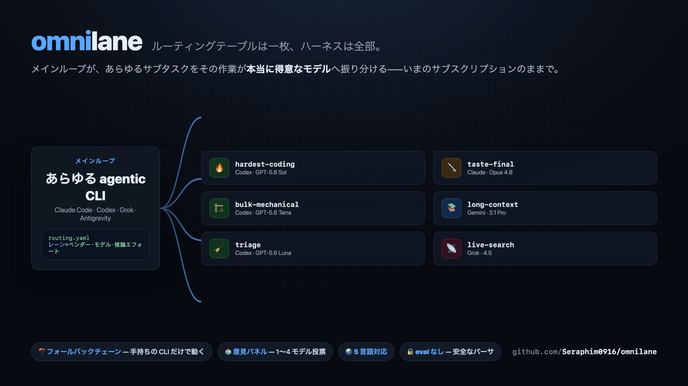
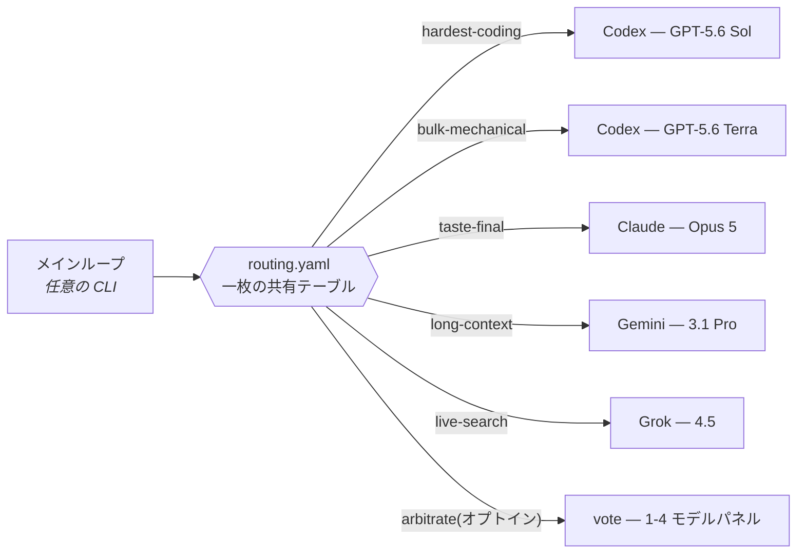

<div align="center">

# omnilane

### ルーティングテーブルは一枚、ハーネスは全部。

*メインループはもう、どのモデルを使うか迷わない。*<br/>
**Claude Code · Codex · Grok Build · Antigravity** のどれから操縦しても、すべてのサブタスクを<br/>
その作業が本当に得意なモデルへ——Codex、Claude、Grok、Gemini、Kimi、Qwen、OpenCode、<br/>
さらに OpenRouter 経由の任意のホスト型モデル——いまのサブスクリプションのまま、または API キー一つで。



[](https://github.com/Seraphim0916/omnilane/actions/workflows/ci.yml)
[](LICENSE)
[](https://github.com/Seraphim0916/omnilane/tags)

[English](README.md) · [繁體中文](README.zh-TW.md) · [简体中文](README.zh-CN.md) · **日本語** · [한국어](README.ko.md)

</div>

---

## 🤔 omnilane とは

**何が問題か。** すでに AI コーディングアシスタント——**Claude Code、Codex、
Cursor、Gemini CLI** など——を使っていますよね。どれも一つのモデルファミリー
としかやり取りしません。つまり、頼んだ作業はすべて同じモデルで走ります。適任か
どうかに関係なく——使い捨てのファイル名変更が最も高価なモデルを消費し、本当に
難しい設計上の問いは、たまたま開いていたモデルに当たります。

**omnilane がすること。** アシスタントにルーティング表を渡します。作業は
**レーン**——最難関のコーディング、機械的な物量、トリアージ、難しい判断、
最終的な仕上げ——に振り分けられ、各レーンにはそれに最も強く(そして最も安い)
モデルが指定されています。アシスタントは自分の得意なレーンを自分で処理し、
残りは既存のログインを使って別ベンダーの CLI にバックグラウンドで渡します。

**omnilane ではないもの。** プロキシでも、新しいサブスクでも、常時面倒を見る
サービスでもありません。表一枚とディスパッチスクリプト一本が、既存ツールの裏で
動くだけです。`./install.sh --uninstall` で痕跡なく削除できます。

**すべてのサブスクは不要です。** 各レーンはフォールバックチェーンであり、実際に
インストール済みの最初の候補が選ばれます。CLI が一つでも七つでも動作し、どれも
無いレーンは失敗せず単にオフになります。サブスク一つでも、デフォルト表はその
ベンダーに収束します。

**[⬇ 60 秒クイックスタートへ](#-60-秒クイックスタート)** · **[❓ FAQ を読む](#-faq)**

## ⚡ 60 秒クイックスタート

**一番早い方法——npm でインストール:**

```bash
npm i -g omnilane                                    # CLI をインストール
omnilane route hardest-coding "auth トークン更新テストの不安定さを修正"
omnilane doctor                                      # 使える AI CLI / キーを確認
omnilane ui start                                    # 任意:ブラウザでジョブをライブ表示
```

**またはリポジトリを clone**(ルーティングテーブルとカスタマイズ用スキルが手に入る):

```bash
git clone https://github.com/Seraphim0916/omnilane && cd omnilane
./install.sh          # CLI を検出、スキルを接続、あなたの言語で対話
omnilane route hardest-coding "auth トークン更新テストの不安定さを修正"
```

> はじめての方は、まず `omnilane doctor` を実行してください。omnilane が今どのモデル CLI と
> API キーに接続できるかがわかり、実際に何が動くか把握できます。

## 🧭 仕組み

omnilane は、**どの** agentic CLI のメインループでも、サブタスクをレーンに
分類し、各レーンをその作業が最も得意なベンダーへヘッドレスで
ディスパッチさせる仕組みです。既存のサブスクリプションログインをそのまま
使います(`openrouter` vendor は例外:CLI 不要、API キー一つで直接接続):


```mermaid
flowchart LR
    M["メインループ<br/><i>任意の CLI</i>"] --> T{{"routing.yaml<br/>一枚の共有テーブル"}}
    T -->|hardest-coding| C1["Codex — GPT-5.6 Sol"]
    T -->|bulk-mechanical| C2["Codex — GPT-5.6 Terra"]
    T -->|taste-final| C3["Claude — Opus 5"]
    T -->|long-context| C4["Gemini — 3.1 Pro"]
    T -->|live-search| C5["Grok — 4.5"]
    T -->|"arbitrate(オプトイン)"| C6["vote — 1-4 モデルパネル"]
```

- **`routing.yaml`** — レーン → ベンダー+モデル+推論エフォート。
  一つのファイルを四つのハーネスが共有します。
- **フォールバックチェーン** — レーンには複数の候補を並べられます
  (`codex … | claude … | off`)。実際にインストールされている最初のベンダー
  CLI が選ばれるため、一〜二社の契約でも同じテーブルが機能します。
- **`scripts/dispatch.sh [--vendor V] <レーン> "<タスク>"`** — テーブルを
  解決し、該当ベンダーの CLI をヘッドレスで起動します。`--vendor` は
  指定ベンダーに固定し、フォールバックしません。
- **`skills/omnilane/SKILL.md`** — 四つのハーネス共通のスキル:
  自分のモデルを特定し、自分のレーンは自前で実行、残りはディスパッチ。
- **`omnilane mcp`** — 同じルーティングを MCP stdio サーバーとして提供。
  スキルではなく MCP で統合するホスト向け。

<div align="center">

| | | |
|:---:|:---:|:---:|
| 🧭 **一枚のテーブル**<br/>四つのハーネスで共有 | 🪂 **フォールバックチェーン**<br/>手持ちの CLI へ自動降格 | 🗳️ **オピニオンパネル**<br/>重大な判断はマルチモデル投票 |
| 🔒 **安全機構**<br/>ロック · ウォッチドッグ · ネスト禁止 | 🌏 **五言語対応**<br/>インストーラーが母語で対話 | ↩️ **完全可逆**<br/>`--uninstall` で全て元通り |

</div>

## 🛤️ レーン一覧(デフォルト。実効値は `scripts/dispatch.sh --list` で確認)

| レーン | 第一候補 | バックアップ | 用途 |
|---|---|---|---|
| 🔥 hardest-coding | GPT-5.6 Sol (xhigh) | Claude Opus 5 (xhigh) | 最難関の実装、根本原因デバッグ、正確性が要の変更 |
| 🏗️ bulk-mechanical | GPT-5.6 Terra (max) | Claude Sonnet 5 (high) | リファクタ、移行、テスト、大規模スイープ |
| 🧹 triage | GPT-5.6 Luna (medium) | Gemini 3.6 Flash (Low) | 大量の一次スクリーニング |
| ⚖️ hard-judgment | Claude Opus 5 (xhigh) | GPT-5.6 Sol (max) | アーキテクチャ裁定、深い推論、セカンドオピニオン |
| ✒️ taste-final | Claude Opus 5 (high) | GPT-5.6 Sol (max) | 対外文章、prompt/ドキュメント推敲、スタイル最終審 |
| 💬 consult | 明示指定したベンダー/モデル | —(フォールバックなし) | 自然言語で直接相談。`--vendor` を必ず維持 |
| 🎨 ui-draft | GPT-5.6 Sol (xhigh) | Claude Opus 5 (high) | デザインシステム/参考画像がある場合の UI ドラフト |
| 📚 long-context | Gemini 3.1 Pro (High) | Claude Opus 5 (high) | 100 万トークン級の走査と検索。複数箇所をまたぐ統合には Claude 候補を、高速反復ループは Flash を優先 |
| ⚡ fast-agentic | GPT-5.6 Luna (max) | Gemini 3.6 Flash (High) | 高速なマルチステップ agentic ループ、マルチモーダル確認 |
| 📡 live-search | Grok 4.5 | —(off) | リアルタイム X/ウェブ検索とソーシャル文脈 |
| 🚰 coding-overflow | Grok 4.5 | Kimi K3 → Qwen3 Coder Plus → OpenCode | Codex クォータ逼迫時の中級コーディング逃し弁 |
| 🗳️ arbitrate | off(オプトイン) | — | 内蔵オピニオンパネル(重大な判断用)——デフォルト無効。`routing.local.yaml` で有効化;投票者×ラウンドごとに 1 コール消費 |

**バックアップ**はチェーンの次の候補——第一候補のベンダー CLI が未インストールの
ときにディスパッチが降格する先です。どのレーンもこうしたチェーンで、チェーン内に
何もインストールされていなければレーンは `off` に降格します。

> **Claude Fable 5 はどこ?** 意図的にデフォルト表に入れていません——理由と
> 実測データは [FAQ](#-faq) にまとめてあります。

### 自然言語コンサルテーション

`omnilane` スキルまたは `/route` では、普通に
**「Opus にこのアーキテクチャを厳しく検討してもらって。」** と頼めます。
自然言語を解釈するのは Agent Skill であり、`dispatch.sh` に自由文の shell
パーサーを追加するものではありません。

- 能力だけを尋ねる質問には、該当レーンで現在最初に利用可能なモデルを回答し、
  モデル呼び出しは行いません。
- 一般的なベンダー名は、そのベンダー用に `consult` で設定された候補を使います。
- Opus などの標準モデル別名はスキル表の正確なモデルファミリーに固定します。
  明示した対象が存在しない、または CLI が使えない場合は明確に失敗し、別の
  ベンダーやモデルファミリーへフォールバックしません。

<details>
<summary><b>👉 どのレーンを自分で実行する?メインモデルを選択</b></summary>

<br/>

上の表はベンダー非依存です——レーンの*最適*モデルは、誰が操縦していても
変わりません。変わるのは、どのレーンを**自分で実行**するか(すでにそのモデル
なので追加コールなし)、どれを**ディスパッチ**するか。CLI の `omnilane` スキルが
該当行を自動適用します。これはその人間向けビューです。

- **Claude Code · Fable 5** — 自分で実行:hard-judgment、taste-final、正確性が最重要の難修正。ディスパッチ:機械的コーディング量 → Codex、長文 → Gemini、リアルタイム検索 → Grok。
- **Claude Code · Opus 5** — 自分で実行：hard-judgment、taste-final。大量のコーディングは Codex レーン、長文 → Gemini、リアルタイム検索 → Grok。
- **Codex · Sol** — 自分で実行:hardest-coding、hard-judgment、ui-draft。ディスパッチ:taste-final → Claude、長文 → Gemini、リアルタイム検索 → Grok、大量作業 → Codex Terra。
- **Codex · Terra** — 自分で実行:bulk-mechanical。本当に最難関の部分は Sol へエスカレーション;taste → Claude、長文 → Gemini、リアルタイム検索 → Grok。
- **Grok Build · Grok 4.5** — 自分で実行:live-search、coding-overflow(中級コーディング)。難しい作業は全て Codex/Claude/Gemini へ——先に全 API シグネチャと引用事実を検証。
- **Antigravity · Gemini** — 自分で実行:3.1 Pro で長文と重いコンテキストの agentic 作業、Flash で高速反復ループ。最難関のコーディング/判断/文章は Codex/Claude へ;リアルタイム検索 → Grok。

</details>

## 🖥️ Live Board

すべてのディスパッチは——フォアグラウンドでも `--background` でも——ディスク上の
ジョブとして記録されます。Live Board はそのジョブストアの上に載る、任意かつ
読み取り専用のローカルワークベンチです:各モデルに何を頼み、何が返り、どう
ルーティングされ、まだ実行中かを一目で確認できます。

<div align="center">


</div>

```bash
omnilane ui start    # サーバーを起動または再利用し、認証済み URL を表示
omnilane ui status   # ローカルサーバーの状態を確認
omnilane ui url      # 現在の認証済み URL を表示
omnilane ui stop     # 正常に停止
```

デスクトップではジョブ一覧と詳細ペインを別々にスクロールでき、モバイルでは
一覧／詳細の切り替えと戻る操作、Esc に対応します。Server-Sent Events(SSE)は
フォーカス中の行を作り直さず更新し、短い切断では最後のスナップショットを保持して
再接続します。読み込み済みジョブを参照として固定し、別のジョブを選ぶと、モデル
経路と公開結果を横並びで比較できます。参照スナップショットはブラウザのメモリ内
だけに保持され、ページを閉じると消えます。`127.0.0.1` のみにバインドし、
ランダムトークンで保護された読み取り専用画面です。`task.txt` と公開用 `out.txt`
のみを表示し、ワーカーや
ベンダーの生ログは表示しません。

画面は英語・日本語・韓国語・繁体字中国語・簡体字中国語で読めます。初回はブラウザ
の言語に従い、ヘッダーの切り替えで上書きでき、選んだ言語はローカルに記憶されます。

コアルーティングに Python は不要で、この UI のみ Python 3.9 以降が必要です。

## 📦 インストール

前提:ルーティングしたいベンダー CLI(`codex`、`claude`、`grok`、`agy`、
任意で `kimi`、`qwen`、`opencode`)がログイン済みで `PATH` 上にあること——
**持っている分だけで OK**、足りないレーンは自動的に降格します。
`openrouter` vendor は例外で、CLI は不要——`curl` と環境変数の
`OPENROUTER_API_KEY` だけで動きます。

最速:`./install.sh` — 本機の CLI を検出してスキルを接続し、残りのプラグイン
コマンドを表示、実効ルーティングを出力し、最後に対話式設定メニューを
提案します(`--uninstall` で元に戻せます)。インストーラーはシステム言語に
合わせて英/繁中/簡中/日/韓を自動選択(`OMNILANE_LANG=ja` で強制可)。
さらに任意で、各 CLI の指示ファイル(`~/.claude/CLAUDE.md`、
`~/.codex/AGENTS.md`、`~/.grok/Agents.md`、`~/.gemini/GEMINI.md`——パスは
CLI バージョンにより異なる場合あり)へマーカー付きの可逆な
**常駐ルーティングリマインダー**を追記できます。非対話インストールは
`OMNILANE_HOOKS=all|none|claude,codex` を指定。手動接続:

`./install.sh --check` は変更せずドリフトを検査します。インストールまたは
`--uninstall` に `--dry-run` を加えると所有対象の操作を事前表示します。
インストーラー所有のリンクとマーカー付きリマインダーを戻すには、
`./install.sh --uninstall` を実行します。

- **Claude Code**:プラグインとしてインストール(`/route`、`/route-jobs`
  コマンドに加え、セッション開始時にルーティングリマインダーを自動注入する
  `SessionStart` フック付き。CLAUDE.md の編集は不要)、または
  `skills/omnilane` を `~/.claude/skills/` へ。
- **Codex**:`skills/omnilane` を `~/.codex/skills/` へ配置/リンク。
- **Grok Build**:`grok plugin install <このリポジトリ> --trust`
- **Antigravity**:`agy plugin install <このリポジトリ>`(先に
  `agy plugin validate` で確認)

### MCP サーバー

`omnilane mcp` は依存ゼロでローカル実行される MCP stdio サーバーを起動し、
MCP 対応ホストがスキルの導入やルーティングリマインダーなしで omnilane を
発見・呼び出しできるようにします。ホスト側の設定でインストール済み CLI を
指定してください:

```json
{
  "mcpServers": {
    "omnilane": {
      "command": "omnilane",
      "args": ["mcp"]
    }
  }
}
```

サーバーは `route` に加えて、読み取り専用の照会ツール `list_lanes`、`explain`、`validate`、`dry_run`、`jobs_list`、`jobs_status`、`jobs_result`、`jobs_stats`、`jobs_audit`、`doctor` を公開します。
`route` のデフォルトは読み取り専用の `advise` モードで、`work` を選ぶ呼び
出しには明示的な `workdir` が必須です。

実行時に必要なのは Node.js のみ(npm パッケージは不要)。npm 派なら
`npm install -g omnilane` で MCP サーバーごと CLI をインストールできます。

## ⚙️ カスタマイズ

三層、すべて任意:

1. **対話メニュー** — `scripts/configure.sh` が設定可能なレーンを表示し、レーンごとに
   ベンダー → モデル → エフォートを選択(候補リスト+自由入力)、結果を
   `~/.omnilane/routing.local.yaml` に書き込みます。複数ベンダーの `consult`
   は意図的に除外されるため、変更する場合は手動編集します。
2. **`~/.omnilane/routing.local.yaml`** — 手書きのオーバーライド。
   書式は `routing.yaml` と同じで、ローカルが優先。
3. **`~/.omnilane/local.sh`** — マシン固有のバイナリパス、プロキシ、認証
   ラッパー。全ランナーが読み込み、コミットされません。

確認はいつでも:

```
scripts/dispatch.sh --list     # 実効テーブル(フォールバック解決を注記)
```

## 📖 コマンドリファレンス

```
eval "$(omnilane completion bash)"             # 現在の Bash で補完を有効化
source <(omnilane completion zsh)               # 現在の Zsh で補完を有効化
omnilane completion fish | source              # 現在の Fish で補完を有効化
omnilane mcp                                   # MCP stdio サーバー(Node.js が必要)
omnilane release-audit [--target VERSION] [--json] # オフライン・読み取り専用のリリースゲート
omnilane ui start                              # ローカル Live UI を起動または再利用し、URL を表示
omnilane ui status                             # Live UI の稼働状態を表示
omnilane ui url                                # 現在の認証済みローカル URL を表示
omnilane ui stop                               # Live UI を停止
omnilane doctor [--json]                       # ルーティングとローカル実行環境を読み取り専用で診断
dispatch.sh [--background] [--dry-run] [--mode advise|work|sysops] [--workdir DIR]
            [--vendor V] [--model M] [--effort E] [--timeout SEC] [--job-timeout SEC]
            LANE "TASK"                              # "-" で stdin から読む
dispatch.sh [--json] --list [--json]
dispatch.sh [--json] --explain LANE [--json]       # 候補ごとの決定理由をオフライン表示
dispatch.sh [--json] --validate [--json]           # プロバイダーを呼ばず実効ルーティングを検証
jobs.sh [--json] {list | status ID | result ID}    # JSON は本文を返さずメタデータのみ
jobs.sh [--json] list [--lane L] [--vendor V] [--status running|done]  # 一覧を絞り込み
jobs.sh wait ID [--timeout N]                     # ジョブ終了値。124 はタイムアウト、125 はワーカー消失
jobs.sh cancel ID                                 # 実行中ジョブを停止:グループに SIGTERM、その後 SIGKILL
jobs.sh rm ID                                     # 完了/停止ジョブを1件削除(実行中は拒否)
jobs.sh [--json] stats [--last N] [--lane L] [--vendor V]  # ローカル成功率とルーティング集計
jobs.sh audit [--last N] [--json]                  # 読み取り専用のジョブ整合性・プライバシー検査
jobs.sh prune [--keep N] [--apply]                # 既定はプレビューのみ。完了ジョブだけを対象
configure.sh                                        # 対話式レーンメニュー
configure.sh set|get|unset|list|diff LANE [SPEC]    # routing.local.yaml を非対話で編集/確認
```

終了コード:`2` 使い方エラー(無効なベンダー、または指定ベンダーがレーンに
ない場合を含む)、`3` レーン無効(off)、`4` チェーン内に利用可能な CLI がない、
または設定済みの指定ベンダー CLI が利用不可、`5` Round 1 の成功投票者不足、
`6` Round 2 の反論全失敗、`86` ネストディスパッチ拒否、`87` ロック待ちタイムアウト、
`124` ジョブ全体タイムアウト。
それ以外はワーカー自身の終了コードを透過。

## 🎭 モード

- **advise(デフォルト)** — 読み取り専用ワーカー。Codex は read-only
  サンドボックス、Claude は Read/Glob/Grep のみ、Grok は plan モード、
  Kimi と OpenCode はそれぞれの読み取り専用 plan モードに固定、
  OpenRouter は設計上 advise 専用(純推論)。
- **work** — 指定した `--workdir` 内でのみファイル編集可。Codex は
  workspace-write、Claude は編集自動承認、Gemini は accept-edits モード。
  `openrouter` vendor は work モードを明確に拒否します——編集はエージェント型
  CLI ベンダーへ。
- **sysops** — `work` からベンダーのサンドボックスを外したモード。サンドボックスが
  拒否するサービス操作(`launchctl` など)向けです。Codex は
  `-s danger-full-access` で実行し、他のベンダーは通常の `work` として扱います。
  マシン全体へのアクセスをワーカーに与えることになるため、ディスパッチごとに
  明示指定する必要があり、レーンの既定値には決してできません。`work` が
  サンドボックス拒否で失敗するのを実際に確認した場合にのみ使ってください。

## 🔒 安全機構

- **ネストディスパッチ禁止** — ワーカーの再ディスパッチを拒否
  (`OMNILANE_DEPTH` ガード、終了コード 86)。
- **Codex 直列化ロック** — 同一ターゲットディレクトリへの codex
  ディスパッチはキューイング。クラッシュ残留ロックは所有者 PID で検出し
  安全に奪取。
- **ウォッチドッグ** — 全ワーカーは `timeout`/`gtimeout`、どちらも無ければ
  perl-alarm フォールバック下で実行(素の macOS がこのケース)。上限は
  **CLI 呼び出しごと** に適用され、優先順位は `--timeout SECONDS` > レーン別
  `OMNILANE_TIMEOUT_<LANE>`(例 `OMNILANE_TIMEOUT_HARD_JUDGMENT`) > グローバル
  `OMNILANE_TIMEOUT`(既定 600 秒)。これは呼び出し単位のハングガードであり、
  ジョブ全体の予算ではありません。リトライするベンダー(grok)や vote パネル
  (投票者 × ラウンド)は複数回呼び出すため、総実時間はこの値の数倍になり得ます。
- **ジョブ全体ヒューズ** — 任意の `--job-timeout SECONDS` はロック待ち、
  リトライ、全投票者・ラウンドを一つの process group 監視下で制限します。
  優先順位はフラグ > `OMNILANE_JOB_TIMEOUT_<LANE>` >
  `OMNILANE_JOB_TIMEOUT` > 無効です。ただし Git worktree 外で Codex の
  `work` を実行し、全体上限が未設定の場合だけ、解決済みの呼び出し単位
  ウォッチドッグを自動的に全体ヒューズとして使います（監視機構の上限は
  999999999 秒）。この自動ヒューズには同梱の Perl 監視機構が必要です。利用
  できない場合は警告し、既存の呼び出し単位ウォッチドッグ経路で非 Git work を
  続行します。その経路でも監視ツールがなければ、別途警告します。
  期限切れは監視対象の process group を終了して 124 を返します。
  大規模リポジトリの深い監査は 2–4 時間(7200–14400 秒)、呼び出し単位は
  30 分から始めるのが目安です。ハードコードされた既定値ではありません。
- **バックグラウンドジョブ** — `--background` ワーカーは独立した process
  group で動き、呼び出し元の終了後も生存。kill された場合は終了コードを
  記録し、`jobs.sh status` が `dead` を報告。
- **ペイロード上限** — 巨大なタスクテキストは自動で頭尾トランケート。

## ❓ FAQ

<details>
<summary><b>これらのサブスクは全部必要ですか?</b></summary>

<br/>

いいえ。各レーンはフォールバックチェーンで、実際にインストール済みの最初の候補が
使われます。サブスクが一つなら表全体がそのベンダーに収束し、チェーン内に何も無い
レーンはエラーではなく単にオフになります。`omnilane doctor` で今このマシンが実際に
到達できる先が分かり、`routing.local.yaml.example` にはよくある状況向けの
スタータープロファイル(Claude のみ、Codex 中心、Codex 無し)が入っています。

</details>

<details>
<summary><b>omnilane は私のコードを新しい送信先へ送りますか?</b></summary>

<br/>

新しい送信先は増えません。ディスパッチはすでにインストールしログイン済みの
ベンダー CLI を呼ぶだけなので、コードが届くのは元から使っているベンダーだけです。
ランナーはサブスク制 CLI を呼ぶ前に API キーの環境変数を取り除くため、残っていた
キーによって従量課金へ黙って切り替わることもありません。唯一の例外は direct-API
ベンダー群(`openrouter`、`deepseek`、`zai`、`mistral`、`groq`、`cerebras`)で、
これらは定義上あなたが設定したキーでそのプロバイダーの API を呼びます——いずれも
advise 専用で、ファイルを編集しません。

</details>

<details>
<summary><b>Claude Fable 5 はどこ?なぜデフォルト表に無いのですか?</b></summary>

<br/>

**Claude の最上位ティアは通常メインループ自身であり、ディスパッチされるワーカー
ではないからです。** レーンは「今あなたが動かしているモデル以外」に作業を送るために
あります。Fable 5 がメインループなら、判断や文章を Fable 5 に戻すのは呼び出しが
一回増えるだけで得るものがありません——だからこそ上の「メインモデルを選ぶ」一覧では
Fable 5 に**ドライバー**として独立した行があり、hard-judgment、taste-final、
正確性が要の最難関修正を自分で処理します。

**計測データもワーカーとしての採用を支持しません。** Artificial Analysis の
Intelligence Index(2026-07-24)では Opus 5(max)が 61、Fable 5(max)が 60 —— AA 自身が
「実質的に同点」と表現し、Epoch AI の Capability Index は順位が逆です
(Fable 5 161、Opus 5 159)。総合的な知能は引き分けと見てよいでしょう。差が付くのは
エージェント的な専門アウトプットで、その差は小さくありません:

| ベンチマーク | Claude Opus 5 (max) | Claude Fable 5 | |
|---|---:|---:|---|
| AA-Briefcase(エージェント的知識労働、Elo) | 1720 | 1574 | **+146** |
| GDPval-AA v2(Elo) | 1861 | 1747 | **+114** |
| AA-Briefcase の 1 タスク単価 | $17.79 | $22.30 | **-20%** |
| API 価格、入力/出力 1M あたり | $5 / $25 | $10 / $50 | **半額** |

Opus 5 の max・xhigh・high の三ティアが AA-Briefcase の上位三席を占め、`high`
ティアですら 1 タスク単価が半分以下で Fable 5 を上回ります。つまり Fable 5 は
価格が二倍でありながら、レーンが重視するどの軸でも優位を買えていません。

**Fable 5 が実際に優れている点**:知識の広さです。AA-Omniscience では今も Opus 5 を
上回っており(モデルのサイズクラスから見て妥当)、一方の Opus 5 は不確かなときでも
答えがちで、ハルシネーション率は 50%(Opus 4.8 比 +14 ポイント)です。実行より
想起が中心のタスクなら、明示的に指名してください:

```bash
dispatch.sh --vendor claude --model claude-fable-5 --effort high consult "…"
```

**これはコストとメインループの方針上の選択であり、能力評価ではありません。**
Fable 5 は設定メニューのモデル一覧に載っており、`routing.local.yaml` の 1 行で
デフォルトを上書きできます:

```yaml
taste-final: claude claude-fable-5 high
```

</details>

<details>
<summary><b>Claude のレーンはなぜ <code>max</code> ではなく <code>xhigh</code> なのですか?</b></summary>

<br/>

努力度は高ければ高いほど良い、というものではないからです。Anthropic は `xhigh` を
コーディングとエージェント作業の出発点、`high` をそれ以外の知能を要する作業の下限、
`max` を正確性がコストに優先する場合の設定として文書化しています。第三者の計測も
一致しており、Vals.ai の Vibe Code Bench では Opus 5 は `high` で 89.8%、`xhigh` で
88.3%、`max` で 88.4% —— 上位ティアはより手の込んだ解を出し、その分だけ失敗も増えます。
ワークロードが違うならレーン単位で上げてください:

```bash
omnilane configure set hard-judgment "claude claude-opus-5 max"
```

</details>

<details>
<summary><b>レーンの第一候補 CLI が無いときはどうなりますか?</b></summary>

<br/>

ディスパッチはチェーンを辿り、手元にある最初のベンダーを使います。コールを消費
せずに判断を確認できます:

```bash
scripts/dispatch.sh --explain hardest-coding   # 候補ごとのトレース
scripts/dispatch.sh --list                     # 実効表の全体
scripts/dispatch.sh --dry-run hardest-coding "…"   # 解決済みプラン、プロバイダー呼び出し無し
```

</details>

<details>
<summary><b>ディスパッチされたワーカーはファイルを編集できますか?</b></summary>

<br/>

依頼した場合のみです。ディスパッチの既定は読み取り専用の `advise` で、ベンダーごとに
実装されています(読み取り専用サンドボックス、plan モード、あるいは読み取り専用の
ツールセット)。編集には `--mode work` と明示的な `--workdir` の両方が必要です。
第三のモード `--mode sysops` は `work` からベンダーのサンドボックスを外したもので、
サンドボックスが拒否するサービス操作(`launchctl` など)向けです。codex は
`-s danger-full-access` で実行し、他のベンダーは `work` として扱います。
ディスパッチごとの明示指定のみで、レーンの既定値にはなりません。
ワーカー自身は再ディスパッチできません——深度ガードが終了コード 86 で入れ子の
ファンアウトを拒否するため、一つのコマンドがエージェントの連鎖に膨らんでクォータを
食い潰すことはありません。

</details>

## 📊 デフォルト値と出典

デフォルトのレーン割当は Artificial Analysis の 2026-07 スナップショット
(AA サイトの生レコードと各社公式価格ページで照合済み)と公開の比較レビューに
基づきます。これは意見であって法則ではありません——設定メニューと
`routing.local.yaml` はそのためにあります。ベンチマークごとの但し書きを含む
作業ノートは [`docs/model-capabilities-2026-07.md`](docs/model-capabilities-2026-07.md) にあります。

## ⚠️ 既知の制限

- **Antigravity の print モードにおけるツール呼び出しは現行 CLI ビルドで
  不安定**(拒否または invalid-argument)。long-context レーンの本来の用途
  (本文をタスクに貼り込む長文統合)には影響しません。
- **Grok に推論エフォートのつまみはありません**。effort 欄はインターフェース
  互換のためだけに存在し、無視されます。
- **Git 管理外でも Codex の work は利用できます。** 一部の Codex CLI は
  Git worktree 外で停止する可能性があるため、上記の自動ヒューズがこのケースを
  制限し、監視対象の process group を終了します。Omnilane は `git init` を自動実行せず、
  リポジトリの作成も要求しません。

## 📜 リリース履歴

## v0.12.0 の新機能

- **`hardest-coding` の Sol を `max` から `xhigh` へ** — AA の努力度別 Coding Index
  では、Sol の xhigh が自身の max も Claude の全ティアも上回り、コストは約 3 分の 1
  少ない。この種の作業では xhigh を超えた努力度は正確さではなく考えすぎを買う。
- **`fast-agentic` の第一候補が GPT-5.6 Luna に**、Gemini 3.6 Flash は第二候補へ。
  Luna は AA の Agentic Index で Flash を大きく上回り、2026-07-30 の値下げ後は
  タスクあたりコストがごく僅か。Flash に残る優位はスループットのみ — レイテンシ律速の
  ループならローカル設定で先頭に戻すこと。
- **レーンのコメントから数値を排除。** `routing.yaml` は各順序の「理由」だけを述べ、
  スコア・価格・スループットは取得日とともに `docs/model-capabilities-2026-07.md` に
  集約。数値が古くなってもルーティング表の編集は不要になった。
- **value プロファイル**を `routing.local.yaml.example` に追加 — Intelligence Index
  約 1 ポイントと引き換えに、タスクあたりコストを 30〜40% 削減。
- **`--mode sysops` を追加** — ベンダーのサンドボックスを外した `work`。サンドボックスが
  拒否するサービス操作向けです。ワーカーにマシン全体へのアクセスを与えるため、
  ディスパッチごとの指定のみで、レーンの既定値にはできません。
- **価格とベンチマークを更新**(2026-07-30 の OpenAI 値下げ反映)。あわせて AA の
  Coding Index が Coding Agent Index **ではない**ことを明記 — 構成要素は全く別物だが
  数値が近接する。

## v0.11.0 の新機能

- **Live Board が 5 言語で読めます** — 英語・日本語・韓国語・繁体字中国語・簡体字
  中国語。初回はブラウザの言語に従い、ヘッダーの切り替えで上書きでき、選択は
  ローカルに記憶されます。見出し、検索プレースホルダー、フィルターボタン、空状態と
  エラー状態、コンテンツマーカー、スクリーンリーダーが読み上げる `aria-label` まで
  対象で、`<html lang>` も選択に追従します。
- **ジョブ状態も翻訳しますが、参照側は壊しません** — `state-` の CSS クラスは元の値
  のままなのでステータス色は変わらず、検索インデックスは両方の表記を保持するため、
  `running` でも訳語でも同じジョブに一致します。
- **ルーティング変更なし。** ディスパッチ動作は v0.10.4 と同一です。

## v0.10.4 の新機能

- **`long-context` がマルチホップ作業を誤ったモデルに向けなくなりました** — この
  レーンは長文*統合*を名乗りながら Gemini を第一候補にしていましたが、公開されて
  いる 1M トークンのマルチニードル評価では Claude が約 3 倍のスコアを示し、Gemini
  が強いのはシングルニードル検索です。レーンの説明を走査と検索に改め、複数箇所を
  またぐ統合には Claude 候補を案内します。順序は意図的に据え置き — 根拠が二次情報
  であり、前世代モデルの測定に基づくためです。
- **Coding Agent Index を数値として引用しなくなりました** — 同一モデルがバージョン
  とハーネス次第で 80、78、67 と読み取れます。今後は順序の参照のみに用い、観測値
  ごとの出所を記録しています。
- **`taste-final` に文章特化の根拠を追加** — 従来は散文を測らない汎用・エージェント
  指標のみで順序を決めていました。EQ-Bench Creative Writing v3、EQ-Bench Longform、
  Lech Mazur の 3 ボードを、いずれも公開元から直接取得して追加しました。
- **努力度ごとのコストとスループットを追加**。既定が `xhigh` である理由を示します:
  `max` と同じ指数スコアを、1 タスクあたり 30-53% 安く得られます。

## v0.10.3 の新機能

- **5 言語すべての README を再構成** — 冒頭で「これは何か、なぜ欲しくなるのか」を
  まず説明し、バージョン履歴は導入部を分断せず最下部にまとめました。さらに FAQ を
  新設し、繰り返し寄せられた疑問に答えています:サブスクは全部必要か、コードは
  どこへ送られるか、なぜ Fable 5 がデフォルト表に無いのか、なぜ `max` ではなく
  `xhigh` なのか、CLI が無いときはどうなるか、ワーカーはファイルを編集できるのか。
- **修正: プラグインマニフェストのバージョンが古いままだった** — `plugin.json` と
  `.claude-plugin/plugin.json` が 0.10.1・0.10.2 リリース後も `0.10.0` を表示して
  いたため、プラグインのインストールで誤ったバージョンが出ていました。
- **修正: `routing.local.yaml.example` が退役モデルを指していた** — スタータープロ
  ファイル内の `claude-opus-4-8` をすべて `claude-opus-5`(レーンに応じた努力度付き)
  に、Gemini 3.5 Flash 候補を 3.6 Flash に更新し、0.10.0 以降のデフォルトと揃えました。
- **Intelligence Index の数値を出典に照合して訂正**
  (`docs/model-capabilities-2026-07.md`):パーセントではなく指数ポイントです。
  AA-Briefcase / GDPval-AA v2 の比較を追加し、デフォルトと逆向きの二つの結果も
  記録しました:事実知識では Fable 5 が、プレゼン品質では GPT-5.6 Sol が上回ります。

## v0.10.2 の新機能

- **`hardest-coding` と `hard-judgment` の Claude 努力度を `max` から `xhigh` へ**。
  Claude Opus 5 に関する Anthropic の文書化された指針に合わせました:コーディングと
  エージェント作業は `xhigh` から始め、それ以外の知能を要する作業の下限は `high`、
  `max` は正確性がコストに優先する場合に限る、というものです。戻す場合は
  `omnilane configure set <lane> "<spec>"` を使ってください。
- **CHANGELOG の壊れた比較リンクを 2 件修正** — 公開されなかった `v0.10.0` タグを
  指していました。

## v0.10.1 の新機能

- **デフォルトルーティングに `claude-opus-5` を追加**。`hard-judgment` と
  `taste-final` の第一候補となり、最難関のコーディング作業でもフォールバックとして
  利用できます。
- **`omnilane configure` を全 13 プロバイダーへ拡張**。選択可能なモデルは 106 件で、
  Codex、Claude Code、Grok Build、Antigravity の最新カタログに加え、検証済みの
  OpenRouter／OpenCode ショートカットを収録しています。`c` によるカスタムモデル ID の
  入力も引き続き利用できます。

<details>
<summary>過去のリリース(v0.10.0 以前)</summary>

## v0.10.0 の新機能

- **Gemini 3.6 Flash を既定に** — `fast-agentic`・`triage`・`bulk-mechanical`
  の gemini 候補(および `Gemini Flash` エイリアス)を Gemini 3.6 Flash に更新。
  出力トークンが減り、出力単価も下がり、Artificial Analysis 計測の出力速度は首位です。
- **エビデンス再監査** — ルーティングのコメント、モデル能力ノート、Gemini
  価格表を公式ソースに合わせて更新。

## v0.9.1 の新機能

- **修正**: `configure set` が `routing.local.yaml` の手書きコメントを削除しなく
  なりました。書き換えるのは自身のスタンプ行と置き換え対象のレーンだけです。

## v0.9.0 の新機能

- **OpenAI 互換の direct-API ベンダーを 5 つ追加** — `deepseek`、`zai`(GLM)、
  `mistral`、`groq`、`cerebras` が `openrouter` と同じく CLI 不要のレーンに
  (curl と `<VENDOR>_API_KEY` だけ)。`lib/common.sh` のレジストリに 1 行で
  追加でき、モデル能力の比較は [`docs/model-capabilities-2026-07.md`](docs/model-capabilities-2026-07.md) を参照。
- **Fish シェル補完** — `omnilane completion fish | source`。

## v0.8.3 の新機能

- **MCP サーバー** — `omnilane mcp` は依存ゼロの stdio MCP サーバーを起動し、
  MCP 対応ホスト(Claude Code、Codex、Gemini CLI、Cursor、OpenCode など)が
  スキルなしで omnilane を発見・呼び出しできます:ツールは `route`、
  `jobs_status`、`jobs_result`、`list_lanes`。`route` は読み取り専用の
  advise がデフォルトで、work モードには明示的な workdir が必須です。

## v0.8.2 の新機能

- **`openrouter` vendor** — `curl` と `OPENROUTER_API_KEY` だけで
  OpenRouter API に直接ディスパッチ。どの omnilane インストールからでも
  数百のホスト型モデルに到達でき、コーディングエージェント CLI の追加は
  不要。advise/consult 専用(ファイル編集不可、work モードは明確に
  エラーで案内)、モデル slug は必須。例:
  `dispatch.sh --vendor openrouter --model anthropic/claude-sonnet-5 consult "..."`
- **`opencode` vendor** — マルチプロバイダ集約 CLI OpenCode 経由の
  ヘッドレスディスパッチ(`opencode run`)。advise モードは組み込みの
  読み取り専用 `plan` エージェントを使用し、work モードは `--auto`。
  デフォルトの `coding-overflow` チェーンの最終フォールバックに追加。

## v0.8.1 の新機能

- **Claude Code プラグインがルーティングリマインダーを自動読み込み** —
  プラグインに `SessionStart` フック(`hooks/hooks.json`)を同梱。
  セッション開始時(`startup|resume|clear`)にルーティングリマインダーを
  自動注入するため、`~/.claude/CLAUDE.md` を編集せずプラグインの
  インストールだけで有効になります。他の CLI は引き続き `install.sh` の
  指示ファイル方式です。

## v0.8.0 の新機能

- **2 つの新ディスパッチベンダー** — `kimi`(Moonshot Kimi Code CLI)と
  `qwen`(Alibaba Qwen Code CLI)が統一 runner 契約で加わりました:
  advise は読み取り専用、work は自動承認、API キー環境変数を除去して
  CLI 自身のサブスクリプションログインを使用、空出力は明示的な失敗。
  `--vendor kimi|qwen` で直接指名できます。
- **coding-overflow にフォールバックチェーン** — クォータ逃し弁が
  grok → kimi → qwen → `off` の順にフォールバックし、3 ベンダーの
  いずれか 1 つで動作します。runner はフェイクバイナリで契約テスト済み。
  実モデルでの報告を歓迎します。

## v0.7.1 の新機能

- **ルーティング表を更新(2026-07 モデルデータ)** — hardest-coding の第一候補を
  GPT-5.6 Sol **max** に変更。Artificial Analysis Coding Agent Index v1.1 で
  Sol (max) が 80 点の現行最高を記録し、旧「xhigh が max を上回る」スナップ
  ショットを置き換えました。
- **Claude バックアップを強化** — hardest-coding と hard-judgment の
  Claude Opus 4.8 バックアップを **xhigh** に変更。難しいタスクと長時間作業には
  extra effort を推奨する Anthropic 公式ガイダンスに従います。

## v0.7.0 の新機能

- **ディスパッチを事前にプレビュー** — `--dry-run` は解決済みの実行計画
  (vendor、モデル、モード、タイムアウト、副作用判定)を表示し、モデル呼び出しも
  ジョブ状態の作成も行いません。
- **バージョン付き JSON で自動化** — `--list`/`--explain`/`--validate` と
  `jobs list|status|result|stats` に `--json` エンベロープを追加。読み取り専用の
  `jobs wait`、`jobs audit`、決定的マニフェスト付きのオフライン
  `omnilane release-audit` も利用できます。
- **ローカルジョブを一気通貫で操作** — `jobs tail` で出力を覗き、`jobs retry` で
  完了ジョブを fail-closed に再実行、`prune --older-than` で古いジョブを整理。
  `--help` が全コマンドを網羅します。
- **インストールと補完を安全に** — `install.sh --check`/`--dry-run` は書き込みなしで
  ドリフトを報告し、`omnilane completion bash|zsh` が安全なタブ補完を提供。
  macOS 標準 Bash 3.2 のクラッシュを 5 件修正しました。

## v0.6.0 の新機能

- **ルーティングをオフラインで説明・検証** — `--explain` で各フォールバック
  候補を確認し、`--validate` で実効ルーティング表全体を検査できます。
  プロバイダー呼び出しやジョブ状態の作成は行いません。
- **ローカル状態を機械可読データで観測** — 有界な `jobs.sh stats` 集計と
  `omnilane doctor --json` により、タスクや結果本文を漏らさず自動化できます。
- **Live Board で二つのジョブを比較** — 読み込み済みジョブをメモリ内だけの
  参照スナップショットとして固定し、モデル経路と公開結果を並べて比較できます。
- **ロック回復時のノイズを削減** — 所有者ファイルが確認と読み取りの間に
  消えた場合も、誤解を招く欠落ファイル診断を出さず fail-closed を維持します。

## v0.5.1 の新機能

- **Git 管理外で Codex work を利用** — 通常のディレクトリを引き続きサポートし、
  Omnilane は `git init` を要求も自動実行もしません。
- **非 Git の停止を安全に処理** — 全体上限が未設定なら、解決済みの呼び出し単位
  ウォッチドッグを process group ヒューズとして使い、明示設定の優先順位と終了
  コードの意味は維持します。
- **表示バージョンを信頼可能に** — `VERSION` が `omnilane --version` と二つの
  plugin manifest を統一し、CI が変更履歴と五言語 README の一致を検査します。

</details>

## 🌱 ステータス

omnilane は 13 のディスパッチベンダーを備えます——4 つのハーネスネイティブ
(codex、claude、grok、gemini)、3 つの集約/オーバーフロー CLI(kimi、qwen、
opencode)、そして CLI 不要の OpenAI 互換 direct-API ベンダー 6 つ(openrouter、
deepseek、zai、mistral、groq、cerebras)——すべて統一 runner 契約と契約テスト
付き。Claude Code の `SessionStart` 自動リマインダーと MCP stdio サーバー
(`omnilane mcp`)も同梱。direct-API と集約系の runner はフェイクバイナリで
契約テスト済みです。実モデルでの報告を歓迎します。Grok/Antigravity の
コマンドシェル挙動は CLI バージョンで変わる可能性があります。issue と PR を
歓迎します。

プロジェクト文書：[コントリビューション](CONTRIBUTING.md) ·
[セキュリティ](SECURITY.md) · [変更履歴](CHANGELOG.md)
