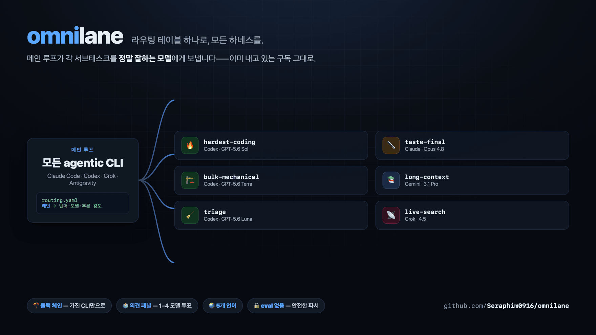
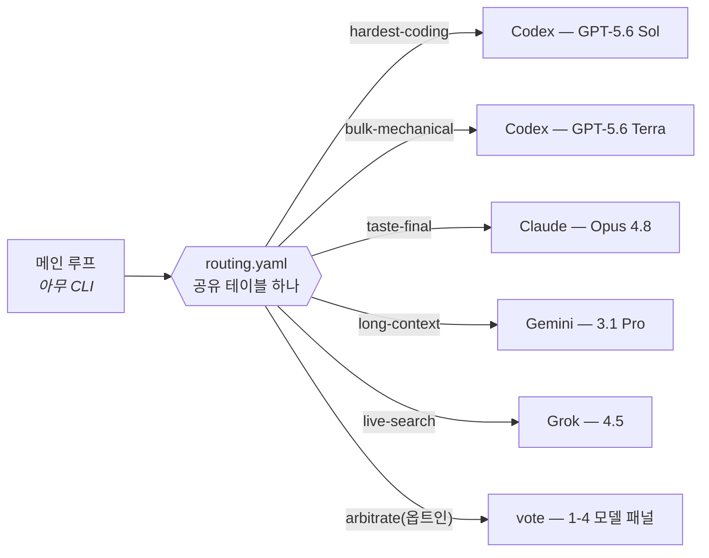

<div align="center">

# omnilane

### 라우팅 테이블 하나로, 모든 하네스를.

*메인 루프가 더 이상 어떤 모델을 쓸지 고민하지 않습니다.*<br/>
모든 서브태스크를 그 일을 정말 잘하는 모델에게——<br/>
**Claude Code · Codex · Grok Build · Antigravity** 를 가로질러, 이미 내고 있는 구독 그대로.



[](https://github.com/Seraphim0916/omnilane/actions/workflows/ci.yml)
[](LICENSE)
[](https://github.com/Seraphim0916/omnilane/tags)

[English](README.md) · [繁體中文](README.zh-TW.md) · [简体中文](README.zh-CN.md) · [日本語](README.ja.md) · **한국어**

</div>

---

## v0.5.1 새 기능

- **Git 저장소 밖에서 Codex work 사용** — 일반 디렉터리를 계속 지원하며
  Omnilane 은 `git init` 을 요구하거나 자동 실행하지 않습니다.
- **비 Git 멈춤을 안전하게 종료** — 전체 상한이 없으면 결정된 호출별 워치독을
  process group 퓨즈로 사용하고, 명시한 timeout 우선순위와 종료 코드 의미는
  그대로 유지합니다.
- **표시 버전을 신뢰 가능하게 유지** — `VERSION` 이 `omnilane --version` 과 두
  plugin manifest 를 통일하며 CI 가 변경 기록과 5개 언어 README 를 검사합니다.

## ⚡ 60초 시작

```bash
git clone https://github.com/Seraphim0916/omnilane && cd omnilane
./install.sh          # CLI 감지, 스킬 연결, 당신의 언어로 대화
omnilane route hardest-coding "간헐적으로 실패하는 auth 토큰 갱신 테스트 수정"
omnilane ui start     # 선택: 브라우저에서 잡을 실시간 확인
```

## 🧭 동작 방식

omnilane 은 **어떤** agentic CLI 든 메인 루프가 서브태스크를 레인으로 분류하고,
각 레인을 그 작업에 가장 강한 벤더 CLI 로 헤드리스 디스패치하게 해 줍니다.
기존 구독 로그인을 그대로 사용합니다:



- **`routing.yaml`** — 레인 → 벤더+모델+추론 강도. 파일 하나를 네 하네스가 공유.
- **폴백 체인** — 한 레인에 후보를 여러 개 나열할 수 있습니다
  (`codex … | claude … | off`). 실제로 설치된 첫 번째 벤더 CLI 가 선택되므로
  한두 개 구독만 있어도 같은 테이블이 동작합니다.
- **`scripts/dispatch.sh [--vendor V] <레인> "<태스크>"`** — 테이블을 해석해
  해당 벤더 CLI 를 헤드리스로 실행합니다. `--vendor` 는 지정한 벤더로
  고정하며 폴백하지 않습니다.
- **`skills/omnilane/SKILL.md`** — 네 하네스 공용 스킬: 자기 모델을 파악하고,
  자기 레인은 직접 수행, 나머지는 디스패치.

<div align="center">

| | | |
|:---:|:---:|:---:|
| 🧭 **테이블 하나**<br/>네 개 하네스가 공유 | 🪂 **폴백 체인**<br/>가진 CLI 로 자동 강등 | 🗳️ **의견 패널**<br/>중대한 결정은 멀티모델 투표 |
| 🔒 **안전 장치**<br/>락 · 워치독 · 중첩 금지 | 🌏 **5개 언어**<br/>설치 프로그램이 모국어로 대화 | ↩️ **완전 가역**<br/>`--uninstall` 로 원상복구 |

</div>

## 🛤️ 레인 목록(기본값. 실효값은 `scripts/dispatch.sh --list`)

| 레인 | 1순위 모델 | 백업 | 용도 |
|---|---|---|---|
| 🔥 hardest-coding | GPT-5.6 Sol (xhigh) | Claude Opus 4.8 (high) | 가장 어려운 구현, 근본 원인 디버깅, 정확성이 핵심인 수정 |
| 🏗️ bulk-mechanical | GPT-5.6 Terra (max) | Claude Sonnet 5 (high) | 리팩터링, 마이그레이션, 테스트, 대량 스윕 |
| 🧹 triage | GPT-5.6 Luna (medium) | Gemini 3.5 Flash (Low) | 대량 1차 선별 |
| ⚖️ hard-judgment | GPT-5.6 Sol (max) | Claude Opus 4.8 (high) | 아키텍처 중재, 깊은 추론, 세컨드 오피니언 |
| ✒️ taste-final | Claude Opus 4.8 (high) | GPT-5.6 Sol (max) | 대외 문장, prompt/문서 다듬기, 스타일 최종심 |
| 💬 consult | 명시적으로 지정한 벤더/모델 | —(폴백 없음) | 자연어 직접 상담. `--vendor` 를 반드시 유지 |
| 🎨 ui-draft | GPT-5.6 Sol (xhigh) | Claude Opus 4.8 (high) | 디자인 시스템/참고 이미지가 있을 때의 UI 초안 |
| 📚 long-context | Gemini 3.1 Pro (High) | Claude Opus 4.8 (high) | 100만 토큰급 장문 통합——분석 전용, agentic 루프 금지 |
| ⚡ fast-agentic | Gemini 3.5 Flash (High) | GPT-5.6 Luna (high) | 빠른 멀티스텝 agentic 루프, 멀티모달 확인 |
| 📡 live-search | Grok 4.5 | —(off) | 실시간 X/웹 검색과 소셜 맥락 |
| 🚰 coding-overflow | Grok 4.5 | —(off) | Codex 쿼터 소진 시 중급 코딩 안전 밸브 |
| 🗳️ arbitrate | off(옵트인) | — | 내장 의견 패널(중대한 결정용)——기본 비활성. `routing.local.yaml` 에서 활성화;투표자×라운드마다 1콜 소모 |

**백업**은 체인의 다음 후보입니다——1순위 벤더 CLI 가 설치되지 않았을 때
디스패치가 강등되는 대상입니다.

> **Claude Fable 5 는 어디에?** 의도적으로 기본 테이블에 넣지 않았습니다:
> Claude 최상위 티어는 보통 *메인 루프 자신*이지 디스패치되는 워커가 아니며,
> 가격도 Opus 보다 높습니다. 설정 메뉴의 모델 목록에는 있으니 원하면 직접
> 라우팅하세요(예: `routing.local.yaml` 에
> `taste-final: claude claude-fable-5 high`).

### 자연어 상담

`omnilane` 스킬이나 `/route` 에서
**“Opus에게 이 아키텍처를 비판적으로 검토해 달라고 해줘.”** 처럼 평범하게
요청할 수 있습니다. 자연어는 Agent Skill 이 해석하며, `dispatch.sh` 에 자유
형식 shell 파서를 추가하는 방식이 아닙니다.

- 모델의 기능만 묻는 질문에는 해당 레인에서 현재 첫 번째로 사용 가능한 모델을
  답하고 모델 호출은 하지 않습니다.
- 일반 벤더명은 그 벤더에 대해 `consult` 에 설정된 후보를 사용합니다.
- Opus 같은 표준 모델 별칭은 스킬 표의 정확한 모델 제품군으로 고정합니다.
  명시한 대상이 없거나 CLI 를 사용할 수 없으면 명확히 실패하며 다른 벤더나
  모델 제품군으로 폴백하지 않습니다.

<details>
<summary><b>👉 어떤 레인을 직접 실행하나요? 메인 모델을 선택하세요</b></summary>

<br/>

위 표는 벤더 중립적입니다——레인의 *최적* 모델은 누가 운전하든 바뀌지
않습니다. 바뀌는 것은 어떤 레인을 **직접 실행**하는지(이미 그 모델이므로
추가 호출 없음)와 **디스패치**하는지입니다. CLI 의 `omnilane` 스킬이 해당
행을 자동 적용하며, 이것은 사람이 보는 버전입니다.

- **Claude Code · Fable 5** — 직접 실행: hard-judgment, taste-final, 정확성이 최우선인 난이도 높은 수정. 디스패치: 기계적 코딩 물량 → Codex, 장문 → Gemini, 실시간 검색 → Grok.
- **Claude Code · Opus 4.8** — 직접 실행: taste-final. hard-judgment 은 Codex Sol 로(순수 지능 점수가 Opus 보다 높음), 모든 코딩은 Codex 레인, 장문 → Gemini, 실시간 검색 → Grok.
- **Codex · Sol** — 직접 실행: hardest-coding, hard-judgment, ui-draft. 디스패치: taste-final → Claude, 장문 → Gemini, 실시간 검색 → Grok, 대량 작업 → Codex Terra.
- **Codex · Terra** — 직접 실행: bulk-mechanical. 정말 가장 어려운 부분은 Sol 로 에스컬레이션; taste → Claude, 장문 → Gemini, 실시간 검색 → Grok.
- **Grok Build · Grok 4.5** — 직접 실행: live-search, coding-overflow(중급 코딩). 어려운 작업은 모두 Codex/Claude/Gemini 로——먼저 모든 API 시그니처와 인용 사실을 검증.
- **Antigravity · Gemini** — 직접 실행: long-context(3.1 Pro), fast-agentic(Flash). 코딩/판단/문장은 Codex/Claude 로; 실시간 검색 → Grok. 3.1 Pro 에서는 agentic 툴 루프 체인을 절대 맡지 않음.

</details>

## 🖥️ Live Board

모든 디스패치는——포그라운드든 `--background` 든——디스크에 잡으로 기록됩니다.
Live Board 는 그 잡 저장소 위에 놓인 선택형 읽기 전용 로컬 워크벤치입니다:
각 모델에게 무엇을 물었고, 무엇을 답했고, 어떻게 라우팅됐고, 아직 실행 중인지
한눈에 봅니다.

<div align="center">


</div>

```bash
omnilane ui start    # 서버를 시작하거나 재사용하고 인증 URL 출력
omnilane ui status   # 로컬 서버 상태 확인
omnilane ui url      # 현재 인증 URL 출력
omnilane ui stop     # 정상 중지
```

데스크톱에서는 잡 목록과 상세 패널을 따로 스크롤할 수 있고, 모바일에서는 목록／상세
전환과 뒤로 가기, Esc 를 지원합니다. Server-Sent Events(SSE)는 포커스된 행을
다시 만들지 않고 갱신하며, 짧은 연결 끊김에는 마지막 스냅샷을 유지한 채 재연결합니다.
`127.0.0.1` 에만 바인딩하고 무작위 토큰으로 보호하는 읽기 전용 화면입니다.
`task.txt` 와 공개용 `out.txt` 만 표시하며 워커나 벤더 원시 로그는 표시하지 않습니다.

핵심 라우팅에는 Python 이 필요 없고, 이 UI 에만 Python 3.9 이상이 필요합니다.

## 📦 설치

전제: 라우팅할 벤더 CLI(`codex`, `claude`, `grok`, `agy`)가 로그인된 채
`PATH` 에 있을 것——**가진 것만 있으면 됩니다**, 없는 레인은 자동 강등.

가장 빠른 방법: `./install.sh` — 로컬 CLI 를 감지해 스킬을 연결하고, 나머지
플러그인 명령을 안내하며, 실효 라우팅을 출력한 뒤 대화형 설정 메뉴를
제안합니다(`--uninstall` 로 되돌리기). 설치 프로그램은 시스템 언어에 따라
영/번체/간체/일/한을 자동 선택합니다(`OMNILANE_LANG=ko` 로 강제 가능).
또한 각 CLI 지침 파일(`~/.claude/CLAUDE.md`, `~/.codex/AGENTS.md`,
`~/.grok/Agents.md`, `~/.gemini/GEMINI.md` — 경로는 CLI 버전에 따라 다를
수 있음)에 마커로 감싼 가역적 **상시 라우팅 리마인더**를 선택 설치할 수
있습니다. 비대화형 설치는 `OMNILANE_HOOKS=all|none|claude,codex`. 수동 연결:

- **Claude Code**: 플러그인으로 설치(`/route`, `/route-jobs` 명령 포함),
  또는 `skills/omnilane` 을 `~/.claude/skills/` 에 배치.
- **Codex**: `skills/omnilane` 을 `~/.codex/skills/` 에 배치/링크.
- **Grok Build**: `grok plugin install <이 저장소> --trust`
- **Antigravity**: `agy plugin install <이 저장소>`(먼저
  `agy plugin validate` 로 확인)

## ⚙️ 사용자 설정

세 계층, 모두 선택 사항:

1. **대화형 메뉴** — `scripts/configure.sh` 가 설정 가능한 레인을 보여 주고, 레인마다
   벤더 → 모델 → 추론 강도를 고르게 한 뒤(추천 목록+자유 입력) 결과를
   `~/.omnilane/routing.local.yaml` 에 기록합니다. 다중 벤더 `consult` 는
   의도적으로 제외되며, 바꾸려면 수동으로 편집합니다.
2. **`~/.omnilane/routing.local.yaml`** — 수동 오버라이드. 형식은
   `routing.yaml` 과 동일, 로컬 우선.
3. **`~/.omnilane/local.sh`** — 머신 전용 바이너리 경로, 프록시, 인증 래퍼.
   모든 러너가 로드하며 커밋되지 않습니다.

언제든 확인:

```
scripts/dispatch.sh --list     # 실효 테이블(폴백 해석 주석 포함)
```

## 📖 명령 레퍼런스

```
omnilane ui start                              # 로컬 Live UI 를 시작하거나 재사용하고 URL 표시
omnilane ui status                             # Live UI 실행 상태 표시
omnilane ui url                                # 현재 인증된 로컬 URL 표시
omnilane ui stop                               # Live UI 중지
omnilane doctor                                # 라우팅과 로컬 실행 환경을 읽기 전용으로 진단
dispatch.sh [--background] [--mode advise|work] [--workdir DIR]
            [--vendor V] [--model M] [--effort E] [--timeout SEC] [--job-timeout SEC]
            LANE "TASK"                              # "-" 는 stdin 에서 읽기
dispatch.sh --list
dispatch.sh --explain LANE                          # 후보별 라우팅 결정을 오프라인 설명
jobs.sh list | status ID | result ID
jobs.sh prune [--keep N] [--apply]                # 기본은 미리보기이며 완료된 작업만 정리
configure.sh                                        # 대화형 레인 메뉴
```

종료 코드: `2` 사용법 오류(잘못된 벤더 또는 지정 벤더가 레인에 없는 경우 포함),
`3` 레인 비활성(off), `4` 체인에 사용 가능한 CLI 가 없거나 설정된 지정 벤더
CLI 를 사용할 수 없음, `5` 1라운드 성공 투표자 부족, `6` 2라운드 반박 전부 실패,
`86` 중첩 디스패치 거부, `87` 락 대기 타임아웃, `124` 전체 잡 타임아웃.
그 외에는 워커 자신의 종료 코드를 그대로 전달.

## 🎭 모드

- **advise(기본)** — 읽기 전용 워커. Codex 는 read-only 샌드박스,
  Claude 는 Read/Glob/Grep 만, Grok 은 plan 모드.
- **work** — 지정한 `--workdir` 안에서만 파일 수정 허용. Codex 는
  workspace-write, Claude 는 편집 자동 승인, Gemini 는 accept-edits 모드.

## 🔒 안전 장치

- **중첩 디스패치 금지** — 워커의 재디스패치를 거부(`OMNILANE_DEPTH` 가드,
  종료 코드 86). AI 가 AI 를 부르는 쿼터 연쇄 소진을 차단.
- **Codex 직렬화 락** — 같은 대상 디렉터리로의 codex 디스패치는 큐잉.
  크래시로 남은 락은 소유자 PID 로 감지해 안전하게 회수.
- **워치독** — 모든 워커는 `timeout`/`gtimeout`, 둘 다 없으면 perl-alarm
  폴백 아래에서 실행(순정 macOS 가 이 경우). 상한은 **CLI 호출마다** 적용되며
  우선순위는 `--timeout SECONDS` > 레인별 `OMNILANE_TIMEOUT_<LANE>`(예:
  `OMNILANE_TIMEOUT_HARD_JUDGMENT`) > 전역 `OMNILANE_TIMEOUT`(기본 600 초)
  순입니다. 이것은 호출 단위 행 방지 장치이지 작업 전체 예산이 아닙니다.
  재시도하는 벤더(grok)나 vote 패널(투표자 × 라운드)은 여러 번 호출하므로
  전체 소요 시간은 이 값의 몇 배가 될 수 있습니다.
- **전체 잡 퓨즈** — 선택형 `--job-timeout SECONDS` 는 락 대기, 재시도,
  모든 투표자와 라운드를 하나의 process group 감독 아래 제한합니다. 우선순위는
  플래그 > `OMNILANE_JOB_TIMEOUT_<LANE>` > `OMNILANE_JOB_TIMEOUT` > 비활성입니다.
  단, Git worktree 밖에서 Codex `work` 를 실행하며 전체 상한이 설정되지 않은 경우에는
  결정된 호출별 워치독을 전체 잡 퓨즈로 자동 사용하며 감독기의 상한은 999999999초입니다.
  이 자동 퓨즈에는 번들 Perl 감독기가 필요합니다. 사용할 수 없으면 경고한 뒤 비 Git
  work를 기존 호출별 워치독 경로로 계속합니다. 그 경로에도 워치독 도구가 없으면 별도로
  경고합니다. 만료 시 감독 중인 process group을
  정리하고 124를 반환합니다. 대규모 저장소 심층 검사는
  2–4시간(7200–14400초), 호출별 워치독은 30분부터 시작하는 것을 권장합니다.
  하드코딩된 기본값은 아닙니다.
- **백그라운드 잡 수명주기** — `--background` 워커는 독립 process group 에서
  돌며 호출자가 종료해도 살아남습니다. kill 되면 종료 코드를 기록하고
  `jobs.sh status` 가 `dead` 를 보고.
- **페이로드 상한** — 과대한 태스크 텍스트는 머리/꼬리만 남기고 자동 절단.

## 📊 기본값과 출처

기본 레인 배치는 Artificial Analysis 2026-07 스냅샷(AA 사이트 원본 레코드와
각사 공식 가격 페이지로 교차 검증)과 공개 비교 리뷰에 근거합니다.
이는 의견이지 법칙이 아닙니다——설정 메뉴와 `routing.local.yaml` 이
그래서 존재합니다.

## ⚠️ 알려진 제한

- **Antigravity print 모드의 툴 호출은 현행 CLI 빌드에서 불안정**
  (거부 또는 invalid-argument). 본문을 태스크에 붙여 넣는 장문 통합이라는
  long-context 레인 본연의 용도에는 영향이 없습니다.
- **Grok 에는 추론 강도 조절이 없습니다**. effort 필드는 인터페이스 호환용.
- **Git 저장소가 아닌 디렉터리에서도 Codex work 를 지원합니다.** 일부 Codex CLI 는
  Git worktree 밖에서 멈출 수 있으므로 위 자동 퓨즈가 이 경우를 제한하고 감독 중인
  process group을 정리합니다. Omnilane 은 `git init` 을 자동 실행하지 않으며 저장소
  생성을 요구하지도 않습니다.

## 🌱 상태

v0.5.1 은 Git 저장소 밖에서도 Codex `work` 를 사용할 수 있게 유지하고 process
group 정리로 멈춤을 제한하며 모든 공개 버전 정보를 동기화합니다. v0.5.0 의 설치
프로그램, 디스패치 수명주기, 잡 저장소, 전체 기한, 진단, 릴리스 CI 강화도 그대로
유지합니다. Grok/Antigravity 커맨드 셸 동작은 CLI 버전에 따라 달라질 수 있습니다.
issue 와 PR 환영합니다.

프로젝트 문서: [기여 가이드](CONTRIBUTING.md) · [보안 정책](SECURITY.md) ·
[변경 기록](CHANGELOG.md)
