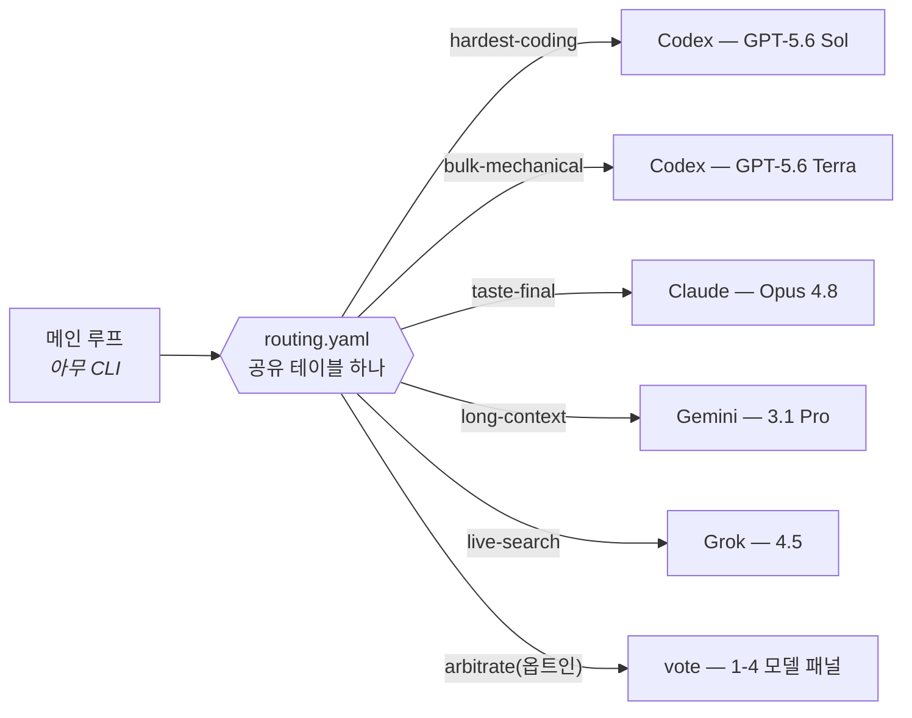

<div align="center">

# omnilane

### 라우팅 테이블 하나로, 모든 하네스를.

*메인 루프가 더 이상 어떤 모델을 쓸지 고민하지 않습니다.*<br/>
모든 서브태스크를 그 일을 정말 잘하는 모델에게——<br/>
**Claude Code · Codex · Grok Build · Antigravity** 를 가로질러, 이미 내고 있는 구독 그대로.

[](https://github.com/Seraphim0916/omnilane/actions/workflows/ci.yml)
[](LICENSE)
[](https://github.com/Seraphim0916/omnilane/tags)

[English](README.md) · [繁體中文](README.zh-TW.md) · [简体中文](README.zh-CN.md) · [日本語](README.ja.md) · **한국어**

</div>

---

```bash
git clone https://github.com/Seraphim0916/omnilane && cd omnilane
./install.sh          # CLI 감지, 스킬 연결, 당신의 언어로 대화
omnilane route hardest-coding "간헐적으로 실패하는 auth 토큰 갱신 테스트 수정"
```

omnilane 은 **어떤** agentic CLI 든 메인 루프가 서브태스크를 레인으로 분류하고,
각 레인을 그 작업에 가장 강한 벤더 CLI 로 헤드리스 디스패치하게 해 줍니다.
기존 구독 로그인을 그대로 사용합니다:



<div align="center">

| | | |
|:---:|:---:|:---:|
| 🧭 **테이블 하나**<br/>네 개 하네스가 공유 | 🪂 **폴백 체인**<br/>가진 CLI 로 자동 강등 | 🗳️ **의견 패널**<br/>중대한 결정은 멀티모델 투표 |
| 🔒 **안전 장치**<br/>락 · 워치독 · 중첩 금지 | 🌏 **5개 언어**<br/>설치기가 모국어로 대화 | ↩️ **완전 가역**<br/>`--uninstall` 로 원상복구 |

</div>

## 🧭 동작 방식

- **`routing.yaml`** — 레인 → 벤더+모델+추론 강도. 파일 하나를 네 하네스가 공유.
- **폴백 체인** — 한 레인에 후보를 여러 개 나열할 수 있습니다
  (`codex … | claude … | off`). 실제로 설치된 첫 번째 벤더 CLI 가 선택되므로
  한두 개 구독만 있어도 같은 테이블이 동작합니다.
- **`scripts/dispatch.sh <레인> "<태스크>"`** — 테이블을 해석해 해당 벤더
  CLI 를 헤드리스로 실행합니다.
- **`skills/omnilane/SKILL.md`** — 네 하네스 공용 스킬: 자기 모델을 파악하고,
  자기 레인은 직접 수행, 나머지는 디스패치.

## 🛤️ 레인 목록(기본값. 실효값은 `scripts/dispatch.sh --list`)

| 레인 | 1순위 모델 | 용도 |
|---|---|---|
| 🔥 hardest-coding | GPT-5.6 Sol (xhigh) | 가장 어려운 구현, 근본 원인 디버깅, 정확성이 핵심인 수정 |
| 🏗️ bulk-mechanical | GPT-5.6 Terra (max) | 리팩터링, 마이그레이션, 테스트, 대량 스윕 |
| 🧹 triage | GPT-5.6 Luna (medium) | 대량 1차 선별 |
| ⚖️ hard-judgment | GPT-5.6 Sol (max) | 아키텍처 중재, 깊은 추론, 세컨드 오피니언 |
| ✒️ taste-final | Claude Opus 4.8 | 대외 문장, prompt/문서 다듬기, 스타일 최종심 |
| 🎨 ui-draft | GPT-5.6 Sol (xhigh) | 디자인 시스템/참고 이미지가 있을 때의 UI 초안 |
| 📚 long-context | Gemini 3.1 Pro (High) | 100만 토큰급 장문 통합——분석 전용, agentic 루프 금지 |
| ⚡ fast-agentic | Gemini 3.5 Flash (High) | 빠른 멀티스텝 agentic 루프, 멀티모달 확인 |
| 📡 live-search | Grok 4.5 | 실시간 X/웹 검색과 소셜 맥락 |
| 🚰 coding-overflow | Grok 4.5 | Codex 쿼터 소진 시 중급 코딩 릴리프 밸브 |
| 🗳️ arbitrate | off(옵트인) | 내장 의견 패널(중대한 결정용)——기본 비활성. `routing.local.yaml` 에서 활성화;투표자×라운드마다 1콜 소모 |

## 🚀 설치

전제: 라우팅할 벤더 CLI(`codex`, `claude`, `grok`, `agy`)가 로그인된 채
`PATH` 에 있을 것——**가진 것만 있으면 됩니다**, 없는 레인은 자동 강등.

가장 빠른 방법: `./install.sh` — 로컬 CLI 를 감지해 스킬을 연결하고, 나머지
플러그인 명령을 안내하며, 실효 라우팅을 출력한 뒤 대화형 설정 메뉴를
제안합니다(`--uninstall` 로 되돌리기). 설치 화면은 시스템 언어에 따라
영/번체/간체/일/한을 자동 선택합니다(`OMNILANE_LANG=ko` 로 강제 가능).
또한 각 CLI 지침 파일(`~/.claude/CLAUDE.md`, `~/.codex/AGENTS.md`,
`~/.grok/Agents.md`, `~/.gemini/GEMINI.md` — 경로는 CLI 버전에 따라 다를
수 있음)에 마커로 감싼 가역적 **상시 라우팅 리마인더**를 선택 설치할 수
있습니다. 비대화형 설치는 `OMNILANE_HOOKS=all|none|claude,codex`. 수동 연결:

- **Claude Code**: 플러그인으로 설치(`/route`, `/route-jobs` 명령 포함),
  또는 `skills/omnilane` 을 `~/.claude/skills/` 에 배치.
- **Codex**: `skills/omnilane` 을 `~/.codex/skills/` 에 배치/링크.
- **Grok Build**: `grok plugin install <이 저장소> --trust`
- **Antigravity**: `agy plugin install <이 저장소>`(먼저
  `agy plugin validate` 로 확인)

## ⚙️ 사용자 설정

세 계층, 모두 선택 사항:

1. **대화형 메뉴** — `scripts/configure.sh` 가 전체 레인을 보여 주고, 레인마다
   벤더 → 모델 → 추론 강도를 고르게 한 뒤(추천 목록+자유 입력) 결과를
   `~/.omnilane/routing.local.yaml` 에 기록합니다.
2. **`~/.omnilane/routing.local.yaml`** — 수동 오버라이드. 형식은
   `routing.yaml` 과 동일, 로컬 우선.
3. **`~/.omnilane/local.sh`** — 머신 전용 바이너리 경로, 프록시, 인증 래퍼.
   모든 러너가 로드하며 커밋되지 않습니다.

언제든 확인:

```
scripts/dispatch.sh --list     # 실효 테이블(폴백 해석 주석 포함)
```

## 📖 명령 레퍼런스

```
dispatch.sh [--background] [--mode advise|work] [--workdir DIR]
            [--model M] [--effort E] LANE "TASK"   # "-" 는 stdin 에서 읽기
dispatch.sh --list
jobs.sh list | status ID | result ID
configure.sh                                        # 대화형 레인 메뉴
```

종료 코드: `2` 사용법 오류, `3` 레인 비활성(off), `4` 체인에 사용 가능한
CLI 없음, `86` 중첩 디스패치 거부, `87` 락 대기 타임아웃.
그 외에는 워커 자신의 종료 코드를 그대로 전달.

## 🎭 모드

- **advise(기본)** — 읽기 전용 워커. Codex 는 read-only 샌드박스,
  Claude 는 Read/Glob/Grep 만, Grok 은 plan 모드.
- **work** — 지정한 `--workdir` 안에서만 파일 수정 허용. Codex 는
  workspace-write, Claude 는 편집 자동 승인, Gemini 는 accept-edits 모드.

## 🔒 안전 장치

- **중첩 디스패치 금지** — 워커의 재디스패치를 거부(`OMNILANE_DEPTH` 가드,
  종료 코드 86). AI 가 AI 를 부르는 쿼터 연쇄 소진을 차단.
- **Codex 직렬화 락** — 같은 대상 디렉터리로의 codex 디스패치는 큐잉.
  크래시로 남은 락은 소유자 PID 로 감지해 안전하게 회수.
- **워치독** — 모든 워커는 `timeout`/`gtimeout`, 둘 다 없으면 perl-alarm
  폴백 아래에서 실행(순정 macOS 가 이 경우).
- **백그라운드 잡 수명주기** — `--background` 워커는 독립 process group 에서
  돌며 호출자가 종료해도 살아남습니다. kill 되면 종료 코드를 기록하고
  `jobs.sh status` 가 `dead` 를 보고.
- **페이로드 상한** — 과대한 태스크 텍스트는 머리/꼬리만 남기고 자동 절단.

## 📊 기본값과 출처

기본 레인 배치는 Artificial Analysis 2026-07 스냅샷(AA 사이트 원본 레코드와
각사 공식 가격 페이지로 교차 검증)과 공개 비교 리뷰에 근거합니다.
이는 의견이지 법칙이 아닙니다——설정 메뉴와 `routing.local.yaml` 이
그래서 존재합니다.

## ⚠️ 알려진 제한

- **Antigravity print 모드의 툴 호출은 현행 CLI 빌드에서 불안정**
  (거부 또는 invalid-argument). 본문을 태스크에 붙여 넣는 장문 통합이라는
  long-context 레인 본연의 용도에는 영향이 없습니다.
- **Grok 에는 추론 강도 조절이 없습니다**. effort 필드는 인터페이스 호환용.
- Codex work 모드가 비 git 디렉터리에서 한 차례 행에 걸렸습니다. 원인 규명
  전까지 git 작업 디렉터리(일반적인 경우)에서 사용하세요.

## 🌱 상태

초기 단계지만 검증됨: shell 코어는 외부 모델 리뷰(지적 11건 전부 수정)와
적대적 검증을 통과했습니다. Grok/Antigravity 커맨드 셸 동작은 CLI 버전에
따라 달라질 수 있습니다. issue 와 PR 환영합니다.
