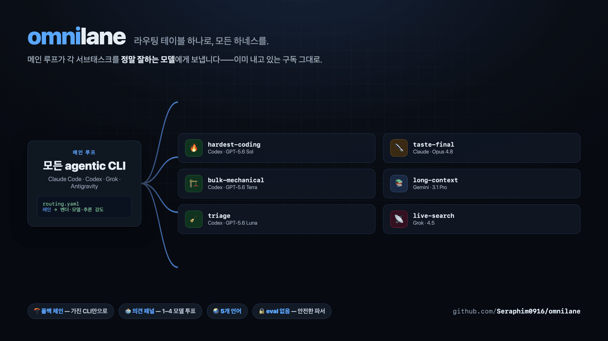
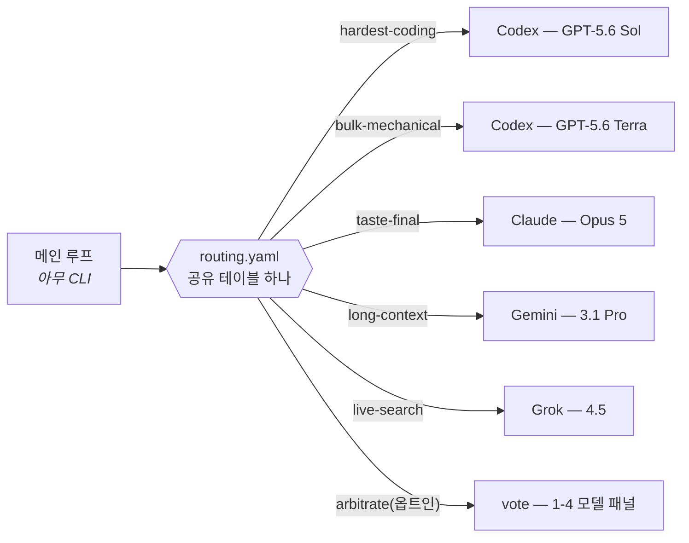

<div align="center">

# omnilane

### 라우팅 테이블 하나로, 모든 하네스를.

*메인 루프가 더 이상 어떤 모델을 쓸지 고민하지 않습니다.*<br/>
**Claude Code · Codex · Grok Build · Antigravity** 어디서 운전하든, 모든 서브태스크를<br/>
그 일을 정말 잘하는 모델에게——Codex, Claude, Grok, Gemini, Kimi, Qwen, OpenCode,<br/>
그리고 OpenRouter 를 통한 모든 호스팅 모델까지——이미 내고 있는 구독 그대로, 또는 API 키 하나로.



[](https://github.com/Seraphim0916/omnilane/actions/workflows/ci.yml)
[](LICENSE)
[](https://github.com/Seraphim0916/omnilane/tags)

[English](README.md) · [繁體中文](README.zh-TW.md) · [简体中文](README.zh-CN.md) · [日本語](README.ja.md) · **한국어**

</div>

---

## 🤔 omnilane 이란?

**무엇이 문제인가.** 이미 AI 코딩 어시스턴트——**Claude Code, Codex, Cursor,
Gemini CLI** 같은——를 쓰고 계시죠. 각각은 하나의 모델 계열하고만 대화합니다.
그래서 맡기는 모든 일이 그 한 모델에서 돌아갑니다, 적합하든 아니든——일회성 파일
이름 변경이 가장 비싼 모델을 소모하고, 정작 어려운 설계 문제는 마침 열어 둔
모델에 걸립니다.

**omnilane 이 하는 일.** 어시스턴트에게 라우팅 표를 줍니다. 작업은 **레인**——
가장 어려운 코딩, 기계적인 물량, 분류, 어려운 판단, 최종 다듬기——으로 나뉘고,
각 레인에는 그 일에 가장 강하고(그리고 가장 저렴한) 모델이 지정됩니다.
어시스턴트는 자신이 잘하는 레인을 직접 처리하고, 나머지는 이미 가진 로그인으로
다른 벤더의 CLI 에 백그라운드로 넘깁니다.

**omnilane 이 아닌 것.** 프록시도, 새 구독도, 계속 돌봐야 할 서비스도 아닙니다.
표 한 장과 디스패치 스크립트 하나가 기존 도구 뒤에서 돌아갈 뿐입니다.
`./install.sh --uninstall` 로 흔적 없이 제거됩니다.

**모든 구독이 필요하지는 않습니다.** 각 레인은 대체 체인이며, 실제로 설치된 첫
후보가 선택됩니다. CLI 가 하나든 일곱이든 동작하고, 아무것도 없는 레인은 실패
대신 그냥 꺼집니다. 구독이 하나여도 기본 표는 그 벤더로 수렴합니다.

**[⬇ 60초 시작으로](#-60초-시작)** · **[❓ FAQ 보기](#-faq)**

## ⚡ 60초 시작

**가장 빠른 방법——npm 으로 설치:**

```bash
npm i -g omnilane                                    # CLI 설치
omnilane route hardest-coding "간헐적으로 실패하는 auth 토큰 갱신 테스트 수정"
omnilane doctor                                      # 사용 가능한 AI CLI / 키 확인
omnilane ui start                                    # 선택: 브라우저에서 잡을 실시간 확인
```

**또는 리포지토리 clone**(라우팅 테이블과 커스터마이즈용 스킬을 얻음):

```bash
git clone https://github.com/Seraphim0916/omnilane && cd omnilane
./install.sh          # CLI 감지, 스킬 연결, 당신의 언어로 대화
omnilane route hardest-coding "간헐적으로 실패하는 auth 토큰 갱신 테스트 수정"
```

> 처음이신가요? 먼저 `omnilane doctor` 를 실행하세요. omnilane 이 지금 어떤 모델 CLI 와
> API 키에 접근할 수 있는지 알려 주어, 실제로 무엇이 실행될지 파악할 수 있습니다.

## 🧭 동작 방식

omnilane 은 **어떤** agentic CLI 든 메인 루프가 서브태스크를 레인으로 분류하고,
각 레인을 그 작업에 가장 강한 벤더로 헤드리스 디스패치하게 해 줍니다.
기존 구독 로그인을 그대로 사용합니다(`openrouter` vendor 는 예외: CLI 없이
API 키 하나로 직접 연결):


```mermaid
flowchart LR
    M["메인 루프<br/><i>아무 CLI</i>"] --> T{{"routing.yaml<br/>공유 테이블 하나"}}
    T -->|hardest-coding| C1["Codex — GPT-5.6 Sol"]
    T -->|bulk-mechanical| C2["Codex — GPT-5.6 Terra"]
    T -->|taste-final| C3["Claude — Opus 5"]
    T -->|long-context| C4["Gemini — 3.1 Pro"]
    T -->|live-search| C5["Grok — 4.5"]
    T -->|"arbitrate(옵트인)"| C6["vote — 1-4 모델 패널"]
```

- **`routing.yaml`** — 레인 → 벤더+모델+추론 강도. 파일 하나를 네 하네스가 공유.
- **폴백 체인** — 한 레인에 후보를 여러 개 나열할 수 있습니다
  (`codex … | claude … | off`). 실제로 설치된 첫 번째 벤더 CLI 가 선택되므로
  한두 개 구독만 있어도 같은 테이블이 동작합니다.
- **`scripts/dispatch.sh [--vendor V] <레인> "<태스크>"`** — 테이블을 해석해
  해당 벤더 CLI 를 헤드리스로 실행합니다. `--vendor` 는 지정한 벤더로
  고정하며 폴백하지 않습니다.
- **`skills/omnilane/SKILL.md`** — 네 하네스 공용 스킬: 자기 모델을 파악하고,
  자기 레인은 직접 수행, 나머지는 디스패치.
- **`omnilane mcp`** — 같은 라우팅을 MCP stdio 서버로 제공.
  스킬 대신 MCP 로 통합하는 호스트용.

<div align="center">

| | | |
|:---:|:---:|:---:|
| 🧭 **테이블 하나**<br/>네 개 하네스가 공유 | 🪂 **폴백 체인**<br/>가진 CLI 로 자동 강등 | 🗳️ **의견 패널**<br/>중대한 결정은 멀티모델 투표 |
| 🔒 **안전 장치**<br/>락 · 워치독 · 중첩 금지 | 🌏 **5개 언어**<br/>설치 프로그램이 모국어로 대화 | ↩️ **완전 가역**<br/>`--uninstall` 로 원상복구 |

</div>

## 🛤️ 레인 목록(기본값. 실효값은 `scripts/dispatch.sh --list`)

| 레인 | 1순위 모델 | 백업 | 용도 |
|---|---|---|---|
| 🔥 hardest-coding | GPT-5.6 Sol (xhigh) | Claude Opus 5 (xhigh) | 가장 어려운 구현, 근본 원인 디버깅, 정확성이 핵심인 수정 |
| 🏗️ bulk-mechanical | GPT-5.6 Terra (max) | Claude Sonnet 5 (high) | 리팩터링, 마이그레이션, 테스트, 대량 스윕 |
| 🧹 triage | GPT-5.6 Luna (medium) | Gemini 3.6 Flash (Low) | 대량 1차 선별 |
| ⚖️ hard-judgment | Claude Opus 5 (xhigh) | GPT-5.6 Sol (max) | 아키텍처 중재, 깊은 추론, 세컨드 오피니언 |
| ✒️ taste-final | Claude Opus 5 (high) | GPT-5.6 Sol (max) | 대외 문장, prompt/문서 다듬기, 스타일 최종심 |
| 💬 consult | 명시적으로 지정한 벤더/모델 | —(폴백 없음) | 자연어 직접 상담. `--vendor` 를 반드시 유지 |
| 🎨 ui-draft | GPT-5.6 Sol (xhigh) | Claude Opus 5 (high) | 디자인 시스템/참고 이미지가 있을 때의 UI 초안 |
| 📚 long-context | Gemini 3.1 Pro (High) | Claude Opus 5 (high) | 100만 토큰급 훑기와 검색. 여러 곳을 잇는 다중 홉 통합은 Claude 후보를, 빠른 반복 루프는 Flash 우선 |
| ⚡ fast-agentic | GPT-5.6 Luna (max) | Gemini 3.6 Flash (High) | 빠른 멀티스텝 agentic 루프, 멀티모달 확인 |
| 📡 live-search | Grok 4.5 | —(off) | 실시간 X/웹 검색과 소셜 맥락 |
| 🚰 coding-overflow | Grok 4.5 | Kimi K3 → Qwen3 Coder Plus → OpenCode | Codex 쿼터 소진 시 중급 코딩 안전 밸브 |
| 🗳️ arbitrate | off(옵트인) | — | 내장 의견 패널(중대한 결정용)——기본 비활성. `routing.local.yaml` 에서 활성화;투표자×라운드마다 1콜 소모 |

**백업**은 체인의 다음 후보입니다——1순위 벤더 CLI 가 설치되지 않았을 때
디스패치가 강등되는 대상입니다. 모든 레인이 이런 체인이며, 체인에 아무것도
설치되어 있지 않으면 레인은 `off` 로 강등됩니다.

> **Claude Fable 5 는 어디에?** 의도적으로 기본 테이블에 넣지 않았습니다——
> 이유와 실측 데이터는 [FAQ](#-faq) 에 정리했습니다.

### 자연어 상담

`omnilane` 스킬이나 `/route` 에서
**“Opus에게 이 아키텍처를 비판적으로 검토해 달라고 해줘.”** 처럼 평범하게
요청할 수 있습니다. 자연어는 Agent Skill 이 해석하며, `dispatch.sh` 에 자유
형식 shell 파서를 추가하는 방식이 아닙니다.

- 모델의 기능만 묻는 질문에는 해당 레인에서 현재 첫 번째로 사용 가능한 모델을
  답하고 모델 호출은 하지 않습니다.
- 일반 벤더명은 그 벤더에 대해 `consult` 에 설정된 후보를 사용합니다.
- Opus 같은 표준 모델 별칭은 스킬 표의 정확한 모델 제품군으로 고정합니다.
  명시한 대상이 없거나 CLI 를 사용할 수 없으면 명확히 실패하며 다른 벤더나
  모델 제품군으로 폴백하지 않습니다.

<details>
<summary><b>👉 어떤 레인을 직접 실행하나요? 메인 모델을 선택하세요</b></summary>

<br/>

위 표는 벤더 중립적입니다——레인의 *최적* 모델은 누가 운전하든 바뀌지
않습니다. 바뀌는 것은 어떤 레인을 **직접 실행**하는지(이미 그 모델이므로
추가 호출 없음)와 **디스패치**하는지입니다. CLI 의 `omnilane` 스킬이 해당
행을 자동 적용하며, 이것은 사람이 보는 버전입니다.

- **Claude Code · Fable 5** — 직접 실행: hard-judgment, taste-final, 정확성이 최우선인 난이도 높은 수정. 디스패치: 기계적 코딩 물량 → Codex, 장문 → Gemini, 실시간 검색 → Grok.
- **Claude Code · Opus 5** 직접 실행: hard-judgment, taste-final. 대량 코딩은 Codex 레인, 장문 → Gemini, 실시간 검색 → Grok.
- **Codex · Sol** — 직접 실행: hardest-coding, hard-judgment, ui-draft. 디스패치: taste-final → Claude, 장문 → Gemini, 실시간 검색 → Grok, 대량 작업 → Codex Terra.
- **Codex · Terra** — 직접 실행: bulk-mechanical. 정말 가장 어려운 부분은 Sol 로 에스컬레이션; taste → Claude, 장문 → Gemini, 실시간 검색 → Grok.
- **Grok Build · Grok 4.5** — 직접 실행: live-search, coding-overflow(중급 코딩). 어려운 작업은 모두 Codex/Claude/Gemini 로——먼저 모든 API 시그니처와 인용 사실을 검증.
- **Antigravity · Gemini** — 직접 실행: 3.1 Pro 로 장문과 무거운 컨텍스트의 agentic 작업, Flash 로 빠른 반복 루프. 가장 어려운 코딩/판단/문장은 Codex/Claude 로; 실시간 검색 → Grok.

</details>

## 🖥️ Live Board

모든 디스패치는——포그라운드든 `--background` 든——디스크에 잡으로 기록됩니다.
Live Board 는 그 잡 저장소 위에 놓인 선택형 읽기 전용 로컬 워크벤치입니다:
각 모델에게 무엇을 물었고, 무엇을 답했고, 어떻게 라우팅됐고, 아직 실행 중인지
한눈에 봅니다.

<div align="center">


</div>

```bash
omnilane ui start    # 서버를 시작하거나 재사용하고 인증 URL 출력
omnilane ui status   # 로컬 서버 상태 확인
omnilane ui url      # 현재 인증 URL 출력
omnilane ui stop     # 정상 중지
```

데스크톱에서는 잡 목록과 상세 패널을 따로 스크롤할 수 있고, 모바일에서는 목록／상세
전환과 뒤로 가기, Esc 를 지원합니다. Server-Sent Events(SSE)는 포커스된 행을
다시 만들지 않고 갱신하며, 짧은 연결 끊김에는 마지막 스냅샷을 유지한 채 재연결합니다.
불러온 잡을 참조로 고정한 뒤 다른 잡을 선택하면 모델 경로와 공개 결과를 나란히
비교할 수 있습니다. 참조 스냅샷은 브라우저 메모리에만 남고 페이지를 닫으면 사라집니다.
`127.0.0.1` 에만 바인딩하고 무작위 토큰으로 보호하는 읽기 전용 화면입니다.
`task.txt` 와 공개용 `out.txt` 만 표시하며 워커나 벤더 원시 로그는 표시하지 않습니다.

화면은 영어, 일본어, 한국어, 번체 중국어, 간체 중국어로 볼 수 있습니다. 처음에는
브라우저 언어를 따르고, 헤더의 선택기로 바꿀 수 있으며 선택은 로컬에 기억됩니다.

핵심 라우팅에는 Python 이 필요 없고, 이 UI 에만 Python 3.9 이상이 필요합니다.

## 📦 설치

전제: 라우팅할 벤더 CLI(`codex`, `claude`, `grok`, `agy`, 선택적으로
`kimi`, `qwen`, `opencode`)가 로그인된 채 `PATH` 에 있을 것——**가진 것만
있으면 됩니다**, 없는 레인은 자동 강등. `openrouter` vendor 는 예외로 CLI 가
필요 없습니다——`curl` 과 환경 변수의 `OPENROUTER_API_KEY` 만 있으면 됩니다.

가장 빠른 방법: `./install.sh` — 로컬 CLI 를 감지해 스킬을 연결하고, 나머지
플러그인 명령을 안내하며, 실효 라우팅을 출력한 뒤 대화형 설정 메뉴를
제안합니다(`--uninstall` 로 되돌리기). 설치 프로그램은 시스템 언어에 따라
영/번체/간체/일/한을 자동 선택합니다(`OMNILANE_LANG=ko` 로 강제 가능).
또한 각 CLI 지침 파일(`~/.claude/CLAUDE.md`, `~/.codex/AGENTS.md`,
`~/.grok/Agents.md`, `~/.gemini/GEMINI.md` — 경로는 CLI 버전에 따라 다를
수 있음)에 마커로 감싼 가역적 **상시 라우팅 리마인더**를 선택 설치할 수
있습니다. 비대화형 설치는 `OMNILANE_HOOKS=all|none|claude,codex`. 수동 연결:

`./install.sh --check` 는 변경 없이 드리프트를 검사합니다. 설치 또는
`--uninstall` 에 `--dry-run` 을 추가하면 소유 대상 작업을 미리 보여 줍니다.
설치 프로그램이 소유한 링크와 표시된 알림을 되돌리려면
`./install.sh --uninstall` 을 실행합니다.

- **Claude Code**: 플러그인으로 설치(`/route`, `/route-jobs` 명령과 함께
  세션 시작 시 라우팅 리마인더를 자동 주입하는 `SessionStart` 훅 포함,
  CLAUDE.md 수정 불필요), 또는 `skills/omnilane` 을 `~/.claude/skills/` 에 배치.
- **Codex**: `skills/omnilane` 을 `~/.codex/skills/` 에 배치/링크.
- **Grok Build**: `grok plugin install <이 저장소> --trust`
- **Antigravity**: `agy plugin install <이 저장소>`(먼저
  `agy plugin validate` 로 확인)

### MCP 서버

`omnilane mcp` 는 의존성 없이 로컬에서 실행되는 MCP stdio 서버를 시작하여,
MCP 지원 호스트가 스킬 설치나 라우팅 리마인더 없이 omnilane 을 발견하고
호출할 수 있게 합니다. 호스트 설정에서 설치된 CLI 를 지정하면 됩니다:

```json
{
  "mcpServers": {
    "omnilane": {
      "command": "omnilane",
      "args": ["mcp"]
    }
  }
}
```

서버는 `route` 와 함께 읽기 전용 조회 도구 `list_lanes`, `explain`, `validate`, `dry_run`, `jobs_list`, `jobs_status`, `jobs_result`, `jobs_stats`, `jobs_audit`, `doctor` 를 제공합니다.
`route` 의 기본값은 읽기 전용 `advise` 모드이며, `work` 를 선택한 호출은
명시적 `workdir` 을 함께 제공해야 합니다.

실행에 필요한 것은 Node.js 뿐입니다(npm 패키지 없음). npm 을 선호하면
`npm install -g omnilane` 으로 MCP 서버가 포함된 CLI 를 설치할 수 있습니다.

## ⚙️ 사용자 설정

세 계층, 모두 선택 사항:

1. **대화형 메뉴** — `scripts/configure.sh` 가 설정 가능한 레인을 보여 주고, 레인마다
   벤더 → 모델 → 추론 강도를 고르게 한 뒤(추천 목록+자유 입력) 결과를
   `~/.omnilane/routing.local.yaml` 에 기록합니다. 다중 벤더 `consult` 는
   의도적으로 제외되며, 바꾸려면 수동으로 편집합니다.
2. **`~/.omnilane/routing.local.yaml`** — 수동 오버라이드. 형식은
   `routing.yaml` 과 동일, 로컬 우선.
3. **`~/.omnilane/local.sh`** — 머신 전용 바이너리 경로, 프록시, 인증 래퍼.
   모든 러너가 로드하며 커밋되지 않습니다.

언제든 확인:

```
scripts/dispatch.sh --list     # 실효 테이블(폴백 해석 주석 포함)
```

## 📖 명령 레퍼런스

```
eval "$(omnilane completion bash)"             # 현재 Bash 에서 완성 활성화
source <(omnilane completion zsh)               # 현재 Zsh 에서 완성 활성화
omnilane completion fish | source              # 현재 Fish 에서 완성 활성화
omnilane mcp                                   # MCP stdio 서버(Node.js 필요)
omnilane release-audit [--target VERSION] [--json] # 오프라인 읽기 전용 릴리스 게이트
omnilane ui start                              # 로컬 Live UI 를 시작하거나 재사용하고 URL 표시
omnilane ui status                             # Live UI 실행 상태 표시
omnilane ui url                                # 현재 인증된 로컬 URL 표시
omnilane ui stop                               # Live UI 중지
omnilane doctor [--json]                       # 라우팅과 로컬 실행 환경을 읽기 전용으로 진단
dispatch.sh [--background] [--dry-run] [--mode advise|work|sysops] [--workdir DIR]
            [--vendor V] [--model M] [--effort E] [--timeout SEC] [--job-timeout SEC]
            LANE "TASK"                              # "-" 는 stdin 에서 읽기
dispatch.sh [--json] --list [--json]
dispatch.sh [--json] --explain LANE [--json]       # 후보별 라우팅 결정을 오프라인 설명
dispatch.sh [--json] --validate [--json]           # 공급자 호출 없이 실효 라우팅 검사
jobs.sh [--json] {list | status ID | result ID}    # JSON은 본문 없이 메타데이터만 반환
jobs.sh [--json] list [--lane L] [--vendor V] [--status running|done]  # 목록 필터
jobs.sh wait ID [--timeout N]                     # 작업 종료값, 124 시간 초과, 125 작업자 소실
jobs.sh cancel ID                                 # 실행 중 작업 중지: 그룹 SIGTERM 후 SIGKILL
jobs.sh rm ID                                     # 완료/종료 작업 1건 삭제(실행 중이면 거부)
jobs.sh [--json] stats [--last N] [--lane L] [--vendor V]  # 로컬 성공률과 라우팅 집계
jobs.sh audit [--last N] [--json]                  # 읽기 전용 작업 무결성/개인정보 검사
jobs.sh prune [--keep N] [--apply]                # 기본은 미리보기이며 완료된 작업만 정리
configure.sh                                        # 대화형 레인 메뉴
configure.sh set|get|unset|list|diff LANE [SPEC]    # routing.local.yaml 비대화식 편집/확인
```

종료 코드: `2` 사용법 오류(잘못된 벤더 또는 지정 벤더가 레인에 없는 경우 포함),
`3` 레인 비활성(off), `4` 체인에 사용 가능한 CLI 가 없거나 설정된 지정 벤더
CLI 를 사용할 수 없음, `5` 1라운드 성공 투표자 부족, `6` 2라운드 반박 전부 실패,
`86` 중첩 디스패치 거부, `87` 락 대기 타임아웃, `124` 전체 잡 타임아웃.
그 외에는 워커 자신의 종료 코드를 그대로 전달.

## 🎭 모드

- **advise(기본)** — 읽기 전용 워커. Codex 는 read-only 샌드박스,
  Claude 는 Read/Glob/Grep 만, Grok 은 plan 모드, Kimi 와 OpenCode 는 각자의
  읽기 전용 plan 모드 고정, OpenRouter 는 설계상 advise 전용(순수 추론).
- **work** — 지정한 `--workdir` 안에서만 파일 수정 허용. Codex 는
  workspace-write, Claude 는 편집 자동 승인, Gemini 는 accept-edits 모드.
  `openrouter` vendor 는 work 모드를 명확한 오류로 거부합니다——파일 편집은
  에이전트형 CLI 벤더로 보내세요.
- **sysops** — `work` 에서 벤더 샌드박스를 뺀 모드. 샌드박스가 거부하는 서비스
  작업(`launchctl` 등)을 위한 것입니다. Codex 는 `-s danger-full-access` 로
  실행하고, 다른 벤더는 일반 `work` 로 취급합니다. 워커에게 머신 전체 접근 권한을
  주는 셈이므로 디스패치마다 명시적으로 지정해야 하며 레인 기본값이 될 수 없습니다.
  `work` 가 샌드박스 거부로 실패하는 것을 직접 확인한 경우에만 쓰세요.

## 🔒 안전 장치

- **중첩 디스패치 금지** — 워커의 재디스패치를 거부(`OMNILANE_DEPTH` 가드,
  종료 코드 86). AI 가 AI 를 부르는 쿼터 연쇄 소진을 차단.
- **Codex 직렬화 락** — 같은 대상 디렉터리로의 codex 디스패치는 큐잉.
  크래시로 남은 락은 소유자 PID 로 감지해 안전하게 회수.
- **워치독** — 모든 워커는 `timeout`/`gtimeout`, 둘 다 없으면 perl-alarm
  폴백 아래에서 실행(순정 macOS 가 이 경우). 상한은 **CLI 호출마다** 적용되며
  우선순위는 `--timeout SECONDS` > 레인별 `OMNILANE_TIMEOUT_<LANE>`(예:
  `OMNILANE_TIMEOUT_HARD_JUDGMENT`) > 전역 `OMNILANE_TIMEOUT`(기본 600 초)
  순입니다. 이것은 호출 단위 행 방지 장치이지 작업 전체 예산이 아닙니다.
  재시도하는 벤더(grok)나 vote 패널(투표자 × 라운드)은 여러 번 호출하므로
  전체 소요 시간은 이 값의 몇 배가 될 수 있습니다.
- **전체 잡 퓨즈** — 선택형 `--job-timeout SECONDS` 는 락 대기, 재시도,
  모든 투표자와 라운드를 하나의 process group 감독 아래 제한합니다. 우선순위는
  플래그 > `OMNILANE_JOB_TIMEOUT_<LANE>` > `OMNILANE_JOB_TIMEOUT` > 비활성입니다.
  단, Git worktree 밖에서 Codex `work` 를 실행하며 전체 상한이 설정되지 않은 경우에는
  결정된 호출별 워치독을 전체 잡 퓨즈로 자동 사용하며 감독기의 상한은 999999999초입니다.
  이 자동 퓨즈에는 번들 Perl 감독기가 필요합니다. 사용할 수 없으면 경고한 뒤 비 Git
  work를 기존 호출별 워치독 경로로 계속합니다. 그 경로에도 워치독 도구가 없으면 별도로
  경고합니다. 만료 시 감독 중인 process group을
  정리하고 124를 반환합니다. 대규모 저장소 심층 검사는
  2–4시간(7200–14400초), 호출별 워치독은 30분부터 시작하는 것을 권장합니다.
  하드코딩된 기본값은 아닙니다.
- **백그라운드 잡 수명주기** — `--background` 워커는 독립 process group 에서
  돌며 호출자가 종료해도 살아남습니다. kill 되면 종료 코드를 기록하고
  `jobs.sh status` 가 `dead` 를 보고.
- **페이로드 상한** — 과대한 태스크 텍스트는 머리/꼬리만 남기고 자동 절단.

## ❓ FAQ

<details>
<summary><b>이 구독들이 전부 필요한가요?</b></summary>

<br/>

아닙니다. 각 레인은 대체 체인이며 실제로 설치된 첫 후보가 사용됩니다. 구독이
하나면 표 전체가 그 벤더로 수렴하고, 체인에 아무것도 없는 레인은 오류 대신 그냥
꺼집니다. `omnilane doctor` 로 이 머신이 지금 실제로 닿을 수 있는 곳을 확인할 수
있고, `routing.local.yaml.example` 에는 흔한 상황별 시작 프로필(Claude 만,
Codex 중심, Codex 없음)이 들어 있습니다.

</details>

<details>
<summary><b>omnilane 이 제 코드를 새로운 곳으로 보내나요?</b></summary>

<br/>

새로운 목적지는 생기지 않습니다. 디스패치는 이미 설치하고 로그인해 둔 벤더 CLI 를
호출할 뿐이라, 코드가 도달하는 곳은 원래 쓰던 벤더뿐입니다. 러너는 구독형 CLI 를
호출하기 전에 API 키 환경 변수를 제거하므로, 남아 있던 키 때문에 토큰 종량제로
조용히 전환되는 일도 없습니다. 유일한 예외는 direct-API 벤더군(`openrouter`,
`deepseek`, `zai`, `mistral`, `groq`, `cerebras`)으로, 이들은 정의상 당신이 설정한
키로 해당 제공자의 API 를 호출합니다——모두 advise 전용이며 파일을 수정하지 않습니다.

</details>

<details>
<summary><b>Claude Fable 5 는 어디에? 왜 기본 테이블에 없나요?</b></summary>

<br/>

**Claude 최상위 티어는 보통 메인 루프 자신이지 디스패치되는 워커가 아니기
때문입니다.** 레인은 "지금 당신이 몰고 있는 모델 이외"에 작업을 보내려고 존재합니다.
Fable 5 가 메인 루프라면 판단과 문장을 다시 Fable 5 로 라우팅하는 것은 호출만 한 번
늘 뿐 얻는 것이 없습니다——그래서 위의 "메인 모델 고르기" 목록에서 Fable 5 는
**드라이버**로 독립된 줄을 가지며, hard-judgment, taste-final, 정확성이 핵심인
가장 어려운 수정을 직접 처리합니다.

**측정 데이터도 워커로 쓰는 쪽을 지지하지 않습니다.** Artificial Analysis
Intelligence Index(2026-07-24)에서 Opus 5(max)는 61점, Fable 5(max)는 60점 ——
AA 자신이 "사실상 동점"이라 표현했고, Epoch AI 의 Capability Index 는 순위가
반대입니다(Fable 5 161, Opus 5 159). 종합 지능은 무승부로 보면 됩니다. 실제로
벌어지는 곳은 에이전트형 전문 산출물이며, 그 격차는 작지 않습니다:

| 벤치마크 | Claude Opus 5 (max) | Claude Fable 5 | |
|---|---:|---:|---|
| AA-Briefcase(에이전트형 지식 노동, Elo) | 1720 | 1574 | **+146** |
| GDPval-AA v2(Elo) | 1861 | 1747 | **+114** |
| AA-Briefcase 작업당 비용 | $17.79 | $22.30 | **-20%** |
| API 가격, 입력/출력 1M 당 | $5 / $25 | $10 / $50 | **절반** |

Opus 5 의 max, xhigh, high 세 티어가 AA-Briefcase 상위 세 자리를 차지하며,
`high` 티어조차 작업당 비용 절반 이하로 Fable 5 를 이깁니다. 즉 Fable 5 는 가격이
두 배이면서 레인이 중시하는 어떤 축에서도 우위를 사지 못합니다.

**Fable 5 가 실제로 더 나은 지점**: 사실 지식의 폭입니다. AA-Omniscience 에서는
여전히 Opus 5 를 앞서며(두 모델의 규모 차이를 감안하면 당연), 반대로 Opus 5 는
확신이 없을 때도 답하는 경향이 있어 환각률이 50%(Opus 4.8 대비 +14 포인트)입니다.
실행보다 회상이 중심인 작업이라면 명시적으로 지목하세요:

```bash
dispatch.sh --vendor claude --model claude-fable-5 --effort high consult "…"
```

**이는 비용과 메인 루프 정책의 선택이지 능력 평가가 아닙니다.** Fable 5 는 설정
메뉴의 모델 목록에 있으며, `routing.local.yaml` 한 줄로 기본값을 덮어쓸 수 있습니다:

```yaml
taste-final: claude claude-fable-5 high
```

</details>

<details>
<summary><b>Claude 레인은 왜 <code>max</code> 가 아니라 <code>xhigh</code> 인가요?</b></summary>

<br/>

노력 수준이 높을수록 좋은 것이 아니기 때문입니다. Anthropic 은 `xhigh` 를 코딩과
에이전트 작업의 출발점, `high` 를 그 외 지능이 필요한 작업의 하한, `max` 를
정확성이 비용보다 중요한 경우의 설정으로 문서화합니다. 제3자 측정도 일치합니다:
Vals.ai 의 Vibe Code Bench 에서 Opus 5 는 `high` 에서 89.8%, `xhigh` 에서 88.3%,
`max` 에서 88.4% —— 최상위 티어는 더 복잡한 해법을 내놓고 그만큼 더 자주 실패합니다.
워크로드가 다르다면 레인 단위로 올리세요:

```bash
omnilane configure set hard-judgment "claude claude-opus-5 max"
```

</details>

<details>
<summary><b>레인의 1순위 CLI 가 없으면 어떻게 되나요?</b></summary>

<br/>

디스패치가 체인을 따라 내려가며 보유한 첫 벤더를 사용합니다. 호출을 쓰지 않고도
결정을 먼저 확인할 수 있습니다:

```bash
scripts/dispatch.sh --explain hardest-coding   # 후보별 추적
scripts/dispatch.sh --list                     # 전체 유효 테이블
scripts/dispatch.sh --dry-run hardest-coding "…"   # 완전히 해석된 계획, 제공자 호출 없음
```

</details>

<details>
<summary><b>디스패치된 워커가 제 파일을 수정할 수 있나요?</b></summary>

<br/>

요청했을 때만 가능합니다. 디스패치의 기본값은 읽기 전용 `advise` 이며 벤더별로
구현되어 있습니다(읽기 전용 샌드박스, plan 모드, 또는 읽기 전용 도구 집합).
수정하려면 `--mode work` 와 명시적인 `--workdir` 가 모두 필요합니다. 세 번째 모드인
`--mode sysops` 는 `work` 에서 벤더 샌드박스를 뺀 것으로, 샌드박스가 거부하는 서비스
작업(`launchctl` 등)을 위한 것입니다. codex 는 `-s danger-full-access` 로 실행하고
다른 벤더는 `work` 로 취급하며, 디스패치마다 명시해야 할 뿐 레인 기본값이 될 수
없습니다. 워커는 다시
디스패치할 수도 없습니다——깊이 가드가 종료 코드 86 으로 중첩 팬아웃을 거부하므로,
명령 하나가 에이전트 연쇄로 번져 할당량을 태우는 일은 없습니다.

</details>

## 📊 기본값과 출처

기본 레인 배치는 Artificial Analysis 2026-07 스냅샷(AA 사이트 원본 레코드와
각사 공식 가격 페이지로 교차 검증)과 공개 비교 리뷰에 근거합니다.
이는 의견이지 법칙이 아닙니다——설정 메뉴와 `routing.local.yaml` 이
그래서 존재합니다. 벤치마크별 단서를 포함한 작업 노트는
[`docs/model-capabilities-2026-07.md`](docs/model-capabilities-2026-07.md) 에 있습니다.

## ⚠️ 알려진 제한

- **Antigravity print 모드의 툴 호출은 현행 CLI 빌드에서 불안정**
  (거부 또는 invalid-argument). 본문을 태스크에 붙여 넣는 장문 통합이라는
  long-context 레인 본연의 용도에는 영향이 없습니다.
- **Grok 에는 추론 강도 조절이 없습니다**. effort 필드는 인터페이스 호환용.
- **Git 저장소가 아닌 디렉터리에서도 Codex work 를 지원합니다.** 일부 Codex CLI 는
  Git worktree 밖에서 멈출 수 있으므로 위 자동 퓨즈가 이 경우를 제한하고 감독 중인
  process group을 정리합니다. Omnilane 은 `git init` 을 자동 실행하지 않으며 저장소
  생성을 요구하지도 않습니다.

## 📜 릴리스 기록

## v0.12.0 새 기능

- **`hardest-coding`의 Sol을 `max`에서 `xhigh`로** — AA의 노력 수준별 Coding Index
  에서 Sol의 xhigh가 자신의 max와 모든 Claude 티어를 앞서면서 비용은 약 3분의 1
  적다. 이 작업에서 xhigh를 넘는 노력은 정확도가 아니라 과잉 사고를 산다.
- **`fast-agentic`의 1순위가 GPT-5.6 Luna로**, Gemini 3.6 Flash는 2순위. Luna는 AA
  Agentic Index에서 Flash를 크게 앞서고, 2026-07-30 가격 인하 후 태스크당 비용이
  극히 낮다. Flash에 남은 우위는 처리량뿐 — 레이턴시가 병목인 루프라면 로컬 설정에서
  다시 앞에 두면 된다.
- **레인 주석에서 수치 제거.** `routing.yaml`은 각 순서가 성립하는 "이유"만 서술하고,
  점수·가격·처리량은 조회 날짜와 함께 `docs/model-capabilities-2026-07.md`에만 둔다.
  수치가 낡아도 라우팅 표를 고칠 필요가 없다.
- **value 프로파일** 추가(`routing.local.yaml.example`) — Intelligence Index 약 1점을
  내주고 태스크당 비용을 30~40% 절감.
- **`--mode sysops` 추가** — 벤더 샌드박스를 뺀 `work`. 샌드박스가 거부하는 서비스
  작업을 위한 것입니다. 워커에게 머신 전체 접근 권한을 주므로 디스패치별 지정만
  가능하며 레인 기본값이 될 수 없습니다.
- **가격·벤치마크 갱신**(2026-07-30 OpenAI 인하 반영). 그리고 AA의 Coding Index는
  Coding Agent Index가 **아니라는** 점을 문서화 — 구성 요소가 전혀 다른데 수치가
  겹친다.

## v0.11.0 새 기능

- **Live Board 를 5 개 언어로 읽을 수 있습니다** — 영어, 일본어, 한국어, 번체 중국어,
  간체 중국어. 처음에는 브라우저 언어를 따르고, 헤더의 선택기로 바꿀 수 있으며 선택은
  로컬에 기억됩니다. 제목, 검색 자리표시자, 필터 버튼, 빈 상태와 오류 상태, 콘텐츠
  마커, 스크린 리더가 읽는 `aria-label` 까지 모두 포함하며 `<html lang>` 도 선택을
  따릅니다.
- **작업 상태도 번역하지만 이를 읽는 쪽은 그대로입니다** — `state-` CSS 클래스는 원래
  값을 유지해 상태 색상이 바뀌지 않고, 검색 색인은 두 표기를 모두 담고 있어 `running`
  으로도 번역어로도 같은 작업이 검색됩니다.
- **라우팅 변경 없음.** 디스패치 동작은 v0.10.4 와 동일합니다.

## v0.10.4 새 기능

- **`long-context` 가 더 이상 다중 홉 작업을 잘못된 모델로 보내지 않습니다** — 이
  레인은 장문 *통합*을 표방하면서 Gemini 를 1순위로 두었지만, 공개된 1M 토큰 멀티
  니들 점수는 Claude 가 약 3배 앞서고 Gemini 가 강한 쪽은 싱글 니들 검색입니다.
  레인 설명을 훑기와 검색으로 좁히고, 여러 곳을 잇는 통합에는 Claude 후보를
  안내합니다. 순서는 의도적으로 유지 — 근거가 2차 자료이고 이전 세대 모델을 측정한
  것이기 때문입니다.
- **Coding Agent Index 를 수치로 인용하지 않습니다** — 같은 모델이 버전과 하네스에
  따라 80, 78, 67 로 읽힙니다. 이제 순서 참조로만 쓰고, 관측값마다 출처를 기록합니다.
- **`taste-final` 에 글쓰기 전용 근거 추가** — 이전에는 산문을 측정하지 않는 범용·
  에이전트 지표만으로 순서를 정했습니다. EQ-Bench Creative Writing v3, EQ-Bench
  Longform, Lech Mazur 세 보드를 모두 발행처에서 직접 가져와 추가했습니다.
- **노력 수준별 비용과 처리량 추가**. 기본값이 `xhigh` 인 이유를 보여줍니다:
  `max` 와 같은 지수 점수를 작업당 30-53% 저렴하게 얻습니다.

## v0.10.3 새 기능

- **5개 언어 README 전면 재구성** — 문서 첫머리에서 "이게 무엇이고 왜 필요한가"를
  먼저 설명하고, 버전 기록은 도입부를 끊지 않도록 맨 아래로 모았습니다. 그리고
  반복해서 들어온 질문에 답하는 FAQ 를 새로 넣었습니다: 구독이 전부 필요한지,
  코드가 어디로 가는지, 왜 Fable 5 가 기본 테이블에 없는지, 왜 `max` 가 아니라
  `xhigh` 인지, CLI 가 없으면 어떻게 되는지, 워커가 파일을 수정할 수 있는지.
- **수정: 플러그인 매니페스트가 옛 버전을 표시** — `plugin.json` 과
  `.claude-plugin/plugin.json` 이 0.10.1, 0.10.2 릴리스 후에도 `0.10.0` 으로
  남아 있어 플러그인 설치 시 잘못된 버전이 표시되었습니다.
- **수정: `routing.local.yaml.example` 이 퇴역 모델을 가리킴** — 시작 프로필의
  `claude-opus-4-8` 을 모두 `claude-opus-5`(레인에 맞는 노력 수준 포함)로,
  Gemini 3.5 Flash 후보를 3.6 Flash 로 바꿔 0.10.0 이후 기본값과 맞췄습니다.
- **Intelligence Index 수치를 원본과 대조해 정정**
  (`docs/model-capabilities-2026-07.md`): 퍼센트가 아니라 지수 점수입니다.
  AA-Briefcase / GDPval-AA v2 비교를 추가하고, 기본값과 반대 방향인 두 결과도
  기록했습니다: 사실 지식은 Fable 5 가, 표현 품질은 GPT-5.6 Sol 이 앞섭니다.

## v0.10.2 새 기능

- **`hardest-coding` 과 `hard-judgment` 의 Claude 노력 수준을 `max` 에서 `xhigh`
  로 변경**. Claude Opus 5 에 대한 Anthropic 의 문서화된 지침에 맞췄습니다:
  코딩과 에이전트 작업은 `xhigh` 에서 시작, 그 외 지능이 필요한 작업의 하한은
  `high`, `max` 는 정확성이 비용보다 중요한 경우에 한합니다. 되돌리려면
  `omnilane configure set <lane> "<spec>"` 을 쓰세요.
- **깨진 CHANGELOG 비교 링크 2건 수정** — 공개된 적 없는 `v0.10.0` 태그를
  가리키고 있었습니다.

## v0.10.1 새 기능

- **기본 라우팅에 `claude-opus-5` 추가**. `hard-judgment` 와 `taste-final` 의
  첫 번째 선택이며, 가장 어려운 코딩 작업의 대체 경로로도 사용됩니다.
- **`omnilane configure` 를 13개 전체 제공자로 확장**. 선택 가능한 모델은
  106개이며 Codex, Claude Code, Grok Build, Antigravity 의 최신 카탈로그와
  검증된 OpenRouter／OpenCode 바로가기를 포함합니다. `c` 를 통한 사용자 지정
  모델 ID 입력도 계속 지원합니다.

<details>
<summary>이전 릴리스(v0.10.0 이하)</summary>

## v0.10.0 새 기능

- **Gemini 3.6 Flash 기본 라우팅** — `fast-agentic`, `triage`,
  `bulk-mechanical` 의 gemini 후보(그리고 `Gemini Flash` 별칭)를 Gemini 3.6
  Flash 로 변경: 출력 토큰 감소, 출력 단가 인하, Artificial Analysis 측정 출력
  속도 1위.
- **근거 재감사** — 라우팅 주석, 모델 능력 노트, Gemini 가격표를 공식 소스에
  맞춰 갱신.

## v0.9.1 새 기능

- **수정**: `configure set` 이 더 이상 `routing.local.yaml` 의 수기 주석을
  삭제하지 않습니다. 자체 스탬프 줄과 교체 대상 레인만 다시 씁니다.

## v0.9.0 새 기능

- **OpenAI 호환 direct-API 벤더 5개 추가** — `deepseek`, `zai` (GLM), `mistral`,
  `groq`, `cerebras` 가 `openrouter` 처럼 CLI 없는 레인으로 추가(curl 과
  `<VENDOR>_API_KEY` 만 필요). `lib/common.sh` 레지스트리에 한 줄로 추가되며,
  모델 능력 비교는 [`docs/model-capabilities-2026-07.md`](docs/model-capabilities-2026-07.md) 참고.
- **Fish 셸 자동완성** — `omnilane completion fish | source`.

## v0.8.3 새 기능

- **MCP 서버** — `omnilane mcp` 는 의존성 없는 stdio MCP 서버를 시작하여,
  MCP 지원 호스트(Claude Code, Codex, Gemini CLI, Cursor, OpenCode 등)가
  스킬 설치 없이 omnilane 을 발견하고 호출할 수 있습니다: 도구는 `route`,
  `jobs_status`, `jobs_result`, `list_lanes`. `route` 는 읽기 전용 advise 가
  기본값이며, work 모드는 명시적 workdir 이 필요합니다.

## v0.8.2 새 기능

- **`openrouter` vendor** — `curl`과 `OPENROUTER_API_KEY`만으로
  OpenRouter API에 직접 디스패치합니다. 어떤 omnilane 설치에서도 수백 개의
  호스팅 모델에 접근할 수 있으며 코딩 에이전트 CLI를 추가로 설치할 필요가
  없습니다. advise/consult 전용(파일 편집 불가, work 모드는 명확한 오류로
  안내)이며 모델 slug는 필수입니다. 예:
  `dispatch.sh --vendor openrouter --model anthropic/claude-sonnet-5 consult "..."`
- **`opencode` vendor** — 멀티 프로바이더 집합 CLI OpenCode를 통한
  헤드리스 디스패치(`opencode run`). advise 모드는 내장 읽기 전용 `plan`
  에이전트를 사용하고 work 모드는 `--auto`를 사용합니다. 기본
  `coding-overflow` 체인의 마지막 폴백으로 추가되었습니다.

## v0.8.1 새 기능

- **Claude Code 플러그인이 라우팅 리마인더를 자동 로드** — 플러그인에
  `SessionStart` 훅(`hooks/hooks.json`)이 포함되어 세션 시작 시
  (`startup|resume|clear`) 라우팅 리마인더를 자동 주입합니다.
  `~/.claude/CLAUDE.md` 수정 없이 플러그인 설치만으로 적용됩니다.
  다른 CLI는 기존대로 `install.sh` 지침 파일 방식을 사용합니다.

## v0.8.0 새 기능

- **새 디스패치 벤더 2종** — `kimi`(Moonshot Kimi Code CLI)와
  `qwen`(Alibaba Qwen Code CLI)이 통일 runner 계약으로 합류:
  advise 는 읽기 전용, work 는 자동 승인, API 키 환경 변수를 제거해
  CLI 자체 구독 로그인을 사용, 빈 출력은 명시적 실패.
  `--vendor kimi|qwen` 으로 직접 지정할 수 있습니다.
- **coding-overflow 폴백 체인** — 쿼터 안전 밸브가 grok → kimi → qwen
  → `off` 순으로 폴백해 세 벤더 중 하나만 설치돼 있어도 동작합니다.
  runner 는 페이크 바이너리로 계약 테스트 완료. 실제 모델 사용 보고를
  환영합니다.

## v0.7.1 새 기능

- **라우팅 테이블 갱신(2026-07 모델 데이터)** — hardest-coding 1순위를
  GPT-5.6 Sol **max** 로 변경. Artificial Analysis Coding Agent Index v1.1 에서
  Sol (max) 이 80점으로 현행 최고를 기록해, 기존 「xhigh 가 max 보다 낫다」
  스냅샷을 대체합니다.
- **Claude 백업 강화** — hardest-coding 과 hard-judgment 의 Claude Opus 4.8
  백업을 **xhigh** 로 변경. 어려운 작업과 장시간 작업에 extra effort 를
  권장하는 Anthropic 공식 가이드를 따릅니다.

## v0.7.0 새 기능

- **디스패치를 먼저 미리보기** — `--dry-run` 은 완전히 해석된 실행 계획(vendor,
  모델, 모드, 타임아웃, 부작용 판정)을 출력하며 모델 호출도 작업 상태 생성도
  하지 않습니다.
- **버전 있는 JSON 자동화** — `--list`/`--explain`/`--validate` 와
  `jobs list|status|result|stats` 에 `--json` 엔벨로프를 제공하고, 읽기 전용
  `jobs wait`, `jobs audit`, 결정적 manifest 를 갖춘 오프라인
  `omnilane release-audit` 게이트를 추가했습니다.
- **로컬 작업을 끝까지 제어** — `jobs tail` 로 실시간 출력을 확인하고,
  `jobs retry` 로 완료된 작업을 fail-closed 로 재실행하며,
  `prune --older-than` 으로 오래된 작업을 정리합니다. `--help` 가 모든 명령을
  다룹니다.
- **설치와 자동완성을 안전하게** — `install.sh --check`/`--dry-run` 은 쓰기 없이
  드리프트를 보고하고, `omnilane completion bash|zsh` 가 안전한 탭 완성을
  제공하며, macOS 기본 Bash 3.2 크래시 5건을 수정했습니다.

## v0.6.0 새 기능

- **라우팅을 오프라인으로 설명하고 검증** — `--explain` 으로 각 폴백 후보를
  확인하고 `--validate` 로 전체 유효 라우팅 테이블을 검사합니다. 공급자를
  호출하거나 잡 상태를 만들지 않습니다.
- **로컬 상태를 기계 판독 데이터로 관찰** — 제한된 `jobs.sh stats` 집계와
  `omnilane doctor --json` 을 사용해 태스크나 결과 본문 노출 없이 자동화합니다.
- **Live Board 에서 두 잡 비교** — 불러온 잡 하나를 메모리에만 존재하는 참조
  스냅샷으로 고정하고 모델 경로와 공개 결과를 나란히 비교합니다.
- **조용한 잠금 복구** — 소유자 파일이 확인과 읽기 사이에 사라져도 오해를 부르는
  파일 없음 진단을 노출하지 않으며 fail-closed 동작을 유지합니다.

## v0.5.1 새 기능

- **Git 저장소 밖에서 Codex work 사용** — 일반 디렉터리를 계속 지원하며
  Omnilane 은 `git init` 을 요구하거나 자동 실행하지 않습니다.
- **비 Git 멈춤을 안전하게 종료** — 전체 상한이 없으면 결정된 호출별 워치독을
  process group 퓨즈로 사용하고, 명시한 timeout 우선순위와 종료 코드 의미는
  그대로 유지합니다.
- **표시 버전을 신뢰 가능하게 유지** — `VERSION` 이 `omnilane --version` 과 두
  plugin manifest 를 통일하며 CI 가 변경 기록과 5개 언어 README 를 검사합니다.

</details>

## 🌱 상태

omnilane 은 13개의 디스패치 벤더를 갖춥니다——4개의 하네스 네이티브(codex,
claude, grok, gemini), 3개의 집합/오버플로 CLI(kimi, qwen, opencode), 그리고
CLI 가 필요 없는 OpenAI 호환 direct-API 벤더 6개(openrouter, deepseek, zai,
mistral, groq, cerebras)——모두 통일 runner 계약과 계약 테스트를 갖추었고,
Claude Code `SessionStart` 자동 리마인더와 MCP stdio 서버(`omnilane mcp`)도 포함합니다.
kimi, qwen, opencode, openrouter 의 runner 는 페이크 바이너리로 계약 테스트를
마쳤습니다. 실제 모델 사용 보고를 환영합니다. Grok/Antigravity 커맨드 셸
동작은 CLI 버전에 따라 달라질 수 있습니다. issue 와 PR 환영합니다.

프로젝트 문서: [기여 가이드](CONTRIBUTING.md) · [보안 정책](SECURITY.md) ·
[변경 기록](CHANGELOG.md)
