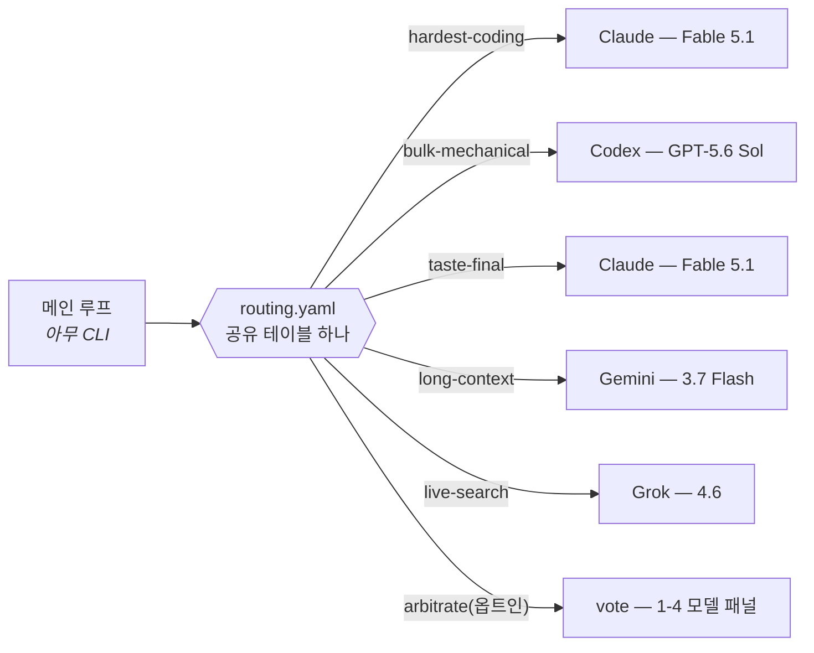

<div align="center">

# omnilane

### 라우팅 테이블 하나로, 모든 하네스를.

*메인 루프가 더 이상 어떤 모델을 쓸지 고민하지 않습니다.*<br/>
**Claude Code · Codex · Grok Build · Antigravity** 어디서 운전하든, 모든 서브태스크를<br/>
그 일을 정말 잘하는 모델에게——Codex, Claude, Grok, Gemini, Kimi, Qwen, OpenCode,<br/>
그리고 OpenRouter 를 통한 모든 호스팅 모델까지——이미 내고 있는 구독 그대로, 또는 API 키 하나로.


[](https://github.com/Seraphim0916/omnilane/actions/workflows/ci.yml)
[](LICENSE)
[](https://github.com/Seraphim0916/omnilane/tags)

[English](README.md) · [繁體中文](README.zh-TW.md) · [简体中文](README.zh-CN.md) · [日本語](README.ja.md) · **한국어**

</div>

---

## 🤔 omnilane 이란?

**무엇이 문제인가.** 이미 AI 코딩 어시스턴트——**Claude Code, Codex, Cursor,
Gemini CLI** 같은——를 쓰고 계시죠. 각각은 하나의 모델 계열하고만 대화합니다.
그래서 맡기는 모든 일이 그 한 모델에서 돌아갑니다, 적합하든 아니든——일회성 파일
이름 변경이 가장 비싼 모델을 소모하고, 정작 어려운 설계 문제는 마침 열어 둔
모델에 걸립니다.

**omnilane 이 하는 일.** 어시스턴트에게 라우팅 표를 줍니다. 작업은 **레인**——
가장 어려운 코딩, 기계적인 물량, 분류, 어려운 판단, 최종 다듬기——으로 나뉘고,
각 레인에는 그 일에 가장 강하고(그리고 가장 저렴한) 모델이 지정됩니다.
어시스턴트는 자신이 잘하는 레인을 직접 처리하고, 나머지는 이미 가진 로그인으로
다른 벤더의 CLI 에 백그라운드로 넘깁니다.

**omnilane 이 아닌 것.** 프록시도, 새 구독도, 계속 돌봐야 할 서비스도 아닙니다.
표 한 장과 디스패치 스크립트 하나가 기존 도구 뒤에서 돌아갈 뿐입니다.
`./install.sh --uninstall` 로 흔적 없이 제거됩니다.

**모든 구독이 필요하지는 않습니다.** 각 레인은 대체 체인이며, 실제로 설치된 첫
후보가 선택됩니다. CLI 가 하나든 일곱이든 동작하고, 아무것도 없는 레인은 실패
대신 그냥 꺼집니다. 구독이 하나여도 기본 표는 그 벤더로 수렴합니다.

**[⬇ 60초 시작으로](#-60초-시작)** · **[❓ FAQ 보기](#-faq)**

## ⚡ 60초 시작

**가장 빠른 방법——npm 으로 설치:**

```bash
npm i -g omnilane                                    # CLI 설치
export OMNILANE_AA_OPERATOR_ASSERTED_HUMAN=1         # 호출자는 모델이 아닌 사람 운영자
omnilane route hardest-coding "간헐적으로 실패하는 auth 토큰 갱신 테스트 수정"
omnilane doctor                                      # 사용 가능한 AI CLI / 키 확인
omnilane ui start                                    # 선택: 브라우저에서 잡을 실시간 확인
```

**또는 리포지토리 clone**(라우팅 테이블과 커스터마이즈용 스킬을 얻음):

```bash
git clone https://github.com/Seraphim0916/omnilane && cd omnilane
./install.sh          # CLI 감지, 스킬 연결, 당신의 언어로 대화
export OMNILANE_AA_OPERATOR_ASSERTED_HUMAN=1         # 호출자는 모델이 아닌 사람 운영자
omnilane route hardest-coding "간헐적으로 실패하는 auth 토큰 갱신 테스트 수정"
```

> **그 export 는 왜 필요한가요?** omnilane 은 호출자 자신의 능력 점수로 모든 디스패치를
> 게이트하므로, 디스패치는 «누가 요청하는지»를 반드시 밝혀야 합니다. 터미널 앞의 사람은
> `OMNILANE_AA_OPERATOR_ASSERTED_HUMAN=1` 을 한 번 설정하거나 호출마다
> `--operator-asserted-human` 을 붙입니다. omnilane 을 구동하는 모델은 **스스로 이를 주장할
> 수 없습니다**. 모델의 신원은 그것을 실행한 CLI 의 모델·effort 플래그에서 자동으로 읽히므로,
> 일반 세션은 아무것도 전달할 필요가 없습니다. `omnilane whoami` 는 그 신원을
> `--caller-context FILE` 로 출력합니다. 주장도 읽을 수 있는 신원도 없으면 잡 생성 전에
> `missing-caller-context` 로 거부됩니다.

> 처음이신가요? 먼저 `omnilane doctor` 를 실행하세요. omnilane 이 지금 어떤 모델 CLI 와
> API 키에 접근할 수 있는지 알려 주어, 실제로 무엇이 실행될지 파악할 수 있습니다.

## 🧭 동작 방식

omnilane 은 **어떤** agentic CLI 든 메인 루프가 서브태스크를 레인으로 분류하고,
각 레인을 그 작업에 가장 강한 벤더로 헤드리스 디스패치하게 해 줍니다.
기존 구독 로그인을 그대로 사용합니다(`openrouter` vendor 는 예외: CLI 없이
API 키 하나로 직접 연결):


```mermaid
flowchart LR
    M["메인 루프<br/><i>아무 CLI</i>"] --> T{{"routing.yaml<br/>공유 테이블 하나"}}
    T -->|hardest-coding| C1["Claude — Fable 5.1"]
    T -->|bulk-mechanical| C2["Codex — GPT-5.6 Sol"]
    T -->|taste-final| C3["Claude — Fable 5.1"]
    T -->|long-context| C4["Gemini — 3.7 Flash"]
    T -->|live-search| C5["Grok — 4.6"]
    T -->|"arbitrate(옵트인)"| C6["vote — 1-4 모델 패널"]
```

- **`routing.yaml`** — 레인 → 벤더+모델+추론 강도. 파일 하나를 네 하네스가 공유.
- **폴백 체인** — 한 레인에 후보를 여러 개 나열할 수 있습니다
  (`codex … | claude … | off`). 실제로 설치된 첫 번째 벤더 CLI 가 선택되므로
  한두 개 구독만 있어도 같은 테이블이 동작합니다.
- **`scripts/dispatch.sh [--vendor V] <레인> "<태스크>"`** — 테이블을 해석해
  해당 벤더 CLI 를 헤드리스로 실행합니다. `--vendor` 는 지정한 벤더로
  고정하며 폴백하지 않습니다.
- **`skills/omnilane/SKILL.md`** — 네 하네스 공용 스킬: 자기 모델을 파악하고,
  자기 레인은 직접 수행, 나머지는 디스패치.
- **`omnilane mcp`** — 같은 라우팅을 MCP stdio 서버로 제공.
  스킬 대신 MCP 로 통합하는 호스트용.

<div align="center">

| | | |
|:---:|:---:|:---:|
| 🧭 **테이블 하나**<br/>네 개 하네스가 공유 | 🪂 **폴백 체인**<br/>가진 CLI 로 자동 강등 | 🗳️ **의견 패널**<br/>중대한 결정은 멀티모델 투표 |
| 🔒 **안전 장치**<br/>락 · 워치독 · 중첩 금지 | 🌏 **5개 언어**<br/>설치 프로그램이 모국어로 대화 | ↩️ **완전 가역**<br/>`--uninstall` 로 원상복구 |

</div>

## 🛤️ 레인 목록(기본값. 실효값은 `scripts/dispatch.sh --list`)

| 레인 | 1순위 모델 | 백업 | 용도 |
|---|---|---|---|
| 🔥 hardest-coding | Claude Fable 5.1 (max) | GPT-6 Astra (xhigh) → Grok 4.6 → Gemini 3.8 Flash (High) | 가장 어려운 구현, 근본 원인 디버깅, 정확성이 핵심인 수정 |
| 🏗️ bulk-mechanical | GPT-5.6 Sol (high) | Gemini 3.8 Flash (High) → Claude Sonnet 5 (high) | 리팩터링, 마이그레이션, 테스트, 대량 스윕——기계적 지구력 작업 |
| 🧹 triage | GPT-5.6 Luna (high) | Gemini 3.8 Flash (Low) → Claude Haiku 4.5 | 대량 스캔과 1차 선별 |
| ⚖️ hard-judgment | Claude Fable 5.1 (xhigh) | GPT-6 Astra (xhigh) → Grok 4.6 | 아키텍처 판정, 심층 추론, 2차 의견 |
| ✒️ taste-final | Claude Fable 5.1 (xhigh) | GPT-6 Astra (xhigh) → Grok 4.6 → Gemini 3.8 Flash (High) | 사용자 대상 문장, 프롬프트／문서 다듬기, 스타일 판정 |
| 💬 consult | GPT-6 Astra (xhigh) | Claude Fable 5.1 (xhigh) → Grok 4.6 → Gemini 3.8 Flash (Medium) | 지정 모델 직접 상담. 폴백 방지를 위해 `--vendor` 유지 |
| 🎨 ui-draft | GPT-5.6 Sol (high) | Claude Fable 5.1 (xhigh) → Gemini 3.8 Flash (High) | 디자인 시스템／참조 이미지가 있을 때만 UI 초안 |
| 📚 long-context | Gemini 3.8 Flash (Medium) | GPT-5.6 Terra (max) → Claude Opus 5 (medium) | 장문 추출과 종합. AA-LCR, 비용, 처리량 순 |
| ⚡ fast-agentic | Gemini 3.8 Flash (Low) | GPT-5.6 Luna (high) → Claude Haiku 4.5 | 빠른 멀티스텝 agentic 루프, 멀티모달 확인 |
| 📡 live-search | Grok 4.6 | Gemini 3.8 Flash (High) → Claude Sonnet 5 (high) | 실시간 X／웹 검색과 소셜 맥락 |
| 🚰 coding-overflow | Grok 4.6 | Gemini 3.8 Flash (High) → Kimi K3 → Qwen3 Coder Plus → OpenCode | Codex 쿼터 소진 시 중급 코딩 안전 밸브 |
| 🗳️ arbitrate | off (opt-in vote panel) | — | 중대한 판단을 위한 내장 의견 패널. 기본 비활성, `routing.local.yaml` 에서 활성화하며 투표자·라운드당 1회 호출 |

**백업**은 체인의 다음 후보입니다——1순위 벤더 CLI 가 설치되지 않았을 때
디스패치가 강등되는 대상입니다. 모든 레인이 이런 체인이며, 체인에 아무것도
설치되어 있지 않으면 레인은 `off` 로 강등됩니다.

> **Fable 5.1 은 기본값에 포함됩니다——그리고 Opus 5 가 여전히 맞는 자리.** 세 모델 비교와 Opus override 는 [FAQ](#-faq) 에 있습니다.

### 자연어 상담

`omnilane` 스킬이나 `/route` 에서
**“Opus에게 이 아키텍처를 비판적으로 검토해 달라고 해줘.”** 처럼 평범하게
요청할 수 있습니다. 자연어는 Agent Skill 이 해석하며, `dispatch.sh` 에 자유
형식 shell 파서를 추가하는 방식이 아닙니다.

- 모델의 기능만 묻는 질문에는 해당 레인에서 현재 첫 번째로 사용 가능한 모델을
  답하고 모델 호출은 하지 않습니다.
- 일반 벤더명은 그 벤더에 대해 `consult` 에 설정된 후보를 사용합니다.
- Opus 같은 표준 모델 별칭은 스킬 표의 정확한 모델 제품군으로 고정합니다.
  명시한 대상이 없거나 CLI 를 사용할 수 없으면 명확히 실패하며 다른 벤더나
  모델 제품군으로 폴백하지 않습니다.

<details>
<summary><b>👉 어떤 레인을 직접 실행하나요? 메인 모델을 선택하세요</b></summary>

<br/>

위 표는 벤더 중립적입니다——레인의 *최적* 모델은 누가 운전하든 바뀌지
않습니다. 바뀌는 것은 어떤 레인을 **직접 실행**하는지(이미 그 모델이므로
추가 호출 없음)와 **디스패치**하는지입니다. CLI 의 `omnilane` 스킬이 해당
행을 자동 적용하며, 이것은 사람이 보는 버전입니다.

- **Claude Code · Fable 5.1**——직접 실행: taste-final, hardest-coding. 디스패치: hard-judgment → Opus 5, bulk → Codex Sol high, long-context／빠른 루프 → Gemini 3.7 Flash, live-search → Grok.
- **Claude Code · Opus 5**——직접 실행: hard-judgment(기본 레인). 더 낮은 환각률이나 가격이 중요할 때는 로컬 오버라이드로 taste-final 도 맡을 수 있습니다. 최고난도 코딩 → Fable 5.1 또는 Sol, bulk → Sol high, long-context／빠른 루프 → Gemini 3.7 Flash, live-search → Grok.
- **Codex · Sol**——직접 실행: hardest-coding, bulk-mechanical, hard-judgment, ui-draft. 디스패치: taste-final → Claude, long-context／빠른 루프 → Gemini 3.7 Flash, live-search → Grok.
- **Codex · Terra**——long-context 의 Codex 폴백을 직접 실행. bulk-mechanical 기본값은 Sol high 로 이동했습니다. 최고난도는 Sol xhigh, taste → Claude, 빠른 루프 → Gemini 3.7 Flash, live-search → Grok.
- **Grok Build · Grok 4.6**——live-search 와 coding-overflow 를 직접 실행하며, hardest-coding, hard-judgment, taste-final 의 폴백도 겸합니다. 1순위 후보를 쓸 수 있으면 어려운 코딩／판단／문장은 Codex, Claude, Gemini 로 보내고 API 시그니처와 인용 사실을 검증합니다.
- **Antigravity · Gemini 3.7 Flash**——Medium 의 long-context／빠른 루프, High 의 bulk／overflow, Low 의 triage 를 직접 실행하며, High 로 hardest-coding, taste-final, ui-draft, live-search 의 폴백도 겸합니다. 1순위 후보를 쓸 수 있으면 최고난도 코딩／판단／문장은 Codex, Claude 로 보냅니다.

</details>

## 🖥️ Live Board

모든 디스패치는——포그라운드든 `--background` 든——디스크에 잡으로 기록됩니다.
Live Board 는 그 잡 저장소 위에 놓인 선택형 읽기 전용 로컬 워크벤치입니다:
각 모델에게 무엇을 물었고, 무엇을 답했고, 어떻게 라우팅됐고, 아직 실행 중인지
한눈에 봅니다.

<div align="center">


</div>

```bash
omnilane ui start    # 서버를 시작하거나 재사용하고 인증 URL 출력
omnilane ui status   # 로컬 서버 상태 확인
omnilane ui url      # 현재 인증 URL 출력
omnilane ui stop     # 정상 중지
```

데스크톱에서는 잡 목록과 상세 패널을 따로 스크롤할 수 있고, 모바일에서는 목록／상세
전환과 뒤로 가기, Esc 를 지원합니다. Server-Sent Events(SSE)는 포커스된 행을
다시 만들지 않고 갱신하며, 짧은 연결 끊김에는 마지막 스냅샷을 유지한 채 재연결합니다.
불러온 잡을 참조로 고정한 뒤 다른 잡을 선택하면 모델 경로와 공개 결과를 나란히
비교할 수 있습니다. 참조 스냅샷은 브라우저 메모리에만 남고 페이지를 닫으면 사라집니다.
`127.0.0.1` 에만 바인딩하고 무작위 토큰으로 보호하는 읽기 전용 화면입니다.
`task.txt` 와 공개용 `out.txt` 만 표시하며 워커나 벤더 원시 로그는 표시하지 않습니다.

화면은 영어, 일본어, 한국어, 번체 중국어, 간체 중국어로 볼 수 있습니다. 처음에는
브라우저 언어를 따르고, 헤더의 선택기로 바꿀 수 있으며 선택은 로컬에 기억됩니다.

핵심 라우팅에는 Python 이 필요 없고, 이 UI 에만 Python 3.9 이상이 필요합니다.

## 📦 설치

전제: 라우팅할 벤더 CLI(`codex`, `claude`, `grok`, `agy`, 선택적으로
`kimi`, `qwen`, `opencode`)가 로그인된 채 `PATH` 에 있을 것——**가진 것만
있으면 됩니다**, 없는 레인은 자동 강등. `openrouter` vendor 는 예외로 CLI 가
필요 없습니다——`curl` 과 환경 변수의 `OPENROUTER_API_KEY` 만 있으면 됩니다.

가장 빠른 방법: `./install.sh` — 로컬 CLI 를 감지해 스킬을 연결하고, 나머지
플러그인 명령을 안내하며, 실효 라우팅을 출력한 뒤 대화형 설정 메뉴를
제안합니다(`--uninstall` 로 되돌리기). 설치 프로그램은 시스템 언어에 따라
영/번체/간체/일/한을 자동 선택합니다(`OMNILANE_LANG=ko` 로 강제 가능).
또한 각 CLI 지침 파일(`~/.claude/CLAUDE.md`, `~/.codex/AGENTS.md`,
`~/.grok/Agents.md`, `~/.gemini/GEMINI.md` — 경로는 CLI 버전에 따라 다를
수 있음)에 마커로 감싼 가역적 **상시 라우팅 리마인더**를 선택 설치할 수
있습니다. 비대화형 설치는 `OMNILANE_HOOKS=all|none|claude,codex`. 수동 연결:

`./install.sh --check` 는 변경 없이 드리프트를 검사합니다. 설치 또는
`--uninstall` 에 `--dry-run` 을 추가하면 소유 대상 작업을 미리 보여 줍니다.
설치 프로그램이 소유한 링크와 표시된 알림을 되돌리려면
`./install.sh --uninstall` 을 실행합니다.

- **Claude Code**: 플러그인으로 설치(`/route`, `/route-jobs` 명령과 함께
  세션 시작 시 라우팅 리마인더를 자동 주입하는 `SessionStart` 훅 포함,
  CLAUDE.md 수정 불필요), 또는 `skills/omnilane` 을 `~/.claude/skills/` 에 배치.
- **Codex**: `skills/omnilane` 을 `~/.codex/skills/` 에 배치/링크.
- **Grok Build**: `grok plugin install <이 저장소> --trust`
- **Antigravity**: `agy plugin install <이 저장소>`(먼저
  `agy plugin validate` 로 확인)

### MCP 서버

`omnilane mcp` 는 의존성 없이 로컬에서 실행되는 MCP stdio 서버를 시작하여,
MCP 지원 호스트가 스킬 설치나 라우팅 리마인더 없이 omnilane 을 발견하고
호출할 수 있게 합니다. 호스트 설정에서 설치된 CLI 를 지정하면 됩니다:

```json
{
  "mcpServers": {
    "omnilane": {
      "command": "omnilane",
      "args": ["mcp"]
    }
  }
}
```

서버는 `route` 와 함께 읽기 전용 조회 도구 `list_lanes`, `explain`, `validate`, `dry_run`, `jobs_list`, `jobs_status`, `jobs_result`, `jobs_stats`, `jobs_audit`, `doctor` 를 제공합니다.
`route` 의 기본값은 읽기 전용 `advise` 모드이며, `work` 를 선택한 호출은
명시적 `workdir` 을 함께 제공해야 합니다.

실행에 필요한 것은 Node.js 뿐입니다(npm 패키지 없음). npm 을 선호하면
`npm install -g omnilane` 으로 MCP 서버가 포함된 CLI 를 설치할 수 있습니다.

## ⚙️ 사용자 설정

세 계층, 모두 선택 사항:

1. **대화형 메뉴** — `scripts/configure.sh` 가 설정 가능한 레인을 보여 주고, 레인마다
   벤더 → 모델 → 추론 강도를 고르게 한 뒤(추천 목록+자유 입력) 결과를
   `~/.omnilane/routing.local.yaml` 에 기록합니다. 다중 벤더 `consult` 는
   의도적으로 제외되며, 바꾸려면 수동으로 편집합니다.
2. **`~/.omnilane/routing.local.yaml`** — 수동 오버라이드. 형식은
   `routing.yaml` 과 동일, 로컬 우선.
3. **`~/.omnilane/local.sh`** — 머신 전용 바이너리 경로, 프록시, 인증 래퍼.
   모든 러너가 로드하며 커밋되지 않습니다.

언제든 확인:

```
scripts/dispatch.sh --list     # 실효 테이블(폴백 해석 주석 포함)
```

## 📖 명령 레퍼런스

```
eval "$(omnilane completion bash)"             # 현재 Bash 에서 완성 활성화
source <(omnilane completion zsh)               # 현재 Zsh 에서 완성 활성화
omnilane completion fish | source              # 현재 Fish 에서 완성 활성화
omnilane mcp                                   # MCP stdio 서버(Node.js 필요)
omnilane release-audit [--target VERSION] [--json] # 오프라인 읽기 전용 릴리스 게이트
omnilane ui start                              # 로컬 Live UI 를 시작하거나 재사용하고 URL 표시
omnilane ui status                             # Live UI 실행 상태 표시
omnilane ui url                                # 현재 인증된 로컬 URL 표시
omnilane ui stop                               # Live UI 중지
omnilane doctor [--json]                       # 라우팅과 로컬 실행 환경을 읽기 전용으로 진단
dispatch.sh [--background] [--dry-run] [--thread NAME] [--mode advise|work|sysops] [--workdir DIR]
            [--vendor V] [--model M] [--effort E] [--timeout SEC] [--job-timeout SEC]
            [--caller-context FILE | --operator-asserted-human]   # who is asking
            LANE "TASK"                              # "-" 는 stdin 에서 읽기
dispatch.sh [--json] --list [--json]
dispatch.sh [--json] --explain LANE [--json]       # 후보별 라우팅 결정을 오프라인 설명
dispatch.sh [--json] --validate [--json]           # 공급자 호출 없이 실효 라우팅 검사
jobs.sh [--json] {list | status ID | result ID}    # JSON은 본문 없이 메타데이터만 반환
jobs.sh [--json] list [--lane L] [--vendor V] [--status running|done]  # 목록 필터
jobs.sh wait ID [--timeout N]                     # 작업 종료값, 124 시간 초과, 125 작업자 소실
jobs.sh cancel ID                                 # 실행 중 작업 중지: 그룹 SIGTERM 후 SIGKILL
jobs.sh rm ID                                     # 완료/종료 작업 1건 삭제(실행 중이면 거부)
jobs.sh [--json] stats [--last N] [--lane L] [--vendor V]  # 로컬 성공률과 라우팅 집계
jobs.sh audit [--last N] [--json]                  # 읽기 전용 작업 무결성/개인정보 검사
jobs.sh prune [--keep N] [--apply]                # 기본은 미리보기이며 완료된 작업만 정리
configure.sh                                        # 대화형 레인 메뉴
configure.sh set|get|unset|list|diff LANE [SPEC]    # routing.local.yaml 비대화식 편집/확인
```

`--thread NAME`은 단발 디스패치 사이에서 이름이 있는 Claude, Codex, Grok,
Gemini 대화를 이어갑니다. 0.33.0에서는 벤더, 모델, effort, 실제 workdir를
고정합니다. 로컬 상태는 `jobs.sh threads`, `threads show NAME`,
`threads rm NAME`으로 관리하며, 상태를 삭제해도 벤더 세션은 남습니다.

종료 코드: `2` 사용법 오류(잘못된 벤더 또는 지정 벤더가 레인에 없는 경우 포함),
`3` 레인 비활성(off), `4` 체인에 사용 가능한 CLI 가 없거나 설정된 지정 벤더
CLI 를 사용할 수 없음, `5` 1라운드 성공 투표자 부족, `6` 2라운드 반박 전부 실패,
`86` 중첩 디스패치 거부, `87` 락 대기 타임아웃, `124` 전체 잡 타임아웃.
그 외에는 워커 자신의 종료 코드를 그대로 전달.

## 🎭 모드

- **advise(기본)**: 로컬 읽기 전용 분석입니다. 지원 벤더의 기본 검색 도구와 모델 연결은 유지하고 변경 도구는 제한합니다. 모든 벤더의 X／웹 검색 기능이 동등하다는 뜻은 아닙니다.
- **work**: 파일 및 명령 작업은 명시한 `--workdir` 내부로 제한하고 에이전트 도구의 네트워크 접근을 끕니다. 모델 연결은 유지합니다. 강제 경계가 지원되지 않으면 모델 시작 전에 중단하며 sysops 로 조용히 전환하지 않습니다.
- **sysops**: 매번 명시적으로 선택하여 도구, 파일, 네트워크 제한을 해제합니다. 레인 기본값으로 설정하지 않으며 작업에 허용된 동작을 명시해야 합니다.

CLI 에서 `--workdir` 를 생략하면 호출자의 현재 디렉터리를 사용하지만 작업 지시에는 명시하십시오. MCP `route`／`dry_run` 의 work 인터페이스는 별도로 명시적인 `workdir` 를 요구합니다.

Codex 와 Claude 는 세 모드에 서로 다른 정책을 적용합니다. Agy advise／sysops 는 구독 인증을 교체하지 않고 독립 세션 설정을 사용합니다. Agy 1.1.27 work 는 검증된 네 도구와 기본 터미널 샌드박스로 신규／재개 범위를 검증했으며 작업 영역 내 읽기·쓰기·편집·빌드와 영역 밖 쓰기 거부를 확인했습니다. 외부 임시 파일／캐시 읽기도 제한됩니다. 설정은 시작할 때마다 명시적으로 다시 생성하며 불변이라고 주장하지 않습니다. 별도의 실제 work 라이브／FIFO 두 턴 검증에서 이전 턴 읽기, 영역 밖 쓰기 거부, 정상 종료 및 소스 불변을 확인했습니다. Grok advise 는 기본 도구 허용／거부 규칙을 사용합니다. 자식 프로세스 네트워크 격리는 Linux 전용이므로 macOS Grok work 는 시작 전에 중단됩니다. Grok 라이브는 명시적 sysops 가 필요합니다. 검색 가용성과 사용자 훅 영향은 실제 도구 이벤트로 검증하며 성공 종료 코드만으로 입증하지 않습니다. OpenRouter 는 advise 전용이며 다른 벤더는 이 네 벤더 계약에 자동 포함되지 않습니다.

Grok 1.0.13의 단발 `plain` advise는 전체 도구 집합으로 실제 검색, 페이지 조회, 쓰기 거부를 검증했습니다. 내부 웹 도구 ID와 작업별 MCP 준비 상태를 사용하며 훅은 끄지 않습니다. 기존의 비어 있지 않은 `CONTEXT_MODE_MCP_SENTINEL_DIR`은 덮어쓰지 않고 충돌로 모델 시작 전에 중단합니다. 이 결과를 라이브나 macOS work 검증으로 확장하지 않습니다. 자세한 범위는 [날짜별 런타임 게이트](docs/model-capabilities-2026-09.md#f-mode-runtime-gate-2026-09-06)를 참조하십시오.

## 🔒 안전 장치

- **중첩 디스패치 금지** — 워커의 재디스패치를 거부(`OMNILANE_DEPTH` 가드,
  종료 코드 86). AI 가 AI 를 부르는 쿼터 연쇄 소진을 차단.
- **Codex 직렬화 락** — 같은 대상 디렉터리로의 codex 디스패치는 큐잉.
  크래시로 남은 락은 소유자 PID 로 감지해 안전하게 회수.
- **워치독** — 모든 워커는 `timeout`/`gtimeout`, 둘 다 없으면 perl-alarm
  폴백 아래에서 실행(순정 macOS 가 이 경우). 상한은 **CLI 호출마다** 적용되며
  우선순위는 `--timeout SECONDS` > 레인별 `OMNILANE_TIMEOUT_<LANE>`(예:
  `OMNILANE_TIMEOUT_HARD_JUDGMENT`) > 전역 `OMNILANE_TIMEOUT`(기본 600 초)
  순입니다. 이것은 호출 단위 행 방지 장치이지 작업 전체 예산이 아닙니다.
  재시도하는 벤더(grok)나 vote 패널(투표자 × 라운드)은 여러 번 호출하므로
  전체 소요 시간은 이 값의 몇 배가 될 수 있습니다.
- **전체 잡 퓨즈** — 선택형 `--job-timeout SECONDS` 는 락 대기, 재시도,
  모든 투표자와 라운드를 하나의 process group 감독 아래 제한합니다. 우선순위는
  플래그 > `OMNILANE_JOB_TIMEOUT_<LANE>` > `OMNILANE_JOB_TIMEOUT` > 비활성입니다.
  단, Git worktree 밖에서 Codex `work` 를 실행하며 전체 상한이 설정되지 않은 경우에는
  결정된 호출별 워치독을 전체 잡 퓨즈로 자동 사용하며 감독기의 상한은 999999999초입니다.
  이 자동 퓨즈에는 번들 Perl 감독기가 필요합니다. 사용할 수 없으면 경고한 뒤 비 Git
  work를 기존 호출별 워치독 경로로 계속합니다. 그 경로에도 워치독 도구가 없으면 별도로
  경고합니다. 만료 시 감독 중인 process group을
  정리하고 124를 반환합니다. 대규모 저장소 심층 검사는
  2–4시간(7200–14400초), 호출별 워치독은 30분부터 시작하는 것을 권장합니다.
  하드코딩된 기본값은 아닙니다.
- **백그라운드 잡 수명주기** — `--background` 워커는 독립 process group 에서
  돌며 호출자가 종료해도 살아남습니다. kill 되면 종료 코드를 기록하고
  `jobs.sh status` 가 `dead` 를 보고.
- **페이로드 상한** — 과대한 태스크 텍스트는 머리/꼬리만 남기고 자동 절단.

## 📬 라이브 메일함

라이브 메일함은 일회성 dispatch와 다른 지원 모드의 상주 백그라운드 실행입니다. 포어맨이 `--background`로 열고, 실행 중에도 추가 지시를 보낼 수 있으며, 끝나면 `jobs.sh close ID`로 닫을 책임이 있습니다. 방치해도 영구히 남아 있지는 않습니다. 유휴 상한 또는 설정된 전체 작업 시간 제한(`--job-timeout`)에 도달하면 종료됩니다.

```bash
scripts/dispatch.sh --background --vendor claude hard-judgment "시간 제한 테스트 실패를 확인해 주세요"
# dispatch가 출력한 작업 ID를 $ID로 저장
scripts/jobs.sh send "$ID" "재시도 경로도 확인해 주세요."
scripts/jobs.sh watch "$ID"
scripts/jobs.sh tail "$ID" --lines 20
scripts/jobs.sh close "$ID"
scripts/jobs.sh retry "$ID" --background
```

`watch` 는 `$JOB_DIR/events.jsonl` 을 따라가고 `tail` 은 `out.txt` 를 읽습니다. Claude 와 Gemini 는 지원 모드에서 기존 자동 라이브 동작을 유지합니다. Codex／Grok 은 기본적으로 단발 실행이며 `--background --live` 를 명시해야 합니다. Grok 은 추가로 `--mode sysops --workdir DIR` 가 필요합니다. ACP 가 제한 모드 경계를 강제하지 않으므로 advise／work 라이브 요청은 시작 전에 중단됩니다. 미지원 벤더의 라이브 요청은 즉시 실패합니다. `--single-shot` 은 단발 실행을 강제합니다. `--idle-timeout SECONDS` 의 기본값은 900초이며 `0` 은 유휴 상한을 비활성화합니다.

유휴 상태에서는 API 호출이나 비용이 발생하지 않습니다. 기본적으로 새 수신 메시지나 결과 이벤트가 900초 동안 없으면 worker가 자동으로 종료되며, 전체 작업 시간 제한은 바깥쪽 상한으로 유지됩니다. 대화가 끝나면 더 일찍 `close`할 수 있습니다. 끝났거나 라이브가 아닌 작업에 `jobs.sh send`를 실행하면 명확한 오류와 함께 실패합니다. 보낸 뒤 추적하지 않을 작업, 라이브 지원이 없는 벤더, 깨끗한 상태에서 다시 실행해야 하는 경우에는 쓰지 말고 새 dispatch 또는 완료 뒤 `retry`를 사용하세요.

## 🎯 목표 오케스트레이션

`omnilane goal`은 포어맨이 진행하는 작업 원장입니다. 루프는 목표를 연 에이전트 세션이나 터미널 사용자가 담당합니다. 작업을 디스패치하고 완료 수신함 또는 `omnilane jobs wait`로 결과를 받은 뒤 다음 작업을 판단하여 반복합니다. 작업 수와 경과 시간 예산은 기본적으로 무제한입니다. `--budget-jobs N` 또는 `--budget-seconds S`를 지정한 경우에만 해당 상한이 활성화됩니다. omnilane은 기록만 담당하며, 각 goal dispatch 전에 호출자가 지정한 상한과 기본적으로 활성화된 동일 실패 퓨즈를 검사하고 포어맨이 목표를 닫을 때 보고서를 작성합니다.

```bash
GOAL_ID="$(omnilane goal open "불안정한 결제 통합 수정" \
  --budget-jobs 4 --budget-seconds 900 --workdir /path/to/repo)"
JOB_ID="$(omnilane goal dispatch "$GOAL_ID" --mode work hardest-coding \
  "결제 오류를 재현하고 최소 수정 후 검증")"
omnilane jobs wait "$JOB_ID" --timeout 900
omnilane goal note "$GOAL_ID" "결제 통합 테스트 통과"
omnilane goal close "$GOAL_ID" --summary "결제 통합이 안정화됨"
```

목표 상태는 `$OMNILANE_HOME/goals/<goal-id>/`에 저장됩니다. `goal status`로 예산 사용량, 퓨즈 작동 횟수, 각 작업에서 순차적으로 도착하는 메타데이터와 종료 상태를 확인할 수 있습니다. `goal close`는 `report.md`를 기록하고 경로를 출력합니다. 절차가 명확한 단일 작업은 바로 디스패치하십시오. 예산 플래그를 지정한 경우 해당 상한은 엄격한 제한이며 완료를 보장하지 않습니다.

## ❓ FAQ

<details>
<summary><b>이 구독들이 전부 필요한가요?</b></summary>

<br/>

아닙니다. 각 레인은 대체 체인이며 실제로 설치된 첫 후보가 사용됩니다. 구독이
하나면 표 전체가 그 벤더로 수렴하고, 체인에 아무것도 없는 레인은 오류 대신 그냥
꺼집니다. `omnilane doctor` 로 이 머신이 지금 실제로 닿을 수 있는 곳을 확인할 수
있고, `routing.local.yaml.example` 에는 흔한 상황별 시작 프로필(Claude 만,
Codex 중심, Codex 없음)이 들어 있습니다.

</details>

<details>
<summary><b>omnilane 이 제 코드를 새로운 곳으로 보내나요?</b></summary>

<br/>

새로운 목적지는 생기지 않습니다. 디스패치는 이미 설치하고 로그인해 둔 벤더 CLI 를
호출할 뿐이라, 코드가 도달하는 곳은 원래 쓰던 벤더뿐입니다. 러너는 구독형 CLI 를
호출하기 전에 API 키 환경 변수를 제거하므로, 남아 있던 키 때문에 토큰 종량제로
조용히 전환되는 일도 없습니다. 유일한 예외는 direct-API 벤더군(`openrouter`,
`deepseek`, `zai`, `mistral`, `groq`, `cerebras`)으로, 이들은 정의상 당신이 설정한
키로 해당 제공자의 API 를 호출합니다——모두 advise 전용이며 파일을 수정하지 않습니다.

</details>

<details>
<summary><b>Fable 5.1 은 기본값에 포함됩니다——그리고 Opus 5 가 여전히 맞는 자리</b></summary>

<br/>

Fable 5.1 은 이제 `hardest-coding`, `taste-final`의 1순위입니다. 같은
xhigh 에서 지능, agentic 작업, 코딩 모두 Opus 5 를 앞섭니다. Sol max 는
훨씬 저렴한 타 벤더 판단 폴백으로 남습니다. `hard-judgment` 자체는 이제
Opus 5 xhigh 가 기본값입니다: Fable 의 agentic 점수 97.7%를 비용 68%에
얻으면서 환각률도 더 낮아, 이 레인 고유의 비용 기준으로는 더 저렴한
구성이 승리합니다.

| 평가(AA, 2026-09-02 수집) | Claude Fable 5.1 (xhigh) | Claude Opus 5 (xhigh) | GPT-5.6 Sol (max) |
|---|---:|---:|---:|
| Intelligence | 64.8 | 62.5 | 60.9 |
| Agentic | 59.8 | 58.4 | 57.8 |
| Coding | 80.7 | 77.0 | 77.4 |
| 환각률(낮을수록 좋음) | .71 | **.60** | .92 |
| AA $/task | $2.65 | $1.80 | **$0.95** |

Fable 5.1 은 bulk 나 triage 기본값이 아닙니다. 토큰 가격이 Opus 5 의
2배이고 Claude Code 구독 쿼터도 턴당 가장 많이 소비하기 때문입니다.
Opus 5 는 이제 `hard-judgment`의 기본값이며 medium 으로 `long-context`에도
남아 있고, `~/.omnilane/routing.local.yaml` 설정으로 어느 레인에든
언제든 다시 넣을 수 있습니다 — 예를 들어 Fable 을 되돌리려면:

```yaml
hard-judgment: claude claude-fable-5-1 xhigh
```

</details>

<details>
<summary><b>Claude 레인은 왜 <code>max</code> 가 아니라 <code>xhigh</code> 인가요?</b></summary>

<br/>

노력 수준이 높을수록 좋은 것이 아니기 때문입니다. Anthropic 은 `xhigh` 를 코딩과
에이전트 작업의 출발점, `high` 를 그 외 지능이 필요한 작업의 하한, `max` 를
정확성이 비용보다 중요한 경우의 설정으로 문서화합니다. 제3자 측정도 일치합니다:
Vals.ai 의 Vibe Code Bench 에서 Opus 5 는 `high` 에서 89.8%, `xhigh` 에서 88.3%,
`max` 에서 88.4% —— 최상위 티어는 더 복잡한 해법을 내놓고 그만큼 더 자주 실패합니다.
워크로드가 다르다면 레인 단위로 올리세요:

```bash
omnilane configure set hard-judgment "claude claude-opus-5 max"
```

</details>

<details>
<summary><b>레인의 1순위 CLI 가 없으면 어떻게 되나요?</b></summary>

<br/>

디스패치가 체인을 따라 내려가며 보유한 첫 벤더를 사용합니다. 호출을 쓰지 않고도
결정을 먼저 확인할 수 있습니다:

```bash
scripts/dispatch.sh --explain hardest-coding   # 후보별 추적
scripts/dispatch.sh --list                     # 전체 유효 테이블
scripts/dispatch.sh --dry-run hardest-coding "…"   # 완전히 해석된 계획, 제공자 호출 없음
```

</details>

<details>
<summary><b>디스패치된 워커가 제 파일을 수정할 수 있나요?</b></summary>

<br/>

요청했을 때만 가능합니다. 디스패치의 기본값은 읽기 전용 `advise` 이며 벤더별로
구현되어 있습니다(읽기 전용 샌드박스 또는 기본 도구 권한).
범위를 제한한 수정에는 `--mode work` 와 명시적인 `--workdir` 를 지정하십시오.
work 는 지정한 디렉터리 안의 변경만 허용하며 모델 연결은 유지하고 도구 네트워크를 끕니다.
`--mode sysops` 는 Codex, Claude, Grok, Agy 각각의 독립적인 전체 접근 정책이며 work 의 별칭이 아닙니다.
서비스 관리처럼 work 경계를 넘는 동작을 작업에서 명시적으로 허용할 때마다 선택하며 레인 기본값이 될 수 없습니다. 워커는 다시
디스패치할 수도 없습니다——깊이 가드가 종료 코드 86 으로 중첩 팬아웃을 거부하므로,
명령 하나가 에이전트 연쇄로 번져 할당량을 태우는 일은 없습니다.

</details>

<details>
<summary><b>디스패치가 거부되었습니다. 어떤 거부인가요?</b></summary>

<br/>

세 가지 코드에는 각각 다른 해결책이 있습니다. 먼저 `omnilane doctor`를 실행하세요.
`transport-overlay` 검사가 문제의 원인이 이 머신의 설정인지 요청인지 바로
알려줍니다.

`missing-caller-context` — 게이트에 신원이 전달되지 않았습니다. 사람은
`OMNILANE_AA_OPERATOR_ASSERTED_HUMAN=1` 또는 `--operator-asserted-human`을
사용합니다. 모델은 보통 아무것도 할 필요가 없으며, dispatch 가 실행한 CLI 에서 신원을
읽습니다. 읽지 못하면 `omnilane whoami` 를 실행하세요. 전달할 `--caller-context FILE`
을 출력하거나, 읽지 못한 정확한 이유(`--effort` 누락, 모델 별칭, 점수 행 없음)를 알려줍니다.
모델은 사람용 면제를 스스로 주장해서는 안 됩니다.

`runtime-mapping-unverified` — 신원은 정상이지만 **대상**에 검증된 호스트 로컬
요청 셀렉터가 없습니다. 프로브를 한 적이 없거나 프로브가 실패한 경우입니다.
`omnilane doctor`가 해당 구성의 개수를 보고하고, overlay의 `unproven[]`에 각
실패 사유가 기록됩니다. 공급자 할당량 제한으로 인한 거부는 그 할당량이 회복될
때까지 해소되지 않습니다.

`invalid-policy-input`과 "transport contract evidence changed" — 위 둘 다
아닙니다. overlay 자체가 로드되지 않아 **모든 벤더**가 거부됩니다. 흔한 원인은
벤더 CLI 업그레이드입니다. overlay는 각 벤더의 실행 파일과 러너 스크립트 해시를
고정하며, Codex와 Claude의 증거 경로에는 버전 디렉터리가 포함되어 업그레이드 시
다이제스트가 바뀌는 대신 파일이 사라집니다. 태그가 있는 증거는 해당 벤더만
강등시키고, 프로브 매니페스트처럼 태그가 없는 증거는 게이트 전체를 닫습니다.
doctor가 파일과 벤더를 지목하며, 재서명 절차는 디스패치 스킬에 있습니다.

</details>

## 📊 기본값과 출처

기본 레인 배치는 Artificial Analysis 2026-07 스냅샷(AA 사이트 원본 레코드와
각사 공식 가격 페이지로 교차 검증)과 공개 비교 리뷰에 근거합니다.
이는 의견이지 법칙이 아닙니다——설정 메뉴와 `routing.local.yaml` 이
그래서 존재합니다. 벤치마크별 단서를 포함한 작업 노트는
[`docs/model-capabilities-2026-09.md`](docs/model-capabilities-2026-09.md) 에 있습니다.

## ⚠️ 알려진 제한

- **Antigravity print 모드의 툴 호출은 현행 CLI 빌드에서 불안정**
  (거부 또는 invalid-argument). 본문을 태스크에 붙여 넣는 장문 통합이라는
  long-context 레인 본연의 용도에는 영향이 없습니다.
- **Grok 에는 추론 강도 조절이 없습니다**. effort 필드는 인터페이스 호환용.
- **Git 저장소가 아닌 디렉터리에서도 Codex work 를 지원합니다.** 일부 Codex CLI 는
  Git worktree 밖에서 멈출 수 있으므로 위 자동 퓨즈가 이 경우를 제한하고 감독 중인
  process group을 정리합니다. Omnilane 은 `git init` 을 자동 실행하지 않으며 저장소
  생성을 요구하지도 않습니다.

## 📜 릴리스 기록

## v0.42.7 새 기능

- **모델 세션은 신원 파일 없이 디스패치할 수 있습니다.** `--caller-context` 가 없으면 dispatch 가 프로세스 트리를 거슬러 올라가 가장 가까운 벤더 CLI 를 찾고, 그 CLI 가 실행될 때의 모델과 effort 를 읽습니다. 지금까지 omnilane 체크아웃 밖의 세션은 `missing-caller-context` 에서 멈추고 판단을 운영자에게 되돌렸습니다(2026-09-08, 2026-09-10 에 3건).
- **`omnilane whoami`** 는 그 신원을 caller-context 파일로 출력하고, 읽지 못하면 정확한 이유(`--effort` 누락, 모델 별칭, 해당 effort 에 Claude 의 non-reasoning 행만 있음)를 알려줍니다. 추측하지 않습니다.
- **손으로 쓴 파일보다 속이기 어렵습니다.** 게이트는 caller-context 파일의 형식만 확인하고 실제로 실행 중인 모델과 일치하는지는 보지 않습니다. 실행 플래그는 모델이 아니라 하네스가 설정하며, 세션마다 따로 판정됩니다. 같은 모델이라도 `high` 와 `max` 면 상한은 52 와 54 입니다.
- **명시 지정이 우선합니다.** `--caller-context` 파일, 워커가 물려받는 환경, `--operator-asserted-human` 은 모두 자동 읽기보다 우선합니다. `OMNILANE_AA_CALLER_FROM_PROCESS=0` 으로 파일 전용 계약으로 되돌릴 수 있습니다.
- **거부 메시지가 해결책을 알려줍니다.** `missing-caller-context` 와 재시도 거부는 `omnilane whoami` 를 안내합니다.
- **`omnilane --version` 이 다시 정확해졌습니다.** 0.42.6 에서는 `VERSION` 이 0.42.5 로 남아 있었습니다.
- **업그레이드.** npm 게시 후 `npm i -g omnilane@0.42.7`를 실행하세요.

## v0.42.6 새 기능

- **"검증됨"이 어떻게 검증했는지도 알려줍니다.** 각 overlay 매핑은 `evidence_tier`를 가집니다. `billed-model`은 공급자가 과금한 모델을 직접 밝힌 경우(claude, grok), `client-echo`는 CLI가 자신이 보낸 모델을 기록한 경우(codex, agy), `selector-only`는 CLI가 셀렉터를 받아들이기만 한 경우입니다. `client-echo`는 CLI가 적어 둔 주문서이고, `billed-model`은 공급자가 발행한 영수증입니다.
- **보고만 하고 막지 않습니다.** 디스패치는 여전히 `runtime_verified`만으로 결정되므로, 낮은 등급이 기존에 동작하던 레인을 거부하는 일은 없습니다. 세 등급 모두에서 판정이 동일함을 테스트로 보장합니다.
- **등급은 공급업체가 아니라 증거를 따릅니다.** 이번 릴리스 이전의 프로브는 `selector-only`로 재판정되며, 과금 모델을 보고하기 시작한 CLI는 코드 변경 없이 승격됩니다.
- **`omnilane doctor`가 분포를 표시**하고 다시 프로브할 공급업체를 지목합니다.
- **overlay는 실제로 실행되는 바이너리를 고정합니다.** 기존에는 경로가 `build_overlay.py`에 하드코딩되어 사용되지 않는 버전을 조용히 가리켰습니다. 모든 디스패치가 claude `2.1.266`을 실행하는 동안 overlay는 `2.1.263`을 해시하고 있었습니다.
- **죽은 레인 3개를 찾았습니다.** `gpt-5.4-mini`는 2026-09-07 프로브에서는 통과했지만 지금은 HTTP 400(ChatGPT 계정의 Codex에서는 미지원)을 반환합니다. 서명된 overlay는 레인이 상류에서 사라져도 알아차리지 못합니다. 해당 3개 구성은 이유와 함께 `unproven[]`으로 이동했고, 매핑은 46개가 되었습니다.
- **업그레이드.** npm 게시 후 `npm i -g omnilane@0.42.6`를 실행하세요.

## v0.42.5 새 기능

- **CLI 하나를 업그레이드해도 모든 벤더가 막히지 않습니다.** overlay evidence 항목에 `vendor` 태그를 붙일 수 있으며, 태그가 있는 항목의 해시가 바뀌거나 파일이 사라지면 해당 벤더만 `unknown-target-runtime`으로 강등됩니다. 태그가 없는 evidence는 기존처럼 전체 fail-closed입니다.
- **`omnilane doctor`가 overlay를 로드합니다.** 새 `transport-overlay` 검사는 실패 시 문제가 된 파일과 벤더를 지목하고, 성공 시 벤더별 검증된 매핑 수를 보고합니다.
- **프로브가 판정을 기록합니다.** `probe.py`는 청구된 `modelUsage`로 Claude 응답을 판정하며, CLI가 알 수 없는 `--effort`를 기본값으로 조용히 대체한 경우를 실패로 처리합니다. `build_overlay.py`는 통과하지 못한 프로브에 서명하지 않고 overlay의 `unproven[]`에 기록합니다.
- **재빌드 도구를 버전 관리로.** `build_overlay.py`와 `probe.py`는 `scripts/lib/`로 옮겼고 `--root`를 받습니다.
- **업그레이드.** npm 게시 후 `npm i -g omnilane@0.42.5`를 실행하세요.

## v0.42.4 새 기능

- **퀵스타트가 실제로 동작합니다.** `omnilane route` 는 «누가 요청하는지»를 알아야 하지만 60초 시작에 그 내용이 없어, 새 설치에서는 안내 없이 `missing-caller-context` 로 거부되었습니다. 이제 `OMNILANE_AA_OPERATOR_ASSERTED_HUMAN=1` 로 사람 운영자를 한 번 선언하며, 모델 호출자가 대신 전달할 것도 설명합니다.
- **명령 참조.** `dispatch.sh` 서식에 `[--caller-context FILE | --operator-asserted-human]` 을 추가했습니다.

## v0.42.3 새 기능

- **문서 전용 업데이트.** 라우팅, 점수, 게이트, 러너 동작은 변경되지 않았습니다.
- **`--caller-context` 를 빠른 참조에 명시.** 디스패치 명령 서식에 추가했고, 모델 호출자가 이를 전달하지 않으면 작업 생성 전에 `missing-caller-context` 로 거부된다는 점을 명시했습니다.
- **완전한 caller-context 예시.** 동결된 exact-AA 하향 게이트 절에 그대로 사용할 수 있는 JSON 예시를 추가하고, 거부된 뒤가 아니라 첫 디스패치 전에 파일을 만들도록 기술했습니다.
- **effort 는 추측하지 말고 확인.** 하네스가 모델명만 제공하고 effort 를 주지 않으면, 자신의 조상 프로세스 체인을 따라 정확한 플래그를 읽습니다. 호스트의 동일 이름 첫 프로세스가 아니라 체인을 대조해야 합니다. 최저 점수 행 선언은 확인이 불가능할 때의 대안이지 첫 수단이 아닙니다. 불필요하게 낮은 상한은 레인을 조용히 닫습니다.
- **두 거부 코드, 두 가지 해결.** `missing-caller-context` 는 파일 미전달이고, `runtime-mapping-unverified` 는 대상에 검증된 호스트 로컬 셀렉터가 없다는 뜻으로, 실제 증거에 기반한 `--transport-overlay` 항목으로 해결합니다. 동결 레지스트리 편집으로는 결코 해결되지 않습니다.
- **업그레이드.** npm 게시 후 `npm i -g omnilane@0.42.3` 을 실행합니다. 기존 리포지토리 심볼릭 링크 설치는 체크아웃을 갱신하고 `omnilane --version` 을 확인하면 되며 재설치는 필요 없습니다.

## v0.42.2 새 기능

- **Grok 추론 강도를 CLI에 전달합니다.** 명시적 `low`, `medium`, `high`, `xhigh` 선택을 `--reasoning-effort`로 전달하며 Grok 4.6 기본 경로는 `high`를 선택합니다.
- **증거 기반 로컬 매핑.** 호스트 로컬 overlay로 정확한 CLI 선택자 계약을 검증하며 고정 AA 점수와 승인된 registry SHA는 변경하지 않습니다. 누락되거나 잘못된 매핑은 계속 거부하며 live ACP의 명시적 강도도 검증될 때까지 차단합니다.
- **업그레이드.** npm 게시 후 `npm i -g omnilane@0.42.2`를 실행합니다. 기존 repo-symlink 설치는 checkout을 업데이트하고 재설치 없이 `omnilane --version`을 확인할 수 있습니다.

## v0.42.1 새 기능

- **CI 픽스처 복구.** 전체 Python discovery는 기존 routing 및 Grok readiness 테스트에 synthetic-human caller를 명시합니다. production의 missing-identity 거부, 승인된 registry SHA, 하향 점수 검사, retry lineage, skip assertion은 변경하지 않습니다.
- **이식 가능한 lineage 증거.** encoded-effort Gemini spy는 이식 가능한 Python 인터프리터 선택을 사용하고 정확한 `--model gemini-3.8-flash-high` 인수 쌍을 검증합니다. AA 구성 수는 scored target 78개, scored reference-only 1개, unknown configuration 10개로 유지됩니다.
- **패치 버전 업그레이드.** npm 게시 후 `npm i -g omnilane@0.42.1`을 실행할 수 있습니다. 기존 repo-symlink 설치는 checkout을 업데이트하고 `omnilane --version`만 확인하며, 의도적으로 다시 연결할 때가 아니면 `./install.sh`를 재실행하지 않습니다. GitHub release와 npm 게시는 별개입니다.

## v0.42.0 새 기능

- **네이티브 우선 실행.** `--executor auto`는 호스트가 정확히 호환되는 capability context를 제공할 때만 호출자 소유 네이티브 에이전트를 사용하며, 그 외에는 같은 vendor/model/effort의 CLI 경로를 유지합니다. 네이티브 handoff는 대기 중 작업이지 완료 결과가 아닙니다.
- **고정 exact-AA 하향 위임.** 포함된 AA v4.2 policy는 각 provider 시도 전에 현재 caller와 상속 ceiling을 검사하고 정확한 child context를 만들며 retry에서도 다시 검증합니다. 점수가 있는 78개 구성은 policy 입력일 뿐, 전부 실행 가능하다는 의미가 아닙니다.
- **명시적 네이티브 재사용.** 기존 Codex 에이전트를 재사용하려면 호출자가 확인한 idle 상태, context 보존 동의, 정확한 runtime 일치가 필요합니다. 용량 부족 시 new-agent 요청을 몰래 재사용으로 바꾸지 않습니다. 완료 기록도 상위 모델 identity 인증이나 cold-start 용량 보장이 아닙니다.
- **Codex 완료 후속 검증.** `scripts/completion-wakeup.py`는 controller thread와 job allowlist를 연결하고 scheduler 등록, 종료 이벤트 poll, delivery와 acceptance를 분리해 기록합니다. 이는 주기적인 heartbeat polling이며 즉시 push가 아닙니다.
- **패키지와 업그레이드.** npm tarball에는 AA policy, native／AA／wakeup helper, 공개 protocol 문서가 포함됩니다. npm 게시 후 `npm i -g omnilane@0.42.0`을 사용할 수 있으며, GitHub release만으로 npm 게시가 보장되지는 않습니다.

## v0.41.1 새 기능

- **Astra 기본값을 xhigh로 변경.** `hardest-coding`과 `hard-judgment`의 Astra는 기본적으로 `xhigh`를 사용하며, 필요하면 `--vendor codex --effort max`를 명시할 수 있습니다. 공급자 순서와 다른 모델의 추론 강도는 그대로 유지합니다. CLI 구독 할당량 절감을 실측했다는 주장은 아닙니다.

- **Python 3.9 호환성.** Agy 작업 영역 정책 준비와 정리에 `Path.lstat()`을 사용하며 심볼릭 링크, inode 및 동시 교체 보호를 유지합니다.
- **격리된 CI 테스트 설정.** strict doctor 검증에 플러그인 활성화와 디렉터리 소스 설정을 추가합니다. 설정 누락, 비활성화 또는 경로 불일치는 계속 실패합니다.
- **이식 가능한 오프라인 CI 테스트 설정.** 작업자 HOME 의존성을 제거하고 이식 가능한 권한 모드 검사를 사용하며, 실제 플랫폼에 맞춰 Linux／macOS 라이브 실행 제한을 검증합니다.
- **Bash 3.2의 Gemini 스레드.** 빈 스레드 인수 확장을 보호하면서 `set -u`, 값이 있는 재개 인수, 기존 모드와 권한 정책을 유지합니다.
- **시간 제한이 있는 Codex 라이브 종료.** FIFO 역압과 부분 쓰기에서도 바이트 순서와 미전송 뒷부분을 보존하여 종료 제한 시간 안에 전송합니다. 실행기가 먼저 종료되면 이미 수락했지만 전달하지 못한 대기 입력을 보존하고 실패를 보고하며 조용히 버리지 않습니다. 다른 공급자의 전달 경로는 그대로 유지합니다.
- **npm 게시 후 업그레이드.** `npm i -g omnilane@0.41.1`을 실행하거나 checkout 업데이트 후 `./install.sh`를 실행하십시오. npm은 별도로 게시되며 GitHub 릴리스가 npm 제공을 뜻하지 않습니다.

## v0.40.0 새 기능

- **모드 구분 및 Grok 웹 기능 수정.** advise 는 읽기 전용과 지원되는 기본 검색, work 는 명시한 `--workdir` 내부 변경과 도구 네트워크 차단, sysops 는 매번 명시하는 전체 접근입니다. Grok 1.0.13의 완전한 단발 `plain` advise 경로에서 검색, 페이지 조회, 쓰기 거부를 검증했습니다. macOS work 및 제한된 라이브의 시작 전 검사는 유지합니다.
- **명시적 Codex 및 Grok 라이브 세션.** Codex work와 Grok sysops 작업은 `--background --live`로 후속 입력과 명시적 종료를 지원합니다. Codex／Grok 자동 디스패치는 단발 실행을 유지하고 Claude／Gemini는 기존 자동 라이브 동작을 유지합니다. Grok advise는 ACP에 강제 가능한 읽기 전용 경계가 없어 `--live`를 거부합니다.
- **제한되고 관측 가능한 종료.** EOF 인식 기능 프로브, 작업별 불변 worker 스냅샷, 인터프리터／SHA 출처, 종료 기한 및 프로세스 그룹 정리를 통해 멈추거나 종료된 라이브 작업을 제한합니다. OS 샌드박스 격리를 의미하지 않습니다.
- **AA 기반 모델 범위.** 12개 레인 기본값에 Fable 5.1, GPT-6 Astra, Gemini 3.8 Flash를 반영하면서 기존 공급자와 명시적 모델 재정의를 유지합니다. 날짜가 지정된 AA v4.2 스냅샷은 643개 순위 구성을 기록하지만 카탈로그 등재가 런타임 지원을 보장하지는 않습니다.
- **업그레이드.** `npm i -g omnilane@0.40.0`을 실행하거나 checkout을 업데이트한 뒤 `./install.sh`를 다시 실행하십시오.

## v0.33.0 새 기능

- **4개 벤더 스레드 디스패치.** `--thread NAME`은 벤더, 모델, effort,
  workdir를 고정하고 Claude, Codex, Grok, Gemini 대화를 포그라운드 또는
  백그라운드 단발 작업 사이에서 이어갑니다. direct-API 벤더, `exec`, 라이브
  모드, 고정값 불일치는 종료 코드 2로 중단됩니다.
- **스레드 상태 관리.** `jobs.sh threads`, `threads show NAME`, `threads rm NAME`으로
  로컬 상태를 나열하거나 확인하고 삭제할 수 있습니다.

## v0.32.0 새 기능

- **AA 2026-09 스냅샷으로 전체 라우팅을 재평가했습니다.** Fable 5.1 과 Gemini 3.7 Flash 가 기본값에 들어가고 수치는 새 날짜별 문서에 모았습니다.
- **모델 카탈로그를 현재 CLI 표면과 동기화했습니다.** Fable 5.1 을 추가하고 agy 에서 사라진 Gemini 3.5 Flash 를 제거했으며 투표 러너도 갱신했습니다.
- **Opus 5 는 계속 사용할 수 있습니다.** `long-context`에 남고 `routing.local.yaml`로 어느 레인이든 덮어쓸 수 있습니다.

## v0.31.0 새 기능

- **목표 예산은 기본적으로 무제한입니다.** `budget_jobs`와 `budget_seconds`는 이제 JSON `null`로 저장되고 `unlimited`로 표시됩니다. 이전의 암묵적인 8개 작업 및 900초 상한은 제거되었으며, `--budget-jobs N` 또는 `--budget-seconds S`를 지정할 때만 엄격한 상한이 활성화됩니다. 반복 실패 퓨즈는 예산이 아니며 기본적으로 계속 활성화됩니다.
- **파이프를 통한 목표 상태 출력을 수정했습니다.** `omnilane goal status`는 출력 소비자가 파이프를 일찍 닫아도 `BrokenPipeError`를 발생시키지 않고 종료 코드 0으로 끝납니다. 따라서 `pipefail` 환경에서도 `| head`와 `| grep -q`가 정상적으로 작동합니다.

## v0.30.0 새 기능

- **목표 원장.** `omnilane goal open`은 작업 수와 경과 시간이 기본적으로 무제한인 목표 원장을 만듭니다. `goal dispatch`는 각 작업을 실행하기 전에 호출자가 지정한 상한과 기본적으로 활성화된 반복 실패 퓨즈를 검사합니다. `goal note`는 호출자의 기록을 남기고, `goal status`는 예산과 작업별 기록을 표시하며, `goal close`는 `goals/<id>/report.md`를 작성합니다.
- **루프는 호출자가 담당합니다.** 목표를 연 세션이나 사용자가 선택, 디스패치, 검토, 종료를 수행합니다. omnilane은 내장 계획 모델을 실행하지 않습니다.
- **doctor 검사.** `omnilane doctor`가 이제 목표 오케스트레이션 기능을 검사합니다.

## v0.21.0 새 기능

- **세션 모드를 명시적으로 선택.** `dispatch --live`로 상주 세션을 요구하거나 `--single-shot`으로 단발 작업을 강제할 수 있습니다. 라이브 세션을 지원하지 않는 벤더에서는 `--live`가 즉시 실패하고 지원 벤더를 표시합니다.
- **Gemini가 라이브 메일함에 합류.** Gemini는 `agy` 스트림 프로토콜을 통해 Claude와 함께 상주 라이브 작업을 실행할 수 있습니다.
- **라이브 작업의 유휴 제한.** `--idle-timeout N`은 방치된 라이브 세션을 자동으로 닫고 종료 사유와 제한 시간을 `meta.json`에 기록합니다.

## v0.20.0 새 기능

- **Foreman 완료 수신함.** 백그라운드 디스패치가 끝나면 비공개 완료 레코드를
  쓰고, 함께 제공되는 Claude Code 플러그인이 일치하는 레코드를 Foreman의 다음
  프롬프트에 전달합니다. 출력 꼬리에는 프롬프트 주입 방어가 적용되어 제어 문자와
  `U+2028`／`U+2029`를 제거하고 작업자 출력을 들여쓴 데이터로 감쌉니다.
- **설치 가능한 Claude Code 플러그인.** `.claude-plugin/marketplace.json`은
  자기 참조 source를 사용하며, 배포 npm tarball에는 `hooks/`, `skills/`,
  `.claude-plugin/`도 포함됩니다.
- **Claude 라이브 메일함.** 상주 백그라운드 Claude 작업은 실행 중 메시지를
  받을 수 있고 `events.jsonl`을 기록합니다. 사용법은
  [📬 라이브 메일함](#-라이브-메일함)을 참조하세요. 다른 벤더는 `stderr`와
  `mode-notice.txt` 알림을 남긴 채 명시적으로 단발 실행으로 폴백하며,
  `jobs.sh wait`는 `done exit=N`으로 끝납니다.
- **Foreman 세션 식별.** `SessionStart` hook은 Claude `session_id`를 PID와
  시작 시각에 연결하여 PID 재사용에도 안전합니다. 디스패치는 부모 프로세스를
  따라 `foreman_session`을 `meta.json`과 완료 레코드에 기록합니다. 수신함은
  세션 일치를 우선하고 레거시 레코드에서만 `workdir`로 폴백하므로, 한 repository의
  여러 Foreman이 서로의 알림을 가져가지 않습니다.

## v0.15.0 새 기능

- **Codex 진행 증거의 스트리밍 보존** — `codex exec --json`이 JSONL 이벤트를
  `out.txt.progress.log`에 순차 기록하므로 시간 초과가 나도 마지막으로 도달한 단계를 남깁니다.
  `out.txt`와 Jobs 표시는 그대로입니다.
- **증거 기반 시간 초과 진단** — 시간 초과 자체로 원인을 특정하지 않는다고 밝히고,
  세 단계 점검 목록과 빈 진행 로그가 Codex 미진행의 증거가 아니라는 점을 안내합니다.
- **rollout 기록으로 가는 직접 경로** — 첫 진행 이벤트의 `thread_id`로 찾은
  `rollout-*.jsonl`의 절대 경로를 시간 초과 출력에 표시하여, 중단된 대화 이력을 확인할 수 있습니다.

## v0.14.0 새 기능

- **근거 기반 라우팅 제안**: `jobs recommend`와 MCP `jobs_recommend`는 공개 작업 메타데이터만 읽고 라우팅을 자동 변경하지 않습니다.
- **선택형 실제 기능 탐지**: `doctor --probe V`와 MCP `provider_probe`는 명시적으로 요청할 때만 공급자를 호출하며 응답 본문을 보고하지 않습니다.
- **Live Board 기록 검색·필터·내보내기**: 최근 50개 작업을 검색하고 현재 표시된 공개 메타데이터만 내보냅니다.
- **고정 품질／비용 벤치마크**: `omnilane benchmark`는 기본적으로 dry-run이며 실제 호출에는 `--run`이 필요합니다.
- **엄격한 설치 검증**: CI에서 격리된 `doctor --strict --json`을 실행하고 macOS／GNU `stat` 권한 판정 차이도 수정했습니다.

## v0.13.0 새 기능

- **`long-context` 를 AA-LCR 기준으로 정렬** — Artificial Analysis 의 장문맥 추론
  벤치마크로, 바로 이 레인의 일을 측정합니다. Gemini 3.1 Pro 가 두 폴백을 모두
  앞서므로 1순위가 "미검토" 에서 "근거 있음" 으로 바뀌었습니다.
- **이 레인의 기존 조언은 반대였고 제거했습니다.** 예전에는 다중 홉 통합을 Claude
  후보로 보내라고 했지만 근거는 이전 세대 모델의 2차 자료였습니다. 1차 현세대
  데이터에서는 Claude 가 세 후보 중 가장 약해, 폴백을 바꿔 GPT-5.6 Sol (high) 가
  Claude Opus 5 (high) 앞에 옵니다.
- **`release-audit --require-tag` 가 GitHub 릴리스 없는 태그를 표시합니다.** 실패가
  아니라 경고이며, `gh` 가 없거나 오프라인이면 건너뛰어 CI 에서도 동작하고, 최근
  태그만 봅니다.
- **범위 참고:** AA-LCR 은 10k~100k 토큰 문서로 수행되므로 긴 문서 통합 품질은
  가려지지만 1M 에서의 동작은 전혀 가려지지 않습니다. GPT-5.6 Luna 가 이 표의
  1위이고 훨씬 저렴하지만 **의도적으로 승격하지 않았습니다** — 이 레인의 본령은
  벤치마크가 닿지 않는 1M 훑기이기 때문입니다.

## v0.12.0 새 기능

아래는 당시 릴리스 기록입니다. 현재 세 모드 계약과 0.40.0의 독립적인 전체 접근 sysops 정책은 [모드](#-모드)를 참조하십시오.

- **`hardest-coding`의 Sol을 `max`에서 `xhigh`로** — AA의 노력 수준별 Coding Index
  에서 Sol의 xhigh가 자신의 max와 모든 Claude 티어를 앞서면서 비용은 약 3분의 1
  적다. 이 작업에서 xhigh를 넘는 노력은 정확도가 아니라 과잉 사고를 산다.
- **`fast-agentic`의 1순위가 GPT-5.6 Luna로**, Gemini 3.6 Flash는 2순위. Luna는 AA
  Agentic Index에서 Flash를 크게 앞서고, 2026-07-30 가격 인하 후 태스크당 비용이
  극히 낮다. Flash에 남은 우위는 처리량뿐 — 레이턴시가 병목인 루프라면 로컬 설정에서
  다시 앞에 두면 된다.
- **레인 주석에서 수치 제거.** `routing.yaml`은 각 순서가 성립하는 "이유"만 서술하고,
  점수·가격·처리량은 조회 날짜와 함께 `docs/model-capabilities-2026-09.md`에만 둔다.
  수치가 낡아도 라우팅 표를 고칠 필요가 없다.
- **value 프로파일** 추가(`routing.local.yaml.example`) — Intelligence Index 약 1점을
  내주고 태스크당 비용을 30~40% 절감.
- **`--mode sysops` 추가** — 벤더 샌드박스를 뺀 `work`. 샌드박스가 거부하는 서비스
  작업을 위한 것입니다. 워커에게 머신 전체 접근 권한을 주므로 디스패치별 지정만
  가능하며 레인 기본값이 될 수 없습니다.
- **가격·벤치마크 갱신**(2026-07-30 OpenAI 인하 반영). 그리고 AA의 Coding Index는
  Coding Agent Index가 **아니라는** 점을 문서화 — 구성 요소가 전혀 다른데 수치가
  겹친다.

## v0.11.0 새 기능

- **Live Board 를 5 개 언어로 읽을 수 있습니다** — 영어, 일본어, 한국어, 번체 중국어,
  간체 중국어. 처음에는 브라우저 언어를 따르고, 헤더의 선택기로 바꿀 수 있으며 선택은
  로컬에 기억됩니다. 제목, 검색 자리표시자, 필터 버튼, 빈 상태와 오류 상태, 콘텐츠
  마커, 스크린 리더가 읽는 `aria-label` 까지 모두 포함하며 `<html lang>` 도 선택을
  따릅니다.
- **작업 상태도 번역하지만 이를 읽는 쪽은 그대로입니다** — `state-` CSS 클래스는 원래
  값을 유지해 상태 색상이 바뀌지 않고, 검색 색인은 두 표기를 모두 담고 있어 `running`
  으로도 번역어로도 같은 작업이 검색됩니다.
- **라우팅 변경 없음.** 디스패치 동작은 v0.10.4 와 동일합니다.

## v0.10.4 새 기능

- **`long-context` 가 더 이상 다중 홉 작업을 잘못된 모델로 보내지 않습니다** — 이
  레인은 장문 *통합*을 표방하면서 Gemini 를 1순위로 두었지만, 공개된 1M 토큰 멀티
  니들 점수는 Claude 가 약 3배 앞서고 Gemini 가 강한 쪽은 싱글 니들 검색입니다.
  레인 설명을 훑기와 검색으로 좁히고, 여러 곳을 잇는 통합에는 Claude 후보를
  안내합니다. 순서는 의도적으로 유지 — 근거가 2차 자료이고 이전 세대 모델을 측정한
  것이기 때문입니다.
- **Coding Agent Index 를 수치로 인용하지 않습니다** — 같은 모델이 버전과 하네스에
  따라 80, 78, 67 로 읽힙니다. 이제 순서 참조로만 쓰고, 관측값마다 출처를 기록합니다.
- **`taste-final` 에 글쓰기 전용 근거 추가** — 이전에는 산문을 측정하지 않는 범용·
  에이전트 지표만으로 순서를 정했습니다. EQ-Bench Creative Writing v3, EQ-Bench
  Longform, Lech Mazur 세 보드를 모두 발행처에서 직접 가져와 추가했습니다.
- **노력 수준별 비용과 처리량 추가**. 기본값이 `xhigh` 인 이유를 보여줍니다:
  `max` 와 같은 지수 점수를 작업당 30-53% 저렴하게 얻습니다.

## v0.10.3 새 기능

- **5개 언어 README 전면 재구성** — 문서 첫머리에서 "이게 무엇이고 왜 필요한가"를
  먼저 설명하고, 버전 기록은 도입부를 끊지 않도록 맨 아래로 모았습니다. 그리고
  반복해서 들어온 질문에 답하는 FAQ 를 새로 넣었습니다: 구독이 전부 필요한지,
  코드가 어디로 가는지, 왜 Fable 5 가 기본 테이블에 없는지, 왜 `max` 가 아니라
  `xhigh` 인지, CLI 가 없으면 어떻게 되는지, 워커가 파일을 수정할 수 있는지.
- **수정: 플러그인 매니페스트가 옛 버전을 표시** — `plugin.json` 과
  `.claude-plugin/plugin.json` 이 0.10.1, 0.10.2 릴리스 후에도 `0.10.0` 으로
  남아 있어 플러그인 설치 시 잘못된 버전이 표시되었습니다.
- **수정: `routing.local.yaml.example` 이 퇴역 모델을 가리킴** — 시작 프로필의
  `claude-opus-4-8` 을 모두 `claude-opus-5`(레인에 맞는 노력 수준 포함)로,
  Gemini 3.5 Flash 후보를 3.6 Flash 로 바꿔 0.10.0 이후 기본값과 맞췄습니다.
- **Intelligence Index 수치를 원본과 대조해 정정**
  (`docs/model-capabilities-2026-09.md`): 퍼센트가 아니라 지수 점수입니다.
  AA-Briefcase / GDPval-AA v2 비교를 추가하고, 기본값과 반대 방향인 두 결과도
  기록했습니다: 사실 지식은 Fable 5 가, 표현 품질은 GPT-5.6 Sol 이 앞섭니다.

## v0.10.2 새 기능

- **`hardest-coding` 과 `hard-judgment` 의 Claude 노력 수준을 `max` 에서 `xhigh`
  로 변경**. Claude Opus 5 에 대한 Anthropic 의 문서화된 지침에 맞췄습니다:
  코딩과 에이전트 작업은 `xhigh` 에서 시작, 그 외 지능이 필요한 작업의 하한은
  `high`, `max` 는 정확성이 비용보다 중요한 경우에 한합니다. 되돌리려면
  `omnilane configure set <lane> "<spec>"` 을 쓰세요.
- **깨진 CHANGELOG 비교 링크 2건 수정** — 공개된 적 없는 `v0.10.0` 태그를
  가리키고 있었습니다.

## v0.10.1 새 기능

- **기본 라우팅에 `claude-opus-5` 추가**. `hard-judgment` 와 `taste-final` 의
  첫 번째 선택이며, 가장 어려운 코딩 작업의 대체 경로로도 사용됩니다.
- **`omnilane configure` 를 13개 전체 제공자로 확장**. 선택 가능한 모델은
  106개이며 Codex, Claude Code, Grok Build, Antigravity 의 최신 카탈로그와
  검증된 OpenRouter／OpenCode 바로가기를 포함합니다. `c` 를 통한 사용자 지정
  모델 ID 입력도 계속 지원합니다.

<details>
<summary>이전 릴리스(v0.10.0 이하)</summary>

## v0.10.0 새 기능

- **Gemini 3.6 Flash 기본 라우팅** — `fast-agentic`, `triage`,
  `bulk-mechanical` 의 gemini 후보(그리고 `Gemini Flash` 별칭)를 Gemini 3.6
  Flash 로 변경: 출력 토큰 감소, 출력 단가 인하, Artificial Analysis 측정 출력
  속도 1위.
- **근거 재감사** — 라우팅 주석, 모델 능력 노트, Gemini 가격표를 공식 소스에
  맞춰 갱신.

## v0.9.1 새 기능

- **수정**: `configure set` 이 더 이상 `routing.local.yaml` 의 수기 주석을
  삭제하지 않습니다. 자체 스탬프 줄과 교체 대상 레인만 다시 씁니다.

## v0.9.0 새 기능

- **OpenAI 호환 direct-API 벤더 5개 추가** — `deepseek`, `zai` (GLM), `mistral`,
  `groq`, `cerebras` 가 `openrouter` 처럼 CLI 없는 레인으로 추가(curl 과
  `<VENDOR>_API_KEY` 만 필요). `lib/common.sh` 레지스트리에 한 줄로 추가되며,
  모델 능력 비교는 [`docs/model-capabilities-2026-09.md`](docs/model-capabilities-2026-09.md) 참고.
- **Fish 셸 자동완성** — `omnilane completion fish | source`.

## v0.8.3 새 기능

- **MCP 서버** — `omnilane mcp` 는 의존성 없는 stdio MCP 서버를 시작하여,
  MCP 지원 호스트(Claude Code, Codex, Gemini CLI, Cursor, OpenCode 등)가
  스킬 설치 없이 omnilane 을 발견하고 호출할 수 있습니다: 도구는 `route`,
  `jobs_status`, `jobs_result`, `list_lanes`. `route` 는 읽기 전용 advise 가
  기본값이며, work 모드는 명시적 workdir 이 필요합니다.

## v0.8.2 새 기능

- **`openrouter` vendor** — `curl`과 `OPENROUTER_API_KEY`만으로
  OpenRouter API에 직접 디스패치합니다. 어떤 omnilane 설치에서도 수백 개의
  호스팅 모델에 접근할 수 있으며 코딩 에이전트 CLI를 추가로 설치할 필요가
  없습니다. advise/consult 전용(파일 편집 불가, work 모드는 명확한 오류로
  안내)이며 모델 slug는 필수입니다. 예:
  `dispatch.sh --vendor openrouter --model anthropic/claude-sonnet-5 consult "..."`
- **`opencode` vendor** — 멀티 프로바이더 집합 CLI OpenCode를 통한
  헤드리스 디스패치(`opencode run`). advise 모드는 내장 읽기 전용 `plan`
  에이전트를 사용하고 work 모드는 `--auto`를 사용합니다. 기본
  `coding-overflow` 체인의 마지막 폴백으로 추가되었습니다.

## v0.8.1 새 기능

- **Claude Code 플러그인이 라우팅 리마인더를 자동 로드** — 플러그인에
  `SessionStart` 훅(`hooks/hooks.json`)이 포함되어 세션 시작 시
  (`startup|resume|clear`) 라우팅 리마인더를 자동 주입합니다.
  `~/.claude/CLAUDE.md` 수정 없이 플러그인 설치만으로 적용됩니다.
  다른 CLI는 기존대로 `install.sh` 지침 파일 방식을 사용합니다.

## v0.8.0 새 기능

- **새 디스패치 벤더 2종** — `kimi`(Moonshot Kimi Code CLI)와
  `qwen`(Alibaba Qwen Code CLI)이 통일 runner 계약으로 합류:
  advise 는 읽기 전용, work 는 자동 승인, API 키 환경 변수를 제거해
  CLI 자체 구독 로그인을 사용, 빈 출력은 명시적 실패.
  `--vendor kimi|qwen` 으로 직접 지정할 수 있습니다.
- **coding-overflow 폴백 체인** — 쿼터 안전 밸브가 grok → kimi → qwen
  → `off` 순으로 폴백해 세 벤더 중 하나만 설치돼 있어도 동작합니다.
  runner 는 페이크 바이너리로 계약 테스트 완료. 실제 모델 사용 보고를
  환영합니다.

## v0.7.1 새 기능

- **라우팅 테이블 갱신(2026-07 모델 데이터)** — hardest-coding 1순위를
  GPT-5.6 Sol **max** 로 변경. Artificial Analysis Coding Agent Index v1.1 에서
  Sol (max) 이 80점으로 현행 최고를 기록해, 기존 「xhigh 가 max 보다 낫다」
  스냅샷을 대체합니다.
- **Claude 백업 강화** — hardest-coding 과 hard-judgment 의 Claude Opus 4.8
  백업을 **xhigh** 로 변경. 어려운 작업과 장시간 작업에 extra effort 를
  권장하는 Anthropic 공식 가이드를 따릅니다.

## v0.7.0 새 기능

- **디스패치를 먼저 미리보기** — `--dry-run` 은 완전히 해석된 실행 계획(vendor,
  모델, 모드, 타임아웃, 부작용 판정)을 출력하며 모델 호출도 작업 상태 생성도
  하지 않습니다.
- **버전 있는 JSON 자동화** — `--list`/`--explain`/`--validate` 와
  `jobs list|status|result|stats` 에 `--json` 엔벨로프를 제공하고, 읽기 전용
  `jobs wait`, `jobs audit`, 결정적 manifest 를 갖춘 오프라인
  `omnilane release-audit` 게이트를 추가했습니다.
- **로컬 작업을 끝까지 제어** — `jobs tail` 로 실시간 출력을 확인하고,
  `jobs retry` 로 완료된 작업을 fail-closed 로 재실행하며,
  `prune --older-than` 으로 오래된 작업을 정리합니다. `--help` 가 모든 명령을
  다룹니다.
- **설치와 자동완성을 안전하게** — `install.sh --check`/`--dry-run` 은 쓰기 없이
  드리프트를 보고하고, `omnilane completion bash|zsh` 가 안전한 탭 완성을
  제공하며, macOS 기본 Bash 3.2 크래시 5건을 수정했습니다.

## v0.6.0 새 기능

- **라우팅을 오프라인으로 설명하고 검증** — `--explain` 으로 각 폴백 후보를
  확인하고 `--validate` 로 전체 유효 라우팅 테이블을 검사합니다. 공급자를
  호출하거나 잡 상태를 만들지 않습니다.
- **로컬 상태를 기계 판독 데이터로 관찰** — 제한된 `jobs.sh stats` 집계와
  `omnilane doctor --json` 을 사용해 태스크나 결과 본문 노출 없이 자동화합니다.
- **Live Board 에서 두 잡 비교** — 불러온 잡 하나를 메모리에만 존재하는 참조
  스냅샷으로 고정하고 모델 경로와 공개 결과를 나란히 비교합니다.
- **조용한 잠금 복구** — 소유자 파일이 확인과 읽기 사이에 사라져도 오해를 부르는
  파일 없음 진단을 노출하지 않으며 fail-closed 동작을 유지합니다.

## v0.5.1 새 기능

- **Git 저장소 밖에서 Codex work 사용** — 일반 디렉터리를 계속 지원하며
  Omnilane 은 `git init` 을 요구하거나 자동 실행하지 않습니다.
- **비 Git 멈춤을 안전하게 종료** — 전체 상한이 없으면 결정된 호출별 워치독을
  process group 퓨즈로 사용하고, 명시한 timeout 우선순위와 종료 코드 의미는
  그대로 유지합니다.
- **표시 버전을 신뢰 가능하게 유지** — `VERSION` 이 `omnilane --version` 과 두
  plugin manifest 를 통일하며 CI 가 변경 기록과 5개 언어 README 를 검사합니다.

</details>

## 🌱 상태

omnilane 은 13개의 디스패치 벤더를 갖춥니다——4개의 하네스 네이티브(codex,
claude, grok, gemini), 3개의 집합/오버플로 CLI(kimi, qwen, opencode), 그리고
CLI 가 필요 없는 OpenAI 호환 direct-API 벤더 6개(openrouter, deepseek, zai,
mistral, groq, cerebras)——모두 통일 runner 계약과 계약 테스트를 갖추었고,
Claude Code `SessionStart` 자동 리마인더와 MCP stdio 서버(`omnilane mcp`)도 포함합니다.
kimi, qwen, opencode, openrouter 의 runner 는 페이크 바이너리로 계약 테스트를
마쳤습니다. 실제 모델 사용 보고를 환영합니다. Grok/Antigravity 커맨드 셸
동작은 CLI 버전에 따라 달라질 수 있습니다. issue 와 PR 환영합니다.

프로젝트 문서: [기여 가이드](CONTRIBUTING.md) · [보안 정책](SECURITY.md) ·
[변경 기록](CHANGELOG.md)
