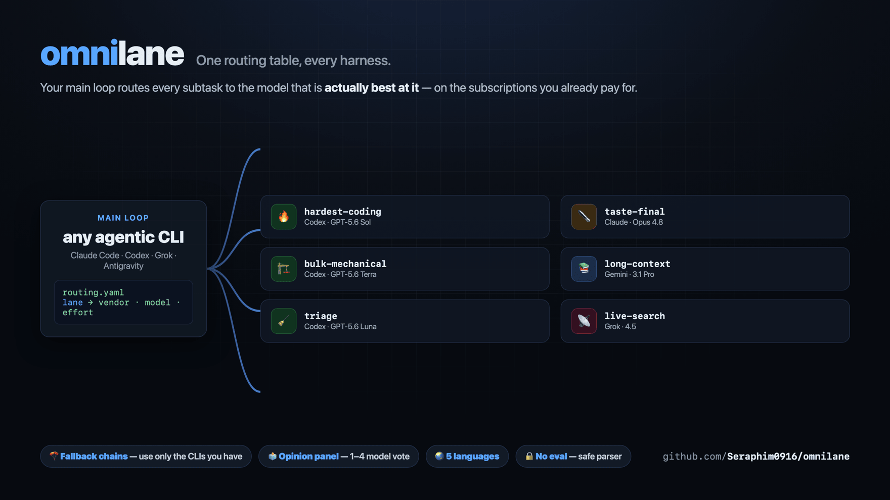
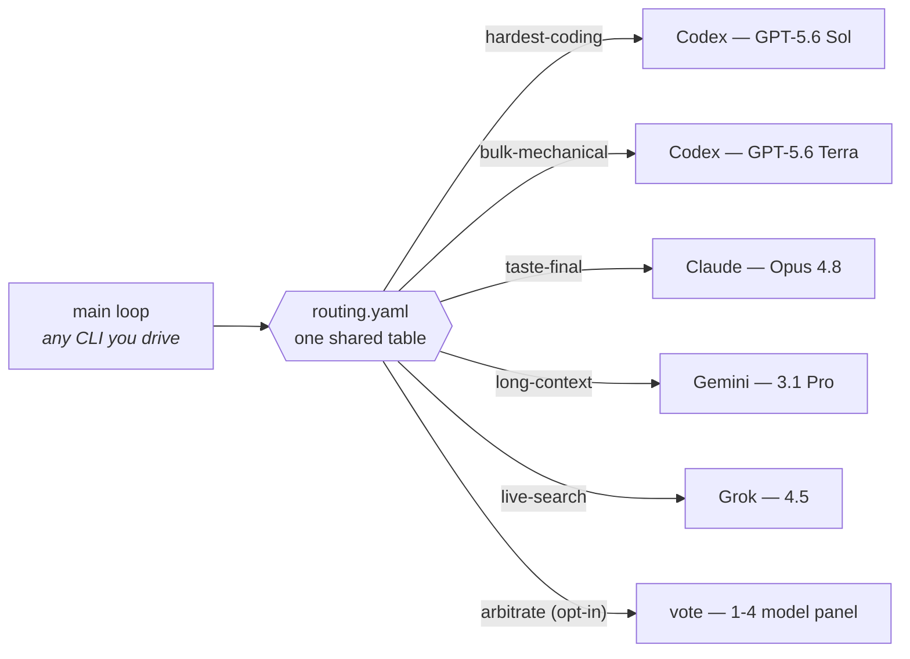
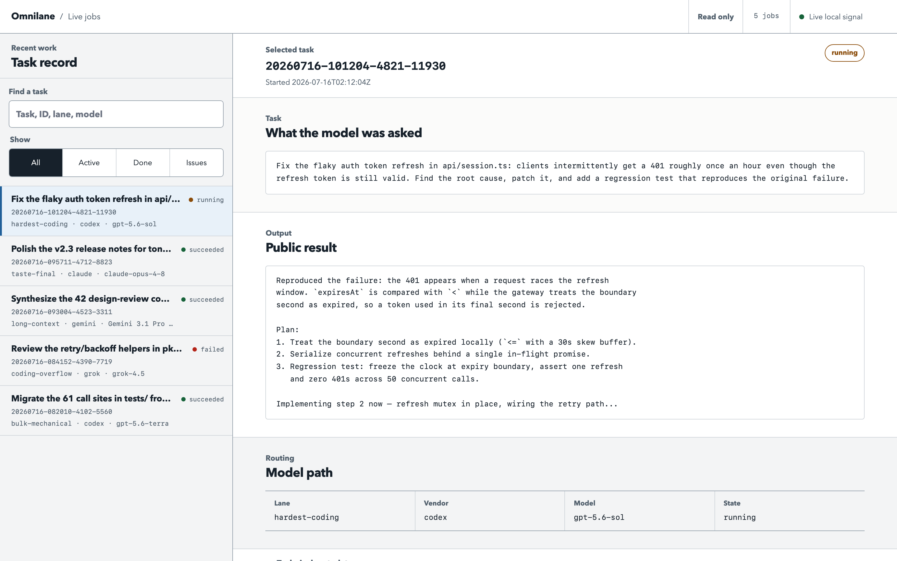
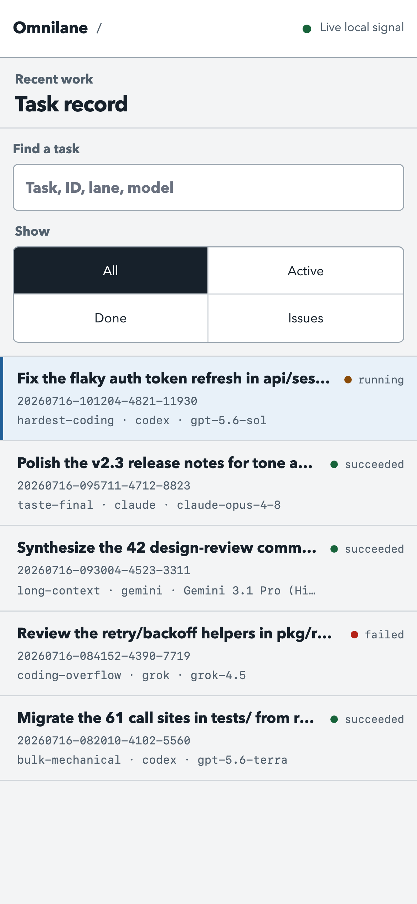

<div align="center">

# omnilane

### One routing table, every harness.

*Your main loop stops guessing which model to use.*<br/>
Drive it from **Claude Code · Codex · Grok Build · Antigravity**, and every subtask goes<br/>
to the model that is actually best at it — Codex, Claude, Grok, Gemini, Kimi, Qwen, OpenCode,<br/>
or any hosted model via OpenRouter — on the subscriptions you already pay for, or a single API key.



[](https://github.com/Seraphim0916/omnilane/actions/workflows/ci.yml)
[](LICENSE)
[](https://github.com/Seraphim0916/omnilane/tags)

**English** · [繁體中文](README.zh-TW.md) · [简体中文](README.zh-CN.md) · [日本語](README.ja.md) · [한국어](README.ko.md)

</div>

---

## What's new in v0.8.3

- **MCP server** — `omnilane mcp` starts a zero-dependency stdio MCP server,
  so any MCP-capable host (Claude Code, Codex, Gemini CLI, Cursor, OpenCode…)
  can discover and call omnilane without installing the skill: tools `route`,
  `jobs_status`, `jobs_result`, and `list_lanes`. `route` defaults to
  read-only advise mode; work mode requires an explicit workdir.

## What's new in v0.8.2

- **`openrouter` vendor** — dispatch straight to the OpenRouter API with
  nothing but `curl` and an `OPENROUTER_API_KEY`: hundreds of hosted models
  become reachable from any omnilane install, no coding-agent CLI required.
  Advise/consult only (it cannot edit files; work mode fails with guidance)
  and the model slug is mandatory, e.g.
  `dispatch.sh --vendor openrouter --model anthropic/claude-sonnet-5 consult "..."`.
- **`opencode` vendor** — headless dispatch through the OpenCode
  multi-provider aggregator CLI (`opencode run`). Advise mode pins OpenCode's
  built-in read-only `plan` agent; work mode uses `--auto`. Joins the default
  `coding-overflow` chain as its last fallback.

## What's new in v0.8.1

- **Claude Code plugin auto-loads the routing reminder** — the plugin now
  ships a `SessionStart` hook (`hooks/hooks.json`) that injects the routing
  reminder at session open (`startup|resume|clear`), so plugin installs get
  the persistent reminder with no edit to `~/.claude/CLAUDE.md`. The
  `install.sh` instruction-file reminder still covers the other CLIs.

## What's new in v0.8.0

- **Two new dispatch vendors** — `kimi` (Moonshot Kimi Code CLI) and `qwen`
  (Alibaba Qwen Code CLI) join the vendor set with the uniform runner
  contract: advise stays read-only, work auto-approves, API-key env is
  stripped so the CLIs use their own subscription logins, and empty output
  is a loud failure. Pin them with `--vendor kimi|qwen`.
- **coding-overflow grows a chain** — the quota relief valve now falls back
  grok → kimi → qwen before `off`, so it works with any one of the three
  vendors installed. Runners are contract-tested against fake binaries;
  real-model reports welcome.

## What's new in v0.7.1

- **Routing refresh (2026-07 model data)** — hardest-coding now dispatches
  GPT-5.6 Sol at **max** effort: Artificial Analysis Coding Agent Index v1.1
  scores Sol (max) at 80, the current state of the art, retiring the older
  xhigh-beats-max snapshot.
- **Claude backups sharpened** — the Claude Opus 4.8 fallback on
  hardest-coding and hard-judgment moves to **xhigh** effort, following
  Anthropic's guidance to use extra effort for difficult tasks and
  long-running work.

## What's new in v0.7.0

- **Preview any dispatch first** — `--dry-run` prints the fully resolved plan
  (vendor, model, mode, timeouts, side-effect decision) with no provider call
  and no job state.
- **Automate with versioned JSON** — one `--json` envelope for `--list`,
  `--explain`, `--validate`, and `jobs list|status|result|stats`, plus
  read-only `jobs wait`, `jobs audit`, and an offline `omnilane release-audit`
  gate with a deterministic manifest.
- **Drive local jobs end to end** — `jobs tail` peeks at live output,
  `jobs retry` re-dispatches a completed job fail-closed,
  `prune --older-than` ages out old jobs, and `--help` covers every command.
- **Install and complete safely** — `install.sh --check`/`--dry-run` report
  drift without writing, `omnilane completion bash|zsh` ships safe tab
  completion, and five macOS stock Bash 3.2 crashes are fixed.

## What's new in v0.6.0

- **Explain and validate routes offline** — inspect every fallback candidate
  with `--explain`, or lint the complete effective table with `--validate`,
  without invoking a provider or creating job state.
- **Inspect local health and outcomes** — bounded `jobs.sh stats` aggregates and
  `omnilane doctor --json` make local automation observable without exposing
  task or result bodies.
- **Compare runs in Live Board** — pin one loaded job as a memory-only reference
  and compare its model path and public result with the current selection.
- **Keep lock recovery quiet** — transient owner-file read races no longer leak
  misleading missing-file diagnostics.

## What's new in v0.5.1

- **Use Codex work outside Git** — ordinary directories remain supported;
  Omnilane never requires or runs `git init`.
- **Stop non-Git hangs cleanly** — the resolved per-call watchdog becomes an
  automatic process-group fuse when no whole-job timeout was configured, while
  explicit timeout precedence and exit semantics remain intact.
- **Trust the displayed version** — `VERSION` now drives `omnilane --version`
  and both plugin manifests, with CI checking the changelog and all five READMEs.

## ⚡ 60-second start

```bash
git clone https://github.com/Seraphim0916/omnilane && cd omnilane
./install.sh          # finds your CLIs, links the skill, speaks your language
omnilane route hardest-coding "fix the flaky auth token refresh"
omnilane ui start     # optional: watch jobs live in your browser
```

## 🧭 How it works

omnilane lets the main loop of **any** agentic CLI classify subtasks into
lanes and dispatch each lane to the best vendor — headlessly, using your
existing subscription logins (or, for the `openrouter` vendor, a direct API
key with no extra CLI at all):



- **`routing.yaml`** — lane → vendor + model + effort. One file, read by every
  harness.
- **Fallback chains** — a lane can list candidates
  (`codex … | claude … | off`); dispatch picks the first vendor CLI you actually
  have, so the default table works even with a single subscription.
- **`scripts/dispatch.sh [--vendor V] <lane> "<task>"`** — resolves the lane
  and shells out to the vendor's CLI headlessly. `--vendor` selects one named
  vendor without fallback.
- **`skills/omnilane/SKILL.md`** — a single skill every harness can load:
  identify your own model, self-execute your lane, dispatch the rest.
- **`omnilane mcp`** — the same routing surface as an MCP stdio server,
  for hosts that integrate via MCP instead of skills.

<div align="center">

| | | |
|:---:|:---:|:---:|
| 🧭 **One table**<br/>four harnesses share it | 🪂 **Fallback chains**<br/>degrades to the CLIs you have | 🗳️ **Opinion panel**<br/>multi-model vote for big calls |
| 🔒 **Safety rails**<br/>locks · watchdogs · no nesting | 🌏 **Five languages**<br/>the installer speaks your locale | ↩️ **Reversible**<br/>`--uninstall` undoes everything |

</div>

## 🛤️ Lanes (defaults — run `scripts/dispatch.sh --list` for your effective table)

| Lane | First choice | Backup | When |
|---|---|---|---|
| 🔥 hardest-coding | GPT-5.6 Sol (max) | Claude Opus 4.8 (xhigh) | Hardest implementation, deep root-cause debug, correctness-critical edits |
| 🏗️ bulk-mechanical | GPT-5.6 Terra (max) | Claude Sonnet 5 (high) | Refactors, migrations, tests, review sweeps — mechanical endurance |
| 🧹 triage | GPT-5.6 Luna (medium) | Gemini 3.5 Flash (Low) | High-volume scans, first-pass filtering |
| ⚖️ hard-judgment | GPT-5.6 Sol (max) | Claude Opus 4.8 (xhigh) | Architecture arbitration, deep reasoning, second opinions |
| ✒️ taste-final | Claude Opus 4.8 (high) | GPT-5.6 Sol (max) | User-facing prose, prompt/doc polish, style arbitration |
| 💬 consult | Explicit named vendor/model | — (no fallback) | Direct natural-language consultation; always keep `--vendor` |
| 🎨 ui-draft | GPT-5.6 Sol (xhigh) | Claude Opus 4.8 (high) | UI drafts only WITH a design system / reference images |
| 📚 long-context | Gemini 3.1 Pro (High) | Claude Opus 4.8 (high) | 1M-token synthesis — analysis only, never agentic loops |
| ⚡ fast-agentic | Gemini 3.5 Flash (High) | GPT-5.6 Luna (high) | Fast multi-step agentic loops, multimodal checks |
| 📡 live-search | Grok 4.5 | — (off) | Realtime X/web search and social context |
| 🚰 coding-overflow | Grok 4.5 | Kimi K3 → Qwen3 Coder Plus → OpenCode | Codex-quota relief valve for mid-tier coding |
| 🗳️ arbitrate | off (opt-in vote panel) | — | Built-in opinion panel for big calls — disabled by default; enable it in `routing.local.yaml`, one call per voter per round |

The **backup** is the next candidate in the lane's `routing.yaml` chain — what
dispatch falls back to when the first-choice vendor CLI is not installed. Every
lane is such a chain; when nothing in it is installed the lane degrades to `off`.

> **Where is Claude Fable 5?** Deliberately not in the defaults: the top
> Claude tier is usually the *main loop itself*, not a dispatched worker, and
> it prices above Opus. It is offered in the configurator's model menu —
> route to it if you disagree (e.g. `taste-final: claude claude-fable-5 high`
> in `routing.local.yaml`).

### Natural-language consultation

With the `omnilane` skill or `/route`, you can ask normally:
**“Ask Opus to challenge this architecture.”** The Agent Skill interprets the
request; this is not a free-form shell parser in `dispatch.sh`.

- A capability-only question recommends the first available model for the
  matching lane and makes no model call.
- A generic vendor name uses that vendor's configured candidate in `consult`.
- A canonical alias such as Opus pins its exact model family from the skill
  table. If an explicit target is absent or unavailable, the command fails
  clearly instead of falling back to another vendor or family.

<details>
<summary><b>👉 Which lanes do you run yourself? Pick your main model</b></summary>

<br/>

The table above is vendor-neutral — the *best* model for a lane doesn't change
with who is driving. What changes is which lanes you **self-execute** (you
already are that model, so no second call) versus **dispatch**. Your harness's
`omnilane` skill applies the right row automatically; this is the human view.

- **Claude Code · Fable 5** — self-execute: hard-judgment, taste-final, the hardest correctness-critical fixes. Dispatch mechanical coding volume → Codex, long-context → Gemini, live-search → Grok.
- **Claude Code · Opus 4.8** — self-execute: taste-final. Dispatch hard-judgment to Codex Sol (it out-scores Opus on raw intelligence), all coding to the Codex lanes, long-context → Gemini, live-search → Grok.
- **Codex · Sol** — self-execute: hardest-coding, hard-judgment, ui-draft. Dispatch taste-final → Claude, long-context → Gemini, live-search → Grok, bulk → Codex Terra.
- **Codex · Terra** — self-execute: bulk-mechanical. Escalate the genuinely hardest pieces to Sol; dispatch taste → Claude, long-context → Gemini, live-search → Grok.
- **Grok Build · Grok 4.5** — self-execute: live-search, coding-overflow (mid-tier coding). Dispatch everything hard to Codex/Claude/Gemini — and verify every API signature and cited fact first.
- **Antigravity · Gemini** — self-execute: long-context (3.1 Pro) and fast-agentic (Flash). Dispatch coding/judgment/taste to Codex/Claude; live-search → Grok. Never take agentic tool-loop chains on 3.1 Pro.

</details>

## 🖥️ Live Board

Every dispatch — foreground or `--background` — is a job on disk. The Live
Board is an optional, read-only local workbench over that job store: what each
model was asked, what it answered, how it was routed, and whether it is still
running.

<div align="center">





</div>

```bash
omnilane ui start    # start or reuse the server and print its authenticated URL
omnilane ui status   # inspect the local server
omnilane ui url      # print the current authenticated URL
omnilane ui stop     # stop it cleanly
```

The desktop view keeps the job list and detail pane independently scrollable;
mobile uses a list/detail flow with Back and Esc navigation. Server-sent events
stream updates without replacing focused rows, and a short disconnect keeps the
last snapshot while reconnecting. Pin any loaded task as a reference, then
select another task to compare both model paths and public results side by side.
The reference is memory-only and disappears when the page closes. The board
binds only to `127.0.0.1`, uses a random token, and is read-only. It shows
`task.txt` and the public `out.txt`, but never raw worker or vendor logs.

Core routing does not need Python; only this UI requires Python 3.9 or newer.

## 📦 Install

Requirements: the vendor CLIs you want to route to, logged in (`codex`,
`claude`, `grok`, `agy`, and optionally `kimi`, `qwen`, `opencode`) and on
`PATH` — install only the ones you have; the rest of the table degrades
automatically. The `openrouter` vendor is the exception: it needs no CLI,
only `curl` and an `OPENROUTER_API_KEY` in your environment.

Quickest: `./install.sh` — symlinks the skill for the CLIs it finds, prints
the plugin commands for the rest, shows your effective routing, and offers the
interactive lane configurator (`--uninstall` reverses it). The installer
speaks English, 繁體中文, 简体中文, 日本語 and 한국어 (auto-detected from
your locale; force with `OMNILANE_LANG=zh-TW` etc.). It also offers an
optional per-CLI **routing reminder**: a marked, reversible block appended to
each CLI's instruction file (`~/.claude/CLAUDE.md`, `~/.codex/AGENTS.md`,
`~/.grok/Agents.md`, `~/.gemini/GEMINI.md` — paths may vary across CLI
versions) so the main loop remembers to consult the table; non-interactive
installs can pass `OMNILANE_HOOKS=all|none|claude,codex`. Manual wiring:

Use `./install.sh --check` for a read-only drift report. Add `--dry-run` to an
install or `--uninstall` to preview every checkout-owned file action.
Rollback the installer-owned links and marked reminders with
`./install.sh --uninstall`.

- **Claude Code**: install as a plugin (ships the skill + `/route`,
  `/route-jobs` commands, and a `SessionStart` hook that auto-injects the
  routing reminder at session open — no CLAUDE.md edit needed), or drop
  `skills/omnilane` into `~/.claude/skills/`.
- **Codex**: drop/symlink `skills/omnilane` into `~/.codex/skills/`.
- **Grok Build**: `grok plugin install <this repo> --trust`
- **Antigravity**: `agy plugin install <this repo>` (check first with
  `agy plugin validate <this repo>`)

### MCP server

`omnilane mcp` starts a zero-dependency, local MCP stdio server so any
MCP-capable host can discover and call omnilane without installing the skill or
adding a routing reminder. Configure the host to launch the installed CLI:

```json
{
  "mcpServers": {
    "omnilane": {
      "command": "omnilane",
      "args": ["mcp"]
    }
  }
}
```

The server exposes `route`, `jobs_status`, `jobs_result`, and `list_lanes`.
`route` defaults to read-only `advise` mode. Calls that select `work` must also
provide an explicit `workdir`.

Node.js is the only runtime requirement (no npm packages). If you prefer
npm, `npm install -g omnilane` installs the CLI with the MCP server
included.

## ⚙️ Configure

Three layers, all optional:

1. **Interactive menu** — `scripts/configure.sh` lists configurable lanes, lets you
   pick vendor → model → effort per lane from suggestions (or free text for
   future models), and writes the result to `~/.omnilane/routing.local.yaml`.
   It intentionally skips the multi-vendor `consult` lane; edit that one by
   hand if needed. `install.sh` offers to run the menu at the end of a normal install.
2. **`~/.omnilane/routing.local.yaml`** — hand-edited overrides, same format
   as `routing.yaml`; local lines win. See `routing.local.yaml.example`.
3. **`~/.omnilane/local.sh`** — per-machine binaries, proxies, auth wrappers;
   sourced by every runner, never committed. See `local.sh.example`.

Check the result any time:

```
scripts/dispatch.sh --list     # effective table, fallback resolution annotated
```

## 📖 Command reference

```
omnilane list | route … | jobs … | configure   # global wrapper, works anywhere
                                               # (install.sh links it into ~/.local/bin)
eval "$(omnilane completion bash)"             # enable Bash completion for this shell
source <(omnilane completion zsh)               # enable Zsh completion for this shell
omnilane mcp                                   # MCP stdio server (needs Node.js)
omnilane release-audit [--target VERSION] [--json] # offline, read-only release gate
omnilane ui start                              # start/reuse the local Live UI; print its URL
omnilane ui status                             # report whether the Live UI is running
omnilane ui url                                # print the current authenticated local URL
omnilane ui stop                               # stop the Live UI
omnilane doctor [--json]                       # read-only routing and runtime health report
dispatch.sh [--background] [--dry-run] [--mode advise|work] [--workdir DIR]
            [--vendor V] [--model M] [--effort E] [--timeout SEC] [--job-timeout SEC]
            LANE "TASK"                              # "-" reads task from stdin
dispatch.sh [--json] --list [--json]
dispatch.sh [--json] --explain LANE [--json]       # offline candidate-by-candidate decision trace
dispatch.sh [--json] --validate [--json]           # lint effective routing; no provider calls
jobs.sh [--json] {list | status ID | result ID}    # JSON result reports metadata, never bodies
jobs.sh wait ID [--timeout N]                     # job exit; 124 timeout; 125 dead worker
jobs.sh cancel ID                                 # stop a running job: group SIGTERM, then SIGKILL
jobs.sh rm ID                                     # delete one finished/dead job (refuses a running job)
jobs.sh [--json] stats [--last N]                  # local success and routing aggregates
jobs.sh audit [--last N] [--json]                  # read-only job integrity/privacy check
jobs.sh prune [--keep N] [--apply]                # preview by default; completed jobs only
configure.sh                                        # interactive lane menu
```

**Big decisions can get a panel, not a person.** The `arbitrate` lane ships
**disabled** — a panel costs one call per voter per round, so it is opt-in.
Enable it with `arbitrate: vote codex,claude,grok -` in `routing.local.yaml`,
or through the configurator, which lets you pick any 1-4 voters from
codex/claude/grok/gemini. The same question then goes to every voter, the
opinions come back side by side, and the calling model chairs the verdict.
Set the effort field to `2` for a debate round — every voter sees the whole
panel and rebuts only the disagreements. Power users can swap in their own
gate via the `exec` vendor:
`arbitrate: exec /path/to/script -` — the script receives
`MODE WORKDIR EFFORT PROMPT_FILE OUTPUT_FILE` and writes its verdict to
`OUTPUT_FILE` (see `scripts/runners/run-exec.sh`).

Exit codes: `2` bad usage (including an invalid vendor or a requested vendor
absent from the lane), `3` lane disabled (off), `4` no vendor CLI available in
the chain or the requested vendor is configured but its CLI is unavailable,
`5` too few successful Round 1
voters, `6` no Round 2 rebuttal succeeded, `86` nested dispatch refused, `87`
lock timeout, `124` whole-job timeout expired; otherwise the worker's own exit
code passes through.

## 🎭 Modes

- **advise** (default) — read-only worker. Codex runs in a read-only sandbox;
  Claude gets only Read/Glob/Grep; Grok runs in plan mode; Kimi and OpenCode
  pin their read-only plan modes; OpenRouter is advise-only by design (pure
  inference). Use for reviews, questions, second opinions.
- **work** — the worker may edit files, only inside the `--workdir` you name.
  Codex gets a workspace-write sandbox; Claude auto-accepts edits; Gemini runs
  in accept-edits mode. The `openrouter` vendor refuses work mode with a clear
  error — route edits to an agentic CLI vendor instead.

## 🔒 Safety rails

- **No nested dispatch** — workers cannot fan out again (`OMNILANE_DEPTH`
  guard, exit 86): no runaway agent-calls-agent quota chains.
- **Serialized codex** — same-target-directory codex dispatches queue behind a
  lock keyed on the normalized workdir; stale locks from crashed jobs are
  detected by owner PID and stolen safely.
- **Watchdog** — every worker runs under `timeout`/`gtimeout`, or a perl-alarm
  fallback when neither exists (stock macOS), so a hung CLI cannot block
  forever. The cap applies to **each CLI invocation**, highest priority first:
  `--timeout SECONDS` beats a per-lane `OMNILANE_TIMEOUT_<LANE>` (the lane
  upper-cased with `-`→`_`, e.g. `OMNILANE_TIMEOUT_HARD_JUDGMENT`) beats the
  global `OMNILANE_TIMEOUT`, default 600s. It is a per-call hang-guard, not a
  whole-job budget: a retrying vendor (grok) or the `vote` panel (voters ×
  rounds) makes several calls, so total wall-clock can be a multiple of this
  value.
- **Whole-job fuse** — optional `--job-timeout SECONDS` caps lock wait plus all
  retries, voters, and rounds under one process-group supervisor. Priority is
  flag > `OMNILANE_JOB_TIMEOUT_<LANE>` > `OMNILANE_JOB_TIMEOUT` > disabled,
  with one automatic exception: Codex `work` outside a Git worktree uses the
  resolved per-call watchdog as its whole-job fuse when none was configured,
  capped at the supervisor's 999999999-second maximum. This automatic guard
  needs the bundled Perl supervisor; if unavailable, dispatch warns and keeps
  non-Git work running through the existing per-call watchdog path, which emits
  its own warning if no watchdog tool exists.
  Expiry cleans the supervised process group and returns 124. For a deep audit
  of a fubon-autotrade-sized repository, start around 2–4 hours (7200–14400s)
  with a 30-minute per-call watchdog; these are recommendations, not defaults.
- **Background lifecycle** — `--background` workers run in their own process
  group and survive the caller's exit; killed workers record an exit code, and
  `jobs.sh status` reports `dead` instead of `running` forever.
- **Payload caps** — oversized task text is truncated head+tail before it can
  blow a worker's context.

## 📊 Defaults and provenance

Default lane assignments follow Artificial Analysis coding/intelligence data
(2026-07 snapshot, cross-checked against AA site records and vendor pricing
pages) plus published head-to-head reviews; they are opinions, not laws — the
configurator and `routing.local.yaml` exist so you can disagree.

## ⚠️ Known limitations

- **Antigravity tool calls in print mode are unstable** in current CLI builds
  (tool calls may be denied or rejected with invalid-argument errors). The
  long-context lane is designed for content-you-paste-in synthesis, which is
  unaffected; for repo *inspection* prefer the claude/codex candidates.
- **Grok has no reasoning-effort knob**; the effort field is accepted for
  interface parity and ignored.
- **Non-Git Codex work is supported.** Some Codex CLI builds may stall outside
  a Git worktree, so the automatic fuse above bounds that case and cleans the
  supervised process group. Omnilane neither initializes nor requires a repository.

## 🌱 Status

v0.8.3 spans eight dispatch vendors — four harness natives (codex, claude,
grok, gemini), three aggregator/overflow CLIs (kimi, qwen, opencode), and the
CLI-free `openrouter` direct-API vendor — on the uniform runner contract with
contract tests, plus the Claude Code `SessionStart`
auto-reminder and an MCP stdio server surface (`omnilane mcp`). kimi, qwen,
opencode, and openrouter runners are contract-tested against fake binaries;
real-model reports welcome. Grok/Antigravity command-shell behavior may still
vary across CLI versions. Issues and PRs welcome.

Project policies: [Contributing](CONTRIBUTING.md) · [Security](SECURITY.md) ·
[Changelog](CHANGELOG.md)
