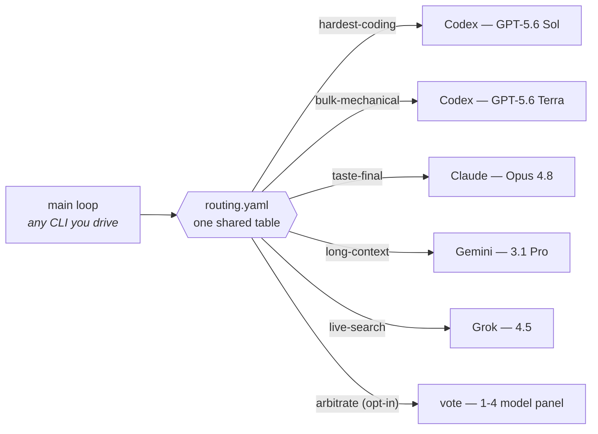

<div align="center">

# omnilane

### One routing table, every harness.

*Your main loop stops guessing which model to use.*<br/>
Every subtask goes to the model that is actually best at it — across<br/>
**Claude Code · Codex · Grok Build · Antigravity**, on the subscriptions you already pay for.


[](https://github.com/Seraphim0916/omnilane/actions/workflows/ci.yml)
[](LICENSE)
[](https://github.com/Seraphim0916/omnilane/tags)

**English** · [繁體中文](README.zh-TW.md) · [简体中文](README.zh-CN.md) · [日本語](README.ja.md) · [한국어](README.ko.md)

</div>

---

## What's new in v0.4.0

- **Ask in plain language** — the `omnilane` skill and `/route` can recommend
  a model, consult a vendor, or pin a canonical model family without hiding a
  fallback.
- **Watch work live** — an authenticated, read-only local workbench streams
  job state, tasks, routing decisions, and public results on desktop or mobile.
- **Tune hang protection** — set a timeout once with `--timeout`, per lane with
  `OMNILANE_TIMEOUT_<LANE>`, or globally with `OMNILANE_TIMEOUT`.

```bash
git clone https://github.com/Seraphim0916/omnilane && cd omnilane
./install.sh          # finds your CLIs, links the skill, speaks your language
omnilane route hardest-coding "fix the flaky auth token refresh"
```

omnilane lets the main loop of **any** agentic CLI classify subtasks into
lanes and dispatch each lane to the best vendor's CLI — headlessly, using
your existing subscription logins:



<div align="center">

| | | |
|:---:|:---:|:---:|
| 🧭 **One table**<br/>four harnesses share it | 🪂 **Fallback chains**<br/>degrades to the CLIs you have | 🗳️ **Opinion panel**<br/>multi-model vote for big calls |
| 🔒 **Safety rails**<br/>locks · watchdogs · no nesting | 🌏 **Five languages**<br/>the installer speaks your locale | ↩️ **Reversible**<br/>`--uninstall` undoes everything |

</div>

## 🧭 How it works

- **`routing.yaml`** — lane → vendor + model + effort. One file, read by every
  harness.
- **Fallback chains** — a lane can list candidates
  (`codex … | claude … | off`); dispatch picks the first vendor CLI you actually
  have, so the default table works even with a single subscription.
- **`scripts/dispatch.sh [--vendor V] <lane> "<task>"`** — resolves the lane
  and shells out to the vendor's CLI headlessly. `--vendor` selects one named
  vendor without fallback.
- **`skills/omnilane/SKILL.md`** — a single skill every harness can load:
  identify your own model, self-execute your lane, dispatch the rest.

## 🛤️ Lanes (defaults — run `scripts/dispatch.sh --list` for your effective table)

| Lane | First choice | Backup | When |
|---|---|---|---|
| 🔥 hardest-coding | GPT-5.6 Sol (xhigh) | Claude Opus 4.8 (high) | Hardest implementation, deep root-cause debug, correctness-critical edits |
| 🏗️ bulk-mechanical | GPT-5.6 Terra (max) | Claude Sonnet 5 (high) | Refactors, migrations, tests, review sweeps — mechanical endurance |
| 🧹 triage | GPT-5.6 Luna (medium) | Gemini 3.5 Flash (Low) | High-volume scans, first-pass filtering |
| ⚖️ hard-judgment | GPT-5.6 Sol (max) | Claude Opus 4.8 (high) | Architecture arbitration, deep reasoning, second opinions |
| ✒️ taste-final | Claude Opus 4.8 (high) | GPT-5.6 Sol (max) | User-facing prose, prompt/doc polish, style arbitration |
| 💬 consult | Explicit named vendor/model | — (no fallback) | Direct natural-language consultation; always keep `--vendor` |
| 🎨 ui-draft | GPT-5.6 Sol (xhigh) | Claude Opus 4.8 (high) | UI drafts only WITH a design system / reference images |
| 📚 long-context | Gemini 3.1 Pro (High) | Claude Opus 4.8 (high) | 1M-token synthesis — analysis only, never agentic loops |
| ⚡ fast-agentic | Gemini 3.5 Flash (High) | GPT-5.6 Luna (high) | Fast multi-step agentic loops, multimodal checks |
| 📡 live-search | Grok 4.5 | — (off) | Realtime X/web search and social context |
| 🚰 coding-overflow | Grok 4.5 | — (off) | Codex-quota relief valve for mid-tier coding |
| 🗳️ arbitrate | off (opt-in vote panel) | — | Built-in opinion panel for big calls — disabled by default; enable it in `routing.local.yaml`, one call per voter per round |

The **backup** is the next candidate in the lane's `routing.yaml` chain — what
dispatch falls back to when the first-choice vendor CLI is not installed. Every
lane is such a chain; when nothing in it is installed the lane degrades to `off`.

> **Where is Claude Fable 5?** Deliberately not in the defaults: the top
> Claude tier is usually the *main loop itself*, not a dispatched worker, and
> it prices above Opus. It is offered in the configurator's model menu —
> route to it if you disagree (e.g. `taste-final: claude claude-fable-5 high`
> in `routing.local.yaml`).

### Natural-language consultation

With the `omnilane` skill or `/route`, you can ask normally:
**“Ask Opus to challenge this architecture.”** The Agent Skill interprets the
request; this is not a free-form shell parser in `dispatch.sh`.

- A capability-only question recommends the first available model for the
  matching lane and makes no model call.
- A generic vendor name uses that vendor's configured candidate in `consult`.
- A canonical alias such as Opus pins its exact model family from the skill
  table. If an explicit target is absent or unavailable, the command fails
  clearly instead of falling back to another vendor or family.

<details>
<summary><b>👉 Which lanes do you run yourself? Pick your main model</b></summary>

<br/>

The table above is vendor-neutral — the *best* model for a lane doesn't change
with who is driving. What changes is which lanes you **self-execute** (you
already are that model, so no second call) versus **dispatch**. Your harness's
`omnilane` skill applies the right row automatically; this is the human view.

- **Claude Code · Fable 5** — self-execute: hard-judgment, taste-final, the hardest correctness-critical fixes. Dispatch mechanical coding volume → Codex, long-context → Gemini, live-search → Grok.
- **Claude Code · Opus 4.8** — self-execute: taste-final. Dispatch hard-judgment to Codex Sol (it out-scores Opus on raw intelligence), all coding to the Codex lanes, long-context → Gemini, live-search → Grok.
- **Codex · Sol** — self-execute: hardest-coding, hard-judgment, ui-draft. Dispatch taste-final → Claude, long-context → Gemini, live-search → Grok, bulk → Codex Terra.
- **Codex · Terra** — self-execute: bulk-mechanical. Escalate the genuinely hardest pieces to Sol; dispatch taste → Claude, long-context → Gemini, live-search → Grok.
- **Grok Build · Grok 4.5** — self-execute: live-search, coding-overflow (mid-tier coding). Dispatch everything hard to Codex/Claude/Gemini — and verify every API signature and cited fact first.
- **Antigravity · Gemini** — self-execute: long-context (3.1 Pro) and fast-agentic (Flash). Dispatch coding/judgment/taste to Codex/Claude; live-search → Grok. Never take agentic tool-loop chains on 3.1 Pro.

</details>

## 🚀 Install

Requirements: the vendor CLIs you want to route to, logged in (`codex`,
`claude`, `grok`, `agy`) and on `PATH` — install only the ones you have; the
rest of the table degrades automatically.

Quickest: `./install.sh` — symlinks the skill for the CLIs it finds, prints
the plugin commands for the rest, shows your effective routing, and offers the
interactive lane configurator (`--uninstall` reverses it). The installer
speaks English, 繁體中文, 简体中文, 日本語 and 한국어 (auto-detected from
your locale; force with `OMNILANE_LANG=zh-TW` etc.). It also offers an
optional per-CLI **routing reminder**: a marked, reversible block appended to
each CLI's instruction file (`~/.claude/CLAUDE.md`, `~/.codex/AGENTS.md`,
`~/.grok/Agents.md`, `~/.gemini/GEMINI.md` — paths may vary across CLI
versions) so the main loop remembers to consult the table; non-interactive
installs can pass `OMNILANE_HOOKS=all|none|claude,codex`. Manual wiring:

- **Claude Code**: install as a plugin (ships the skill + `/route`,
  `/route-jobs` commands), or drop `skills/omnilane` into `~/.claude/skills/`.
- **Codex**: drop/symlink `skills/omnilane` into `~/.codex/skills/`.
- **Grok Build**: `grok plugin install <this repo> --trust`
- **Antigravity**: `agy plugin install <this repo>` (check first with
  `agy plugin validate <this repo>`)

## ⚙️ Configure

Three layers, all optional:

1. **Interactive menu** — `scripts/configure.sh` lists configurable lanes, lets you
   pick vendor → model → effort per lane from suggestions (or free text for
   future models), and writes the result to `~/.omnilane/routing.local.yaml`.
   It intentionally skips the multi-vendor `consult` lane; edit that one by
   hand if needed. `install.sh` offers to run the menu at the end of a normal install.
2. **`~/.omnilane/routing.local.yaml`** — hand-edited overrides, same format
   as `routing.yaml`; local lines win. See `routing.local.yaml.example`.
3. **`~/.omnilane/local.sh`** — per-machine binaries, proxies, auth wrappers;
   sourced by every runner, never committed. See `local.sh.example`.

Check the result any time:

```
scripts/dispatch.sh --list     # effective table, fallback resolution annotated
```

## 📖 Command reference

```
omnilane list | route … | jobs … | configure   # global wrapper, works anywhere
                                               # (install.sh links it into ~/.local/bin)
omnilane ui start                              # start/reuse the local Live UI; print its URL
omnilane ui status                             # report whether the Live UI is running
omnilane ui url                                # print the current authenticated local URL
omnilane ui stop                               # stop the Live UI
dispatch.sh [--background] [--mode advise|work] [--workdir DIR]
            [--vendor V] [--model M] [--effort E] [--timeout SEC] [--job-timeout SEC]
            LANE "TASK"                              # "-" reads task from stdin
dispatch.sh --list
jobs.sh list | status ID | result ID
configure.sh                                        # interactive lane menu
```

**Big decisions can get a panel, not a person.** The `arbitrate` lane ships
**disabled** — a panel costs one call per voter per round, so it is opt-in.
Enable it with `arbitrate: vote codex,claude,grok -` in `routing.local.yaml`,
or through the configurator, which lets you pick any 1-4 voters from
codex/claude/grok/gemini. The same question then goes to every voter, the
opinions come back side by side, and the calling model chairs the verdict.
Set the effort field to `2` for a debate round — every voter sees the whole
panel and rebuts only the disagreements. Power users can swap in their own
gate via the `exec` vendor:
`arbitrate: exec /path/to/script -` — the script receives
`MODE WORKDIR EFFORT PROMPT_FILE OUTPUT_FILE` and writes its verdict to
`OUTPUT_FILE` (see `scripts/runners/run-exec.sh`).

Exit codes: `2` bad usage (including an invalid vendor or a requested vendor
absent from the lane), `3` lane disabled (off), `4` no vendor CLI available in
the chain or the requested vendor is configured but its CLI is unavailable,
`5` too few successful Round 1
voters, `6` no Round 2 rebuttal succeeded, `86` nested dispatch refused, `87`
lock timeout, `124` whole-job timeout expired; otherwise the worker's own exit
code passes through.

## 🖥️ Live UI

The Live UI is an optional local workbench; core routing does not need Python,
and only this UI requires Python 3.9 or newer.

```bash
omnilane ui start    # start or reuse the server and print its authenticated URL
omnilane ui status   # inspect the local server
omnilane ui url      # print the current authenticated URL
omnilane ui stop     # stop it cleanly
```

The desktop view keeps the job list and detail pane independently scrollable;
mobile uses a list/detail flow with Back and Esc navigation. Server-sent events
stream updates without replacing focused rows, and a short disconnect keeps the
last snapshot while reconnecting. It binds only to `127.0.0.1`, uses a random
token, and is read-only. It shows `task.txt` and the public `out.txt`, but never
raw worker or vendor logs.

## 🎭 Modes

- **advise** (default) — read-only worker. Codex runs in a read-only sandbox;
  Claude gets only Read/Glob/Grep; Grok runs in plan mode. Use for reviews,
  questions, second opinions.
- **work** — the worker may edit files, only inside the `--workdir` you name.
  Codex gets a workspace-write sandbox; Claude auto-accepts edits; Gemini runs
  in accept-edits mode.

## 🔒 Safety rails

- **No nested dispatch** — workers cannot fan out again (`OMNILANE_DEPTH`
  guard, exit 86): no runaway agent-calls-agent quota chains.
- **Serialized codex** — same-target-directory codex dispatches queue behind a
  lock keyed on the normalized workdir; stale locks from crashed jobs are
  detected by owner PID and stolen safely.
- **Watchdog** — every worker runs under `timeout`/`gtimeout`, or a perl-alarm
  fallback when neither exists (stock macOS), so a hung CLI cannot block
  forever. The cap applies to **each CLI invocation**, highest priority first:
  `--timeout SECONDS` beats a per-lane `OMNILANE_TIMEOUT_<LANE>` (the lane
  upper-cased with `-`→`_`, e.g. `OMNILANE_TIMEOUT_HARD_JUDGMENT`) beats the
  global `OMNILANE_TIMEOUT`, default 600s. It is a per-call hang-guard, not a
  whole-job budget: a retrying vendor (grok) or the `vote` panel (voters ×
  rounds) makes several calls, so total wall-clock can be a multiple of this
  value.
- **Whole-job fuse** — optional `--job-timeout SECONDS` caps lock wait plus all
  retries, voters, and rounds under one process-group supervisor. Priority is
  flag > `OMNILANE_JOB_TIMEOUT_<LANE>` > `OMNILANE_JOB_TIMEOUT` > disabled.
  Expiry cleans the supervised process group and returns 124. For a deep audit
  of a fubon-autotrade-sized repository, start around 2–4 hours (7200–14400s)
  with a 30-minute per-call watchdog; these are recommendations, not defaults.
- **Background lifecycle** — `--background` workers run in their own process
  group and survive the caller's exit; killed workers record an exit code, and
  `jobs.sh status` reports `dead` instead of `running` forever.
- **Payload caps** — oversized task text is truncated head+tail before it can
  blow a worker's context.

## 📊 Defaults and provenance

Default lane assignments follow Artificial Analysis coding/intelligence data
(2026-07 snapshot, cross-checked against AA site records and vendor pricing
pages) plus published head-to-head reviews; they are opinions, not laws — the
configurator and `routing.local.yaml` exist so you can disagree.

## ⚠️ Known limitations

- **Antigravity tool calls in print mode are unstable** in current CLI builds
  (tool calls may be denied or rejected with invalid-argument errors). The
  long-context lane is designed for content-you-paste-in synthesis, which is
  unaffected; for repo *inspection* prefer the claude/codex candidates.
- **Grok has no reasoning-effort knob**; the effort field is accepted for
  interface parity and ignored.
- Codex work mode in a non-git directory has hung in one test; use a git
  working directory (the normal case) until this is pinned down.

## 🌱 Status

v0.4.0 combines the reviewed routing core with natural-language consultation
and the local Live UI. The shell core has passed external model review (11
findings fixed) and adversarial verification; the UI is covered by Python tests
and real-browser behavior checks. Grok/Antigravity command-shell behavior may
still vary across CLI versions. Issues and PRs welcome.
