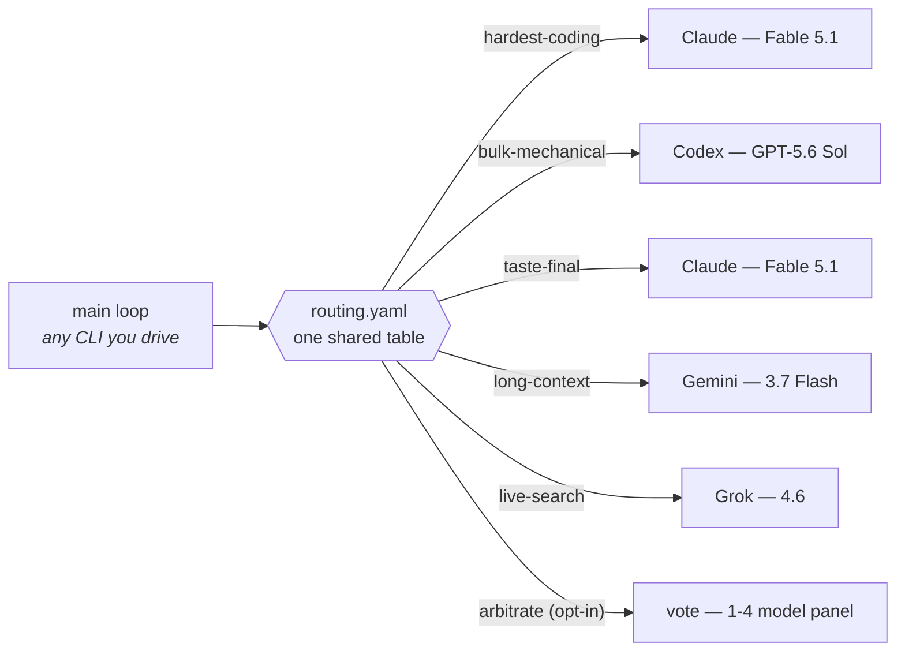

<div align="center">

# omnilane

### One routing table, every harness.

*Your main loop stops guessing which model to use.*<br/>
Drive it from **Claude Code · Codex · Grok Build · Antigravity**, and every subtask goes<br/>
to the model that is actually best at it — Codex, Claude, Grok, Gemini, Kimi, Qwen, OpenCode,<br/>
or any hosted model via OpenRouter — on the subscriptions you already pay for, or a single API key.


[](https://github.com/Seraphim0916/omnilane/actions/workflows/ci.yml)
[](LICENSE)
[](https://github.com/Seraphim0916/omnilane/tags)

**English** · [繁體中文](README.zh-TW.md) · [简体中文](README.zh-CN.md) · [日本語](README.ja.md) · [한국어](README.ko.md)

</div>

---

## 🤔 What is omnilane?

**The problem.** You already drive an AI coding assistant — Claude Code, Codex,
Cursor, Gemini CLI. Each one talks to a single model family. So every task you
give it runs on that one model, whether or not it is the right tool: a
throwaway file rename burns your most expensive model, and a genuinely hard
architecture question runs on whatever you happened to open.

**What omnilane does.** It gives your assistant a routing table. Work gets
sorted into **lanes** — hardest coding, bulk mechanical, triage, hard judgment,
final polish — and each lane names the model that is best (and cheapest) for
it. The assistant delegates each lane through a compatible caller-owned native
agent or the existing vendor CLI, even when the worker uses the same model.

**What it is not.** Not a proxy, not a new subscription, not another service to
keep alive. It is a table plus a dispatch script that runs behind the tool you
already use. `./install.sh --uninstall` removes every trace.

**You do not need every vendor.** Each lane is a fallback chain. Install one
CLI or seven — dispatch picks the first candidate you actually have, and a lane
with nothing available simply turns off. The default table works on a single
subscription.

**[⬇ Jump to the 60-second start](#-60-second-start)** · **[❓ Read the FAQ](#-faq)**

## ⚡ 60-second start

**The quick way — install from npm:**

```bash
npm i -g omnilane                                    # install the CLI
export OMNILANE_AA_OPERATOR_ASSERTED_HUMAN=1         # you are the operator, not a model
omnilane route hardest-coding "fix the flaky auth token refresh"
omnilane doctor                                      # see which AI CLIs / keys you have
omnilane ui start                                    # optional: watch jobs live in your browser
```

**Or clone the repo** (gets you the routing table and skill to customise):

```bash
git clone https://github.com/Seraphim0916/omnilane && cd omnilane
./install.sh          # finds your CLIs, links the skill, speaks your language
export OMNILANE_AA_OPERATOR_ASSERTED_HUMAN=1         # you are the operator, not a model
omnilane route hardest-coding "fix the flaky auth token refresh"
```

> **Why that export?** Omnilane gates every delegation against the caller's own
> capability score, so a dispatch has to say who is asking. A human at a terminal
> asserts that once with `OMNILANE_AA_OPERATOR_ASSERTED_HUMAN=1`, or per call with
> `--operator-asserted-human`. A model driving omnilane cannot assert it for
> itself — it passes `--caller-context FILE` carrying its exact vendor, model and
> effort instead. With neither, the dispatch is refused with
> `missing-caller-context` before any job is created.

> New to this? Run `omnilane doctor` first — it tells you which model CLIs and
> API keys omnilane can already reach, so you know what will actually run.

## 🧭 How it works

omnilane lets the main loop of **any** agentic CLI classify subtasks into
lanes and dispatch each lane to the best vendor — headlessly, using your
existing subscription logins (or, for the `openrouter` vendor, a direct API
key with no extra CLI at all):


```mermaid
flowchart LR
    M["main loop<br/><i>any CLI you drive</i>"] --> T{{"routing.yaml<br/>one shared table"}}
    T -->|hardest-coding| C1["Claude — Fable 5.1"]
    T -->|bulk-mechanical| C2["Codex — GPT-5.6 Sol"]
    T -->|taste-final| C3["Claude — Fable 5.1"]
    T -->|long-context| C4["Gemini — 3.7 Flash"]
    T -->|live-search| C5["Grok — 4.6"]
    T -->|"arbitrate (opt-in)"| C6["vote — 1-4 model panel"]
```

- **`routing.yaml`** — lane → vendor + model + effort. One file, read by every
  harness.
- **Fallback chains** — a lane can list candidates
  (`codex … | claude … | off`); dispatch picks the first vendor CLI you actually
  have, so the default table works even with a single subscription.
- **`scripts/dispatch.sh [--vendor V] <lane> "<task>"`** — resolves the lane
  and shells out to the vendor's CLI headlessly. `--vendor` selects one named
  vendor without fallback.
- **`skills/omnilane/SKILL.md`** — a single skill every harness can load:
  identify the lane's model and delegate through a compatible native agent or CLI.
- **`omnilane mcp`** — the same routing surface as an MCP stdio server,
  for hosts that integrate via MCP instead of skills.

<div align="center">

| | | |
|:---:|:---:|:---:|
| 🧭 **One table**<br/>four harnesses share it | 🪂 **Fallback chains**<br/>degrades to the CLIs you have | 🗳️ **Opinion panel**<br/>multi-model vote for big calls |
| 🔒 **Safety rails**<br/>locks · watchdogs · no nesting | 🌏 **Five languages**<br/>the installer speaks your locale | ↩️ **Reversible**<br/>`--uninstall` undoes everything |

</div>

## 🛤️ Lanes

Defaults below — run `scripts/dispatch.sh --list` for the table your machine
actually resolves.

| Lane | First choice | Backup | When |
|---|---|---|---|
| 🔥 hardest-coding | Claude Fable 5.1 (max) | GPT-6 Astra (xhigh) → Grok 4.6 → Gemini 3.8 Flash (High) | Hardest implementation, deep root-cause debug, correctness-critical edits |
| 🏗️ bulk-mechanical | GPT-5.6 Sol (high) | Gemini 3.8 Flash (High) → Claude Sonnet 5 (high) | Refactors, migrations, tests, review sweeps — mechanical endurance |
| 🧹 triage | GPT-5.6 Luna (high) | Gemini 3.8 Flash (Low) → Claude Haiku 4.5 | High-volume scans, first-pass filtering |
| ⚖️ hard-judgment | Claude Fable 5.1 (xhigh) | GPT-6 Astra (xhigh) → Grok 4.6 | Architecture arbitration, deep reasoning, second opinions |
| ✒️ taste-final | Claude Fable 5.1 (xhigh) | GPT-6 Astra (xhigh) → Grok 4.6 → Gemini 3.8 Flash (High) | User-facing prose and style arbitration; benchmarks do not prove visual or editorial taste |
| 💬 consult | GPT-6 Astra (xhigh) | Claude Fable 5.1 (xhigh) → Grok 4.6 → Gemini 3.8 Flash (Medium) | Direct named-model consultation; keep `--vendor` to prevent fallback |
| 🎨 ui-draft | GPT-5.6 Sol (high) | Claude Fable 5.1 (xhigh) → Gemini 3.8 Flash (High) | UI drafts only with a design system or reference images; no aesthetic benchmark claim |
| 📚 long-context | Gemini 3.8 Flash (Medium) | GPT-5.6 Terra (max) → Claude Opus 5 (medium) | Long-document synthesis; context size alone does not prove task quality |
| ⚡ fast-agentic | Gemini 3.8 Flash (Low) | GPT-5.6 Luna (high) → Claude Haiku 4.5 | Fast multi-step tool loops and multimodal checks |
| 📡 live-search | Grok 4.6 | Gemini 3.8 Flash (High) → Claude Sonnet 5 (high) | Realtime X/web search; backups provide generic web search, not equivalent X context |
| 🚰 coding-overflow | Grok 4.6 | Gemini 3.8 Flash (High) → Kimi K3 → Qwen3 Coder Plus → OpenCode | Explicit Codex-quota relief; provider failure does not auto-retry another vendor |
| 🗳️ arbitrate | off (opt-in vote panel) | — | Built-in opinion panel for big calls — disabled by default; enable it in `routing.local.yaml`, one call per voter per round |

The **backup** is the next candidate in the lane's `routing.yaml` chain — what
dispatch falls back to when the first-choice vendor CLI is not installed. Every
lane is such a chain; when nothing in it is installed the lane degrades to `off`.

> **Fable 5.1 and Astra now lead hard work.** See the current same-condition evidence in [FAQ](#-faq).

### Natural-language consultation

With the `omnilane` skill or `/route`, you can ask normally:
**“Ask Opus to challenge this architecture.”** The Agent Skill interprets the
request; this is not a free-form shell parser in `dispatch.sh`.

- A capability-only question recommends the first available model for the
  matching lane and makes no model call.
- A generic vendor name uses that vendor's configured candidate in `consult`.
- A canonical alias such as Opus pins its exact model family from the skill
  table. If an explicit target is absent or unavailable, the command fails
  clearly instead of falling back to another vendor or family.

## Native-first delegation, terminal-compatible

Model routing and execution are separate. `--executor auto` (default) selects
a caller-owned native tool only from explicit structured capabilities. Without
that context a standalone terminal uses legacy CLI. `--executor cli` forces
the old behavior; `--executor native` rejects missing/incompatible capability.
Same vendor is not same model; explicit model/vendor/effort are preserved.
On native rejection, auto reports a CLI reason and keeps the exact resolved
target rather than substituting another vendor/model.

```sh
# Standalone terminal: CLI dry run, no jobs or provider calls.
omnilane route --executor auto --dry-run hardest-coding "Review this change"

# Host supplies honest shared/inherited capability JSON; inspect the linked schema.
omnilane route --executor native --native-context /absolute/capability.json --workdir /absolute/repo hardest-coding "Review this change"
# The host now spawns its native agent tool, waits and writes actual evidence.
omnilane jobs --json complete-native JOB_ID /absolute/completion.json
omnilane jobs --json status JOB_ID
omnilane jobs --json result JOB_ID
omnilane jobs --json list --status pending
```

Native route emits **pending handoff JSON**, not a shell-native invocation or
completed job. Codex `collaboration.spawn_agent` has no sandbox/tool/workdir
restriction parameters and inherits parent tools/filesystem. Its honest request
and matching capability row explicitly use `shared-inherited` with empty tool
arrays; `advise`/`work` and workdir are task intent, not an OS boundary. Hard
isolation remains same-model CLI in auto and rejects forced native.

The caller spawns the real agent with the exact resolved model/effort, then
ingests the actual agent ID, runtime model/effort/vendor/harness/backend,
outcome, public result, and evidence. An explicit model override uses
`fork_turns: "none"` or bounded positive history, never `fork_turns: "all"`.
Unknown caller current model may be omitted when the route explicitly selects
an exact model declared by the matching capability row. Duplicate completion is
rejected. Native cancellation never signals PIDs; the caller separately stops
any spawned agent.

Background/durable/live/named CLI sessions, sysops, unsupported isolation,
vote/arbitration and multi-round paths remain CLI-only. Native integration is
limited to list/status/result/cancel/completion, not CLI wait/retry/mailbox or
goal-loop. Protocol handling needs Python 3.9+; legacy terminal CLI remains
compatible. Tests are fixtures, not live native acceptance. The parent alone
syncs the host AGENTS managed block after review.
See [schemas, complete examples and limitations](docs/native-executor.md).

<details>
<summary><b>Model-role guidance (delegation still required)</b></summary>

<br/>

The best model for a lane does not change with the commander. These are role
hints, not self-execution exemptions: even a same-model task is delegated.
A native agent is eligible only when the caller explicitly confirms the exact
model, effort, mode, workdir, tools, isolation and lifecycle. Otherwise use CLI.
The commander orchestrates and validates; workers do not delegate again.

- **Claude Code · Fable 5.1** — recommended prompt-level controller for quality-sensitive work; this is a role, not a lane or automatic selector. Delegate hardest-coding at max and judgment/taste at xhigh; use Astra for an independent Codex review, Sol for bulk, Gemini 3.8 Flash for long/fast work, and Grok for live search.
- **Claude Code · Opus 5** — balanced prompt-level controller and independent reviewer when explicitly selected (`high`, or `xhigh` for deeper review), plus long-context fallback. This is an opt-in role, not a new lane or the default hard-judgment route.
- **Codex · Sol** — delegate bulk-mechanical and constrained ui-draft at high. Escalate hardest coding and judgment to Fable/Astra; route long/fast work to Gemini 3.8 Flash and live search to Grok.
- **Codex · Astra** — prompt-level controller backup and independent reviewer. Use xhigh by default for hardest coding/judgment and consult/taste; explicitly select `--vendor codex --effort max` when needed. Explicit model/effort always win.
- **Codex · Terra** — delegate the Codex long-context fallback at max. Bulk stays on Sol high; escalate hard work to Fable/Astra.
- **Grok Build · Grok 4.6** — delegate live-search and coding-overflow, plus fallback duty in hardest-coding, hard-judgment, and taste-final. Dispatch primary hard coding/judgment/taste work to Codex/Claude/Gemini when available; verify API signatures and cited facts.
- **Antigravity · Gemini 3.8 Flash** — delegate long-context Medium, fast-agentic/triage Low, and bulk/overflow/web fallbacks High. Do not infer visual taste or controller authority from agent/coding benchmarks.

</details>

## 🖥️ Live Board

Every dispatch — foreground or `--background` — is a job on disk. The Live
Board is an optional, read-only local workbench over that job store: what each
model was asked, what it answered, how it was routed, and whether it is still
running.

<div align="center">


</div>

```bash
omnilane ui start    # start or reuse the server and print its authenticated URL
omnilane ui status   # inspect the local server
omnilane ui url      # print the current authenticated URL
omnilane ui stop     # stop it cleanly
```

The desktop view keeps the job list and detail pane independently scrollable;
mobile uses a list/detail flow with Back and Esc navigation. Server-sent events
stream updates without replacing focused rows, and a short disconnect keeps the
last snapshot while reconnecting. Pin any loaded task as a reference, then
select another task to compare both model paths and public results side by side.
The reference is memory-only and disappears when the page closes. The board
binds only to `127.0.0.1`, uses a random token, and is read-only. It shows
`task.txt` and the public `out.txt`, but never raw worker or vendor logs.

Search and state filters apply to the latest 50 retained jobs. **Export visible**
downloads only the currently visible public metadata as local JSON; it excludes
tokens, task text, result bodies, workdirs, and raw logs.

The board reads in English, Japanese, Korean, Traditional Chinese and Simplified
Chinese. It follows the browser language on first load; the switcher in the
header overrides that and the choice is remembered locally.

Core routing does not need Python; only this UI requires Python 3.9 or newer.

### Foreman completion inbox

Finished dispatches write a private completion record under `$OMNILANE_HOME/inbox/`. A Claude Code `SessionStart` hook binds each foreman's hook-provided session ID to its live process ancestry, and the bundled `UserPromptSubmit` hook atomically delivers up to ten records owned by that session on the foreman's next prompt. Older records without a session ID still use the original dispatch `workdir` scope; claimed records move to `inbox/consumed/`. Set `OMNILANE_INBOX=0` on a dispatch to disable record creation; the default is enabled.

## 📦 Install

Requirements: the vendor CLIs you want to route to, logged in (`codex`,
`claude`, `grok`, `agy`, and optionally `kimi`, `qwen`, `opencode`) and on
`PATH` — install only the ones you have; the rest of the table degrades
automatically. The `openrouter` vendor is the exception: it needs no CLI,
only `curl` and an `OPENROUTER_API_KEY` in your environment.

Quickest: `./install.sh` — symlinks the skill for the CLIs it finds, prints
the plugin commands for the rest, shows your effective routing, and offers the
interactive lane configurator (`--uninstall` reverses it). The installer
speaks English, 繁體中文, 简体中文, 日本語 and 한국어 (auto-detected from
your locale; force with `OMNILANE_LANG=zh-TW` etc.). It also offers an
optional per-CLI **routing reminder**: a marked, reversible block appended to
each CLI's instruction file (`~/.claude/CLAUDE.md`, `~/.codex/AGENTS.md`,
`~/.grok/Agents.md`, `~/.gemini/GEMINI.md` — paths may vary across CLI
versions) so the main loop remembers to consult the table; non-interactive
installs can pass `OMNILANE_HOOKS=all|none|claude,codex`.

The foreman completion notice requires the Claude Code plugin install; the
skill-only symlink path does not deliver completion notices. Install the plugin
from this checkout with:

```bash
claude plugin marketplace add <path to this repo>
claude plugin install omnilane@omnilane
```

Use `./install.sh --check` for a read-only drift report. Add `--dry-run` to an
install or `--uninstall` to preview every checkout-owned file action.
Rollback the installer-owned links and marked reminders with
`./install.sh --uninstall`.

Manual wiring:

- **Claude Code**: install as a plugin (ships the skill + `/route`,
  `/route-jobs` commands, and a `SessionStart` hook that auto-injects the
  routing reminder at session open — no CLAUDE.md edit needed), or drop
  `skills/omnilane` into `~/.claude/skills/`.
- **Codex**: drop/symlink `skills/omnilane` into `~/.codex/skills/`.
- **Grok Build**: `grok plugin install <this repo> --trust`
- **Antigravity**: `agy plugin install <this repo>` (check first with
  `agy plugin validate <this repo>`)

### MCP server

`omnilane mcp` starts a zero-dependency, local MCP stdio server so any
MCP-capable host can discover and call omnilane without installing the skill or
adding a routing reminder. Configure the host to launch the installed CLI:

```json
{
  "mcpServers": {
    "omnilane": {
      "command": "omnilane",
      "args": ["mcp"]
    }
  }
}
```

The server exposes `route` plus read-only introspection: `list_lanes`,
`explain`, `validate`, `dry_run`, `jobs_list`, `jobs_status`, `jobs_result`,
`jobs_stats`, `jobs_recommend`, `jobs_audit`, `doctor`, and the explicitly opt-in
`provider_probe`. `route` defaults to read-only `advise` mode. Calls that select `work` must also
provide an explicit `workdir`.

Node.js is the only runtime requirement (no npm packages). If you prefer
npm, `npm install -g omnilane` installs the CLI with the MCP server
included.

## ⚙️ Configure

Three layers, all optional:

1. **Interactive menu** — `scripts/configure.sh` lists configurable lanes, lets you
   pick vendor → model → effort per lane from suggestions (or free text for
   future models), and writes the result to `~/.omnilane/routing.local.yaml`.
   It intentionally skips the multi-vendor `consult` lane; edit that one by
   hand if needed. `install.sh` offers to run the menu at the end of a normal install.
   For scripting, `configure set|get|unset|list|diff LANE [SPEC]` edits or inspects the same file
   without a tty — `set` validates the lane and rejects an unsafe or structurally
   invalid spec, rolling back on failure.
2. **`~/.omnilane/routing.local.yaml`** — hand-edited overrides, same format
   as `routing.yaml`; local lines win. See `routing.local.yaml.example`.
3. **`~/.omnilane/local.sh`** — per-machine binaries, proxies, auth wrappers;
   sourced by every runner, never committed. See `local.sh.example`.

Check the result any time:

```
scripts/dispatch.sh --list     # effective table, fallback resolution annotated
```

## 📖 Command reference

```
omnilane list | route … | jobs … | configure   # global wrapper, works anywhere
                                               # (install.sh links it into ~/.local/bin)
eval "$(omnilane completion bash)"             # enable Bash completion for this shell
source <(omnilane completion zsh)               # enable Zsh completion for this shell
omnilane completion fish | source              # enable Fish completion for this shell
omnilane mcp                                   # MCP stdio server (needs Node.js)
omnilane release-audit [--target VERSION] [--json] # offline, read-only release gate
omnilane ui start                              # start/reuse the local Live UI; print its URL
omnilane ui status                             # report whether the Live UI is running
omnilane ui url                                # print the current authenticated local URL
omnilane ui stop                               # stop the Live UI
omnilane doctor [--json] [--strict] [--probe V] [--probe-timeout SEC]  # live probe is opt-in
omnilane benchmark [--json] [--run] [--vendor V] [--cost-per-call V=USD] # dry-run by default
dispatch.sh [--background] [--dry-run] [--thread NAME] [--mode advise|work|sysops] [--workdir DIR]
            [--vendor V] [--model M] [--effort E] [--timeout SEC] [--job-timeout SEC]
            [--caller-context FILE | --operator-asserted-human]   # who is asking
            LANE "TASK"                              # "-" reads task from stdin
dispatch.sh [--json] --list [--json]
dispatch.sh [--json] --explain LANE [--json]       # offline candidate-by-candidate decision trace
dispatch.sh [--json] --validate [--json]           # lint effective routing; no provider calls
jobs.sh [--json] {list | status ID | result ID}    # JSON result reports metadata, never bodies
jobs.sh [--json] list [--lane L] [--vendor V] [--status running|done]  # filter the listing
jobs.sh wait ID [--timeout N]                     # job exit; 124 timeout; 125 dead worker
jobs.sh cancel ID                                 # stop a running job: group SIGTERM, then SIGKILL
jobs.sh rm ID                                     # delete one finished/dead job (refuses a running job)
jobs.sh [--json] stats [--last N] [--lane L] [--vendor V]  # local success and routing aggregates
jobs.sh [--json] recommend [--last N] [--lane L] [--min-samples N]  # evidence-gated vendor suggestion
jobs.sh audit [--last N] [--json]                  # read-only job integrity/privacy check
jobs.sh prune [--keep N] [--apply]                # preview by default; completed jobs only
configure.sh                                        # interactive lane menu
configure.sh set|get|unset|list|diff LANE [SPEC]    # script/inspect routing.local.yaml, no tty
```

`--thread NAME` continues named Claude, Codex, Grok, or Gemini conversations across
single-shot dispatches. In 0.33.0 it pins vendor, model, effort, and physical
workdir; use `jobs.sh threads`, `threads show NAME`, or `threads rm NAME` to
manage local state without deleting the vendor session.

`jobs recommend` reads only validated public metadata and exit codes. It ranks
eligible vendors by success rate, sample count, then name; the default minimum
is three completed jobs. It never reads task/result bodies or changes routing.

`doctor --probe V` makes one bounded advise-mode provider call and returns only
availability, selected model, timing, and response byte count—not the response
body. Without `--probe`, doctor remains offline. `benchmark` uses the fixed TSV
suite in `benchmarks/workloads.tsv`; its default dry-run resolves every route
without provider calls. `--run` is the explicit call gate, and cost totals are
estimates based only on values supplied with `--cost-per-call`.

**Big decisions can get a panel, not a person.** The `arbitrate` lane ships
**disabled** — a panel costs one call per voter per round, so it is opt-in.
Enable it with `arbitrate: vote codex,claude,grok -` in `routing.local.yaml`,
or through the configurator, which lets you pick any 1-4 voters from
codex/claude/grok/gemini. The same question then goes to every voter, the
opinions come back side by side, and the calling model chairs the verdict.
Set the effort field to `2` for a debate round — every voter sees the whole
panel and rebuts only the disagreements. Power users can swap in their own
gate via the `exec` vendor:
`arbitrate: exec /path/to/script -` — the script receives
`MODE WORKDIR EFFORT PROMPT_FILE OUTPUT_FILE` and writes its verdict to
`OUTPUT_FILE` (see `scripts/runners/run-exec.sh`).

Exit codes: `2` bad usage (including an invalid vendor or a requested vendor
absent from the lane), `3` lane disabled (off), `4` no vendor CLI available in
the chain or the requested vendor is configured but its CLI is unavailable,
`5` too few successful Round 1
voters, `6` no Round 2 rebuttal succeeded, `86` nested dispatch refused, `87`
lock timeout, `124` whole-job timeout expired; otherwise the worker's own exit
code passes through.

## 🎭 Modes

- **advise** (default): read-only local analysis with native web/search tools where the vendor supports them. Model/provider traffic stays available; agent mutation tools are restricted. This is not a promise of identical X/web capabilities across vendors.
- **work**: local file and command work confined to the explicit `--workdir`, with agent-tool network access disabled. This does not disable the model/provider connection. Unsupported enforcement fails before provider startup rather than silently becoming sysops.
- **sysops**: explicit per-dispatch opt-in to unrestricted agent tools and filesystem/network access. It is never a lane default; the task must state the allowed operations.

The CLI defaults `--workdir` to the caller’s current directory when omitted; task briefs should still specify it explicitly. The MCP `route`/`dry_run` work interface separately requires an explicit `workdir`.

Codex and Claude have distinct policies for all three modes. Agy advise/sysops use isolated per-session native app settings without replacing subscription authentication; Agy 1.1.27 work has bounded new/resume acceptance using four validated tools and the native terminal sandbox: workspace read/write/edit/build and policy-denied outside writes passed. External temp/cache reads are also restricted; settings are explicitly regenerated at each start rather than claimed immutable. A separate real two-turn work live/FIFO check passed readback, outside-write denial and normal close with unchanged sources. Grok advise uses native tool allow/deny rules; its complete single-shot `plain` path has verified native keyword search, page fetching, and a denied write on Grok 1.0.13. It uses internal web-tool IDs and job-local MCP readiness without disabling hooks. An existing nonempty `CONTEXT_MODE_MCP_SENTINEL_DIR` conflicts with this advise scope and stops before provider startup rather than being overwritten. Grok work remains gated on macOS because native child-network isolation is Linux-only, and Grok live requires explicit sysops; the advise result does not validate these other paths. OpenRouter remains advise-only; other vendors are not implicitly covered by this four-vendor contract. See the [dated runtime gate](docs/model-capabilities-2026-09.md#f-mode-runtime-gate-2026-09-06) for evidence boundaries.

## 🔒 Safety rails

- **No nested dispatch** — workers cannot fan out again (`OMNILANE_DEPTH`
  guard, exit 86): no runaway agent-calls-agent quota chains.
- **Serialized codex** — same-target-directory codex dispatches queue behind a
  lock keyed on the normalized workdir; stale locks from crashed jobs are
  detected by owner PID and stolen safely.
- **Watchdog** — every worker runs under `timeout`/`gtimeout`, or a perl-alarm
  fallback when neither exists (stock macOS), so a hung CLI cannot block
  forever. The cap applies to **each CLI invocation**, highest priority first:
  `--timeout SECONDS` beats a per-lane `OMNILANE_TIMEOUT_<LANE>` (the lane
  upper-cased with `-`→`_`, e.g. `OMNILANE_TIMEOUT_HARD_JUDGMENT`) beats the
  global `OMNILANE_TIMEOUT`, default 600s. It is a per-call hang-guard, not a
  whole-job budget: a retrying vendor (grok) or the `vote` panel (voters ×
  rounds) makes several calls, so total wall-clock can be a multiple of this
  value.
- **Whole-job fuse** — optional `--job-timeout SECONDS` caps lock wait plus all
  retries, voters, and rounds under one process-group supervisor. Priority is
  flag > `OMNILANE_JOB_TIMEOUT_<LANE>` > `OMNILANE_JOB_TIMEOUT` > disabled,
  with one automatic exception: Codex `work` outside a Git worktree uses the
  resolved per-call watchdog as its whole-job fuse when none was configured,
  capped at the supervisor's 999999999-second maximum. This automatic guard
  needs the bundled Perl supervisor; if unavailable, dispatch warns and keeps
  non-Git work running through the existing per-call watchdog path, which emits
  its own warning if no watchdog tool exists.
  Expiry cleans the supervised process group and returns 124. For a deep audit
  of a large repository, start around 2–4 hours (7200–14400s)
  with a 30-minute per-call watchdog; these are recommendations, not defaults.
- **Background lifecycle** — `--background` workers run in their own process
  group and survive the caller's exit; killed workers record an exit code, and
  `jobs.sh status` reports `dead` instead of `running` forever.
- **Payload caps** — oversized task text is truncated head+tail before it can
  blow a worker's context.

## 📬 Live mailbox

A live mailbox is a resident background dispatch, not a one-shot dispatch. Claude and Gemini retain their existing automatic live behavior with `--background`. Codex and Grok default to single-shot; opt in with `--background --live` (Grok additionally requires `--mode sysops --workdir DIR`). The foreman can send another instruction while it is running and is responsible for closing it with `jobs.sh close ID`. The idle cap and configured whole-job timeout (`--job-timeout`) can still end it.

```bash
scripts/dispatch.sh --background --vendor claude hard-judgment "Review the timeout failure"
# save the printed job ID as $ID
scripts/jobs.sh send "$ID" "Also inspect the retry path."
scripts/jobs.sh watch "$ID"
scripts/jobs.sh tail "$ID" --lines 20
scripts/jobs.sh close "$ID"
scripts/jobs.sh retry "$ID" --background
```

`watch` follows `$JOB_DIR/events.jsonl`; `tail` reads the public `out.txt`. Live mailbox support covers Claude, Gemini, Codex, and Grok. Automatic selection remains single-shot for Codex/Grok; only explicit `--live` opts them in. Grok advise rejects `--live` because ACP does not enforce its read-only boundary; normal advise uses single-shot native tool allow/deny rules. `--live` fails fast for unsupported vendors. `--single-shot` forces one-shot execution for every vendor. `--idle-timeout SECONDS` sets the inactivity cap (default 900; `0` disables it).

An idle mailbox makes no API calls and incurs no API spend. By default it closes after 900 seconds without a new inbox message or result event, while the whole-job timeout remains the outer cap. Close it sooner when its exchange is finished. `jobs.sh send` to a finished job or a job that is not live fails with a clear error. Do not use this for fire-and-forget work, vendors without live support, or a clean-slate rerun; start a fresh dispatch (or retry a completed job) instead.

## 🎯 Goal orchestration

`omnilane goal` is a foreman-driven ledger for exploratory work. The caller—an agent session or a human terminal—owns the loop: dispatch a job, receive its result through the completion inbox or `omnilane jobs wait`, decide the next job, and repeat. Job and elapsed-time budgets are unlimited by default; `--budget-jobs N` and `--budget-seconds S` opt in to each hard cap. omnilane supplies bookkeeping only, enforces any caller-supplied caps plus the always-on repeated-failure fuse before each goal dispatch, then assembles the report when the foreman closes the goal.

```bash
GOAL_ID="$(omnilane goal open "Fix the flaky checkout integration" \
  --budget-jobs 4 --budget-seconds 900 --workdir /path/to/repo)"
JOB_ID="$(omnilane goal dispatch "$GOAL_ID" --mode work hardest-coding \
  "Reproduce the checkout failure and implement the smallest verified fix")"
omnilane jobs wait "$JOB_ID" --timeout 900
omnilane goal note "$GOAL_ID" "Fix verified by the checkout integration test"
omnilane goal close "$GOAL_ID" --summary "Checkout integration is stable"
```

Goal state lives under `$OMNILANE_HOME/goals/<goal-id>/`. Use `goal status` to inspect budget usage, fuse trips, and each recorded job as its metadata and exit status land. `goal close` writes `report.md` and prints its path. For one obvious task, dispatch directly. When budget flags are supplied, those caps are hard bounds, not completion promises.

Do not use goal orchestration for a single obvious task; dispatch that task directly. The default unlimited budgets let the caller keep exploring without omnilane imposing a cap; pass either budget flag only when that limit is wanted.

## ❓ FAQ

<details>
<summary><b>Do I need all of these subscriptions?</b></summary>

<br/>

No. Every lane is a fallback chain, and dispatch picks the first candidate
whose CLI is actually installed. With one subscription the whole table collapses
onto that vendor; lanes with nothing available turn off rather than failing.
`omnilane doctor` shows exactly what your machine can reach today, and
`routing.local.yaml.example` ships starter profiles for common situations
(Claude-focused, Codex-heavy, no-Codex).

</details>

<details>
<summary><b>Does omnilane send my code somewhere new?</b></summary>

<br/>

No new destination. Dispatch shells out to vendor CLIs you already installed
and logged into, so your code reaches exactly the vendors you already use.
Runners strip API-key environment variables before invoking a subscription CLI,
so a stray key cannot silently switch you onto pay-per-token billing. The one
exception is the direct-API vendor family (`openrouter`, `deepseek`, `zai`,
`mistral`, `groq`, `cerebras`), which by definition calls that provider's API
with the key you set — those are advise-only and never edit files.

</details>

<details>
<summary><b>Why do Fable 5.1 and Astra now lead hard work?</b></summary>

<br/>

The 2026-09-05 refresh compares the two on AA v4.2 under matching effort:
Fable/Astra score 57/55 at max and 54/54 at xhigh; AA Briefcase is
1666/1566 at max and 1657/1540 at xhigh. In the native coding-agent comparison,
Fable max completes 70 at $9.18/task in 24 minutes and Astra max completes 67
at $4.72/task in 26.8 minutes. That supports Fable max for
`hardest-coding`, Fable xhigh for `hard-judgment`/`taste-final`, and Astra as
the Codex-family fallback or independent reviewer.

Fable max is the quality-first prompt-level controller. Opus high/xhigh is
the balanced controller and independent-review option; Astra is the existing-
Codex-quota backup/reviewer. These are role recommendations, not a new lane or
automatic controller selector. Opus also remains the Claude `long-context`
fallback.

</details>

<details>
<summary><b>Why does hardest coding use <code>max</code> while other Claude lanes use <code>xhigh</code>?</b></summary>

<br/>

Effort is selected per task, not assumed to improve monotonically. The current
same-condition and native coding evidence justifies max for correctness-first
`hardest-coding`; xhigh remains the quality/cost default for
`hard-judgment`, `taste-final`, and named Fable consultation. Explicit
`--model` and `--effort` always override these route defaults.

</details>

<details>
<summary><b>What happens when a lane's first-choice CLI is missing?</b></summary>

<br/>

Dispatch walks the chain and uses the first vendor you have. Inspect the
decision without spending a call:

```bash
scripts/dispatch.sh --explain hardest-coding   # candidate-by-candidate trace
scripts/dispatch.sh --list                     # whole effective table
scripts/dispatch.sh --dry-run hardest-coding "…"   # fully resolved plan, no provider call
```

</details>

<details>
<summary><b>Can a dispatched worker edit my files?</b></summary>

<br/>

Only if you ask for it. Dispatch defaults to `advise`, with per-vendor read-only
sandbox or native tool permissions and supported web search. For bounded edits,
use `--mode work` with an explicit `--workdir`; agent-tool networking is disabled
while the model connection remains available. `--mode sysops` is a separate,
explicit full-access policy for Codex, Claude, Grok, and Agy, not an alias for
work. Use it only when the task explicitly permits operations outside work's
boundary, such as service management. It is never a lane default. Workers
also cannot dispatch again — the depth guard refuses nested fan-out with exit 86,
so one command can never spiral into a chain of agents spending your quota.

</details>

## 📊 Defaults and provenance

Default lane assignments follow Artificial Analysis coding/intelligence data
(2026-07 snapshot, cross-checked against AA site records and vendor pricing
pages) plus published head-to-head reviews; they are opinions, not laws — the
configurator and `routing.local.yaml` exist so you can disagree. The full
working notes, including per-benchmark caveats, live in
[`docs/model-capabilities-2026-09.md`](docs/model-capabilities-2026-09.md).

## ⚠️ Known limitations

- **Antigravity tool calls in print mode are unstable** in current CLI builds
  (tool calls may be denied or rejected with invalid-argument errors). The
  long-context lane is designed for content-you-paste-in synthesis, which is
  unaffected; for repo *inspection* prefer the claude/codex candidates.
- **Grok has no reasoning-effort knob**; the effort field is accepted for
  interface parity and ignored.
- **Non-Git Codex work is supported.** Some Codex CLI builds may stall outside
  a Git worktree, so the automatic fuse above bounds that case and cleans the
  supervised process group. Omnilane neither initializes nor requires a repository.

## 📜 Release history

## What's new in v0.42.4

- **The quickstart actually runs now.** `omnilane route` needs to know who is asking; the 60-second start omitted that, so a fresh install hit `missing-caller-context` with no guidance. It now asserts the human operator once with `OMNILANE_AA_OPERATOR_ASSERTED_HUMAN=1`, and explains what a model caller passes instead.
- **Command reference.** The `dispatch.sh` synopsis shows `[--caller-context FILE | --operator-asserted-human]`.

## What's new in v0.42.3

- **Documentation only.** No routing, scoring, gate, or runner behaviour changes.
- **`--caller-context` is in the quick reference.** The dispatch command signature now shows it, and states that a model caller without it is refused with `missing-caller-context` before a job exists.
- **A worked caller-context example.** The frozen exact-AA downward gate section gains a complete JSON example, and says to build the file before the first dispatch rather than after a refusal.
- **Find your own effort instead of guessing.** When a harness names a model but no effort, read the exact flags from the launching process by walking your own ancestor chain; match the chain rather than the first same-named process on the host. Declaring the lowest-scoring row is the fallback, not the first move, because an unnecessarily low ceiling silently closes lanes.
- **Two refusal codes, two fixes.** `missing-caller-context` means no file was passed; `runtime-mapping-unverified` means the target lacks a proven host-local selector, which is fixed by a `--transport-overlay` entry backed by real evidence and never by editing the frozen registry.
- **Upgrade.** After npm publication, run `npm i -g omnilane@0.42.3`. Existing repo-symlink installations can update their checkout and verify `omnilane --version` without rerunning installation.

## What's new in v0.42.2

- **Grok effort reaches the CLI.** Explicit `low`, `medium`, `high`, and `xhigh` selections are passed with `--reasoning-effort`; Grok 4.6 default routes now select `high`.
- **Evidence-backed local mapping.** A host-local overlay proves the exact CLI selector contract without changing frozen AA scores or the approved registry SHA. Missing or incorrect mappings still deny dispatch; explicit effort on live ACP remains blocked until that surface is verified.
- **Upgrade.** After npm publication, run `npm i -g omnilane@0.42.2`. Existing repo-symlink installations can update their checkout and verify `omnilane --version` without rerunning installation.

## What's new in v0.42.1

- **CI fixture repair.** Full Python discovery now gives legacy routing and Grok-readiness fixtures an explicit synthetic-human caller, while production missing-identity denial, the approved registry SHA, downward score checks, retry lineage, and skip assertions remain unchanged.
- **Portable lineage evidence.** The encoded-effort Gemini spy uses a portable Python interpreter selector and verifies the exact `--model gemini-3.8-flash-high` pair. AA coverage remains 78 scored targets, one scored reference-only entry, and 10 unknown configurations.
- **Patch upgrade.** After npm publication, run `npm i -g omnilane@0.42.1`. For an existing repo-symlink installation, update the checkout and run `omnilane --version`; do not rerun `./install.sh` unless deliberately rewiring integrations. GitHub release and npm publication remain separate.

## What's new in v0.42.0

- **Native-first execution.** Routing and execution are separate: `--executor auto` uses a caller-owned native agent only when the host supplies an exact compatible capability context, and otherwise keeps the same vendor/model/effort on the CLI path. A native handoff is pending work, not a completed job; the caller executes it and records verified completion separately.
- **Frozen exact-AA downward delegation.** The checked-in AA v4.2 policy gates every provider attempt against the current caller and inherited ceiling, carries an exact child context, and revalidates retries without inheriting a model's earlier human exemption. Its 78 scored configurations are policy inputs, not a claim that all 78 are runnable.
- **Explicit native reuse.** Reusing an existing Codex agent requires caller-observed idle state, preserved-context consent, and an exact runtime match; capacity exhaustion never silently changes a new-agent request into reuse. Completion is caller-attested evidence, not independent certification of upstream model identity or a cold-start guarantee.
- **Codex completion wakeup.** `scripts/completion-wakeup.py` binds a run to a controller thread and job allowlist, records scheduler registration, polls terminal events, and separates delivery from acceptance before closing. This is scheduled heartbeat polling, not instant push; without a supported callback the controller keeps waiting directly.
- **Package and upgrade.** The npm tarball now carries the AA policy, native/AA/wakeup helpers, and both public protocol documents. After npm publication, run `npm i -g omnilane@0.42.0`. Existing repo-symlink installations only need the checkout updated to the released revision and `omnilane --version` verified; review `./install.sh` only for first installation or required rewiring. A GitHub release alone does not establish npm availability.

## What's new in v0.41.1

- **Astra defaults to xhigh.** In `hardest-coding` and `hard-judgment`, Astra now defaults to `xhigh`; explicitly select `--vendor codex --effort max` when needed. Provider order and other model efforts are unchanged. This is not a claim of measured CLI subscription-quota savings.

- **Python 3.9 compatibility.** Agy workspace-policy staging and cleanup now use `Path.lstat()` without weakening symlink, inode, or concurrent-replacement protections.
- **Isolated CI fixture.** Strict doctor acceptance now supplies explicit plugin-enabled and directory-marketplace settings; missing, disabled, or mismatched settings still fail.
- **Portable offline CI fixtures.** Tests no longer depend on the operator HOME, use portable permission-mode checks, and verify Linux/macOS live restrictions for the actual platform.
- **Gemini threads on Bash 3.2.** Empty thread-argument expansion is guarded while preserving `set -u`, populated resume arguments, and existing mode and permission policies.
- **Bounded Codex live close.** FIFO backpressure and partial writes preserve byte ordering and unsent suffixes for the bounded close drain. If the runner exits before forwarding accepted queued input, that input is retained and the failure is reported rather than silently discarded. Other providers keep their existing forwarding paths.
- **Upgrade after npm publication.** Run `npm i -g omnilane@0.41.1`, or update your checkout and rerun `./install.sh`. npm publication is handled separately; a GitHub release does not establish npm availability.

## What's new in v0.40.0

- **Distinct modes and repaired Grok web access.** Advise is read-only with supported native search, work confines edits to explicit `--workdir` with agent-tool networking off, and sysops explicitly opts into full access. Grok's full single-shot `plain` advise path now has real search/fetch and denied-write evidence; macOS work and restricted live remain gated.
- **Explicit Codex and Grok live sessions.** `--background --live` enables follow-up prompts and explicit close for Codex work jobs and Grok sysops jobs; automatic Codex/Grok dispatch stays single-shot, while Claude/Gemini keep their existing auto-live behavior. Grok advise rejects `--live` because its ACP surface does not enforce a read-only boundary.
- **Bounded, observable shutdown.** EOF-aware capability probes, immutable per-job worker snapshots, interpreter/SHA provenance, close deadlines, and process-group cleanup keep stalled or killed live jobs bounded without claiming OS sandbox isolation.
- **Completion and idle fixes.** Completion delivery tolerates truncated UTF-8 tails, terminal state comes from durable exit records, and idle tracking advances on completed result events rather than arbitrary stream traffic.
- **AA-informed model coverage.** The 12-lane defaults now cover Fable 5.1, GPT-6 Astra, and Gemini 3.8 Flash while retaining existing vendors and explicit model overrides. A dated AA v4.2 coverage snapshot documents 643 leaderboard configurations; catalog presence is not a runtime capability guarantee.
- **Upgrade.** Run `npm i -g omnilane@0.40.0`, or update your checkout and rerun `./install.sh`.

## What's new in v0.33.0

- **Four-vendor threaded dispatch.** `--thread NAME` continues pinned Claude,
  Codex, Grok, or Gemini conversations across foreground or background
  single-shot jobs; direct-API vendors, `exec`, live mode, and pin mismatches
  stop with visible exit-2 notices.
- **Thread inspection.** `jobs.sh threads`, `threads show NAME`, and
  `threads rm NAME` list, inspect, or remove local thread state.

## What's new in v0.32.0

- **Full 2026-09 routing re-evaluation.** Fable 5.1 and Gemini 3.7 Flash enter the defaults, backed by the dated Artificial Analysis snapshot.
- **Catalogs match live CLI surfaces.** Fable 5.1 is added and retired Gemini 3.5 Flash rows are removed.
- **Opus 5 remains available.** It stays in `long-context` and can override any lane through `routing.local.yaml`.

## What's new in v0.31.0

- **Unlimited goal budgets by default.** `budget_jobs` and `budget_seconds` now persist as JSON `null` and render as `unlimited`; the previous implicit 8-job and 900-second caps are gone. Use `--budget-jobs N` or `--budget-seconds S` to opt in to a hard cap. The repeat-failure fuse remains enabled by default.
- **Pipe-safe goal status.** `omnilane goal status` now exits 0 when its consumer closes the pipe early instead of raising `BrokenPipeError`, so `| head` and `| grep -q` work under `pipefail`.

## What's new in v0.30.0

- **Goal ledger.** `omnilane goal open` creates a goal ledger with unlimited default budgets; `goal dispatch` gates each job on caller-supplied job or wall-clock caps and the always-on repeat-failure fuse. `goal note` preserves the caller's narrative, `goal status` shows budgets and per-job records, and `goal close` writes `goals/<id>/report.md`.
- **Caller owns the loop.** The session or person that opened the goal chooses, dispatches, reviews, and closes the work; omnilane does not run a built-in planning model.
- **Doctor coverage.** `omnilane doctor` now checks the goal-orchestrator surface.

## What's new in v0.21.0

- **Explicit session mode.** Use `dispatch --live` to require a resident session or `--single-shot` to force a one-shot job. `--live` fails immediately for incompatible vendors and lists the live-capable choices.
- **Gemini joins the live mailbox.** Gemini can now run a resident live job through the `agy` stream protocol alongside Claude.
- **Idle cap for live jobs.** `--idle-timeout N` automatically closes an untended live session and preserves the close reason and timeout in `meta.json`.

## What's new in v0.20.0

- **Foreman completion inbox.** Finished background dispatches write a private
  completion record, and the bundled Claude Code plugin delivers matching
  records into the foreman's next prompt. The output tail is injection-hardened:
  control characters and `U+2028`/`U+2029` are removed, and worker output is
  framed as indented data.
- **Installable Claude Code plugin.** `.claude-plugin/marketplace.json` uses a
  self-referencing source, and the published npm tarball includes `hooks/`,
  `skills/`, and `.claude-plugin/`.
- **Claude live mailbox.** Resident background Claude jobs can receive messages
  while they run and record `events.jsonl`. For operations, see
  [📬 Live mailbox](#-live-mailbox); other vendors explicitly fall back to
  single-shot mode with a `stderr` and `mode-notice.txt` notice, and
  `jobs.sh wait` ends with `done exit=N`.
- **Foreman session identity.** The `SessionStart` hook binds a Claude
  `session_id` to a PID plus start time, making PID reuse safe. Dispatch walks
  its ancestors to stamp `foreman_session` into `meta.json` and completion
  records; the inbox prefers a session match and falls back to `workdir` for
  legacy records, so two foremen in one repository do not take each other's
  notices.

## What's new in v0.15.0

- **Streaming Codex progress evidence** — `codex exec --json` now streams JSONL
  events into `out.txt.progress.log`, so a timeout still records its last known
  step. `out.txt` and the Jobs display remain unchanged.
- **Evidence-led timeout diagnostics** — timeouts now state that they do not
  identify the cause, list a three-step check, and clarify that an empty
  progress log does not prove Codex made no progress.
- **Direct rollout recovery path** — timeout output now prints the absolute path
  to the matching `rollout-*.jsonl`, found from the first progress event's
  `thread_id`, so the interrupted conversation history can be inspected.

## What's new in v0.14.0

- **Evidence-based routing recommendations** — `jobs recommend` and MCP
  `jobs_recommend` rank vendors from completed public job metadata, enforce a
  minimum sample gate, and never change routing automatically.
- **Opt-in live capability probes** — `doctor --probe V` and MCP
  `provider_probe` distinguish an installed CLI from a working provider call.
  Default doctor remains offline; probe reports never include response bodies.
- **Search, filter, and export Live Board history** — search and state filters
  cover the latest 50 jobs, while **Export visible** downloads only filtered
  public metadata.
- **Repeatable quality/cost benchmark** — `omnilane benchmark` ships a fixed
  workload suite, defaults to provider-free dry-run, and requires `--run` for
  actual calls. Cost estimates use only explicit `--cost-per-call` values.
- **Strict installation acceptance** — CI runs isolated
  `omnilane doctor --strict --json`, catching incomplete runtime wiring without
  contacting providers.

## What's new in v0.13.0

- **`long-context` is ordered on AA-LCR** — Artificial Analysis's long-context
  reasoning benchmark, which scores exactly this lane's work. Gemini 3.1 Pro
  leads both fallbacks there, so its first place is now positively justified
  rather than merely unrevisited.
- **The lane's old advice was backwards and is gone.** It used to send
  multi-hop synthesis to the Claude candidate on second-hand figures for a
  prior model generation; on first-party current-generation data Claude is the
  weakest of the three shipped candidates. The fallbacks swapped, so GPT-5.6
  Sol (high) now precedes Claude Opus 5 (high).
- **`release-audit --require-tag` flags tags with no GitHub release.** It warns
  rather than fails, skips when `gh` is absent or offline so the audit still
  runs in CI, and looks only at recent tags.
- **Scope note:** AA-LCR runs on 10k-100k-token documents, so it settles
  synthesis across long documents and nothing at a full 1M. GPT-5.6 Luna tops
  that table far more cheaply and was deliberately *not* promoted, because this
  lane exists for the 1M sweep the benchmark does not reach.

## What's new in v0.12.0

These are historical release notes. The current three-mode contract is defined in [Modes](#-modes), including the separate full-access sysops policy in 0.40.0.

- **`hardest-coding` drops Sol from `max` to `xhigh`** — on AA's per-effort
  Coding Index, Sol at xhigh outscores Sol at max and every Claude tier while
  costing about a third less. Past xhigh, effort buys overthinking rather than
  accuracy on this workload.
- **`fast-agentic` leads with GPT-5.6 Luna**, Gemini 3.6 Flash second. Luna
  leads Flash on AA's Agentic Index by a wide margin and, after OpenAI's
  2026-07-30 reprice, costs a fraction as much per task. Flash keeps only a
  throughput edge — put it back in front locally if your loops are
  latency-bound.
- **Lane comments no longer carry numbers.** `routing.yaml` now states why each
  ordering holds; every score, price and throughput figure lives in
  `docs/model-capabilities-2026-09.md` with its retrieval date, so a stale
  figure never requires a routing-table edit.
- **A value profile** in `routing.local.yaml.example` trades about one
  Intelligence Index point for 30-40% off the cost per task.
- **New `--mode sysops`** — `work` without the vendor sandbox, for service
  operations the sandbox denies. It gives the worker full machine access, so it
  is a per-dispatch flag only and can never be a lane default.
- **Refreshed pricing and benchmark data** for the 2026-07-30 OpenAI reprice,
  and documented that AA's Coding Index is *not* the Coding Agent Index — they
  share no components and their numbers collide.

## What's new in v0.11.0

- **The Live Board reads in five languages** — English, Japanese, Korean,
  Traditional Chinese and Simplified Chinese. It follows the browser languages
  on first load, the switcher in the header overrides that, and the choice is
  remembered locally. Headings, the search placeholder, filter buttons, empty
  and error states, content markers and the `aria-label` attributes screen
  readers announce are all covered, and `<html lang>` follows the selection.
- **Job states are translated without breaking anything that reads them** — the
  `state-` CSS classes keep the raw value so status colours are unchanged, and
  the search index holds both spellings, so `running` and its translation match
  the same job.
- **No routing changes.** Dispatch behaviour is identical to v0.10.4.

## What's new in v0.10.4

- **`long-context` no longer points multi-hop work at the wrong model** — the
  lane called itself long-document *synthesis* while shipping Gemini first, but
  published multi-needle scores at 1M favour Claude by roughly threefold while
  Gemini leads single-needle retrieval. The lane now describes retrieval and
  volume sweeps and names the Claude candidate for integration work. Ordering is
  unchanged; the evidence is secondary and covers prior model generations.
- **The Coding Agent Index is no longer quoted as a number** — the same model
  reads 80, 78 or 67 depending on index version and harness. It is now cited for
  ordering only, with every observed value and its provenance recorded.
- **`taste-final` has writing evidence behind it** — previously ordered from
  general and agentic indexes that do not measure prose. Added EQ-Bench Creative
  Writing v3, EQ-Bench Longform, and the Lech Mazur benchmark, read from the
  publishers.
- **Per-effort cost and throughput** added to the model notes, showing why the
  defaults use `xhigh`: it reaches the same index score as `max` for 30-53% less
  per task.

## What's new in v0.10.3

- **Restructured READMEs in all five languages** — the reader now meets a plain
  "what is this and why would I want it" section first, version history is
  consolidated at the bottom instead of interrupting the introduction, and a new
  FAQ answers the questions that kept coming up: do I need every subscription,
  where does my code go, why is Fable 5 not in the table, why `xhigh` and not
  `max`, what happens when a CLI is missing, can a worker edit files.
- **Fixed: plugin manifests advertised a stale version** — `plugin.json` and
  `.claude-plugin/plugin.json` still reported `0.10.0` after the 0.10.1 and
  0.10.2 releases, so plugin installs showed the wrong version.
- **Fixed: `routing.local.yaml.example` shipped retired models** — the starter
  profiles still pointed at `claude-opus-4-8` and Gemini 3.5 Flash; they now use
  Claude Opus 5 (with lane-appropriate effort) and Gemini 3.6 Flash.
- **Corrected the Intelligence Index figures** in
  `docs/model-capabilities-2026-09.md` against the Artificial Analysis source
  (index points, not percentages), added the AA-Briefcase / GDPval-AA v2
  comparison, and recorded the two results that cut against the defaults:
  Fable 5's lead on factual knowledge and Sol's lead on presentation quality.

## What's new in v0.10.2

- **Claude effort on `hardest-coding` and `hard-judgment` moved from `max` to
  `xhigh`**, matching Anthropic's documented guidance for Claude Opus 5: start
  at `xhigh` for coding and agentic work, keep `high` as the floor for other
  intelligence-sensitive work, and reserve `max` for cases where correctness
  outweighs cost. Raise it back per lane with
  `omnilane configure set <lane> "<spec>"`.
- **Fixed two dead CHANGELOG compare links** that pointed at a `v0.10.0` tag
  which was never published.

## What's new in v0.10.1

- **`claude-opus-5` joins the default table** as first choice for
  `hard-judgment` and `taste-final`, plus a fallback for the hardest coding work.
- **`omnilane configure` covers all 13 providers** with 106 selectable model
  entries — current native catalogs for Codex, Claude Code, Grok Build and
  Antigravity, plus verified OpenRouter/OpenCode shortcuts. Custom model IDs
  remain available through `c`.

<details>
<summary>Older releases (v0.10.0 and earlier)</summary>

## What's new in v0.10.0

- **Gemini 3.6 Flash defaults** — the gemini candidates in `fast-agentic`,
  `triage`, and `bulk-mechanical` (and the `Gemini Flash` alias) now run
  Gemini 3.6 Flash: fewer output tokens, a lower output price, and the fastest
  output speed measured by Artificial Analysis.
- **Evidence re-audit** — routing comments, model capability notes, and the
  Gemini price table refreshed against official sources.

## What's new in v0.9.1

- **Fix:** `configure set` no longer deletes hand-written comments from
  `routing.local.yaml` — it rewrites only its own stamp header and the lane
  being replaced.

## What's new in v0.9.0

- **Five OpenAI-compatible direct-API vendors** — `deepseek`, `zai` (GLM),
  `mistral`, `groq`, and `cerebras` join `openrouter` as CLI-free lanes (curl +
  a `<VENDOR>_API_KEY`). A one-line `lib/common.sh` registry entry adds each;
  see [`docs/model-capabilities-2026-09.md`](docs/model-capabilities-2026-09.md).
- **Fish shell completion** — `omnilane completion fish | source`.

## What's new in v0.8.3

- **MCP server** — `omnilane mcp` starts a zero-dependency stdio MCP server,
  so any MCP-capable host (Claude Code, Codex, Gemini CLI, Cursor, OpenCode…)
  can discover and call omnilane without installing the skill: tools `route`,
  `jobs_status`, `jobs_result`, and `list_lanes`. `route` defaults to
  read-only advise mode; work mode requires an explicit workdir.

## What's new in v0.8.2

- **`openrouter` vendor** — dispatch straight to the OpenRouter API with
  nothing but `curl` and an `OPENROUTER_API_KEY`: hundreds of hosted models
  become reachable from any omnilane install, no coding-agent CLI required.
  Advise/consult only (it cannot edit files; work mode fails with guidance)
  and the model slug is mandatory, e.g.
  `dispatch.sh --vendor openrouter --model anthropic/claude-sonnet-5 consult "..."`.
- **`deepseek`, `zai`, `mistral`, `groq`, `cerebras` vendors** — the same
  CLI-free direct-API path as `openrouter`, for OpenAI-compatible providers:
  DeepSeek, Z.ai GLM, Mistral, Groq, and Cerebras. Each needs only `curl` and
  its `<VENDOR>_API_KEY`; advise/consult only. A one-line `lib/common.sh`
  registry entry defines each endpoint, key env, and default model. See
  [`docs/model-capabilities-2026-09.md`](docs/model-capabilities-2026-09.md).
- **`opencode` vendor** — headless dispatch through the OpenCode
  multi-provider aggregator CLI (`opencode run`). Advise mode pins OpenCode's
  built-in read-only `plan` agent; work mode uses `--auto`. Joins the default
  `coding-overflow` chain as its last fallback.

## What's new in v0.8.1

- **Claude Code plugin auto-loads the routing reminder** — the plugin now
  ships a `SessionStart` hook (`hooks/hooks.json`) that injects the routing
  reminder at session open (`startup|resume|clear`), so plugin installs get
  the persistent reminder with no edit to `~/.claude/CLAUDE.md`. The
  `install.sh` instruction-file reminder still covers the other CLIs.

## What's new in v0.8.0

- **Two new dispatch vendors** — `kimi` (Moonshot Kimi Code CLI) and `qwen`
  (Alibaba Qwen Code CLI) join the vendor set with the uniform runner
  contract: advise stays read-only, work auto-approves, API-key env is
  stripped so the CLIs use their own subscription logins, and empty output
  is a loud failure. Pin them with `--vendor kimi|qwen`.
- **coding-overflow grows a chain** — the quota relief valve now falls back
  grok → kimi → qwen before `off`, so it works with any one of the three
  vendors installed. Runners are contract-tested against fake binaries;
  real-model reports welcome.

## What's new in v0.7.1

- **Routing refresh (2026-07 model data)** — hardest-coding now dispatches
  GPT-5.6 Sol at **max** effort: Artificial Analysis Coding Agent Index v1.1
  scores Sol (max) at 80, the current state of the art, retiring the older
  xhigh-beats-max snapshot.
- **Claude backups sharpened** — the Claude Opus 4.8 fallback on
  hardest-coding and hard-judgment moves to **xhigh** effort, following
  Anthropic's guidance to use extra effort for difficult tasks and
  long-running work.

## What's new in v0.7.0

- **Preview any dispatch first** — `--dry-run` prints the fully resolved plan
  (vendor, model, mode, timeouts, side-effect decision) with no provider call
  and no job state.
- **Automate with versioned JSON** — one `--json` envelope for `--list`,
  `--explain`, `--validate`, and `jobs list|status|result|stats`, plus
  read-only `jobs wait`, `jobs audit`, and an offline `omnilane release-audit`
  gate with a deterministic manifest.
- **Drive local jobs end to end** — `jobs tail` peeks at live output,
  `jobs retry` re-dispatches a completed job fail-closed,
  `prune --older-than` ages out old jobs, and `--help` covers every command.
- **Install and complete safely** — `install.sh --check`/`--dry-run` report
  drift without writing, `omnilane completion bash|zsh` ships safe tab
  completion, and five macOS stock Bash 3.2 crashes are fixed.

## What's new in v0.6.0

- **Explain and validate routes offline** — inspect every fallback candidate
  with `--explain`, or lint the complete effective table with `--validate`,
  without invoking a provider or creating job state.
- **Inspect local health and outcomes** — bounded `jobs.sh stats` aggregates and
  `omnilane doctor --json` make local automation observable without exposing
  task or result bodies.
- **Compare runs in Live Board** — pin one loaded job as a memory-only reference
  and compare its model path and public result with the current selection.
- **Keep lock recovery quiet** — transient owner-file read races no longer leak
  misleading missing-file diagnostics.

## What's new in v0.5.1

- **Use Codex work outside Git** — ordinary directories remain supported;
  Omnilane never requires or runs `git init`.
- **Stop non-Git hangs cleanly** — the resolved per-call watchdog becomes an
  automatic process-group fuse when no whole-job timeout was configured, while
  explicit timeout precedence and exit semantics remain intact.
- **Trust the displayed version** — `VERSION` now drives `omnilane --version`
  and both plugin manifests, with CI checking the changelog and all five READMEs.

</details>

## 🌱 Status

omnilane now spans thirteen dispatch vendors — four harness natives (codex,
claude, grok, gemini), three aggregator/overflow CLIs (kimi, qwen, opencode),
and six CLI-free OpenAI-compatible direct-API vendors (openrouter, deepseek,
zai, mistral, groq, cerebras) — on the uniform runner contract with
contract tests, plus the Claude Code `SessionStart`
auto-reminder and an MCP stdio server surface (`omnilane mcp`). The direct-API
and aggregator runners are contract-tested against fake binaries;
real-model reports welcome. Grok/Antigravity command-shell behavior may still
vary across CLI versions. Issues and PRs welcome.

Project policies: [Contributing](CONTRIBUTING.md) · [Security](SECURITY.md) ·
[Changelog](CHANGELOG.md)
