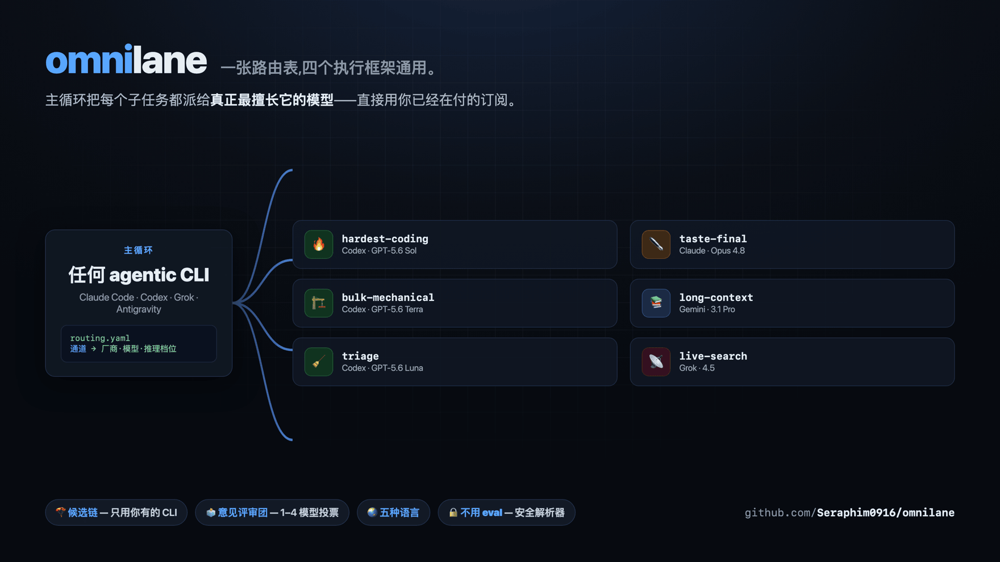
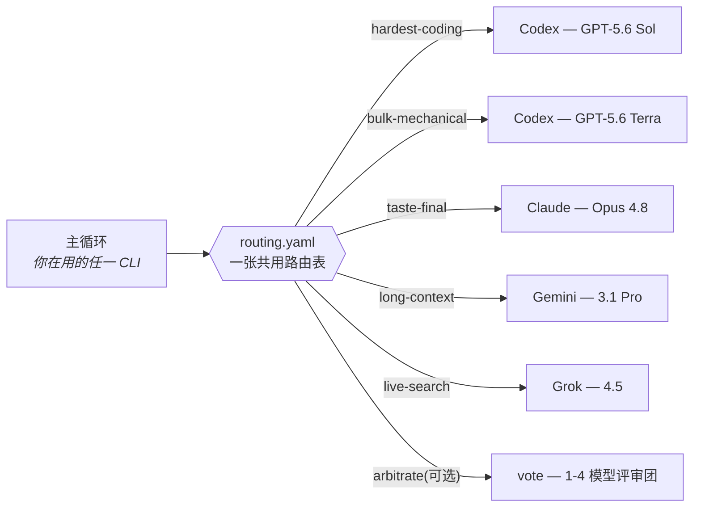

<div align="center">

# omnilane

### 一张路由表,四个执行框架通用。

*让主循环不再猜要用哪个模型。*<br/>
每个子任务都派给真正最擅长它的模型——横跨<br/>
**Claude Code · Codex · Grok Build · Antigravity**,直接用你已经在付的订阅。



[](https://github.com/Seraphim0916/omnilane/actions/workflows/ci.yml)
[](LICENSE)
[](https://github.com/Seraphim0916/omnilane/tags)

[English](README.md) · [繁體中文](README.zh-TW.md) · **简体中文** · [日本語](README.ja.md) · [한국어](README.ko.md)

</div>

---

## v0.6.0 新功能

- **离线理解并验证路由** — 使用 `--explain` 查看每个备用候选，或使用
  `--validate` 检查完整生效路由表；都不会调用模型或创建作业状态。
- **用机器可读数据观察本地状态** — `jobs.sh stats` 提供有界统计，
  `omnilane doctor --json` 提供健康检查，同时不会泄漏任务或结果正文。
- **在 Live Board 比较两条作业** — 将一条已加载作业固定为仅存在于内存中的
  参考快照，并排比较模型路径与公开结果。
- **让锁恢复更安静** — 所有者文件在检查与读取之间消失时，不再泄漏容易误判的
  缺失文件诊断，同时保持 fail-closed。

## v0.5.1 新功能

- **在非 Git 目录使用 Codex work** — 普通文件夹仍完整支持；Omnilane 不要求，
  也绝不会自动执行 `git init`。
- **干净停止非 Git 卡死** — 未设置整体上限时，解析后的单次看门狗会自动成为
  进程组保险丝，同时保留手动 timeout 的优先级和退出码语义。
- **让版本显示可信** — `VERSION` 现在统一提供给 `omnilane --version` 和两份
  plugin manifest，CI 会检查变更记录和五种语言 README 是否一致。

## ⚡ 60 秒上手

```bash
git clone https://github.com/Seraphim0916/omnilane && cd omnilane
./install.sh          # 检测你的 CLI、接好技能、说你的语言
omnilane route hardest-coding "修掉间歇失败的 auth token 刷新测试"
omnilane ui start     # 可选:在浏览器实时查看派发
```

## 🧭 工作原理

omnilane 让**任何**一个 agentic CLI 的主循环把子任务分类到通道(lane),
再以无头方式把每条通道派发给该项工作最强的厂商 CLI,直接沿用你已有的订阅登录:



- **`routing.yaml`** — 通道 → 厂商+模型+推理档位。一个文件,四个执行框架共用。
- **候选链** — 一条通道可以列多个候选(`codex … | claude … | off`),
  派发时自动采用本机**实际安装了**的第一个厂商 CLI。只订一、两家也能用同一张表。
- **`scripts/dispatch.sh [--vendor V] <通道> "<任务>"`** — 查表后以无头方式
  调用对应厂商的 CLI。`--vendor` 会锁定指定厂商，不做降级。
- **`skills/omnilane/SKILL.md`** — 一份技能四个框架都能加载:
  先认出自己是哪个模型,自己通道的活自己干,其余派出去。

<div align="center">

| | | |
|:---:|:---:|:---:|
| 🧭 **一张表**<br/>四个执行框架共用 | 🪂 **候选链**<br/>自动降级到你装了的 CLI | 🗳️ **意见评审团**<br/>重大决定多模型投票 |
| 🔒 **安全机制**<br/>排队锁 · 看门狗 · 禁嵌套 | 🌏 **五种语言**<br/>安装器说你的母语 | ↩️ **完全可逆**<br/>`--uninstall` 一键还原 |

</div>

## 🛤️ 通道一览(默认值;实际生效值运行 `scripts/dispatch.sh --list` 查看)

| 通道 | 首选模型 | 备选模型 | 用途 |
|---|---|---|---|
| 🔥 hardest-coding | GPT-5.6 Sol (xhigh) | Claude Opus 4.8 (high) | 最难的实现、深度调试、正确性攸关的修改 |
| 🏗️ bulk-mechanical | GPT-5.6 Terra (max) | Claude Sonnet 5 (high) | 重构、迁移、测试、大面积扫描——机械耐力活 |
| 🧹 triage | GPT-5.6 Luna (medium) | Gemini 3.5 Flash (Low) | 高量初筛、第一轮过滤 |
| ⚖️ hard-judgment | GPT-5.6 Sol (max) | Claude Opus 4.8 (high) | 架构仲裁、深度推理、第二意见 |
| ✒️ taste-final | Claude Opus 4.8 (high) | GPT-5.6 Sol (max) | 对外文字、prompt 与文档打磨、风格终审 |
| 💬 consult | 明确指定的厂商/模型 | —(不降级) | 自然语言直接咨询;必须保留 `--vendor` |
| 🎨 ui-draft | GPT-5.6 Sol (xhigh) | Claude Opus 4.8 (high) | 有设计规范/参考图时的 UI 出稿;开放式视觉品味交给 taste-final |
| 📚 long-context | Gemini 3.1 Pro (High) | Claude Opus 4.8 (high) | 百万 token 长文整合——仅限分析,不派 agentic 长链 |
| ⚡ fast-agentic | Gemini 3.5 Flash (High) | GPT-5.6 Luna (high) | 快速多步骤 agentic 循环、多模态检查 |
| 📡 live-search | Grok 4.5 | —(off) | 实时 X/网络搜索与社群脉络 |
| 🚰 coding-overflow | Grok 4.5 | —(off) | Codex 额度吃紧时的中量级编码溢流道;事实性声明须另行查证 |
| 🗳️ arbitrate | off(可选评审团) | — | 内置意见评审团,重大决定用——默认关闭,要用在 `routing.local.yaml` 打开;每评审每轮烧一次额度 |

**备选模型**是候选链的下一位——首选那家的厂商 CLI 没装时,派发就降到它。

> **Claude Fable 5 去哪了?** 默认表刻意不放:Claude 顶级档通常就是*主循环本人*,
> 不是被派发的工人,且定价高于 Opus。设置菜单的模型清单里有它——
> 不同意就自己路由过去(例如在 `routing.local.yaml` 写
> `taste-final: claude claude-fable-5 high`)。

### 自然语言咨询

通过 `omnilane` 技能或 `/route`,你可以直接说: **“请 Opus 挑战这个架构。”**
自然语言由 Agent Skill 判断,不是在 `dispatch.sh` 里做自由文本 shell 解析。

- 只问“哪个模型适合”时,回答匹配通道当前第一个可用模型,不发出模型调用。
- 只指定厂商名时,使用该厂商在 `consult` 通道中配置的候选模型。
- 指定标准模型别名(例如 Opus)时,会锁定技能表中的确切模型家族。明确目标
  不存在或 CLI 不可用时会清楚失败,不会暗中更换厂商或模型家族。

<details>
<summary><b>👉 哪些通道你自己跑?选你的主控模型</b></summary>

<br/>

上面那张表跟厂商无关——一条通道的*最佳*模型不会因为谁在主控而改变。会变的是
你哪些通道**自己做**(你本来就是那个模型,省一次调用)、哪些**派出去**。你 CLI 里
的 `omnilane` 技能会自动套对的那一行,这里是给人看的版本。

- **Claude Code · Fable 5** — 自己做:hard-judgment、taste-final、最吃正确性的硬修。派出去:机械编码量 → Codex、长文 → Gemini、实时搜索 → Grok。
- **Claude Code · Opus 4.8** — 自己做:taste-final。hard-judgment 派给 Codex Sol(智力分高于 Opus)、所有编码走 Codex 通道、长文 → Gemini、实时搜索 → Grok。
- **Codex · Sol** — 自己做:hardest-coding、hard-judgment、ui-draft。派出去:taste-final → Claude、长文 → Gemini、实时搜索 → Grok、粗活 → Codex Terra。
- **Codex · Terra** — 自己做:bulk-mechanical。真正最硬的往上升给 Sol;taste → Claude、长文 → Gemini、实时搜索 → Grok。
- **Grok Build · Grok 4.5** — 自己做:live-search、coding-overflow(中量级编码)。所有硬活派给 Codex/Claude/Gemini——先验每个 API 签名与引用事实。
- **Antigravity · Gemini** — 自己做:long-context(3.1 Pro)、fast-agentic(Flash)。编码/判断/文字派给 Codex/Claude;实时搜索 → Grok。3.1 Pro 绝不接 agentic 工具长链。

</details>

## 🖥️ Live Board

每一次派发——无论前台还是 `--background`——都是落盘的一条 job。Live Board
是架在这个 job 存储之上、可选且只读的本地工作台:每个模型被问了什么、答了
什么、怎么路由、是否还在运行,一眼看完。

<div align="center">


</div>

```bash
omnilane ui start    # 启动或复用服务器，输出通过认证的网址
omnilane ui status   # 查看本地服务器状态
omnilane ui url      # 输出当前通过认证的网址
omnilane ui stop     # 正常停止
```

桌面版的作业列表与详情区域可分别滚动;手机版使用列表／详情切换，支持返回键与
Esc。服务器发送事件(SSE)会实时更新，又不会重建当前聚焦的作业行;短暂断线时
保留最后画面并自动重连。可将任意已加载作业固定为参考，再选择另一条作业，并排
比较模型路径和公开结果;参考快照只留在浏览器内存中，关闭页面即消失。服务只绑定
`127.0.0.1`、使用随机令牌保护、全程只读。界面只显示 `task.txt` 和公开的
`out.txt`，不会显示工作端或厂商原始日志。

核心路由不需要 Python;只有这个界面需要 Python 3.9 或更高版本。

## 📦 安装

前置需求:想路由到的厂商 CLI(`codex`、`claude`、`grok`、`agy`)已登录且在
`PATH` 上——**有几家装几家就好**,缺的通道会自动降级。

最快:`./install.sh` — 自动检测本机的 CLI、接好技能、列出其余的插件安装命令、
打印这台机器的生效路由表,最后询问是否进入交互设置菜单(`--uninstall` 可逆)。
安装界面依系统语言自动切换(英/繁中/简中/日/韩,可用 `OMNILANE_LANG=zh-CN`
强制)。另提供可选的各 CLI **常驻路由提示**:在各 CLI 指令文件末尾加一段带
标记、可逆的区块(`~/.claude/CLAUDE.md`、`~/.codex/AGENTS.md`、
`~/.grok/Agents.md`、`~/.gemini/GEMINI.md`——路径可能随 CLI 版本不同);
非交互安装可带 `OMNILANE_HOOKS=all|none|claude,codex`。手动接线:

`./install.sh --check` 可只读检查漂移；安装或 `--uninstall` 加上
`--dry-run`，可先预览每个由这份 checkout 拥有的文件动作。
要回滚安装器拥有的链接与标记提示，执行 `./install.sh --uninstall`。

- **Claude Code**:以插件安装(附 `/route`、`/route-jobs` 命令),
  或把 `skills/omnilane` 放进 `~/.claude/skills/`。
- **Codex**:把 `skills/omnilane` 放进或链接到 `~/.codex/skills/`。
- **Grok Build**:`grok plugin install <本仓库路径> --trust`
- **Antigravity**:`agy plugin install <本仓库路径>`(先用
  `agy plugin validate` 检查)

## ⚙️ 自定义设置

三层,全部可选:

1. **交互菜单** — `scripts/configure.sh` 列出可配置的通道,让你逐条选
   厂商 → 模型 → 推理档位(有建议清单,也可自由输入未来的新模型名),
   写进 `~/.omnilane/routing.local.yaml`。多厂商 `consult` 会被刻意跳过,
   如需修改请手动编辑。`install.sh` 装完会主动询问。
2. **`~/.omnilane/routing.local.yaml`** — 手改覆盖文件,格式同 `routing.yaml`,
   本机优先。参考 `routing.local.yaml.example`。
3. **`~/.omnilane/local.sh`** — 机器专属的可执行文件路径、代理、认证包装;
   每个执行器都会加载,永不进版本控制。参考 `local.sh.example`。

随时检查结果:

```
scripts/dispatch.sh --list     # 生效表,标出候选链降级与关闭的通道
```

## 📖 命令参考

```
eval "$(omnilane completion bash)"             # 在当前 Bash 启用补全
source <(omnilane completion zsh)               # 在当前 Zsh 启用补全
omnilane release-audit [--target 版本] [--json]     # 离线、只读的发布闸门
omnilane ui start                              # 启动或复用本地 Live UI,输出链接
omnilane ui status                             # 查看 Live UI 是否正在运行
omnilane ui url                                # 输出当前通过认证的本地链接
omnilane ui stop                               # 停止 Live UI
omnilane doctor [--json]                       # 只读检查路由与本地运行环境
dispatch.sh [--background] [--mode advise|work] [--workdir 目录]
            [--vendor V] [--model M] [--effort E] [--timeout SEC] [--job-timeout SEC]
            通道 "任务"                              # "-" 表示从 stdin 读任务
dispatch.sh [--json] --list [--json]
dispatch.sh [--json] --explain 通道 [--json]       # 离线逐候选解释路由决策
dispatch.sh [--json] --validate [--json]           # 离线检查生效路由，不调用模型
jobs.sh list | status 作业ID | result 作业ID
jobs.sh stats [--last N]                           # 本机成功率与路由汇总
jobs.sh prune [--keep N] [--apply]                # 默认仅预览；只清理已完成作业
configure.sh                                        # 交互通道菜单
```

退出码:`2` 用法错误(包括厂商值无效,或指定厂商不在该通道)、`3` 通道已关闭、
`4` 候选链没有可用 CLI,或指定厂商已配置但其 CLI 不可用、
`5` 第一轮成功评审太少、`6` 第二轮没有任何反驳成功、`86` 拒绝嵌套派发、
`87` 等锁超时、`124` 整体任务超时;
其余直接透传工作端自己的退出码。

## 🎭 模式

- **advise(默认)** — 只读工作端。Codex 跑只读沙箱;Claude 只给
  Read/Glob/Grep;Grok 跑 plan 模式。适合审查、提问、第二意见。
- **work** — 允许改文件,仅限你指定的 `--workdir`。Codex 给
  workspace-write 沙箱;Claude 自动接受编辑;Gemini 跑 accept-edits 模式。

## 🔒 内置安全机制

- **禁止嵌套派发** — 工作端不得再往外派(`OMNILANE_DEPTH` 守卫,退出码 86),
  杜绝 AI 叫 AI 的额度连环烧。
- **Codex 排队锁** — 同一目标目录的 codex 派发自动串行化(锁以规范化后的
  workdir 为键);崩溃残留的锁以所有者 PID 检测后安全接管。
- **看门狗** — 每个工作端跑在 `timeout`/`gtimeout` 之下,两者皆无时退到
  perl-alarm 后备(原生 macOS 就是这种情况),卡死的 CLI 不会挂一整晚。
  上限作用于**每次 CLI 调用**,优先级从高到低:`--timeout SECONDS` > 单通道
  `OMNILANE_TIMEOUT_<LANE>`(通道名大写、`-` 换成 `_`,如
  `OMNILANE_TIMEOUT_HARD_JUDGMENT`) > 全局 `OMNILANE_TIMEOUT`(默认 600 秒)。
  它是单次调用的防卡死看门狗,不是整个任务的时间预算:会重试的 vendor(grok)
  或 vote 面板(评审 × 轮次)会发起多次调用,总耗时可能是该值的数倍。
- **整体任务保险丝** — 可选的 `--job-timeout SECONDS` 用同一个进程组监工,
  一次覆盖等锁、重试、所有评审和轮次。优先级为参数 >
  `OMNILANE_JOB_TIMEOUT_<LANE>` > `OMNILANE_JOB_TIMEOUT` > 关闭；唯一的自动例外
  是 Codex 在 Git worktree 外执行 `work` 时，若未设置整体上限，就沿用解析后的
  单次调用看门狗作为整体保险丝，上限为监工支持的 999999999 秒。到期会清理
  受监工的进程组并返回 124。这个自动保险丝需要内置的 Perl 监工；若环境
  无法使用，派发会警告但仍通过原有单次调用看门狗路径执行非 Git 工作；若连
  单次看门狗工具都没有，该路径会另外警告。
  完整深度代码审查建议从 2–4 小时
  (7200–14400 秒)起步,单次调用看门狗可先设 30 分钟;这些只是建议值,
  不会写死为默认值。
- **后台作业生命周期** — `--background` 的工作端跑在自己的 process group,
  调用端退出也不受影响;被杀会落盘退出码,`jobs.sh status` 会报 `dead`
  而不是永远显示 `running`。
- **任务载荷上限** — 过大的任务文本自动头尾截断,防止撑爆工作端上下文。

## 📊 默认值与数据来源

默认通道配置依据 Artificial Analysis 2026-07 快照(已对 AA 站上原始记录与
各厂官方定价页交叉核对)加上公开对比评测;这些是意见不是定律——
设置菜单和 `routing.local.yaml` 就是让你不同意用的。评审团(arbitrate)
默认关闭;要用就在 `routing.local.yaml` 写
`arbitrate: vote codex,claude,grok -`(从四家里任选 1-4 个评审),
或改用 `exec` 厂商指向你自己的多模型审查闸脚本。

## ⚠️ 已知限制

- **Antigravity 的 print 模式工具调用在现行 CLI 版本不稳定**(可能被拒或
  返回无效参数)。long-context 通道的设计本来就是"把内容贴进任务"的长文
  整合,不受影响;要*读取仓库*的咨询请用 claude/codex 候选。
- **Grok 没有推理档位开关**;effort 字段仅为接口一致而保留,实际忽略。
- **非 Git 的 Codex work 仍受支持。** 部分 Codex CLI 版本可能在 Git worktree
  外卡住，因此上面的自动保险丝会限制这个场景并清理受监工的进程组。Omnilane
  不会自动执行 `git init`，也不要求用户创建仓库。

## 🌱 状态

v0.5.1 让 Codex `work` 在非 Git 目录仍可使用，同时以进程组清理限制卡死，
并同步所有公开版本来源。它延续 v0.5.0 对安装器、派发生命周期、作业存储、
整体截止时间、诊断和发布 CI 的强化。Grok/Antigravity 命令壳行为仍可能随
CLI 版本变动。欢迎提交 issue 与 PR。

项目文档：[贡献指南](CONTRIBUTING.md) · [安全政策](SECURITY.md) ·
[变更记录](CHANGELOG.md)
