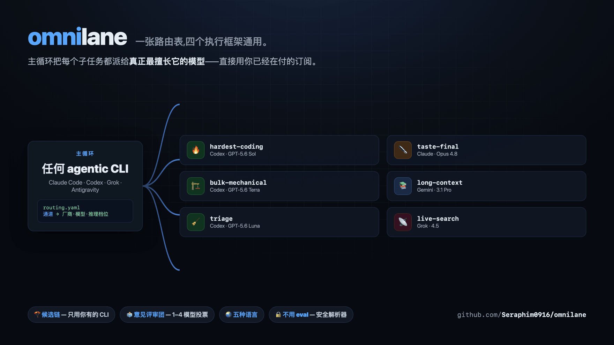
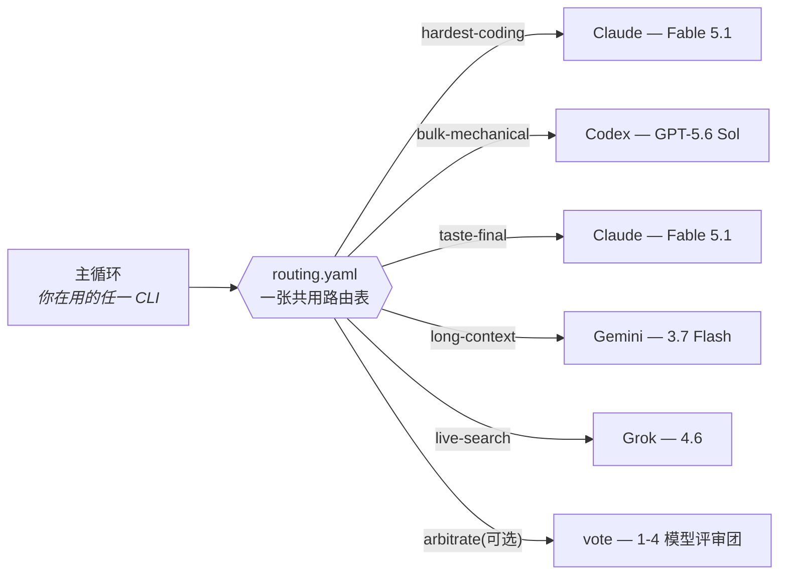

<div align="center">

# omnilane

### 一张路由表,四个执行框架通用。

*让主循环不再猜要用哪个模型。*<br/>
从 **Claude Code · Codex · Grok Build · Antigravity** 任一框架驾驶,每个子任务都派给<br/>
真正最擅长它的模型——Codex、Claude、Grok、Gemini、Kimi、Qwen、OpenCode,<br/>
或经 OpenRouter 直达任何托管模型——用你已经在付的订阅,或一把 API 密钥。



[](https://github.com/Seraphim0916/omnilane/actions/workflows/ci.yml)
[](LICENSE)
[](https://github.com/Seraphim0916/omnilane/tags)

[English](README.md) · [繁體中文](README.zh-TW.md) · **简体中文** · [日本語](README.ja.md) · [한국어](README.ko.md)

</div>

---

## 🤔 omnilane 是什么?

**问题在哪。** 你已经在用某个 AI 写代码助手——**Claude Code、Codex、Cursor、
Gemini CLI** 之类。每一个都只接一个模型家族,所以你交代的每件事都跑在那同一个
模型上,不管它合不合适:随手改个文件名烧掉最贵的模型,真正难的架构问题却刚好落在
你当下开着的那个。

**omnilane 做什么。** 它给你的助手一张路由表。工作被分进**通道**——最难的实现、
机械粗活、初筛、硬判断、文字终审——每条通道指名对那件事最强(也最省)的模型。
助手保留自己本来就擅长的通道,其余用你既有的登录,在后台交给别家厂商的 CLI。

**它不是什么。** 不是 proxy、不是另一笔订阅、不是又一个要维护的服务。它就是一张表
加一支派工脚本,躲在你现有工具背后跑。`./install.sh --uninstall` 可完全清除。

**你不需要每一家订阅。** 每条通道都是候选链,派工时自动采用本机实际装了的第一个
候选。装一家或七家都行,整条链都没有的通道就自动关闭,而不是报错。只有一份订阅
时,整张默认表会收敛到那一家。

**[⬇ 直接跳到 60 秒上手](#-60-秒上手)** · **[❓ 看常见问题](#-常见问题)**

## ⚡ 60 秒上手

**最快的方式——用 npm 装:**

```bash
npm i -g omnilane                                    # 装 CLI
export OMNILANE_AA_OPERATOR_ASSERTED_HUMAN=1         # 你是操作者本人,不是模型
omnilane route hardest-coding "修掉会间歇失败的 auth token 更新测试"
omnilane doctor                                      # 看你手上有哪些 AI CLI / 金钥
omnilane ui start                                    # 选配:在浏览器即时看派工
```

**或 clone 整包**(拿到路由表与可自订的技能):

```bash
git clone https://github.com/Seraphim0916/omnilane && cd omnilane
./install.sh          # 侦测你的 CLI、接好技能、说你的语言
export OMNILANE_AA_OPERATOR_ASSERTED_HUMAN=1         # 你是操作者本人,不是模型
omnilane route hardest-coding "修掉会间歇失败的 auth token 更新测试"
```

> **那个 export 是做什么的?** omnilane 会用调用者自己的能力分数来把关每一次派工,
> 所以派工必须表明「是谁在问」。人类在终端前只要设一次
> `OMNILANE_AA_OPERATOR_ASSERTED_HUMAN=1`,或每次带 `--operator-asserted-human`。
> 模型驱动 omnilane 时**不能替自己主张**这个标志。它的身份会从启动它的 CLI 标志
> (模型与强度)自动读取,一般 session 什么都不用带;`omnilane whoami` 会把这个身份
> 打印成 `--caller-context FILE`。既没主张、又读不到身份的话,派工会在创建作业前就被
> `missing-caller-context` 拒绝。

> 第一次用?先跑 `omnilane doctor`——它会告诉你 omnilane 现在能接到哪些模型 CLI 与
> API 金钥,你就知道实际会跑什么。

## 🧭 工作原理

omnilane 让**任何**一个 agentic CLI 的主循环把子任务分类到通道(lane),
再以无头方式把每条通道派发给该项工作最强的厂商——直接沿用你已有的订阅登录
(`openrouter` vendor 例外:免装任何 CLI,一把 API 密钥直连):


```mermaid
flowchart LR
    M["主循环<br/><i>你在用的任一 CLI</i>"] --> T{{"routing.yaml<br/>一张共用路由表"}}
    T -->|hardest-coding| C1["Claude — Fable 5.1"]
    T -->|bulk-mechanical| C2["Codex — GPT-5.6 Sol"]
    T -->|taste-final| C3["Claude — Fable 5.1"]
    T -->|long-context| C4["Gemini — 3.7 Flash"]
    T -->|live-search| C5["Grok — 4.6"]
    T -->|"arbitrate(可选)"| C6["vote — 1-4 模型评审团"]
```

- **`routing.yaml`** — 通道 → 厂商+模型+推理档位。一个文件,四个执行框架共用。
- **候选链** — 一条通道可以列多个候选(`codex … | claude … | off`),
  派发时自动采用本机**实际安装了**的第一个厂商 CLI。只订一、两家也能用同一张表。
- **`scripts/dispatch.sh [--vendor V] <通道> "<任务>"`** — 查表后以无头方式
  调用对应厂商的 CLI。`--vendor` 会锁定指定厂商，不做降级。
- **`skills/omnilane/SKILL.md`** — 一份技能四个框架都能加载:
  先认出自己是哪个模型,自己通道的活自己干,其余派出去。
- **`omnilane mcp`** — 同一套路由改以 MCP stdio server 提供,
  给走 MCP 而非 skill 集成的宿主。

<div align="center">

| | | |
|:---:|:---:|:---:|
| 🧭 **一张表**<br/>四个执行框架共用 | 🪂 **候选链**<br/>自动降级到你装了的 CLI | 🗳️ **意见评审团**<br/>重大决定多模型投票 |
| 🔒 **安全机制**<br/>排队锁 · 看门狗 · 禁嵌套 | 🌏 **五种语言**<br/>安装器说你的母语 | ↩️ **完全可逆**<br/>`--uninstall` 一键还原 |

</div>

## 🛤️ 通道一览(默认值;实际生效值运行 `scripts/dispatch.sh --list` 查看)

| 通道 | 首选模型 | 备选模型 | 用途 |
|---|---|---|---|
| 🔥 hardest-coding | Claude Fable 5.1 (max) | GPT-6 Astra (xhigh) → Grok 4.6 → Gemini 3.8 Flash (High) | 最难的实现、深度调试、正确性关键的修改 |
| 🏗️ bulk-mechanical | GPT-5.6 Sol (high) | Gemini 3.8 Flash (High) → Claude Sonnet 5 (high) | 重构、迁移、测试、大范围扫描——机械耐力活 |
| 🧹 triage | GPT-5.6 Luna (high) | Gemini 3.8 Flash (Low) → Claude Haiku 4.5 | 大量扫描、第一轮筛选 |
| ⚖️ hard-judgment | Claude Fable 5.1 (xhigh) | GPT-6 Astra (xhigh) → Grok 4.6 | 架构裁决、深度推理、第二意见 |
| ✒️ taste-final | Claude Fable 5.1 (xhigh) | GPT-6 Astra (xhigh) → Grok 4.6 → Gemini 3.8 Flash (High) | 对外文字、提示词／文档润色、风格裁决 |
| 💬 consult | GPT-6 Astra (xhigh) | Claude Fable 5.1 (xhigh) → Grok 4.6 → Gemini 3.8 Flash (Medium) | 直接指定模型咨询；保留 `--vendor` 避免降级 |
| 🎨 ui-draft | GPT-5.6 Sol (high) | Claude Fable 5.1 (xhigh) → Gemini 3.8 Flash (High) | 仅在提供设计系统／参考图时生成 UI 草稿 |
| 📚 long-context | Gemini 3.8 Flash (Medium) | GPT-5.6 Terra (max) → Claude Opus 5 (medium) | 长文档提取与综合，按 AA-LCR、成本和吞吐排序 |
| ⚡ fast-agentic | Gemini 3.8 Flash (Low) | GPT-5.6 Luna (high) → Claude Haiku 4.5 | 高速多步骤工具循环、多模态检查 |
| 📡 live-search | Grok 4.6 | Gemini 3.8 Flash (High) → Claude Sonnet 5 (high) | 实时 X／网页搜索与社交上下文 |
| 🚰 coding-overflow | Grok 4.6 | Gemini 3.8 Flash (High) → Kimi K3 → Qwen3 Coder Plus → OpenCode | Codex 配额耗尽时的中量级编码安全阀 |
| 🗳️ arbitrate | off (opt-in vote panel) | — | 重大决定的内置意见评审团；默认禁用，在 `routing.local.yaml` 启用，每位评审每轮调用一次 |

**备选模型**是候选链的下一位——首选那家的厂商 CLI 没装时,派发就降到它。每条
通道都是这样一条链;整条都没装时,通道自动降为 `off`。

> **Fable 5.1 已进入默认表——以及 Opus 5 仍适合放在哪里。** 三方数据与 Opus override 见[常见问题](#-常见问题)。

### 自然语言咨询

通过 `omnilane` 技能或 `/route`,你可以直接说: **“请 Opus 挑战这个架构。”**
自然语言由 Agent Skill 判断,不是在 `dispatch.sh` 里做自由文本 shell 解析。

- 只问“哪个模型适合”时,回答匹配通道当前第一个可用模型,不发出模型调用。
- 只指定厂商名时,使用该厂商在 `consult` 通道中配置的候选模型。
- 指定标准模型别名(例如 Opus)时,会锁定技能表中的确切模型家族。明确目标
  不存在或 CLI 不可用时会清楚失败,不会暗中更换厂商或模型家族。

<details>
<summary><b>👉 哪些通道你自己跑?选你的主控模型</b></summary>

<br/>

上面那张表跟厂商无关——一条通道的*最佳*模型不会因为谁在主控而改变。会变的是
你哪些通道**自己做**(你本来就是那个模型,省一次调用)、哪些**派出去**。你 CLI 里
的 `omnilane` 技能会自动套对的那一行,这里是给人看的版本。

- **Claude Code · Fable 5.1**——自己执行：taste-final、hardest-coding。派发：hard-judgment → Opus 5；bulk → Codex Sol high；long-context／高速循环 → Gemini 3.7 Flash；实时搜索 → Grok。
- **Claude Code · Opus 5**——自己执行：hard-judgment(默认车道)。需要更低幻觉率或价格时，用本地覆写让它接手 taste-final。最难编码 → Fable 5.1 或 Sol；bulk → Sol high；long-context／高速循环 → Gemini 3.7 Flash；实时搜索 → Grok。
- **Codex · Sol**——自己执行：hardest-coding、bulk-mechanical、hard-judgment、ui-draft。派发：taste-final → Claude；long-context／高速循环 → Gemini 3.7 Flash；实时搜索 → Grok。
- **Codex · Terra**——自己执行 long-context 的 Codex 备用任务；bulk-mechanical 现在默认由 Sol high 处理。最难部分升级到 Sol xhigh，taste → Claude，高速循环 → Gemini 3.7 Flash，实时搜索 → Grok。
- **Grok Build · Grok 4.6**——自己执行 live-search、coding-overflow，并兼任 hardest-coding、hard-judgment、taste-final 的备用。首选可用时，最难的编码／判断／文字交给 Codex、Claude、Gemini；仍需验证 API 签名和引用事实。
- **Antigravity · Gemini 3.7 Flash**——自己执行：Medium 的 long-context／高速循环、High 的 bulk／overflow、Low 的 triage，并以 High 兼任 hardest-coding、taste-final、ui-draft、live-search 的备用。首选可用时，最难编码／判断／文字交给 Codex、Claude。

</details>

## 🖥️ Live Board

每一次派发——无论前台还是 `--background`——都是落盘的一条 job。Live Board
是架在这个 job 存储之上、可选且只读的本地工作台:每个模型被问了什么、答了
什么、怎么路由、是否还在运行,一眼看完。

<div align="center">


</div>

```bash
omnilane ui start    # 启动或复用服务器，输出通过认证的网址
omnilane ui status   # 查看本地服务器状态
omnilane ui url      # 输出当前通过认证的网址
omnilane ui stop     # 正常停止
```

桌面版的作业列表与详情区域可分别滚动;手机版使用列表／详情切换，支持返回键与
Esc。服务器发送事件(SSE)会实时更新，又不会重建当前聚焦的作业行;短暂断线时
保留最后画面并自动重连。可将任意已加载作业固定为参考，再选择另一条作业，并排
比较模型路径和公开结果;参考快照只留在浏览器内存中，关闭页面即消失。服务只绑定
`127.0.0.1`、使用随机令牌保护、全程只读。界面只显示 `task.txt` 和公开的
`out.txt`，不会显示工作端或厂商原始日志。

界面提供英文、日文、韩文、繁体中文与简体中文。首次加载依浏览器语言决定，可用标题栏
的切换器覆盖，选择会记在本地。

核心路由不需要 Python;只有这个界面需要 Python 3.9 或更高版本。

## 📦 安装

前置需求:想路由到的厂商 CLI(`codex`、`claude`、`grok`、`agy`,另可选
`kimi`、`qwen`、`opencode`)已登录且在 `PATH` 上——**有几家装几家就好**,
缺的通道会自动降级。`openrouter` vendor 是例外:不需要任何 CLI,只要
`curl` 和环境变量里的 `OPENROUTER_API_KEY`。

最快:`./install.sh` — 自动检测本机的 CLI、接好技能、列出其余的插件安装命令、
打印这台机器的生效路由表,最后询问是否进入交互设置菜单(`--uninstall` 可逆)。
安装界面依系统语言自动切换(英/繁中/简中/日/韩,可用 `OMNILANE_LANG=zh-CN`
强制)。另提供可选的各 CLI **常驻路由提示**:在各 CLI 指令文件末尾加一段带
标记、可逆的区块(`~/.claude/CLAUDE.md`、`~/.codex/AGENTS.md`、
`~/.grok/Agents.md`、`~/.gemini/GEMINI.md`——路径可能随 CLI 版本不同);
非交互安装可带 `OMNILANE_HOOKS=all|none|claude,codex`。手动接线:

`./install.sh --check` 可只读检查漂移；安装或 `--uninstall` 加上
`--dry-run`，可先预览每个由这份 checkout 拥有的文件动作。
要回滚安装器拥有的链接与标记提示，执行 `./install.sh --uninstall`。

- **Claude Code**:以插件安装(附 `/route`、`/route-jobs` 命令,并内置
  `SessionStart` hook,会话开始时自动注入路由提醒,无需修改 CLAUDE.md),
  或把 `skills/omnilane` 放进 `~/.claude/skills/`。
- **Codex**:把 `skills/omnilane` 放进或链接到 `~/.codex/skills/`。
- **Grok Build**:`grok plugin install <本仓库路径> --trust`
- **Antigravity**:`agy plugin install <本仓库路径>`(先用
  `agy plugin validate` 检查)

### MCP server

`omnilane mcp` 会启动零依赖、跑在本机的 MCP stdio server,让任何支持 MCP
的宿主无需安装 skill、也不用加路由提醒,即可发现并调用 omnilane。在宿主
配置里指向已安装的 CLI 即可:

```json
{
  "mcpServers": {
    "omnilane": {
      "command": "omnilane",
      "args": ["mcp"]
    }
  }
}
```

Server 提供 `route`,以及一组只读查询工具:`list_lanes`、`explain`、`validate`、`dry_run`、`jobs_list`、`jobs_status`、`jobs_result`、`jobs_stats`、`jobs_audit`、`doctor`。
`route` 默认只读 `advise` 模式;选择 `work` 的调用必须同时提供明确的
`workdir`。

唯一的运行需求是 Node.js(不装任何 npm 包);也可以直接
`npm install -g omnilane`,CLI 连同 MCP server 一起装好。

## ⚙️ 自定义设置

三层,全部可选:

1. **交互菜单** — `scripts/configure.sh` 列出可配置的通道,让你逐条选
   厂商 → 模型 → 推理档位(有建议清单,也可自由输入未来的新模型名),
   写进 `~/.omnilane/routing.local.yaml`。多厂商 `consult` 会被刻意跳过,
   如需修改请手动编辑。`install.sh` 装完会主动询问。
2. **`~/.omnilane/routing.local.yaml`** — 手改覆盖文件,格式同 `routing.yaml`,
   本机优先。参考 `routing.local.yaml.example`。
3. **`~/.omnilane/local.sh`** — 机器专属的可执行文件路径、代理、认证包装;
   每个执行器都会加载,永不进版本控制。参考 `local.sh.example`。

随时检查结果:

```
scripts/dispatch.sh --list     # 生效表,标出候选链降级与关闭的通道
```

## 📖 命令参考

```
eval "$(omnilane completion bash)"             # 在当前 Bash 启用补全
source <(omnilane completion zsh)               # 在当前 Zsh 启用补全
omnilane completion fish | source
omnilane mcp                                   # MCP stdio server(需 Node.js)
omnilane release-audit [--target 版本] [--json]     # 离线、只读的发布闸门
omnilane ui start                              # 启动或复用本地 Live UI,输出链接
omnilane ui status                             # 查看 Live UI 是否正在运行
omnilane ui url                                # 输出当前通过认证的本地链接
omnilane ui stop                               # 停止 Live UI
omnilane doctor [--json]                       # 只读检查路由与本地运行环境
dispatch.sh [--background] [--dry-run] [--thread NAME] [--mode advise|work|sysops] [--workdir 目录]
            [--vendor V] [--model M] [--effort E] [--timeout SEC] [--job-timeout SEC]
            [--caller-context FILE | --operator-asserted-human]   # who is asking
            通道 "任务"                              # "-" 表示从 stdin 读任务
dispatch.sh [--json] --list [--json]
dispatch.sh [--json] --explain 通道 [--json]       # 离线逐候选解释路由决策
dispatch.sh [--json] --validate [--json]           # 离线检查生效路由，不调用模型
jobs.sh [--json] {list | status 作业ID | result 作业ID} # JSON 结果只回元数据，不回正文
jobs.sh [--json] list [--lane L] [--vendor V] [--status running|done]  # 过滤列表
jobs.sh wait 作业ID [--timeout N]                  # 作业退出码；124 超时；125 工作进程消失
jobs.sh cancel 作业ID                              # 停止运行中的作业:整组 SIGTERM,再 SIGKILL
jobs.sh rm 作业ID                                  # 删除单个已完成/已死作业(运行中会被拒绝)
jobs.sh [--json] stats [--last N] [--lane L] [--vendor V]  # 本机成功率与路由汇总
jobs.sh audit [--last N] [--json]                  # 只读检查作业完整性与隐私
jobs.sh prune [--keep N] [--apply]                # 默认仅预览；只清理已完成作业
configure.sh                                        # 交互通道菜单
configure.sh set|get|unset|list|diff LANE [SPEC]    # 非交互编辑/查看 routing.local.yaml
```

`--thread NAME` 可在多次单次派发间延续命名的 Claude、Codex、Grok 或 Gemini
对话。0.33.0 会固定厂商、模型、effort 与实际工作目录；使用
`jobs.sh threads`、`threads show NAME`、`threads rm NAME` 管理本地状态，
删除状态不会删除厂商端会话。

退出码:`2` 用法错误(包括厂商值无效,或指定厂商不在该通道)、`3` 通道已关闭、
`4` 候选链没有可用 CLI,或指定厂商已配置但其 CLI 不可用、
`5` 第一轮成功评审太少、`6` 第二轮没有任何反驳成功、`86` 拒绝嵌套派发、
`87` 等锁超时、`124` 整体任务超时;
其余直接透传工作端自己的退出码。

## 🎭 模式

- **advise（默认）**：本地只读分析；供应商支持时可用原生网页／搜索工具。保留模型连接，限制修改工具；不同供应商的 X／网页搜索能力并不等同。
- **work**：文件与命令操作限于显式 `--workdir`，关闭代理工具网络访问，保留模型连接。不支持的强制边界在调用模型前停止，不会静默切换为 sysops。
- **sysops**：每次派工显式选择，开放代理工具、文件和网络访问；不作为通道默认值，任务必须列明允许的操作。

CLI 省略 `--workdir` 时默认使用调用端当前目录；任务说明仍应明确工作目录。MCP `route`／`dry_run` 的 work 接口则单独要求明确的 `workdir`。

Codex 和 Claude 的三种模式使用不同策略。Agy advise／sysops 使用独立的原生会话设置，不替换订阅认证；Agy 1.1.27 work 已使用四个经过验证的工具及原生终端沙箱完成限定的新建／续接验收：工作目录内读写、修改、编译及越界写入拒绝通过。外部临时文件／缓存读取也受限；每次启动重写明确设置，不宣称设置全程不可变。另一次正式 work 实时／FIFO 两轮验收已通过前轮读回、越界写入拒绝及正常关闭，源文件保持不变。Grok advise 使用原生工具允许／拒绝规则；Grok 1.0.13 的完整单次 `plain` 路径已验证原生关键词搜索、抓取网页及写入拒绝，采用内部网页工具 ID 和每项作业独立的 MCP 就绪状态，不关闭钩子。`CONTEXT_MODE_MCP_SENTINEL_DIR` 已设置为非空值时，会在调用模型前报告冲突，不覆盖原设置。原生子进程网络隔离仅支持 Linux，因此 macOS Grok work 仍保留前置检查；Grok 实时模式仍要求显式 sysops，这次 advise 结果不扩展到其他路径。OpenRouter 仍仅支持 advise；其他供应商不自动纳入这份四供应商契约。证据范围见[日期化运行验收表](docs/model-capabilities-2026-09.md#f-mode-runtime-gate-2026-09-06)。

## 🔒 内置安全机制

- **禁止嵌套派发** — 工作端不得再往外派(`OMNILANE_DEPTH` 守卫,退出码 86),
  杜绝 AI 叫 AI 的额度连环烧。
- **Codex 排队锁** — 同一目标目录的 codex 派发自动串行化(锁以规范化后的
  workdir 为键);崩溃残留的锁以所有者 PID 检测后安全接管。
- **看门狗** — 每个工作端跑在 `timeout`/`gtimeout` 之下,两者皆无时退到
  perl-alarm 后备(原生 macOS 就是这种情况),卡死的 CLI 不会挂一整晚。
  上限作用于**每次 CLI 调用**,优先级从高到低:`--timeout SECONDS` > 单通道
  `OMNILANE_TIMEOUT_<LANE>`(通道名大写、`-` 换成 `_`,如
  `OMNILANE_TIMEOUT_HARD_JUDGMENT`) > 全局 `OMNILANE_TIMEOUT`(默认 600 秒)。
  它是单次调用的防卡死看门狗,不是整个任务的时间预算:会重试的 vendor(grok)
  或 vote 面板(评审 × 轮次)会发起多次调用,总耗时可能是该值的数倍。
- **整体任务保险丝** — 可选的 `--job-timeout SECONDS` 用同一个进程组监工,
  一次覆盖等锁、重试、所有评审和轮次。优先级为参数 >
  `OMNILANE_JOB_TIMEOUT_<LANE>` > `OMNILANE_JOB_TIMEOUT` > 关闭；唯一的自动例外
  是 Codex 在 Git worktree 外执行 `work` 时，若未设置整体上限，就沿用解析后的
  单次调用看门狗作为整体保险丝，上限为监工支持的 999999999 秒。到期会清理
  受监工的进程组并返回 124。这个自动保险丝需要内置的 Perl 监工；若环境
  无法使用，派发会警告但仍通过原有单次调用看门狗路径执行非 Git 工作；若连
  单次看门狗工具都没有，该路径会另外警告。
  完整深度代码审查建议从 2–4 小时
  (7200–14400 秒)起步,单次调用看门狗可先设 30 分钟;这些只是建议值,
  不会写死为默认值。
- **后台作业生命周期** — `--background` 的工作端跑在自己的 process group,
  调用端退出也不受影响;被杀会落盘退出码,`jobs.sh status` 会报 `dead`
  而不是永远显示 `running`。
- **任务载荷上限** — 过大的任务文本自动头尾截断,防止撑爆工作端上下文。

## 📬 实时邮箱

实时邮箱是受支持模式的常驻后台派发，不是一次性派发。派发方以 `--background` 打开后，运行中仍可追加指令，并负责用 `jobs.sh close ID` 收尾。即使无人处理，它也不会永久存在：空闲上限或已配置的整个作业超时（`--job-timeout`）到期后都会终止它。

```bash
scripts/dispatch.sh --background --vendor claude hard-judgment "检查超时测试失败的原因"
# 将 dispatch 显示的作业 ID 保存为 $ID
scripts/jobs.sh send "$ID" "再检查重试路径。"
scripts/jobs.sh watch "$ID"
scripts/jobs.sh tail "$ID" --lines 20
scripts/jobs.sh close "$ID"
scripts/jobs.sh retry "$ID" --background
```

`watch` 跟随 `$JOB_DIR/events.jsonl`；`tail` 读取 `out.txt`。Claude 和 Gemini 保留受支持模式的后台自动实时行为。Codex／Grok 默认一次性，必须显式 `--background --live`；Grok 还要求 `--mode sysops --workdir DIR`，advise／work 的实时请求在启动前停止，因为 ACP 不强制这些模式的边界。不支持实时模式的供应商立即失败。`--single-shot` 强制一次性执行。`--idle-timeout SECONDS` 默认 900 秒，`0` 禁用空闲上限。

空闲时不会发出 API 调用，也不会产生 API 费用。默认若 900 秒内没有新邮箱消息或新结果事件，worker 会自动收尾；整个作业超时仍是外层上限。处理结束可提前执行 `close`。向已结束或不是实时邮箱的作业执行 `jobs.sh send` 会明确报错并失败。即发即忘的工作、没有实时支持的供应商，或需要从干净状态重新运行的情况都不适用；请新建一次派发，或在作业完成后使用 `retry`。

## 🎯 目标编排

`omnilane goal` 是由领班驱动的工作台账。循环由调用方负责，也就是打开目标的代理会话或终端用户：派发一个作业，从完成收件箱或 `omnilane jobs wait` 取回结果，决定下一个作业，再重复执行。作业数量和秒数预算默认均不设上限；只有传入 `--budget-jobs N` 或 `--budget-seconds S` 时，才会启用对应的硬上限。omnilane 只负责记账；每次 goal dispatch 前都会检查调用方设置的上限和默认启用的重复失败熔断器，领班关闭目标时才汇总报告。

```bash
GOAL_ID="$(omnilane goal open "修复不稳定的结账集成" \
  --budget-jobs 4 --budget-seconds 900 --workdir /path/to/repo)"
JOB_ID="$(omnilane goal dispatch "$GOAL_ID" --mode work hardest-coding \
  "重现结账失败，完成最小修复并验证")"
omnilane jobs wait "$JOB_ID" --timeout 900
omnilane goal note "$GOAL_ID" "结账集成测试已通过"
omnilane goal close "$GOAL_ID" --summary "结账集成已稳定"
```

目标状态保存在 `$OMNILANE_HOME/goals/<goal-id>/`。使用 `goal status` 可以查看预算用量、熔断次数，以及各作业陆续写入的元数据和退出状态。`goal close` 会写入 `report.md` 并打印路径。单个且做法明确的任务直接派发即可；传入预算参数后，对应的上限是硬限制，并不保证任务完成。

## ❓ 常见问题

<details>
<summary><b>这些订阅我全都要有吗?</b></summary>

<br/>

不用。每条通道都是候选链,派工时采用本机实际装了的第一个候选。只有一份订阅时,
整张表会收敛到那一家;整条链都没有的通道自动关闭,不会报错。运行
`omnilane doctor` 可以看到这台机器现在实际接得到什么,`routing.local.yaml.example`
也附了常见情形的起手配置(只有 Claude、以 Codex 为主、没有 Codex)。

</details>

<details>
<summary><b>omnilane 会不会把我的代码送到新的地方?</b></summary>

<br/>

不会多出新的去处。派工是调用你早就装好也登录过的厂商 CLI,所以代码只会到达
你本来就在用的那几家。执行器在调用订阅制 CLI 前会剥掉 API 密钥环境变量,避免
一把残留的密钥把你悄悄切到按 token 计费。唯一的例外是 direct-API vendor 家族
(`openrouter`、`deepseek`、`zai`、`mistral`、`groq`、`cerebras`),它们本来就是
拿你配置的密钥直调该提供商的 API——这几家只做 advise,不会改文件。

</details>

<details>
<summary><b>Fable 5.1 已进入默认表——以及 Opus 5 仍适合放在哪里</b></summary>

<br/>

Fable 5.1 现在领跑 `hardest-coding`、`taste-final`。同为 xhigh 时，它在
智能、代理式工作和编码上都领先 Opus 5；Sol max 则保留为便宜得多的跨厂商
判断备用项。`hard-judgment` 本身现在改为默认走 Opus 5 xhigh：它能拿到
Fable 代理式分数的 97.7%，成本却只要 68%，幻觉率也更低——按这条车道
自身的每成本准则，更便宜的配置胜出。

| 评测（AA，抓取于 2026-09-02） | Claude Fable 5.1 (xhigh) | Claude Opus 5 (xhigh) | GPT-5.6 Sol (max) |
|---|---:|---:|---:|
| 智能 | 64.8 | 62.5 | 60.9 |
| 代理式 | 59.8 | 58.4 | 57.8 |
| 编码 | 80.7 | 77.0 | 77.4 |
| 幻觉率（越低越好） | .71 | **.60** | .92 |
| AA 每任务成本 | $2.65 | $1.80 | **$0.95** |

Fable 5.1 没进入 bulk 或 triage：每 token 价格是 Opus 5 的两倍，而且每轮
消耗最多 Claude Code 订阅配额。Opus 5 现在默认领跑 `hard-judgment`，并以
medium 保留在 `long-context`；也能通过 `~/.omnilane/routing.local.yaml`
随时放回任意通道——例如把 Fable 换回来：

```yaml
hard-judgment: claude claude-fable-5-1 xhigh
```

</details>

<details>
<summary><b>Claude 那几条通道为什么用 <code>xhigh</code> 而不是 <code>max</code>?</b></summary>

<br/>

因为推理档位不是越高越好。Anthropic 官方把 `xhigh` 定为编码与 agentic 工作的
起手档位,`high` 是其他吃智力任务的下限,`max` 保留给「正确性重于成本」的场合。
第三方实测也一致:Vals.ai 的 Vibe Code Bench 上,Opus 5 在 `high` 拿 89.8%,
`xhigh` 只有 88.3%、`max` 88.4%——最高档倾向产出更繁复的解,反而更常出错。
你的工作类型如果不同意,单条通道自己拉高:

```bash
omnilane configure set hard-judgment "claude claude-opus-5 max"
```

</details>

<details>
<summary><b>通道首选的 CLI 没装会怎样?</b></summary>

<br/>

派工会沿着候选链往下走,用你手上有的第一家。不花任何额度就能先看决策:

```bash
scripts/dispatch.sh --explain hardest-coding   # 逐候选解释
scripts/dispatch.sh --list                     # 整张生效表
scripts/dispatch.sh --dry-run hardest-coding "…"   # 完整解析后的计划,不调用模型
```

</details>

<details>
<summary><b>被派工的模型会不会乱改我的文件?</b></summary>

<br/>

除非你明确要求修改。派工默认是 `advise`，通过各厂商的只读沙箱或原生工具权限
保持只读，并保留支持的网页搜索。一般修改使用 `--mode work` 和明确的 `--workdir`，
关闭代理工具网络，但保留模型连接。`--mode sysops` 是 Codex、Claude、Grok、Agy
各自独立的完整权限策略，不是 work 的别名；只有任务明确允许超出 work 边界的
操作，例如服务管理，才逐次选择，永远不作为通道默认值。
工作端也不能再往外派——深度守卫会用退出码 86 拒绝嵌套派工,一道
命令不可能失控变成一整串 AI 烧你的额度。

</details>

<details>
<summary><b>派工被拒了，是哪一种拒绝？</b></summary>

<br/>

三个代码，三种不同的修法。先运行 `omnilane doctor`——它的 `transport-overlay`
检查会直接告诉你问题出在本机配置还是你的请求。

`missing-caller-context`——没有身份送到闸门。真人加上
`OMNILANE_AA_OPERATOR_ASSERTED_HUMAN=1` 或 `--operator-asserted-human`。
模型通常什么都不用做：dispatch 会从启动它的 CLI 读取身份。读不到时运行
`omnilane whoami`，它会打印可以带的 `--caller-context FILE`，或说明读不到的确切原因
（缺 `--effort`、模型别名、查无评分行）。模型不得替自己主张真人豁免。

`runtime-mapping-unverified`——你的身份没问题，但**目标**没有已验证的本机请求
选择器。可能从未探测过，也可能探测失败；`omnilane doctor` 会报告这类配置的数量，
overlay 的 `unproven[]` 记录每一条失败的原因。因供应商额度上限造成的拒绝，
在额度恢复前不会自行解除。

`invalid-policy-input` 搭配 "transport contract evidence changed"——以上皆非。
是 overlay 本身加载失败，因此**所有厂商**都会被拒。常见成因是厂商 CLI 升级：
overlay 钉住每家的可执行文件与 runner 脚本哈希，而 Codex 与 Claude 的证据路径
内嵌版本目录，升级后是文件消失而非哈希改变。带标签的证据只降级自己那一家；
未标签的证据（例如探测清单）仍会关闭整个闸门。doctor 会指出文件与厂商，
重签流程写在派工技能里。

</details>

<details>
<summary><b>映射上的证据等级是什么意思？</b></summary>

<br/>

它说明这次探测把「谁回答的」钉到多紧。它**不影响**你能不能派工。

`billed-model`——供应商自己说出它计费的模型。claude 放在 `modelUsage`；
grok 在 `--output-format json` 下也一样。这是供应商开的收据。

`client-echo`——CLI 记下自己送出的模型，而且那笔记录与你的请求相符。
codex 记在 session rollout，agy 写进 `cli.log`。这是 CLI 自己抄的订单，
不是收据：它证明请求照原样送出去了，不能证明是谁接的。

`selector-only`——CLI 收下选择器，其余不表态。v0.42.6 之前探测的每一条映射
都是这一级。它照样能派工，只是三级里最弱的一级；`omnilane doctor` 会点名
哪几家值得重探。

三者都不能证明上游供应商身分，也都不会让任何车道被拒。等级是从探测产出的
东西推导出来的，不是按厂商指定，所以哪支 CLI 开始汇报计费模型，下一次重探
就会自动升级，omnilane 不用改。

</details>

## 📊 默认值与数据来源

默认通道配置依据 Artificial Analysis 2026-07 快照(已对 AA 站上原始记录与
各厂官方定价页交叉核对)加上公开对比评测;这些是意见不是定律——
设置菜单和 `routing.local.yaml` 就是让你不同意用的。评审团(arbitrate)
默认关闭;要用就在 `routing.local.yaml` 写
`arbitrate: vote codex,claude,grok -`(从四家里任选 1-4 个评审),
或改用 `exec` 厂商指向你自己的多模型审查闸脚本。完整工作笔记(含各评测的
但书)见 [`docs/model-capabilities-2026-09.md`](docs/model-capabilities-2026-09.md)。

## ⚠️ 已知限制

- **Antigravity 的 print 模式工具调用在现行 CLI 版本不稳定**(可能被拒或
  返回无效参数)。long-context 通道的设计本来就是"把内容贴进任务"的长文
  整合,不受影响;要*读取仓库*的咨询请用 claude/codex 候选。
- **Grok 没有推理档位开关**;effort 字段仅为接口一致而保留,实际忽略。
- **非 Git 的 Codex work 仍受支持。** 部分 Codex CLI 版本可能在 Git worktree
  外卡住，因此上面的自动保险丝会限制这个场景并清理受监工的进程组。Omnilane
  不会自动执行 `git init`，也不要求用户创建仓库。

## 📜 版本历程

## v0.42.8 新功能

- **Codex 当前轮次身份。** `app-server` 始终忽略启动参数中的模型和强度默认值。
  其他 Codex 启动保留明确的 `-m` / `--model` / `-c model=...` / `--config`；
  未指定模型（包括只指定 profile）时读取当前轮次记录。TOML 模型覆盖需要 Python 3.11+。
- **证据不明就拒绝。** 本进程的当前环境与 Codex 直属子进程的初始环境必须有相同、符合 UUID 格式的
  `CODEX_THREAD_ID`。记录文件在 `$CODEX_HOME/sessions`（默认 `~/.codex`）下按
  `rollout-*-<对话串>.jsonl` 查找，对话串续用后还会有 `rollout-*-<对话串>_<会话>.jsonl`；
  取最后写入的那一个，`session_meta.id` 必须一致。最后一个 `turn_context` 必须包含模型、强度和轮次 ID；
  后面若出现**同一个轮次 ID** 的 `task_complete` / `turn_complete`（读取别名）/ `turn_aborted`，
  就拒绝使用过期身份，并在消息里写出两个轮次 ID，以及该记录多久没有被写入。
- **Codex 沙箱拒绝。** 仍会先查询祖先进程；若在 `CODEX_SANDBOX=seatbelt` 下查询失败，
  `whoami` 会说明进程查询、写入 `~/.omnilane` 和联网都需要在沙箱外重新执行命令。
- **隐私与兼容。** 逐行读取 JSONL，诊断不含消息正文；`whoami` 会报告对话串和轮次 ID。
  不从配置默认值、模型列表、归档或其他对话推断。其他供应商、明确或继承的身份、人类声明
  的优先级不变；`OMNILANE_AA_CALLER_FROM_PROCESS=0` 同时关闭两种读取路径。
- **验证边界。** 合成单元测试与既有的 0.153.4 来源探测，不代表修改后的真实 app-server
  轮次已经验收。发布后升级：`npm i -g omnilane@0.42.8`。

## v0.42.7 新功能

- **模型 session 派工不再需要身份文件。** 没给 `--caller-context` 时，dispatch 会沿进程树往上找到最近的厂商 CLI，读取它启动时带的模型与强度。以前不在 omnilane 目录下的 session 会卡在 `missing-caller-context`，把问题丢回给操作者——2026-09-08 与 2026-09-10 就有三个 session 这样停下来。
- **`omnilane whoami`** 会把这个身份打印成 caller-context 文件，读不到时说明确切原因（缺 `--effort`、模型别名、claude 该强度只剩 non-reasoning 行），绝不猜测。
- **比手写的文件更难作假。** 闸门只检查身份文件的格式，不核对它与实际运行的模型是否一致。启动标志由 harness 设置，模型改不了，而且每个 session 各算各的：同一模型分别开 `high` 和 `max`，上限就是 52 和 54。
- **明确指定仍然优先。** `--caller-context` 文件、worker 继承的环境、`--operator-asserted-human` 都优先于自动读取。`OMNILANE_AA_CALLER_FROM_PROCESS=0` 可恢复「只认文件」的规则。
- **被拒时会告诉你出路。** `missing-caller-context` 和重试被拒的消息都改为指向 `omnilane whoami`。
- **`omnilane --version` 恢复正确。** 0.42.6 发版时漏改了 `VERSION`，会报告 0.42.5。
- **升级。** npm 发布后运行 `npm i -g omnilane@0.42.7`。既有的 repo symlink 安装更新检出后确认 `omnilane --version` 即可。

## v0.42.6 新功能

- **「已验证」现在会说明是怎么验的。** 每条 overlay 映射带一个 `evidence_tier`：`billed-model` 是供应商自己说出计费的模型（claude、grok），`client-echo` 是 CLI 记下自己送出的模型（codex、agy），`selector-only` 是 CLI 收下选择器、其余不表态。`client-echo` 是 CLI 自己抄的订单，`billed-model` 是供应商开的收据。
- **只汇报，不拦截。** 派工照旧只看 `runtime_verified`，等级低不会让原本跑得动的车道被拒。已有测试确认三种等级下每个判定都不变。
- **等级跟着证据走，不跟着厂商走。** 本次发布之前的探测会重判为 `selector-only`；哪天某支 CLI 开始汇报计费模型，不改代码就自动升级。
- **`omnilane doctor` 显示分布**，并点名哪几家值得重探。
- **overlay 锚定的是真正在跑的可执行文件。** 过去路径写死在 `build_overlay.py` 里，会无声地锚到没在用的版本——线上 overlay 哈希的是 claude `2.1.263`，但每次派工跑的都是 `2.1.266`。
- **抓到三条已死的车道。** `gpt-5.4-mini` 在 2026-09-07 探测还会过，现在回 HTTP 400——「ChatGPT 账号使用 Codex 时不支持此模型」。签好的 overlay 永远不会发现某条车道在上游死掉，重探才会。那三条移进 `unproven[]` 并附上原因，映射剩 46 条。
- **升级。** npm 发布后运行 `npm i -g omnilane@0.42.6`。既有的 repo symlink 安装更新检出后确认 `omnilane --version` 即可。

## v0.42.5 新功能

- **升级一支 CLI 不再阻断所有厂商。** overlay 的证据项目可带 `vendor` 标签；带标签的项目哈希漂移或文件消失时，只让该厂商降级为 `unknown-target-runtime`。未标签的证据维持全局 fail-closed。
- **`omnilane doctor` 会加载 overlay。** 新增 `transport-overlay` 检查，失败时指出是哪个文件、哪一家厂商，成功时报告各厂商的已验证映射数。
- **探测会记录判定。** `probe.py` 以计费的 `modelUsage` 判断 Claude 响应，并在 CLI 静默改用默认强度时判为失败。`build_overlay.py` 拒签未通过的探测，改记入 overlay 的 `unproven[]`。
- **重建工具纳入版本控制。** `build_overlay.py` 与 `probe.py` 移入 `scripts/lib/`，并接受 `--root`。
- **升级。** npm 发布后运行 `npm i -g omnilane@0.42.5`。既有的 repo symlink 安装更新检出后确认 `omnilane --version` 即可。

## v0.42.4 新功能

- **快速上手现在真的跑得起来。** `omnilane route` 必须知道「是谁在问」,但 60 秒上手漏了这件事,新安装照抄会直接吃到 `missing-caller-context` 且没有任何指引。现在会先用 `OMNILANE_AA_OPERATOR_ASSERTED_HUMAN=1` 表明操作者身分,并说明模型主控该改用什么。
- **命令参考。** `dispatch.sh` 的用法摘要补上 `[--caller-context FILE | --operator-asserted-human]`。

## v0.42.3 新功能

- **纯文档更新。** 路由、评分、闸门与执行器行为均未变更。
- **`--caller-context` 进入快速参考。** 派工命令签名现已列出该参数，并说明模型主控未携带时会在创建作业前被 `missing-caller-context` 拒绝。
- **完整的 caller-context 示例。** 冻结 exact-AA 下行闸章节补充了可直接复制的 JSON 示例，并要求在首次派工前建好，而非被拒后才补。
- **自行查询强度，不要猜测。** 当运行环境只给出模型名称而无强度时，沿自身祖先进程链读取确切标志；应比对整条链，而非主机上第一个同名进程。声明最低分配置是查不到时的退路，而非首选，因为过低的上限会静默关闭车道。
- **两个拒绝码，两种修法。** `missing-caller-context` 表示未提供文件；`runtime-mapping-unverified` 表示目标缺少已验证的本机选择器，须以真实证据支撑的 `--transport-overlay` 条目修正，绝不可通过修改冻结注册表解决。
- **升级。** npm 发布后执行 `npm i -g omnilane@0.42.3`。既有的 repo 符号链接安装可更新检出并确认 `omnilane --version`，无需重跑安装。

## v0.42.2 新功能

- **Grok 强度确实传入 CLI。** 显式的 `low`、`medium`、`high`、`xhigh` 通过 `--reasoning-effort` 传递；Grok 4.6 默认路由指定 `high`。
- **本机映射以证据验证。** 主机本地覆盖文件证明精确 CLI 选择器契约，不调整固定 AA 分数或获准的注册表 SHA。缺失或错误映射仍拒绝派工；实时 ACP 的显式强度在验证完成前仍阻止执行。
- **升级。** npm 发布后执行 `npm i -g omnilane@0.42.2`。现有 repo-symlink 安装更新 checkout 并确认 `omnilane --version`，无需重新安装。

## v0.42.1 新功能

- **修复 CI 测试夹具。** 完整 Python discovery 现在会为旧 routing 与 Grok readiness 测试显式指定 synthetic-human caller；production 的缺失身份拒绝、获准 registry SHA、向下分数闸、重试 lineage 与 skip 断言均保持不变。
- **可移植的 lineage 证据。** encoded-effort Gemini spy 改用可移植的 Python 解释器选择，并验证精确的 `--model gemini-3.8-flash-high` 参数对。AA 覆盖仍为 78 个 scored target、1 个 scored reference-only 项目和 10 个 unknown configuration。
- **补丁版升级。** npm 发布后可运行 `npm i -g omnilane@0.42.1`。现有 repo-symlink 安装只需更新 checkout 并运行 `omnilane --version`；除非有意重新接线，否则不要再次运行 `./install.sh`。GitHub release 与 npm 发布仍相互独立。

## v0.42.0 新功能

- **原生优先执行。** `--executor auto` 只在主机提供精确兼容的能力上下文时使用调用方持有的原生代理；否则保持同一供应商、模型和推理强度走 CLI。原生 handoff 仍是待执行任务，并不代表已经完成。
- **冻结的 exact-AA 向下委派。** 内置 AA v4.2 策略在每次供应商调用前检查当前 caller 与继承上限，生成精确子上下文，并在重试时重新验证。78 个评分配置是策略输入，不表示 78 个配置都可运行。
- **明确的原生复用边界。** 复用现有 Codex 代理要求调用方已确认空闲、允许保留上下文且运行身份完全匹配；容量不足不会把新代理请求静默改成复用。完成记录也不是上游模型身份认证或冷启动容量保证。
- **Codex 完成续验。** `scripts/completion-wakeup.py` 绑定控制线程与任务白名单，记录排程注册，并区分送达和验收。这是定时 heartbeat 轮询，而不是即时推送。
- **封装与升级。** npm 包现在包含 AA 策略、原生／AA／wakeup 辅助脚本以及公开协议文档。npm 发布后可运行 `npm i -g omnilane@0.42.0`；GitHub release 本身不代表 npm 已上架。

## v0.41.1 新功能

- **Astra 默认 xhigh。** `hardest-coding` 与 `hard-judgment` 的 Astra 默认改用 `xhigh`；需要时可明确指定 `--vendor codex --effort max`。供应商顺序与其他模型的推理强度保持不变；这不代表已实测节省 CLI 订阅额度。

- **Python 3.9 兼容性。** Agy 工作目录策略的建立与清理改用 `Path.lstat()`，保留符号链接、inode 和并发替换保护。
- **隔离 CI 测试数据。** 严格 doctor 验收补齐明确启用插件与目录来源设置；设置缺失、停用或路径不匹配时仍会失败。
- **可移植的离线 CI 测试数据。** 测试移除对操作者 HOME 的依赖，采用跨平台权限模式检查，并按实际平台验证 Linux／macOS 的实时任务限制。
- **Bash 3.2 的 Gemini 任务。** 保护空任务参数展开，同时保留 `set -u`、非空续接参数以及现有模式与权限策略。
- **有时间上限的 Codex 实时关闭。** FIFO 背压与部分写入会保留字节顺序及未发送尾段，供限时关闭排空处理；若执行器提前退出，已接受但尚未转发的排队输入仍会保留并报告失败，不会静默丢弃。其他供应商沿用原有转发路径。
- **npm 上架后升级。** 运行 `npm i -g omnilane@0.41.1`，或更新 checkout 后再次运行 `./install.sh`。npm 单独发布，GitHub 发布不代表 npm 已上架。

## v0.40.0 新功能

- **区分模式并修复 Grok 网页工具。** advise 只读并保留支持的原生搜索；work 限于明确的 `--workdir` 且关闭代理工具网络；sysops 每次显式启用完整权限。Grok 完整单次 `plain` advise 已取得真实搜索、抓页和写入拒绝证据；macOS work 与受限实时模式仍保留前置检查。
- **Codex 与 Grok 显式实时会话。** Codex work 与 Grok sysops 作业可用 `--background --live` 继续发送消息并显式关闭；Codex／Grok 自动派发仍保持单次执行，Claude／Gemini 保留原有自动实时行为。Grok advise 因 ACP 没有可强制执行的只读边界而拒绝 `--live`。
- **有界且可观测的关闭流程。** 能识别 EOF 的能力探测、每项作业的不可变 worker 快照、解释器／SHA 来源、关闭期限与进程组清理，可限制卡住或被终止的实时作业，但不宣称操作系统沙箱隔离。
- **AA 驱动的模型覆盖。** 12 条通道默认值已纳入 Fable 5.1、GPT-6 Astra 与 Gemini 3.8 Flash，同时保留现有供应商和显式模型覆盖。日期化 AA v4.2 覆盖快照记录 643 个榜单配置；模型出现在目录中不代表运行环境已验证支持。
- **升级。** 运行 `npm i -g omnilane@0.40.0`，或更新 checkout 后再次运行 `./install.sh`。

## v0.33.0 新功能

- **四厂商线程派发。** `--thread NAME` 可让固定厂商、模型、effort 与工作
  目录的 Claude、Codex、Grok 或 Gemini 对话跨前台或后台单次作业延续；
  direct-API 厂商、`exec`、实时模式与固定值冲突都会以清晰的退出码 2 提示停止。
- **线程状态管理。** `jobs.sh threads`、`threads show NAME`、`threads rm NAME`
  可列出、查看或删除本地线程状态。

## v0.32.0 新功能

- **基于 AA 2026-09 快照全面重评路由。** Fable 5.1 和 Gemini 3.7 Flash 进入默认表，数据集中在新的日期化文档。
- **模型目录同步当前 CLI 接口。** 加入 Fable 5.1，移除 agy 已下架的 Gemini 3.5 Flash 项，并同步投票器。
- **Opus 5 仍可使用。** 它保留在 `long-context`，也能通过 `routing.local.yaml` 覆盖任意通道。

## v0.31.0 新功能

- **目标预算默认不设上限。** `budget_jobs` 和 `budget_seconds` 现在以 JSON `null` 保存并显示为 `unlimited`；此前隐含的 8 个任务和 900 秒上限已移除。只有使用 `--budget-jobs N` 或 `--budget-seconds S` 才会启用硬性上限；重复失败保险丝不是预算，默认仍然启用。
- **管道中的目标状态不再误报失败。** `omnilane goal status` 的消费端提前关闭管道时，现在会以状态码 0 退出，而不是触发 `BrokenPipeError`，因此 `| head` 和 `| grep -q` 可在 `pipefail` 下正常工作。

## v0.30.0 新功能

- **目标台账。** `omnilane goal open` 创建默认不限制作业数量和秒数的目标台账；`goal dispatch` 会在每个作业运行前检查调用方设置的作业数量或总耗时上限，以及默认启用的重复失败熔断器。`goal note` 保留调用方叙事，`goal status` 显示预算和每个作业记录，`goal close` 会写入 `goals/<id>/report.md`。
- **循环由调用方负责。** 打开目标的会话或用户负责选择、派发、审阅和收尾；omnilane 不会运行内置的规划模型。
- **doctor 检查。** `omnilane doctor` 现在会检查目标编排功能。

## v0.21.0 新功能

- **显式选择会话模式。** 可使用 `dispatch --live` 要求常驻会话，或用 `--single-shot` 强制单次派发；对不支持实时会话的供应商，`--live` 会立即失败并列出可用供应商。
- **Gemini 加入实时邮箱。** Gemini 通过 `agy` 流式协议加入常驻实时任务，与 Claude 并列支持。
- **实时任务的空闲上限。** `--idle-timeout N` 会自动关闭无人处理的实时会话，并在关闭原因与 `meta.json` 中保留超时信息。

## v0.20.0 新功能

- **Foreman 完成收件箱。** 后台派发完成后会写入私有完成记录，内置 Claude
  Code 插件会在 Foreman 的下一次提示中递交匹配记录。输出尾段已做提示注入防护：
  移除控制字符及 `U+2028`／`U+2029`，并将工作器输出框为缩进数据。
- **可安装的 Claude Code 插件。** `.claude-plugin/marketplace.json` 使用自指
  来源，已发布的 npm tarball 也包含 `hooks/`、`skills/` 和
  `.claude-plugin/`。
- **Claude 实时邮箱。** 常驻后台 Claude 作业可在运行时接收消息，并写入
  `events.jsonl`。操作方式请见 [📬 实时邮箱](#-实时邮箱)；其他供应商会明确
  降级为单次模式，并留下 `stderr` 与 `mode-notice.txt` 通知；`jobs.sh wait`
  最后会输出 `done exit=N`。
- **Foreman 会话身份。** `SessionStart` hook 会将 Claude `session_id` 绑定到
  PID 与启动时间，避免 PID 重用误判。派发会沿父进程向上查找，将
  `foreman_session` 写入 `meta.json` 与完成记录；收件箱优先按会话匹配，旧记录
  才回退至 `workdir`，避免同一 repository 的两个 Foreman 互取通知。

## v0.15.0 新功能

- **流式保留 Codex 进度证据**：`codex exec --json` 会将 JSONL 事件逐条写入
  `out.txt.progress.log`，即使超时也会留下最后执行到哪一步。`out.txt` 与任务列表显示保持不变。
- **超时诊断回归证据**：超时提示明确说明它本身不足以判定原因，提供三步检查清单，并说明空的
  进度日志不是 Codex 从未推进的证据。
- **直接给出 rollout 记录位置**：超时输出会根据第一条进度事件的 `thread_id`，打印
  ${CODEX_HOME:-$HOME/.codex}/sessions 下对应 `rollout-*.jsonl` 的绝对路径，便于查看
  被中断而未回报的完整对话历程。

## v0.14.0 新功能

- **基于证据的路由建议**：`jobs recommend` 与 MCP `jobs_recommend` 只读取公开作业元数据，并且不会自动修改路由。
- **可选的真实能力探测**：`doctor --probe V` 与 MCP `provider_probe` 仅在明确请求时调用供应商，报告不包含回答正文。
- **Live Board 历史搜索、筛选与导出**：支持最近 50 条作业，并且只导出当前可见的公开元数据。
- **固定质量／成本基准**：`omnilane benchmark` 默认只做 dry-run，`--run` 才实际调用供应商。
- **严格安装验收**：CI 在隔离环境执行 `doctor --strict --json`，并修正 macOS／GNU `stat` 权限检测差异。

## v0.13.0 新功能

- **`long-context` 改用 AA-LCR 排序**——那是 Artificial Analysis 的长脉络推理基准,
  量的正是这条通道的工作。Gemini 3.1 Pro 在该榜领先两个备援,因此它的第一顺位
  从「未复审」升格为「有据」。
- **这条通道原本的建议是反的,已移除。** 它原先要人把多跳整合改派给 Claude 候选,
  依据是上一代模型的二手数字;以第一手当代数据看,Claude 反而是三个候选里最弱的。
  备援因此换位,GPT-5.6 Sol (high) 排在 Claude Opus 5 (high) 前面。
- **`release-audit --require-tag` 会标出没有 GitHub release 的 tag。** 只警告不中断,
  `gh` 缺席或离线时自动跳过(CI 仍可跑),且只看最近几个 tag。
- **范围注记:** AA-LCR 测的是 10k–100k token 的文件,所以它能定「长文整合谁强」,
  定不了 1M 的行为。GPT-5.6 Luna 在该榜居首且便宜得多,**刻意不升**——这条通道的
  招牌工作是 1M 扫读,而该基准涵盖不到。

## v0.12.0 新功能

以下保留当时版本的历史说明。当前三种模式的契约以[模式](#-模式)为准，包括 0.40.0 独立的完整权限 sysops 策略。

- **`hardest-coding` 的 Sol 从 `max` 降到 `xhigh`**——在 AA 分档位的 Coding Index
  上,Sol 的 xhigh 不但胜过自己的 max,也胜过所有 Claude 档位,成本还少约三分之一。
  这类工作超过 xhigh 之后,多加的 effort 买到的是过度思考,不是正确率。
- **`fast-agentic` 改由 GPT-5.6 Luna 领头**,Gemini 3.6 Flash 退居第二。Luna 在 AA
  的 Agentic Index 上大幅领先 Flash,而且 2026-07-30 降价后每任务成本只剩零头。
  Flash 只剩吞吐量优势——若你的循环受延迟限制,可在本机覆写把它调回第一。
- **lane 注释不再放数字。**`routing.yaml` 只说明每条排序「为什么」成立;所有分数、
  价格与吞吐量连同取数日期,一律放在 `docs/model-capabilities-2026-09.md`。数字过期
  不再需要动路由表。
- **新增 value profile**(在 `routing.local.yaml.example`):用约一个 Intelligence
  Index 分数,换每任务成本降三到四成。
- **新增 `--mode sysops`**——等于 `work` 拿掉 vendor 沙箱,用于沙箱会挡掉的服务操作。
  它会把整台机器的访问权交给工作端,因此只能逐次指定,永远不能设成 lane 默认值。
- **价格与基准数据刷新**至 2026-07-30 OpenAI 降价后的版本,并记录 AA 的 Coding Index
  **不是** Coding Agent Index——两者成分完全不同,数值却会撞在一起。

## v0.11.0 新功能

- **Live Board 提供五种语言** —— 英文、日文、韩文、繁体中文与简体中文。首次加载依
  浏览器语言决定，可用标题栏的切换器覆盖，选择会记在本地。标题、搜索提示文字、
  筛选按钮、空状态与错误状态、内容标记，以及屏幕阅读器会朗读的 `aria-label` 全部
  涵盖，`<html lang>` 也跟着切换。
- **作业状态有翻译，但读取状态的地方不受影响** —— `state-` 的 CSS class 仍是原始值，
  状态配色不变；搜索索引同时收录两种写法，输入 `running` 或译文都能找到同一条作业。
- **路由没有任何变更。** 派发行为与 v0.10.4 相同。

## v0.10.4 新功能

- **`long-context` 不再把多跳任务指向错的模型**——这条通道原本自称长文*整合*,
  首选却是 Gemini;但公开的百万 token 多针分数显示 Claude 领先约三倍,Gemini
  强的是单针检索。通道说明已改为扫读与检索,跨来源整合请改用 Claude 候选。
  排序刻意不动:那批证据是二手且测的是上一代模型,不足以移动已发布的默认值。
- **Coding Agent Index 不再被当数字引用**——同一个模型在不同版本与 harness 下
  读出 80、78、67 三种值。现在只用来看排序,并记录每个观测值的出处。
- **`taste-final` 补上写作专项证据**——此前完全靠不测文笔的通用与 agentic 指标
  排序。已加入 EQ-Bench Creative Writing v3、EQ-Bench Longform 与 Lech Mazur
  三个榜,全部取自发布者第一手。
- **补上逐档位成本与吞吐**,说明默认为何用 `xhigh`:拿到与 `max` 相同的指数
  分数,每任务却便宜 30-53%。

## v0.10.3 新功能

- **五种语言的 README 全面重整**——文档开头改成先讲清楚「这是什么、我为什么会
  想要它」,版本历程全部收拢到最下方,不再打断开头的介绍;新增常见问题,回答
  一直被问到的几件事:是不是每家订阅都要有、代码会被送去哪、为什么默认表没有
  Fable 5、为什么用 `xhigh` 而不是 `max`、首选 CLI 没装会怎样、被派工的模型会不会
  改文件。
- **修复:插件清单的版本号没跟上**——`plugin.json` 与
  `.claude-plugin/plugin.json` 在 0.10.1、0.10.2 发布后仍写着 `0.10.0`,导致插件
  安装显示错误版本。
- **修复:`routing.local.yaml.example` 还指着已退场的模型**——起手配置里的
  `claude-opus-4-8` 全数改为 `claude-opus-5`(并按通道给对应档位),Gemini 3.5
  Flash 候选改为 3.6 Flash,与 0.10.0 以来的默认值一致。
- **对照原始资料修正智能指数数字**(`docs/model-capabilities-2026-09.md`):
  那是指数点数不是百分比;补上 AA-Briefcase / GDPval-AA v2 对照,并记下两项与
  默认值相反的结果:Fable 5 在事实知识领先、GPT-5.6 Sol 在呈现质量领先。

## v0.10.2 新功能

- **`hardest-coding` 与 `hard-judgment` 的 Claude 档位由 `max` 降为 `xhigh`**,
  对齐 Anthropic 对 Claude Opus 5 的官方建议:编码与 agentic 工作从 `xhigh` 起跳,
  `high` 是其他吃智力任务的下限,`max` 保留给正确性重于成本的场合。要拉回去用
  `omnilane configure set <通道> "<配置>"`。
- **修掉两条死的 CHANGELOG 比较链接**——它们指向从未发布的 `v0.10.0` tag。

## v0.10.1 新功能

- **默认路由加入 `claude-opus-5`**:成为 `hard-judgment`、`taste-final` 第一顺位,
  也纳入最高难度编程任务的备选。
- **`omnilane configure` 已扩展全部 13 个提供商**:共 106 个可选模型,完整收录
  Codex、Claude Code、Grok Build、Antigravity 实时列表,并加入已验证的
  OpenRouter／OpenCode 快捷项;仍可用 `c` 输入自定义模型 ID。

<details>
<summary>旧版本(v0.10.0 以前)</summary>

## v0.10.0 新功能

- **Gemini 3.6 Flash 默认路由**——`fast-agentic`、`triage`、`bulk-mechanical`
  的 gemini 候选(与 `Gemini Flash` 别名)改用 Gemini 3.6 Flash:输出 token
  更少、输出单价更低、Artificial Analysis 实测输出速度第一。
- **证据重审计**——路由注释、模型能力笔记与 Gemini 价格表对官方来源刷新。

## v0.9.1 新功能

- **修复**:`configure set` 不再删除 `routing.local.yaml` 中手写的注释——
  只改写自身的戳记行与被替换的 lane。

## v0.9.0 新功能

- **新增 5 个 OpenAI-compatible direct-API vendor** — `deepseek`、`zai`(GLM)、`mistral`、`groq`、`cerebras`,与 `openrouter` 同为免 CLI 通道(curl 加一把 `<VENDOR>_API_KEY`);`lib/common.sh` registry 一行即加一个。详见 [`docs/model-capabilities-2026-09.md`](docs/model-capabilities-2026-09.md)。
- **fish shell 补全** — `omnilane completion fish | source`。

## v0.8.3 新功能

- **MCP server** — `omnilane mcp` 启动零依赖的 stdio MCP server,任何支持
  MCP 的宿主(Claude Code、Codex、Gemini CLI、Cursor、OpenCode……)无需安装
  skill 即可发现并调用 omnilane:提供 `route`、`jobs_status`、`jobs_result`、
  `list_lanes` 四个工具。`route` 默认只读 advise 模式;work 模式必须明确
  指定 workdir。

## v0.8.2 新功能

- **`openrouter` vendor** — 只需 `curl` 加一个 `OPENROUTER_API_KEY`,
  即可直连 OpenRouter API 派工:任何 omnilane 安装都能访问数百个
  托管模型,无需再装任何代理 CLI。仅限 advise/consult(不能改文件,
  work 模式会明确报错指路),模型 slug 必填,例如
  `dispatch.sh --vendor openrouter --model anthropic/claude-sonnet-5 consult "..."`。
- **`opencode` vendor** — 通过 OpenCode 多供应商聚合 CLI 无头派工
  (`opencode run`)。advise 模式锁定内置只读 `plan` agent;work 模式
  用 `--auto`。加入默认 `coding-overflow` 链作为最后回退。

## v0.8.1 新功能

- **Claude Code 插件开场自动载入路由提醒** — 插件新增 `SessionStart`
  hook(`hooks/hooks.json`),在会话开始(`startup|resume|clear`)时自动
  注入路由提醒,安装插件即生效,无需修改 `~/.claude/CLAUDE.md`。其他
  CLI 仍使用 `install.sh` 的指令文件提醒。

## v0.8.0 新功能

- **两个新派工 vendor** — `kimi`(Moonshot Kimi Code CLI)与 `qwen`
  (Alibaba Qwen Code CLI)加入,沿用统一 runner 契约:advise 只读、
  work 自动批准、剥除 API key 环境变量改用 CLI 自身订阅登录、空输出
  视为失败。可用 `--vendor kimi|qwen` 直接指定。
- **coding-overflow 新增备选链** — 额度溢流道改为 grok → kimi → qwen
  再到 `off`,三家装任一家即可用。runner 以假可执行文件完成契约测试;
  欢迎反馈真实模型实测结果。

## v0.7.1 新功能

- **路由表更新(2026-07 模型数据)** — hardest-coding 首选改为 GPT-5.6 Sol
  **max** 档位:Artificial Analysis Coding Agent Index v1.1 测得 Sol (max)
  80 分为当前最高,替换旧的「xhigh 胜 max」快照。
- **Claude 备选升档** — hardest-coding 与 hard-judgment 的 Claude Opus 4.8
  备选改为 **xhigh**,依 Anthropic 官方对困难任务与长时间工作的建议。

## v0.7.0 新功能

- **先预览再派工** — `--dry-run` 打印完整解析后的派工计划(vendor、模型、
  模式、超时、副作用判定),不调用模型、不创建作业状态。
- **版本化 JSON 自动化** — `--list`/`--explain`/`--validate` 与
  `jobs list|status|result|stats` 都提供 `--json` 信封;另有只读 `jobs wait`、
  `jobs audit`,以及带可复现 manifest 的离线 `omnilane release-audit` 发布审计。
- **本地作业一条龙** — `jobs tail` 查看实时输出、`jobs retry` 以 fail-closed
  方式重派已完成作业、`prune --older-than` 按时间清理,`--help` 覆盖所有命令。
- **安装与补全更安全** — `install.sh --check`/`--dry-run` 只读报告漂移,
  `omnilane completion bash|zsh` 提供安全的 tab 补全,并修复五个 macOS 自带
  Bash 3.2 崩溃。

## v0.6.0 新功能

- **离线理解并验证路由** — 使用 `--explain` 查看每个备用候选，或使用
  `--validate` 检查完整生效路由表；都不会调用模型或创建作业状态。
- **用机器可读数据观察本地状态** — `jobs.sh stats` 提供有界统计，
  `omnilane doctor --json` 提供健康检查，同时不会泄漏任务或结果正文。
- **在 Live Board 比较两条作业** — 将一条已加载作业固定为仅存在于内存中的
  参考快照，并排比较模型路径与公开结果。
- **让锁恢复更安静** — 所有者文件在检查与读取之间消失时，不再泄漏容易误判的
  缺失文件诊断，同时保持 fail-closed。

## v0.5.1 新功能

- **在非 Git 目录使用 Codex work** — 普通文件夹仍完整支持；Omnilane 不要求，
  也绝不会自动执行 `git init`。
- **干净停止非 Git 卡死** — 未设置整体上限时，解析后的单次看门狗会自动成为
  进程组保险丝，同时保留手动 timeout 的优先级和退出码语义。
- **让版本显示可信** — `VERSION` 现在统一提供给 `omnilane --version` 和两份
  plugin manifest，CI 会检查变更记录和五种语言 README 是否一致。

</details>

## 🌱 状态

omnilane 现有 13 个派工 vendor——4 个框架原生(codex、claude、grok、gemini)、3 个聚合/溢流 CLI(kimi、qwen、opencode),加上 6 个免 CLI 的 OpenAI-compatible direct-API vendor(openrouter、deepseek、zai、mistral、groq、cerebras)——全部走统一 runner 契约并附 contract 测试,另有 Claude Code `SessionStart` 自动提醒与 MCP stdio server 介面(`omnilane mcp`)。direct-API 与聚合 runner 皆以假可执行档做过契约测试;欢迎反馈真实模型使用经验。Grok/Antigravity 命令壳行为仍可能随 CLI 版本变动。欢迎提交 issue 与 PR。

项目文档：[贡献指南](CONTRIBUTING.md) · [安全政策](SECURITY.md) ·
[变更记录](CHANGELOG.md)
