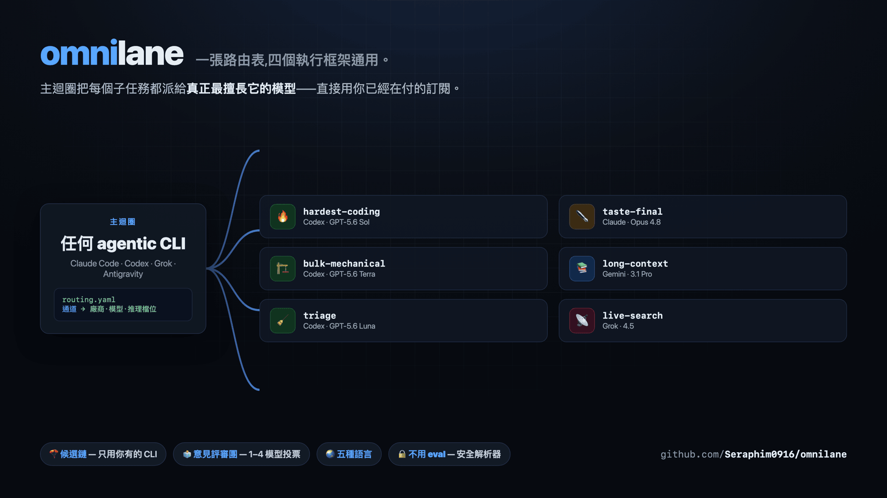
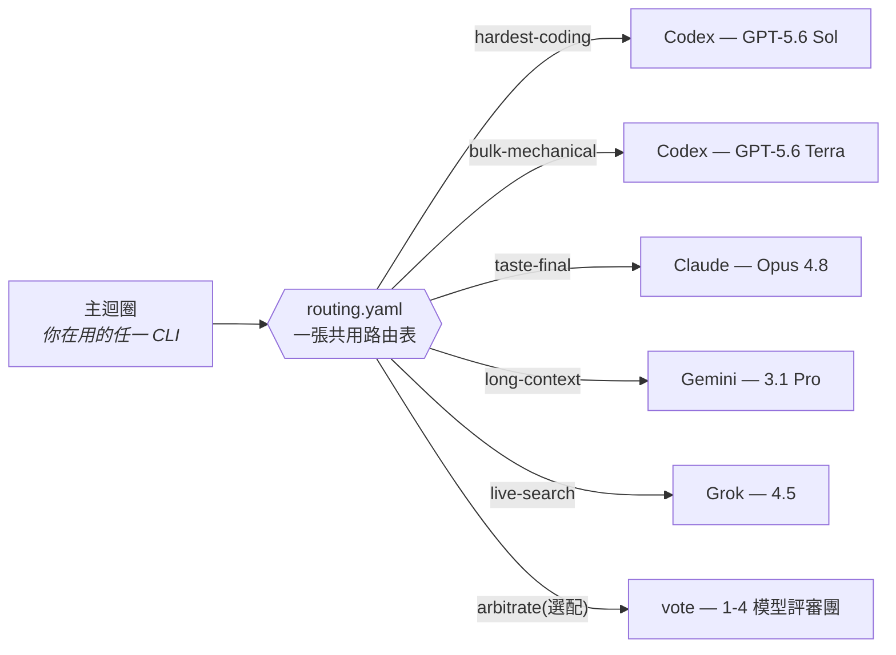

<div align="center">

# omnilane

### 一張路由表,四個執行框架通用。

*讓主迴圈不再猜要用哪個模型。*<br/>
每個子任務都派給真正最擅長它的模型——橫跨<br/>
**Claude Code · Codex · Grok Build · Antigravity**,直接用你已經在付的訂閱。



[](https://github.com/Seraphim0916/omnilane/actions/workflows/ci.yml)
[](LICENSE)
[](https://github.com/Seraphim0916/omnilane/tags)

[English](README.md) · **繁體中文** · [简体中文](README.zh-CN.md) · [日本語](README.ja.md) · [한국어](README.ko.md)

</div>

---

## v0.5.1 新功能

- **在非 Git 目錄使用 Codex work** — 一般資料夾仍完整支援；Omnilane 不要求、
  也絕不會自動執行 `git init`。
- **乾淨停止非 Git 卡死** — 未設定整體上限時，解析後的單次看門狗會自動成為
  程序群組保險絲，同時保留手動 timeout 的優先序與退出碼語意。
- **讓版本顯示可信** — `VERSION` 現在統一供應 `omnilane --version` 與兩份
  plugin manifest，CI 會檢查變更紀錄和五語 README 是否一致。

## ⚡ 60 秒上手

```bash
git clone https://github.com/Seraphim0916/omnilane && cd omnilane
./install.sh          # 偵測你的 CLI、接好技能、說你的語言
omnilane route hardest-coding "修掉會間歇失敗的 auth token 更新測試"
omnilane ui start     # 選配:在瀏覽器即時看派工
```

## 🧭 運作方式

omnilane 讓**任何**一個 agentic CLI 的主迴圈把子任務分類到通道(lane),
再以無頭方式把每條通道派工給該項工作最強的廠商 CLI,直接沿用你既有的訂閱登入:



- **`routing.yaml`** — 通道 → 廠商+模型+推理檔位。一個檔案,四個執行框架共用。
- **候選鏈** — 一條通道可以列多個候選(`codex … | claude … | off`),
  派工時自動採用本機**實際裝了**的第一個廠商 CLI。只訂一、兩家也能用同一張表。
- **`scripts/dispatch.sh [--vendor V] <通道> "<任務>"`** — 查表後以無頭方式
  呼叫對應廠商的 CLI。`--vendor` 會鎖定點名廠商，不做降級。
- **`skills/omnilane/SKILL.md`** — 一份技能四個框架都能載入:
  先認出自己是哪個模型,自己通道的活自己做,其餘派出去。

<div align="center">

| | | |
|:---:|:---:|:---:|
| 🧭 **一張表**<br/>四個執行框架共用 | 🪂 **候選鏈**<br/>自動降級到你有裝的 CLI | 🗳️ **意見評審團**<br/>重大決定多模型投票 |
| 🔒 **安全機制**<br/>排隊鎖 · 看門狗 · 禁巢狀 | 🌏 **五種語言**<br/>安裝器說你的母語 | ↩️ **完全可逆**<br/>`--uninstall` 一鍵還原 |

</div>

## 🛤️ 通道一覽(預設值;實際生效值跑 `scripts/dispatch.sh --list` 看)

| 通道 | 首選模型 | 備選模型 | 用途 |
|---|---|---|---|
| 🔥 hardest-coding | GPT-5.6 Sol (xhigh) | Claude Opus 4.8 (high) | 最難的實作、深度除錯、正確性攸關的修改 |
| 🏗️ bulk-mechanical | GPT-5.6 Terra (max) | Claude Sonnet 5 (high) | 重構、搬遷、測試、大面積掃描——機械耐力活 |
| 🧹 triage | GPT-5.6 Luna (medium) | Gemini 3.5 Flash (Low) | 高量初篩、第一輪過濾 |
| ⚖️ hard-judgment | GPT-5.6 Sol (max) | Claude Opus 4.8 (high) | 架構仲裁、深度推理、第二意見 |
| ✒️ taste-final | Claude Opus 4.8 (high) | GPT-5.6 Sol (max) | 對外文字、prompt 與文件打磨、風格終審 |
| 💬 consult | 明確點名的廠商/模型 | —(不降級) | 自然語言直接諮詢;必須保留 `--vendor` |
| 🎨 ui-draft | GPT-5.6 Sol (xhigh) | Claude Opus 4.8 (high) | 有設計規範/參考圖時的 UI 出稿;開放式視覺品味交給 taste-final |
| 📚 long-context | Gemini 3.1 Pro (High) | Claude Opus 4.8 (high) | 百萬 token 長文整合——僅限分析,不派 agentic 長鏈 |
| ⚡ fast-agentic | Gemini 3.5 Flash (High) | GPT-5.6 Luna (high) | 快速多步驟 agentic 迴圈、多模態檢查 |
| 📡 live-search | Grok 4.5 | —(off) | 即時 X/網路搜尋與社群脈絡 |
| 🚰 coding-overflow | Grok 4.5 | —(off) | Codex 額度吃緊時的中量級編碼溢流道;事實性宣稱須另行查證 |
| 🗳️ arbitrate | off(選配評審團) | — | 內建意見評審團,重大決定用——預設關閉,要用在 `routing.local.yaml` 開;每評審每輪燒一次額度 |

**備選模型**是候選鏈的下一位——首選那家的廠商 CLI 沒裝時,派工就降到它。

> **Claude Fable 5 去哪了?** 預設表刻意不放:Claude 頂級檔通常就是*主迴圈本人*,
> 不是被派發的工人,而且定價高於 Opus。設定選單的模型清單有列它——
> 不同意就自己路由過去(例如在 `routing.local.yaml` 寫
> `taste-final: claude claude-fable-5 high`)。

### 自然語言諮詢

透過 `omnilane` 技能或 `/route`,你可以直接說: **「請 Opus 挑戰這個架構。」**
自然語言是由 Agent Skill 判讀,不是在 `dispatch.sh` 裡做自由文字 shell 解析。

- 只問「哪個模型適合」時,回答相符通道目前第一個可用模型,不發出模型呼叫。
- 只點廠商名時,使用該廠商在 `consult` 通道裡設定的候選模型。
- 點標準模型別名(例如 Opus)時,會鎖定技能表裡的確切模型家族。明確目標
  不存在或 CLI 不可用時會清楚失敗,不會暗中換廠商或模型家族。

<details>
<summary><b>👉 哪些通道你自己跑?選你的主控模型</b></summary>

<br/>

上面那張表跟廠商無關——一條通道的*最佳*模型不會因為誰在主控而改變。會變的是
你哪些通道**自己做**(你本來就是那個模型,省一次呼叫)、哪些**派出去**。你 CLI 裡
的 `omnilane` 技能會自動套對的那一列,這裡是給人看的版本。

- **Claude Code · Fable 5** — 自己做:hard-judgment、taste-final、最吃正確性的硬修。派出去:機械編碼量 → Codex、長文 → Gemini、即時搜尋 → Grok。
- **Claude Code · Opus 4.8** — 自己做:taste-final。hard-judgment 派給 Codex Sol(智力分高於 Opus)、所有編碼走 Codex 通道、長文 → Gemini、即時搜尋 → Grok。
- **Codex · Sol** — 自己做:hardest-coding、hard-judgment、ui-draft。派出去:taste-final → Claude、長文 → Gemini、即時搜尋 → Grok、粗活 → Codex Terra。
- **Codex · Terra** — 自己做:bulk-mechanical。真正最硬的往上升給 Sol;taste → Claude、長文 → Gemini、即時搜尋 → Grok。
- **Grok Build · Grok 4.5** — 自己做:live-search、coding-overflow(中量級編碼)。所有硬活派給 Codex/Claude/Gemini——先驗每個 API 簽章與引用事實。
- **Antigravity · Gemini** — 自己做:long-context(3.1 Pro)、fast-agentic(Flash)。編碼/判斷/文字派給 Codex/Claude;即時搜尋 → Grok。3.1 Pro 絕不接 agentic 工具長鏈。

</details>

## 🖥️ Live Board

每一次派工——不論前景或 `--background`——都是落盤的一筆 job。Live Board
是架在這個 job 儲存上、選配且唯讀的本機工作台:每個模型被問了什麼、答了
什麼、怎麼路由、是否還在執行,一眼看完。

<div align="center">


</div>

```bash
omnilane ui start    # 啟動或沿用伺服器，印出通過驗證的網址
omnilane ui status   # 查看本機伺服器狀態
omnilane ui url      # 印出目前通過驗證的網址
omnilane ui stop     # 正常停止
```

桌機版的工作清單與詳細內容可各自捲動;手機版使用清單／詳細內容切換，支援返回
鍵與 Esc。伺服器傳送事件(SSE)會即時更新，又不會重建目前聚焦的工作列;短暫
斷線時保留最後畫面並自動重連。服務只綁 `127.0.0.1`、用隨機 token 保護、
全程唯讀。畫面只顯示 `task.txt` 與公開的 `out.txt`，不顯示工作端或廠商原始 log。

核心路由不需要 Python;只有這個介面需要 Python 3.9 以上。

## 📦 安裝

前置需求:想路由到的廠商 CLI(`codex`、`claude`、`grok`、`agy`)已登入且在
`PATH` 上——**有幾家裝幾家就好**,缺的通道會自動降級。

最快:`./install.sh` — 自動偵測本機的 CLI、接好技能、列出其餘的外掛安裝指令、
印出這台機器的生效路由表,最後問你要不要進入互動設定選單(`--uninstall` 可逆)。
安裝介面依系統語言自動切換(英/繁中/簡中/日/韓,可用 `OMNILANE_LANG=zh-TW`
強制)。另提供選配的各 CLI **常駐路由提示**:在各 CLI 指令檔尾端加一段有
標記、可逆的區塊(`~/.claude/CLAUDE.md`、`~/.codex/AGENTS.md`、
`~/.grok/Agents.md`、`~/.gemini/GEMINI.md`——路徑可能隨 CLI 版本不同),
讓主迴圈記得查路由表;非互動安裝可帶 `OMNILANE_HOOKS=all|none|claude,codex`。
手動接線:

- **Claude Code**:以外掛安裝(附 `/route`、`/route-jobs` 指令),
  或把 `skills/omnilane` 放進 `~/.claude/skills/`。
- **Codex**:把 `skills/omnilane` 放進或連結到 `~/.codex/skills/`。
- **Grok Build**:`grok plugin install <本 repo 路徑> --trust`
- **Antigravity**:`agy plugin install <本 repo 路徑>`(先用
  `agy plugin validate` 檢查)

## ⚙️ 自訂設定

三層,全部選用:

1. **互動選單** — `scripts/configure.sh` 列出可設定的通道,讓你逐條選
   廠商 → 模型 → 推理檔位(有建議清單,也可自由輸入未來的新模型名),
   寫進 `~/.omnilane/routing.local.yaml`。多廠商 `consult` 會刻意略過,
   要改請手動編輯。`install.sh` 裝完會主動問要不要跑。
2. **`~/.omnilane/routing.local.yaml`** — 手改覆寫檔,格式同 `routing.yaml`,
   本機優先。參考 `routing.local.yaml.example`。
3. **`~/.omnilane/local.sh`** — 機器專屬的執行檔路徑、proxy、認證包裝;
   每個執行器都會載入,永不進版控。參考 `local.sh.example`。

隨時檢查結果:

```
scripts/dispatch.sh --list     # 生效表,標出候選鏈降級與關閉的通道
```

## 📖 指令參考

```
omnilane list | route … | jobs … | configure   # 全域指令,任何目錄都能用
                                               # (install.sh 會連結進 ~/.local/bin)
omnilane ui start                              # 啟動或沿用本機 Live UI,印出網址
omnilane ui status                             # 查看 Live UI 是否運作中
omnilane ui url                                # 印出目前通過驗證的本機網址
omnilane ui stop                               # 停止 Live UI
omnilane doctor [--json]                       # 唯讀檢查路由與本機執行環境
dispatch.sh [--background] [--mode advise|work] [--workdir 目錄]
            [--vendor V] [--model M] [--effort E] [--timeout SEC] [--job-timeout SEC]
            通道 "任務"                              # "-" 表示從 stdin 讀任務
dispatch.sh --list
dispatch.sh --explain 通道                          # 離線逐候選解釋路由決策
dispatch.sh --validate                              # 離線檢查生效路由，不呼叫模型
jobs.sh list | status 工作ID | result 工作ID
jobs.sh stats [--last N]                           # 本機成功率與路由彙整
jobs.sh prune [--keep N] [--apply]                # 預設只預覽；只清理已完成工作
configure.sh                                        # 互動通道選單
```

**重大決定可以開評審團,不是問一個人。**`arbitrate` 通道**預設關閉**——
評審團每評審每輪燒一次額度,所以做成選配。要用就在 `routing.local.yaml`
寫 `arbitrate: vote codex,claude,grok -`,或跑設定選單,從
codex/claude/grok/gemini 自選 1-4 個評審。開了之後,同一個問題丟給每個
評審,意見並排回來,由發問的主控模型當主席下裁決。檔位欄填 `2` 開辯論輪
——每個評審看完整個評審團的意見,只針對分歧互駁。進階使用者可用
`exec` 廠商換成自己的閘門:`arbitrate: exec /路徑/腳本 -`,腳本收
`MODE WORKDIR EFFORT PROMPT_FILE OUTPUT_FILE`、把裁決寫進 `OUTPUT_FILE`
(見 `scripts/runners/run-exec.sh`)。

退出碼:`2` 用法錯誤(包含廠商值不合法,或指定廠商不在該通道)、`3` 通道已關閉、
`4` 候選鏈沒有可用 CLI,或指定廠商已設定但其 CLI 不可用、
`5` 第一輪成功評審太少、`6` 第二輪沒有任何反駁成功、`86` 拒絕巢狀派工、
`87` 等鎖逾時、`124` 整體任務逾時;
其餘直接透傳工作端自己的退出碼。

## 🎭 模式

- **advise(預設)** — 唯讀工作端。Codex 跑唯讀沙箱;Claude 只給
  Read/Glob/Grep;Grok 跑 plan 模式。適合審查、提問、第二意見。
- **work** — 允許改檔案,僅限你指定的 `--workdir`。Codex 給
  workspace-write 沙箱;Claude 自動接受編輯;Gemini 跑 accept-edits 模式。

## 🔒 內建安全機制

- **禁止巢狀派工** — 工作端不得再往外派(`OMNILANE_DEPTH` 守衛,退出碼 86),
  杜絕 AI 叫 AI 的額度連環燒。
- **Codex 排隊鎖** — 同一目標目錄的 codex 派工自動序列化(鎖以正規化後的
  workdir 為鍵);崩潰殘留的鎖以擁有者 PID 偵測後安全接管。
- **看門狗** — 每個工作端跑在 `timeout`/`gtimeout` 之下,兩者皆無時退到
  perl-alarm 後備(原生 macOS 就是這情況),卡死的 CLI 不會掛整晚。
  上限作用於**每次 CLI 呼叫**,優先序由高到低:`--timeout SECONDS` > 單一通道
  `OMNILANE_TIMEOUT_<LANE>`(通道名大寫、`-` 換成 `_`,如
  `OMNILANE_TIMEOUT_HARD_JUDGMENT`) > 全域 `OMNILANE_TIMEOUT`(預設 600 秒)。
  它是單次呼叫的防卡死看門狗,不是整個任務的時間預算:會重試的 vendor(grok)
  或 vote 面板(評審 × 輪次)會發起多次呼叫,總耗時可能是該值的數倍。
- **整體任務保險絲** — 選配的 `--job-timeout SECONDS` 用同一個程序群組監工,
  一次涵蓋等鎖、重試、所有評審與輪次。優先序為旗標 >
  `OMNILANE_JOB_TIMEOUT_<LANE>` > `OMNILANE_JOB_TIMEOUT` > 關閉；唯一的自動例外
  是 Codex 在 Git worktree 外執行 `work` 時，若未設定整體上限，就沿用解析後的
  單次呼叫看門狗作為整體保險絲，上限為監工支援的 999999999 秒。到期會清掉
  受監工的程序群組並回傳 124。這個自動保險絲需要內附的 Perl 監工；若環境
  無法使用，派工會警告但仍透過原有單次呼叫看門狗路徑執行非 Git 工作；若連
  單次看門狗工具都沒有，該路徑會另外警告。
  像 fubon-autotrade 規模的完整深度審查,建議先從
  2–4 小時(7200–14400 秒)起跳,單次呼叫看門狗可先設 30 分鐘;這只是建議值,
  不會寫死成預設。
- **背景工作生命週期** — `--background` 的工作端跑在自己的 process group,
  呼叫端退出也不受影響;被殺會落盤退出碼,`jobs.sh status` 會報 `dead`
  而不是永遠顯示 `running`。
- **任務酬載上限** — 過大的任務文字自動頭尾截斷,防止撐爆工作端脈絡。

## 📊 預設值與資料來源

預設通道配置依據 Artificial Analysis 2026-07 快照(已對 AA 站上原始紀錄與
各廠官方定價頁交叉核對)加上公開對比評測;這些是意見不是定律——
設定選單和 `routing.local.yaml` 就是讓你不同意用的。

## ⚠️ 已知限制

- **Antigravity 的 print 模式工具呼叫在現行 CLI 版本不穩定**(可能被拒或
  回無效引數)。long-context 通道的設計本來就是「把內容貼進任務」的長文
  整合,不受影響;要*讀取 repo* 的諮詢請用 claude/codex 候選。
- **Grok 沒有推理檔位開關**;effort 欄位僅為介面一致而保留,實際忽略。
- **非 Git 的 Codex work 仍受支援。** 部分 Codex CLI 版本可能在 Git worktree
  外卡住，因此上面的自動保險絲會限制這個情境並清掉受監工的程序群組。Omnilane
  不會自動執行 `git init`，也不要求使用者建立 repo。

## 🌱 狀態

v0.5.1 讓 Codex `work` 在非 Git 目錄仍可使用，同時以程序群組清理限制卡死，
並同步所有公開版本來源。它延續 v0.5.0 對安裝器、派工生命週期、job 儲存、
整體截止時間、診斷與發布 CI 的強化。Grok/Antigravity 指令殼行為仍可能隨
CLI 版本變動。歡迎回報 issue 與 PR。

專案文件：[貢獻指南](CONTRIBUTING.md) · [安全政策](SECURITY.md) ·
[變更紀錄](CHANGELOG.md)
