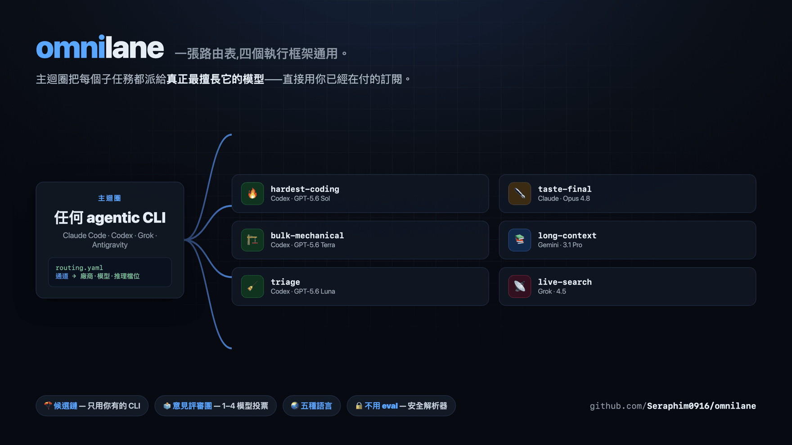
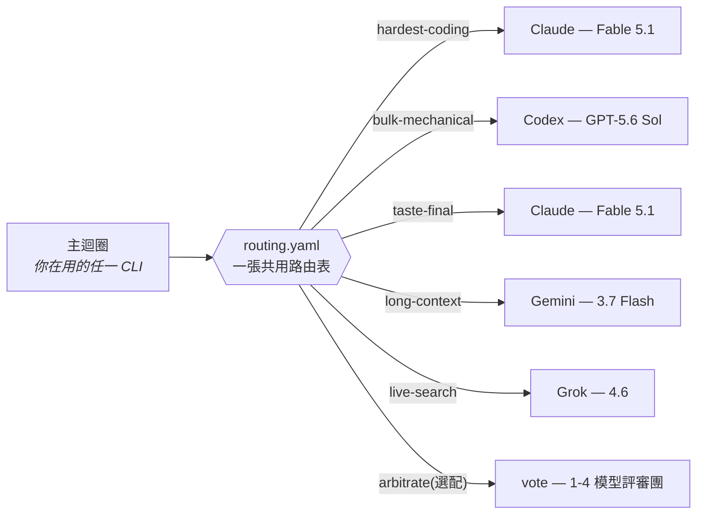

<div align="center">

# omnilane

### 一張路由表,四個執行框架通用。

*讓主迴圈不再猜要用哪個模型。*<br/>
從 **Claude Code · Codex · Grok Build · Antigravity** 任一框架開車,每個子任務都派給<br/>
真正最擅長它的模型——Codex、Claude、Grok、Gemini、Kimi、Qwen、OpenCode,<br/>
或經 OpenRouter 直達任何託管模型——用你已經在付的訂閱,或一把 API 金鑰。



[](https://github.com/Seraphim0916/omnilane/actions/workflows/ci.yml)
[](LICENSE)
[](https://github.com/Seraphim0916/omnilane/tags)

[English](README.md) · **繁體中文** · [简体中文](README.zh-CN.md) · [日本語](README.ja.md) · [한국어](README.ko.md)

</div>

---

## 🤔 omnilane 是什麼?

**問題在哪。** 你已經在用某個 AI 寫程式助手——**Claude Code、Codex、Cursor、
Gemini CLI** 之類。每一個都只接一個模型家族,所以你交代的每件事都跑在那同一個
模型上,不管它適不適合:隨手改個檔名燒掉最貴的模型,真正難的架構問題卻剛好落在
你當下開著的那個。

**omnilane 做什麼。** 它給你的助手一張路由表。工作被分進**通道**——最難的實作、
機械粗活、初篩、硬判斷、文字終審——每條通道指名對那件事最強(也最省)的模型。
助手依通道解析目標模型，再委派給能力相符的原生子代理或既有 CLI；同模型也仍須派工。

**它不是什麼。** 不是 proxy、不是另一筆訂閱、不是又一個要顧的服務。它就是一張表
加一支派工腳本,躲在你現有工具背後跑。`./install.sh --uninstall` 可完全清除。

**你不需要每一家訂閱。** 每條通道都是候選鏈,派工時自動採用本機實際裝了的第一個
候選。裝一家或七家都行,整條鏈都沒有的通道就自動關閉,而不是報錯。只有一份訂閱
時,整張預設表會收斂到那一家。

**[⬇ 直接跳到 60 秒上手](#-60-秒上手)** · **[❓ 看常見問題](#-常見問題)**

## ⚡ 60 秒上手

**最快的方式——用 npm 裝:**

```bash
npm i -g omnilane                                    # 裝 CLI
export OMNILANE_AA_OPERATOR_ASSERTED_HUMAN=1         # 你是操作者本人,不是模型
omnilane route hardest-coding "修掉會間歇失敗的 auth token 更新測試"
omnilane doctor                                      # 看你手上有哪些 AI CLI / 金鑰
omnilane ui start                                    # 選配:在瀏覽器即時看派工
```

**或 clone 整包**(拿到路由表與可自訂的技能):

```bash
git clone https://github.com/Seraphim0916/omnilane && cd omnilane
./install.sh          # 偵測你的 CLI、接好技能、說你的語言
export OMNILANE_AA_OPERATOR_ASSERTED_HUMAN=1         # 你是操作者本人,不是模型
omnilane route hardest-coding "修掉會間歇失敗的 auth token 更新測試"
```

> **那個 export 是做什麼的?** omnilane 會用呼叫者自己的能力分數來把關每一次派工,
> 所以派工必須表明「是誰在問」。人類在終端機前只要設一次
> `OMNILANE_AA_OPERATOR_ASSERTED_HUMAN=1`,或每次帶 `--operator-asserted-human`。
> 模型驅動 omnilane 時**不能替自己主張**這個旗標。它的身分會從啟動它的 CLI 旗標
> (模型與強度)自動讀取,一般 session 什麼都不用帶;`omnilane whoami` 會把這個身分
> 印成 `--caller-context FILE`。既沒主張、又讀不到身分的話,派工會在建立工作前就被
> `missing-caller-context` 拒絕。

> 第一次用?先跑 `omnilane doctor`——它會告訴你 omnilane 現在能接到哪些模型 CLI 與
> API 金鑰,你就知道實際會跑什麼。

## 🧭 運作方式

omnilane 讓**任何**一個 agentic CLI 的主迴圈把子任務分類到通道(lane),
再以無頭方式把每條通道派工給該項工作最強的廠商——直接沿用你既有的訂閱登入
(`openrouter` vendor 例外:免裝任何 CLI,一把 API 金鑰直連):


```mermaid
flowchart LR
    M["主迴圈<br/><i>你在用的任一 CLI</i>"] --> T{{"routing.yaml<br/>一張共用路由表"}}
    T -->|hardest-coding| C1["Claude — Fable 5.1"]
    T -->|bulk-mechanical| C2["Codex — GPT-5.6 Sol"]
    T -->|taste-final| C3["Claude — Fable 5.1"]
    T -->|long-context| C4["Gemini — 3.7 Flash"]
    T -->|live-search| C5["Grok — 4.6"]
    T -->|"arbitrate(選配)"| C6["vote — 1-4 模型評審團"]
```

- **`routing.yaml`** — 通道 → 廠商+模型+推理檔位。一個檔案,四個執行框架共用。
- **候選鏈** — 一條通道可以列多個候選(`codex … | claude … | off`),
  派工時自動採用本機**實際裝了**的第一個廠商 CLI。只訂一、兩家也能用同一張表。
- **`scripts/dispatch.sh [--vendor V] <通道> "<任務>"`** — 查表後以無頭方式
  呼叫對應廠商的 CLI。`--vendor` 會鎖定點名廠商，不做降級。
- **`skills/omnilane/SKILL.md`** — 一份技能四個框架都能載入:
  先解析通道的目標模型，再透過相符的原生子代理或 CLI 派工。
- **`omnilane mcp`** — 同一套路由改以 MCP stdio server 提供,
  給走 MCP 而非 skill 整合的宿主。

<div align="center">

| | | |
|:---:|:---:|:---:|
| 🧭 **一張表**<br/>四個執行框架共用 | 🪂 **候選鏈**<br/>自動降級到你有裝的 CLI | 🗳️ **意見評審團**<br/>重大決定多模型投票 |
| 🔒 **安全機制**<br/>排隊鎖 · 看門狗 · 禁巢狀 | 🌏 **五種語言**<br/>安裝器說你的母語 | ↩️ **完全可逆**<br/>`--uninstall` 一鍵還原 |

</div>

## 🛤️ 通道一覽(預設值;實際生效值跑 `scripts/dispatch.sh --list` 看)

| 通道 | 首選模型 | 備選模型 | 用途 |
|---|---|---|---|
| 🔥 hardest-coding | Claude Fable 5.1（max） | GPT-6 Astra（xhigh）→ Grok 4.6 → Gemini 3.8 Flash（High） | 最難的實作、深度除錯、正確性攸關的修改 |
| 🏗️ bulk-mechanical | GPT-5.6 Sol（high） | Gemini 3.8 Flash（High）→ Claude Sonnet 5（high） | 重構、搬遷、測試、大面積掃描等耐力工作 |
| 🧹 triage | GPT-5.6 Luna（high） | Gemini 3.8 Flash（Low）→ Claude Haiku 4.5 | 大量掃描、第一輪篩選 |
| ⚖️ hard-judgment | Claude Fable 5.1（xhigh） | GPT-6 Astra（xhigh）→ Grok 4.6 | 架構裁決、深度推理、第二意見 |
| ✒️ taste-final | Claude Fable 5.1（xhigh） | GPT-6 Astra（xhigh）→ Grok 4.6 → Gemini 3.8 Flash（High） | 對外文字與風格裁決；評測不等於審美證明 |
| 💬 consult | GPT-6 Astra（xhigh） | Claude Fable 5.1（xhigh）→ Grok 4.6 → Gemini 3.8 Flash（Medium） | 直接點名模型諮詢；保留 `--vendor` 避免降級 |
| 🎨 ui-draft | GPT-5.6 Sol（high） | Claude Fable 5.1（xhigh）→ Gemini 3.8 Flash（High） | 只有附設計系統／參考圖時做 UI 草稿；不把評測誇大成審美證明 |
| 📚 long-context | Gemini 3.8 Flash（Medium） | GPT-5.6 Terra（max）→ Claude Opus 5（medium） | 長文件整合；上下文容量本身不證明任務品質 |
| ⚡ fast-agentic | Gemini 3.8 Flash（Low） | GPT-5.6 Luna（high）→ Claude Haiku 4.5 | 高速多步驟工具迴圈、多模態檢查 |
| 📡 live-search | Grok 4.6 | Gemini 3.8 Flash（High）→ Claude Sonnet 5（high） | 即時 X／網頁搜尋；備援只有一般網搜，不等同 X 脈絡 |
| 🚰 coding-overflow | Grok 4.6 | Gemini 3.8 Flash（High）→ Kimi K3 → Qwen3 Coder Plus → OpenCode | 顯式 Codex 額度卸載；供應商失敗後不自動跨家重試 |
| 🗳️ arbitrate | `off`（選配模型評審團） | — | 重大決定的內建意見評審團；預設停用，在 `routing.local.yaml` 啟用，每位評審每輪一次呼叫 |

**備選模型**是候選鏈的下一位——首選那家的廠商 CLI 沒裝時,派工就降到它。每條
通道都是這樣一條鏈;整條都沒裝時,通道自動降為 `off`。

> **Fable 5.1 與 Astra 現在領頭困難工作。** 同條件證據見[常見問題](#-常見問題)。

### 自然語言諮詢

透過 `omnilane` 技能或 `/route`,你可以直接說: **「請 Opus 挑戰這個架構。」**
自然語言是由 Agent Skill 判讀,不是在 `dispatch.sh` 裡做自由文字 shell 解析。

- 只問「哪個模型適合」時,回答相符通道目前第一個可用模型,不發出模型呼叫。
- 只點廠商名時,使用該廠商在 `consult` 通道裡設定的候選模型。
- 點標準模型別名(例如 Opus)時,會鎖定技能表裡的確切模型家族。明確目標
  不存在或 CLI 不可用時會清楚失敗,不會暗中換廠商或模型家族。

## 原生優先派工，保留終端相容性

模型路由與執行器（executor）分開判定。`--executor auto` 是預設：只有呼叫端明示的
結構化能力全部相符，才選原生子代理（native agent）；一般終端沒有能力脈絡，
就保留既有 CLI。`--executor cli` 強制原流程；`--executor native` 遇到能力缺漏或不符就報錯。
同廠商不代表同模型；明確指定的廠商、模型及推理強度都保留。原生不符時，
自動模式會說明 CLI 原因，只使用同一個已解析目標，不換廠商或模型。

```sh
# 一般終端的預覽：不建立工作，也不呼叫供應商。
omnilane route --executor auto --dry-run hardest-coding "檢查這次變更"

# 呼叫端依工具契約準備共享繼承能力 JSON；完整格式見下方文件。
omnilane route --executor native --native-context /absolute/capability.json --workdir /absolute/repo hardest-coding "檢查這次變更"
# 接著由呼叫端啟動原生代理、等待結果，再登錄真實證據。
omnilane jobs --json complete-native JOB_ID /absolute/completion.json
omnilane jobs --json status JOB_ID
omnilane jobs --json result JOB_ID
omnilane jobs --json list --status pending
```

原生路由輸出的是「等待執行」交接 JSON，不會從 shell 啟動原生代理，也不代表任務成功。
Codex `collaboration.spawn_agent` 沒有沙箱、工具或工作目錄限制參數，會繼承父代理的工具與檔案系統權限。要求與同一能力列都必須明示 `shared-inherited`，工具陣列留空；`advise`／`work` 與工作目錄只是任務意圖，不是作業系統隔離。要求硬隔離時，自動模式保留同模型 CLI，強制原生則失敗。

呼叫端以精確模型與推理強度啟動工作，最後登錄實際代理 ID、模型／推理強度／廠商／框架／後端、成敗、公開結果與證據。明示模型覆寫時使用 `fork_turns: "none"` 或有限的正整數歷史，不得搭配 `fork_turns: "all"`。路由已明示選中能力列中的精確模型時，可省略未知的呼叫端目前模型。重複登錄會被擋下；原生取消只改工作狀態，不發程序訊號，已啟動的代理由呼叫端另外停止。

背景、持久、即時、具名 CLI 工作階段、sysops、不支援的隔離、投票／仲裁及多輪路徑
仍走 CLI。原生只整合清單、狀態、結果、取消與完成登錄，未接 CLI 等待、重試、
信箱或目標迴圈。原生協定需要 Python 3.9+；一般終端 CLI 保留相容。
測試替身不等於真實原生驗收；主機 AGENTS 管理區塊只由父代理審查後同步。
詳見[能力與完成格式、完整範例及限制](docs/native-executor.md)。

<details>
<summary><b>模型角色指引：仍須派工</b></summary>

<br/>

通道的最佳模型不因主控是誰而改變。以下是角色指引，不是親自執行的豁免：
即使模型相同，也要委派給子代理。呼叫端明示模型、推理強度、任務模式與工作目錄，
並以空工具陣列及 `shared-inherited` 隔離和生命週期能力同列相符時，才採原生代理；否則走 CLI。
主控負責編排與驗收，工作代理執行任務且不得再派工。

- **Claude Code · Fable 5.1**——品質敏感工作建議的提示詞層主控；這是角色，不是新通道或自動選模器。最難編碼用 max，判斷／文字用 xhigh；獨立 Codex 複核用 Astra，bulk 用 Sol，長文／高速工作用 Gemini 3.8 Flash，即時搜尋用 Grok。
- **Claude Code · Opus 5**——顯式點名時可做均衡型提示詞層主控與獨立複核（一般用 `high`，更深複核可選 `xhigh`），也保留為 long-context 備援；這是選配角色，不是新通道或 hard-judgment 預設。
- **Codex · Sol**——bulk-mechanical 與有參考限制的 ui-draft 委派並使用 high；最難編碼／判斷升級 Fable 或 Astra，長文／高速工作交 Gemini 3.8 Flash，即時搜尋交 Grok。
- **Codex · Astra**——提示詞層主控備位與獨立複核者；最難編碼／判斷與 consult／taste 預設用 xhigh，需要時可明確指定 `--vendor codex --effort max`；顯式 model／effort 永遠優先。
- **Codex · Terra**——用 max 接 Codex 的 long-context 備援；bulk 留給 Sol high，困難工作升級 Fable／Astra。
- **Grok Build · Grok 4.6**——委派 live-search、coding-overflow，並兼任 hardest-coding、hard-judgment、taste-final 的備援。首選人手在的話，最難的編碼／判斷／文字交給 Codex、Claude、Gemini；仍要驗證 API 簽章與引用事實。
- **Antigravity · Gemini 3.8 Flash**——long-context 用 Medium，fast-agentic／triage 用 Low，bulk／overflow／網搜備援用 High。不要把代理／編碼評測推論成審美或主控權。

</details>

## 🖥️ Live Board

每一次派工——不論前景或 `--background`——都是落盤的一筆 job。Live Board
是架在這個 job 儲存上、選配且唯讀的本機工作台:每個模型被問了什麼、答了
什麼、怎麼路由、是否還在執行,一眼看完。

<div align="center">


</div>

```bash
omnilane ui start    # 啟動或沿用伺服器，印出通過驗證的網址
omnilane ui status   # 查看本機伺服器狀態
omnilane ui url      # 印出目前通過驗證的網址
omnilane ui stop     # 正常停止
```

桌機版的工作清單與詳細內容可各自捲動;手機版使用清單／詳細內容切換，支援返回
鍵與 Esc。伺服器傳送事件(SSE)會即時更新，又不會重建目前聚焦的工作列;短暫
斷線時保留最後畫面並自動重連。可把任何已載入的工作釘成參考，再選另一筆工作，
並排比較模型路徑與公開結果;參考快照只留在瀏覽器記憶體，關頁即消失。服務只綁
`127.0.0.1`、用隨機 token 保護、全程唯讀。畫面只顯示 `task.txt` 與公開的
`out.txt`，不顯示工作端或廠商原始 log。

搜尋與狀態篩選會套用到最近保留的 50 筆工作歷史。按「匯出目前結果」只會把畫面上
目前可見的公開中繼資料下載成 JSON；不含 token、任務本文、結果本文、工作目錄與原始 log。

畫面提供英文、日文、韓文、繁體中文與簡體中文。首次載入依瀏覽器語言決定，可用標題列
的切換器覆寫，選擇會記在本機。

核心路由不需要 Python;只有這個介面需要 Python 3.9 以上。

## 📦 安裝

前置需求:想路由到的廠商 CLI(`codex`、`claude`、`grok`、`agy`,另可選
`kimi`、`qwen`、`opencode`)已登入且在 `PATH` 上——**有幾家裝幾家就好**,
缺的通道會自動降級。`openrouter` vendor 是例外:不需要任何 CLI,只要
`curl` 和環境變數裡的 `OPENROUTER_API_KEY`。

最快:`./install.sh` — 自動偵測本機的 CLI、接好技能、列出其餘的外掛安裝指令、
印出這台機器的生效路由表,最後問你要不要進入互動設定選單(`--uninstall` 可逆)。
安裝介面依系統語言自動切換(英/繁中/簡中/日/韓,可用 `OMNILANE_LANG=zh-TW`
強制)。另提供選配的各 CLI **常駐路由提示**:在各 CLI 指令檔尾端加一段有
標記、可逆的區塊(`~/.claude/CLAUDE.md`、`~/.codex/AGENTS.md`、
`~/.grok/Agents.md`、`~/.gemini/GEMINI.md`——路徑可能隨 CLI 版本不同),
讓主迴圈記得查路由表;非互動安裝可帶 `OMNILANE_HOOKS=all|none|claude,codex`。
`./install.sh --check` 可唯讀檢查漂移；安裝或 `--uninstall` 加上
`--dry-run`，可先預覽每個由這份 checkout 擁有的檔案動作。
手動接線:

要回滾安裝器擁有的連結與標記提示，執行 `./install.sh --uninstall`。

- **Claude Code**:以外掛安裝(附 `/route`、`/route-jobs` 指令,並內建
  `SessionStart` hook,開場自動注入路由提醒,不必修改 CLAUDE.md),
  或把 `skills/omnilane` 放進 `~/.claude/skills/`。
- **Codex**:把 `skills/omnilane` 放進或連結到 `~/.codex/skills/`。
- **Grok Build**:`grok plugin install <本 repo 路徑> --trust`
- **Antigravity**:`agy plugin install <本 repo 路徑>`(先用
  `agy plugin validate` 檢查)

### MCP server

`omnilane mcp` 會啟動零依賴、跑在本機的 MCP stdio server,讓任何支援 MCP
的宿主不必安裝 skill、也不用加路由提醒,就能發現並呼叫 omnilane。在宿主
設定裡指向已安裝的 CLI 即可:

```json
{
  "mcpServers": {
    "omnilane": {
      "command": "omnilane",
      "args": ["mcp"]
    }
  }
}
```

Server 提供 `route`,以及一組唯讀查詢工具:`list_lanes`、`explain`、`validate`、`dry_run`、`jobs_list`、`jobs_status`、`jobs_result`、`jobs_stats`、`jobs_recommend`、`jobs_audit`、`doctor`,以及必須明確選用的 `provider_probe`。
`route` 預設唯讀 `advise` 模式;選 `work` 的呼叫必須同時提供明確的
`workdir`。

唯一的執行需求是 Node.js(不裝任何 npm 套件);也可以直接
`npm install -g omnilane`,CLI 連同 MCP server 一起裝好。

## ⚙️ 自訂設定

三層,全部選用:

1. **互動選單** — `scripts/configure.sh` 列出可設定的通道,讓你逐條選
   廠商 → 模型 → 推理檔位(有建議清單,也可自由輸入未來的新模型名),
   寫進 `~/.omnilane/routing.local.yaml`。多廠商 `consult` 會刻意略過,
   要改請手動編輯。`install.sh` 裝完會主動問要不要跑。
2. **`~/.omnilane/routing.local.yaml`** — 手改覆寫檔,格式同 `routing.yaml`,
   本機優先。參考 `routing.local.yaml.example`。
3. **`~/.omnilane/local.sh`** — 機器專屬的執行檔路徑、proxy、認證包裝;
   每個執行器都會載入,永不進版控。參考 `local.sh.example`。

隨時檢查結果:

```
scripts/dispatch.sh --list     # 生效表,標出候選鏈降級與關閉的通道
```

## 📖 指令參考

```
omnilane list | route … | jobs … | configure   # 全域指令,任何目錄都能用
                                               # (install.sh 會連結進 ~/.local/bin)
eval "$(omnilane completion bash)"             # 在目前 Bash 啟用補全
source <(omnilane completion zsh)               # 在目前 Zsh 啟用補全
omnilane completion fish | source              # 在目前 Fish 啟用補全
omnilane ui start                              # 啟動或沿用本機 Live UI,印出網址
omnilane ui status                             # 查看 Live UI 是否運作中
omnilane ui url                                # 印出目前通過驗證的本機網址
omnilane ui stop                               # 停止 Live UI
omnilane doctor [--json] [--strict] [--probe V] [--probe-timeout SEC]  # 實際探測必須明確選用
omnilane benchmark [--json] [--run] [--vendor V] [--cost-per-call V=USD] # 預設只乾跑
dispatch.sh [--background] [--dry-run] [--thread NAME] [--mode advise|work|sysops] [--workdir 目錄]
            [--vendor V] [--model M] [--effort E] [--timeout SEC] [--job-timeout SEC]
            [--caller-context FILE | --operator-asserted-human]   # who is asking
            通道 "任務"                              # "-" 表示從 stdin 讀任務
dispatch.sh [--json] --list [--json]
dispatch.sh [--json] --explain 通道 [--json]       # 離線逐候選解釋路由決策
dispatch.sh [--json] --validate [--json]           # 離線檢查生效路由，不呼叫模型
jobs.sh [--json] {list | status 工作ID | result 工作ID} # JSON 結果只回中繼資料，不回本文
jobs.sh [--json] list [--lane L] [--vendor V] [--status running|done]  # 過濾清單
jobs.sh wait 工作ID [--timeout N]                  # 工作結束碼；124 逾時；125 工作者消失
jobs.sh cancel 工作ID                              # 停止執行中的工作:整組 SIGTERM,再 SIGKILL
jobs.sh rm 工作ID                                  # 刪除單一已完成/已死工作(執行中會被拒絕)
jobs.sh [--json] stats [--last N] [--lane L] [--vendor V]  # 本機成功率與路由彙整
jobs.sh [--json] recommend [--last N] [--lane L] [--min-samples N]  # 有證據門檻的廠商建議
jobs.sh audit [--last N] [--json]                  # 唯讀檢查工作完整性與隱私
jobs.sh prune [--keep N] [--apply]                # 預設只預覽；只清理已完成工作
omnilane mcp                                   # MCP stdio server(需 Node.js)
omnilane release-audit [--target 版本] [--json]     # 離線、唯讀的發布閘門
configure.sh                                        # 互動通道選單
configure.sh set|get|unset|list|diff LANE [SPEC]    # 非互動編輯/檢視 routing.local.yaml
```

`--thread NAME` 會在多次單次派工間延續命名的 Claude、Codex、Grok 或 Gemini
對話。0.33.0 會固定供應商、模型、effort 與實體工作目錄；可用
`jobs.sh threads`、`threads show NAME`、`threads rm NAME` 管理本機狀態，
移除狀態不會刪除供應商端工作階段。

`jobs recommend` 只讀取通過驗證的公開中繼資料與退出碼。候選達到最低樣本數後，
依成功率、樣本數、廠商名稱排序；預設至少三筆已完成工作。它不讀任務／結果本文，
也不修改路由。

`doctor --probe V` 只會做一次有逾時上限的 advise 模式供應商呼叫，回傳可用性、
選到的模型、耗時與回應位元組數，不回傳回答本文；未帶 `--probe` 時仍完全離線。
`benchmark` 使用 `benchmarks/workloads.tsv` 的固定題組，預設只解析路由、不呼叫供應商；
`--run` 才是實際呼叫閘門，成本總額也只依 `--cost-per-call` 明確提供的估值計算。

**重大決定可以開評審團,不是問一個人。**`arbitrate` 通道**預設關閉**——
評審團每評審每輪燒一次額度,所以做成選配。要用就在 `routing.local.yaml`
寫 `arbitrate: vote codex,claude,grok -`,或跑設定選單,從
codex/claude/grok/gemini 自選 1-4 個評審。開了之後,同一個問題丟給每個
評審,意見並排回來,由發問的主控模型當主席下裁決。檔位欄填 `2` 開辯論輪
——每個評審看完整個評審團的意見,只針對分歧互駁。進階使用者可用
`exec` 廠商換成自己的閘門:`arbitrate: exec /路徑/腳本 -`,腳本收
`MODE WORKDIR EFFORT PROMPT_FILE OUTPUT_FILE`、把裁決寫進 `OUTPUT_FILE`
(見 `scripts/runners/run-exec.sh`)。

退出碼:`2` 用法錯誤(包含廠商值不合法,或指定廠商不在該通道)、`3` 通道已關閉、
`4` 候選鏈沒有可用 CLI,或指定廠商已設定但其 CLI 不可用、
`5` 第一輪成功評審太少、`6` 第二輪沒有任何反駁成功、`86` 拒絕巢狀派工、
`87` 等鎖逾時、`124` 整體任務逾時;
其餘直接透傳工作端自己的退出碼。

## 🎭 模式

- **advise（預設）**：本機唯讀分析；供應商支援時可用原生網頁／搜尋工具。模型連線保留，修改工具受限；不同供應商的 X／網搜能力不視為等同。
- **work**：檔案與命令操作限制在明示的 `--workdir`，關閉代理工具對外連線，但保留模型連線。尚未支援的強制邊界會在呼叫模型前停止，不偷偷變成 sysops。
- **sysops**：每次派工明示選用，開放代理工具、檔案與網路存取；永遠不是通道預設值，任務須列明可執行操作。

CLI 省略 `--workdir` 時預設為呼叫端目前目錄；任務書仍應明示工作目錄。MCP `route`／`dry_run` 的 work 介面則另行要求明示 `workdir`。

Codex 與 Claude 的三種模式使用不同政策。Agy advise／sysops 使用獨立的每工作階段原生設定，不替換訂閱認證；Agy 1.1.27 work 已以四個經驗證工具及原生終端沙箱完成限定的新建／續接驗收：工作目錄內讀寫、修改、編譯及越界寫入拒絕通過。外部暫存／快取讀取也受限；每次啟動重寫明示設定，不宣稱設定全程不可變。另一次正式 work 即時／FIFO 兩輪驗收已通過前輪讀回、越界寫入拒絕及正常關閉，來源保持不變。Grok advise 使用原生工具允許／拒絕規則；Grok 1.0.13 的完整一次性 `plain` 路徑已驗證原生關鍵字搜尋、抓頁及寫入拒絕，使用內部網頁工具 ID 與每筆工作的 MCP 就緒狀態隔離，不關閉掛鉤。若 `CONTEXT_MODE_MCP_SENTINEL_DIR` 已設為非空值，會在呼叫模型前明確回報衝突，不覆寫原設定。原生子程序網路隔離僅支援 Linux，因此 macOS Grok work 仍保留閘門；Grok 即時模式仍須明示 sysops，此次 advise 結果不擴張到其他路徑。OpenRouter 維持僅 advise；其餘供應商不自動納入這份四供應商契約。證據範圍見[日期化執行驗收表](docs/model-capabilities-2026-09.md#f-mode-runtime-gate-2026-09-06)。

## 🔒 內建安全機制

- **禁止巢狀派工** — 工作端不得再往外派(`OMNILANE_DEPTH` 守衛,退出碼 86),
  杜絕 AI 叫 AI 的額度連環燒。
- **Codex 排隊鎖** — 同一目標目錄的 codex 派工自動序列化(鎖以正規化後的
  workdir 為鍵);崩潰殘留的鎖以擁有者 PID 偵測後安全接管。
- **看門狗** — 每個工作端跑在 `timeout`/`gtimeout` 之下,兩者皆無時退到
  perl-alarm 後備(原生 macOS 就是這情況),卡死的 CLI 不會掛整晚。
  上限作用於**每次 CLI 呼叫**,優先序由高到低:`--timeout SECONDS` > 單一通道
  `OMNILANE_TIMEOUT_<LANE>`(通道名大寫、`-` 換成 `_`,如
  `OMNILANE_TIMEOUT_HARD_JUDGMENT`) > 全域 `OMNILANE_TIMEOUT`(預設 600 秒)。
  它是單次呼叫的防卡死看門狗,不是整個任務的時間預算:會重試的 vendor(grok)
  或 vote 面板(評審 × 輪次)會發起多次呼叫,總耗時可能是該值的數倍。
- **整體任務保險絲** — 選配的 `--job-timeout SECONDS` 用同一個程序群組監工,
  一次涵蓋等鎖、重試、所有評審與輪次。優先序為旗標 >
  `OMNILANE_JOB_TIMEOUT_<LANE>` > `OMNILANE_JOB_TIMEOUT` > 關閉；唯一的自動例外
  是 Codex 在 Git worktree 外執行 `work` 時，若未設定整體上限，就沿用解析後的
  單次呼叫看門狗作為整體保險絲，上限為監工支援的 999999999 秒。到期會清掉
  受監工的程序群組並回傳 124。這個自動保險絲需要內附的 Perl 監工；若環境
  無法使用，派工會警告但仍透過原有單次呼叫看門狗路徑執行非 Git 工作；若連
  單次看門狗工具都沒有，該路徑會另外警告。
  像 fubon-autotrade 規模的完整深度審查,建議先從
  2–4 小時(7200–14400 秒)起跳,單次呼叫看門狗可先設 30 分鐘;這只是建議值,
  不會寫死成預設。
- **背景工作生命週期** — `--background` 的工作端跑在自己的 process group,
  呼叫端退出也不受影響;被殺會落盤退出碼,`jobs.sh status` 會報 `dead`
  而不是永遠顯示 `running`。
- **任務酬載上限** — 過大的任務文字自動頭尾截斷,防止撐爆工作端脈絡。

## 📬 即時信箱

即時信箱是常駐背景派工，不是一次性派工。Claude 與 Gemini 保留 `--background` 自動使用即時信箱的既有行為；Codex 與 Grok 預設維持一次性派工，只有明示 `--background --live` 才啟用，Grok 另須指定 `--mode sysops --workdir DIR`。派工者能補傳指示，並負責用 `jobs.sh close ID` 收尾；閒置上限或設定的整體工作逾時（`--job-timeout`）仍會使工作結束。

```bash
scripts/dispatch.sh --background --vendor claude hard-judgment "檢查逾時測試失敗的原因"
# 將 dispatch 顯示的工作 ID 存成 $ID
scripts/jobs.sh send "$ID" "再確認重試路徑。"
scripts/jobs.sh watch "$ID"
scripts/jobs.sh tail "$ID" --lines 20
scripts/jobs.sh close "$ID"
scripts/jobs.sh retry "$ID" --background
```

`watch` 追隨 `$JOB_DIR/events.jsonl`；`tail` 讀取公開的 `out.txt`。Claude、Gemini、Codex 與 Grok 都支援即時信箱，但 Codex／Grok 自動選擇時仍是一次性派工，必須明示 `--live`。Grok 的 advise／work 即時請求會在啟動前停止，因為 ACP 未強制這些受限模式的邊界；一般 advise 採用一次性原生工具允許／拒絕規則。供應商不支援 `--live` 時立即失敗。`--single-shot` 對所有供應商強制一次性派工。`--idle-timeout SECONDS` 設定閒置上限，預設 900 秒，設為 `0` 則停用。

閒置時不會發出 API 呼叫，也不會增加 API 費用。預設若 900 秒內沒有新信箱訊息或新結果事件，工作程序會自動收尾；整體工作逾時仍是外層上限。處理完成可提早執行 `close`。對已結束或不是即時信箱的工作使用 `jobs.sh send`，會明確報錯並失敗。送出後不需追蹤的工作、沒有即時支援的供應商，或必須從乾淨狀態重跑的情況都不適用；請使用新的派工，或在工作完成後使用 `retry`。

## 🎯 目標編排

`omnilane goal` 是工頭式工作台帳。迴圈由呼叫端負責，也就是開啟目標的代理工作階段或終端機前的人：派出一份工作，從完成信箱或 `omnilane jobs wait` 收回結果，判斷下一份工作，再重複執行。工作數與秒數預算預設都不設上限；只有傳入 `--budget-jobs N` 或 `--budget-seconds S` 時，才會啟用對應的硬上限。omnilane 只負責記帳；每次 goal dispatch 前會檢查呼叫端設定的上限與預設啟用的重複失敗熔斷器，工頭關閉目標時才彙整報告。

```bash
GOAL_ID="$(omnilane goal open "修好不穩定的結帳整合" \
  --budget-jobs 4 --budget-seconds 900 --workdir /path/to/repo)"
JOB_ID="$(omnilane goal dispatch "$GOAL_ID" --mode work hardest-coding \
  "重現結帳失敗，完成最小修正並驗證")"
omnilane jobs wait "$JOB_ID" --timeout 900
omnilane goal note "$GOAL_ID" "結帳整合測試已通過"
omnilane goal close "$GOAL_ID" --summary "結帳整合已穩定"
```

目標狀態存放在 `$OMNILANE_HOME/goals/<goal-id>/`。用 `goal status` 可查看預算用量、熔斷次數，以及每份工作陸續寫入的中繼資料與結束狀態。`goal close` 會寫入 `report.md` 並印出路徑。單一而且作法明確的工作直接派工即可；有傳入預算旗標時，該上限是硬限制，不代表保證完成。

## ❓ 常見問題

<details>
<summary><b>這些訂閱我全都要有嗎?</b></summary>

<br/>

不用。每條通道都是候選鏈,派工時採用本機實際裝了的第一個候選。只有一份訂閱時,
整張表會收斂到那一家;整條鏈都沒有的通道自動關閉,不會報錯。跑
`omnilane doctor` 可以看到這台機器現在實際接得到什麼,`routing.local.yaml.example`
也附了常見情境的起手設定檔(只有 Claude、以 Codex 為主、沒有 Codex)。

</details>

<details>
<summary><b>omnilane 會不會把我的程式碼送到新的地方?</b></summary>

<br/>

不會多出新的去處。派工是呼叫你早就裝好也登入過的廠商 CLI,所以程式碼只會到達
你本來就在用的那幾家。執行器在呼叫訂閱制 CLI 前會剝掉 API 金鑰環境變數,避免
一把殘留的金鑰把你悄悄切到按 token 計費。唯一的例外是 direct-API vendor 家族
(`openrouter`、`deepseek`、`zai`、`mistral`、`groq`、`cerebras`),它們本來就是
拿你設定的金鑰直呼該供應商的 API——這幾家只做 advise,不會改檔。

</details>

<details>
<summary><b>為什麼困難工作現在由 Fable 5.1 與 Astra 領頭？</b></summary>

<br/>

2026-09-05 更新用 AA v4.2 同檔位比較兩者：Fable／Astra 在 max 為
57／55、xhigh 為 54／54；AA Briefcase 在 max 為 1666／1566、xhigh
為 1657／1540。原生編碼代理比較中，Fable max 完成 70、每題 $9.18、
耗時 24 分鐘；Astra max 完成 67、每題 $4.72、耗時 26.8 分鐘。因此
`hardest-coding` 用 Fable max，`hard-judgment`／`taste-final` 用 Fable
xhigh，Astra 則是 Codex 家族備援與獨立複核者。

品質優先的提示詞層主控首選是 Fable max；Opus high／xhigh 是均衡型主控與
獨立複核選項；Astra 則是沿用 Codex 額度的備位與複核者。這些都是角色建議，
不是新增通道或自動主控選模器。Opus 也保留為 Claude 的 `long-context` 備援。

</details>

<details>
<summary><b>為什麼最難編碼用 <code>max</code>，其他 Claude 通道用 <code>xhigh</code>？</b></summary>

<br/>

推理檔位依任務選，不預設越高一定越好。目前同條件比較與原生編碼證據支持
正確性優先的 `hardest-coding` 用 max；`hard-judgment`、`taste-final`
及具名 Fable 諮詢則以 xhigh 平衡品質與成本。顯式 `--model`／`--effort`
永遠覆蓋這些通道路由預設。

</details>

<details>
<summary><b>通道首選的 CLI 沒裝會怎樣?</b></summary>

<br/>

派工會沿著候選鏈往下走,用你手上有的第一家。不花任何額度就能先看決策:

```bash
scripts/dispatch.sh --explain hardest-coding   # 逐候選解釋
scripts/dispatch.sh --list                     # 整張生效表
scripts/dispatch.sh --dry-run hardest-coding "…"   # 完整解析後的計畫,不呼叫模型
```

</details>

<details>
<summary><b>被派工的模型會不會亂改我的檔案?</b></summary>

<br/>

除非你明講要它改。派工預設是 `advise`，以各廠商的唯讀沙箱或原生工具權限
維持唯讀，並保留支援的網搜。一般修改使用 `--mode work` 與明確的 `--workdir`，
關閉代理工具網路，但保留模型連線。`--mode sysops` 是 Codex、Claude、Grok、Agy
各自獨立的完整權限政策，不是 work 的別名；只有任務明示允許超出 work 邊界的
操作，例如服務管理，才逐次選用，永遠不是通道預設值。
工作端也不能再往外派——深度守衛會用退出碼 86 拒絕巢狀派工,一道
指令不可能失控變成一整串 AI 燒你的額度。

</details>

<details>
<summary><b>派工被拒了，是哪一種拒絕？</b></summary>

<br/>

三個代碼，三種不同的修法。先跑 `omnilane doctor`——它的 `transport-overlay`
檢查會直接告訴你問題出在本機設定還是你的請求。

`missing-caller-context`——沒有身分送到閘門。真人加上
`OMNILANE_AA_OPERATOR_ASSERTED_HUMAN=1` 或 `--operator-asserted-human`。
模型通常什麼都不用做：dispatch 會從啟動它的 CLI 讀取身分。讀不到時跑
`omnilane whoami`，它會印出可以帶的 `--caller-context FILE`，或說明讀不到的確切原因
（缺 `--effort`、模型別名、查無評分列）。模型不得替自己主張真人豁免。

`runtime-mapping-unverified`——你的身分沒問題，但**目標**沒有已驗證的本機請求
選擇器。可能從未探測過，也可能探測失敗；`omnilane doctor` 會回報這類設定的數量，
overlay 的 `unproven[]` 記錄每一條失敗的原因。因供應商額度上限造成的拒絕，
在額度恢復前不會自行解除。

`invalid-policy-input` 搭配 "transport contract evidence changed"——以上皆非。
是 overlay 本身載不起來，因此**所有廠商**都會被拒。常見成因是廠商 CLI 升級：
overlay 釘住每家的執行檔與 runner 腳本雜湊，而 Codex 與 Claude 的證據路徑內嵌
版本目錄，升級後是檔案消失而非雜湊改變。帶標籤的證據只降級自己那一家；
未標籤的證據（例如探測清單）仍會關閉整個閘門。doctor 會指名檔案與廠商，
重簽流程寫在派工技能裡。

</details>

<details>
<summary><b>映射上的證據等級是什麼意思？</b></summary>

<br/>

它說明這次探測把「誰回答的」釘到多緊。它**不影響**你能不能派工。

`billed-model`——供應商自己說出它計費的模型。claude 放在 `modelUsage`；
grok 在 `--output-format json` 下也一樣。這是供應商開的收據。

`client-echo`——CLI 記下自己送出的模型，而且那筆紀錄與你的請求相符。
codex 記在 session rollout，agy 寫進 `cli.log`。這是 CLI 自己抄的訂單，
不是收據：它證明請求照原樣送出去了，不能證明是誰接的。

`selector-only`——CLI 收下選擇器，其餘不表態。v0.42.6 之前探測的每一條映射
都是這一級。它照樣能派工，只是三級裡最弱的一級；`omnilane doctor` 會點名
哪幾家值得重探。

三者都不能證明上游供應商身分，也都不會讓任何車道被拒。等級是從探測產出的
東西推導出來的，不是按廠商指定，所以哪支 CLI 開始回報計費模型，下一次重探
就會自動升級，omnilane 不用改。

</details>

## 📊 預設值與資料來源

預設通道配置依據 Artificial Analysis 2026-07 快照(已對 AA 站上原始紀錄與
各廠官方定價頁交叉核對)加上公開對比評測;這些是意見不是定律——
設定選單和 `routing.local.yaml` 就是讓你不同意用的。完整工作筆記(含各評測的
但書)見 [`docs/model-capabilities-2026-09.md`](docs/model-capabilities-2026-09.md)。

## ⚠️ 已知限制

- **Antigravity 的 print 模式工具呼叫在現行 CLI 版本不穩定**(可能被拒或
  回無效引數)。long-context 通道的設計本來就是「把內容貼進任務」的長文
  整合,不受影響;要*讀取 repo* 的諮詢請用 claude/codex 候選。
- **Grok 沒有推理檔位開關**;effort 欄位僅為介面一致而保留,實際忽略。
- **非 Git 的 Codex work 仍受支援。** 部分 Codex CLI 版本可能在 Git worktree
  外卡住，因此上面的自動保險絲會限制這個情境並清掉受監工的程序群組。Omnilane
  不會自動執行 `git init`，也不要求使用者建立 repo。

## 📜 版本歷程

## v0.42.9 新功能

- **經啟動器帶起的 Codex 桌面版。** ChatGPT.app 若透過 codex-profile-switch 啟動 app-server，
  程序名稱是 `codex-modified`；0.42.8 只找名為 `codex` 的程序，會直接跳過它，該對話串的每一次派工
  都被拒為 `missing-caller-context`。現在認得這個名稱；同目錄的 `codex-code-mode-host` 仍不視為 CLI。
- **實機驗收。** 2026-09-13 在經啟動器帶起的 Codex 桌面版對話串執行 `whoami`，退出 0，
  讀出 `codex/gpt-5-6-sol-medium (score 46)`，來源是 `codex-modified` 程序。
  升級：`npm i -g omnilane@0.42.9`。

## v0.42.8 新功能

- **Codex 本輪身分。** `app-server` 一律忽略啟動參數的模型與強度預設值。
  其他 Codex 啟動保留明確的 `-m` / `--model` / `-c model=...` / `--config`；
  沒有指定模型（包括只指定 profile）時，改讀本輪記錄。TOML 模型覆寫需要 Python 3.11+。
- **證據不明就拒絕。** 本程序的現行環境與 Codex 直屬子程序的初始環境，必須有相同且符合 UUID 形狀的
  `CODEX_THREAD_ID`。記錄檔在 `$CODEX_HOME/sessions`（預設 `~/.codex`）底下找
  `rollout-*-<對話串>.jsonl`，對話串續用之後還會有 `rollout-*-<對話串>_<工作階段>.jsonl`；
  取最後寫入的那一份，`session_meta.id` 必須一致。最後一筆 `turn_context` 必須有模型、強度與回合 ID；
  後面若出現**同一個回合 ID** 的 `task_complete` / `turn_complete`（讀取別名）/ `turn_aborted`，
  就拒絕沿用過期身分，並在訊息裡寫出兩個回合 ID，以及那份記錄多久沒有被寫入。
- **Codex 沙箱拒絕。** 仍會先查詢祖先程序；若在 `CODEX_SANDBOX=seatbelt` 下查詢失敗，
  `whoami` 會說明程序查詢、寫入 `~/.omnilane` 與連網都必須把指令移到沙箱外重新執行。
- **隱私與相容。** 逐行讀取 JSONL，不把訊息內容放進診斷；`whoami` 會回報對話串與回合 ID。
  不從設定預設值、模型清單、封存或其他對話推斷。其他廠商、明確或繼承的身分、真人聲明
  的優先順序不變；`OMNILANE_AA_CALLER_FROM_PROCESS=0` 同時關閉兩條讀取路徑。
- **測試自己清環境。** 測試不再沿用派工工人帶進來的 `OMNILANE_AA_*`；在工人裡跑時，
  授權者身分與傳輸對照表的雜湊釘選會蓋掉各夾具自己的真人豁免，害 6 個測試失敗。
- **實機驗收。** 2026-09-12 在 Codex 桌面版實測：新開的對話串與續用的對話串（原始記錄檔
  前一天就停筆）各跑一次，`whoami` 與 `dispatch.sh --dry-run` 都退出 0，讀出
  `codex/gpt-6-astra-xhigh (score 54)`、`"allowed":true`，而且沒有建立任何工作。
  升級：`npm i -g omnilane@0.42.8`。

## v0.42.7 新功能

- **模型 session 派工不再需要身分檔。** 沒給 `--caller-context` 時，dispatch 會沿行程樹往上找到最近的廠商 CLI，讀它啟動時帶的模型與強度。以前不在 omnilane 目錄下的 session 會卡在 `missing-caller-context`，把問題丟回給操作者——2026-09-08 與 2026-09-10 就有三個 session 這樣停下來。
- **`omnilane whoami`** 會把這個身分印成 caller-context 檔，讀不到時說明確切原因（缺 `--effort`、模型別名、claude 那個強度只剩 non-reasoning 列），絕不猜。
- **比手寫的檔案更難作假。** 閘門只檢查身分檔的格式，不核對它和實際在跑的模型是否一致。啟動旗標是 harness 設的，模型改不了，而且每個 session 各算各的：同一個模型分別開 `high` 和 `max`，上限就是 52 和 54。
- **明確指定仍然優先。** `--caller-context` 檔、worker 繼承的環境、`--operator-asserted-human` 都優先於自動讀取。`OMNILANE_AA_CALLER_FROM_PROCESS=0` 可以恢復「只認檔案」的規則。
- **被拒時會告訴你出路。** `missing-caller-context` 和重試被拒的訊息都改成指向 `omnilane whoami`，不再只給模型兩條走不通的路。
- **`omnilane --version` 恢復正確。** 0.42.6 發版時漏改了 `VERSION`，會回報 0.42.5。
- **升級。** npm 發布後執行 `npm i -g omnilane@0.42.7`。既有的 repo symlink 安裝更新檢出後確認 `omnilane --version` 即可，不需重跑安裝。

## v0.42.6 新功能

- **「已驗證」現在會說明是怎麼驗的。** 每條 overlay 映射帶一個 `evidence_tier`：`billed-model` 是供應商自己說出計費的模型（claude、grok），`client-echo` 是 CLI 記下自己送出的模型（codex、agy），`selector-only` 是 CLI 收下選擇器、其餘不表態。白話說：`client-echo` 是 CLI 自己抄的訂單，`billed-model` 是供應商開的收據。
- **只回報，不擋人。** 派工照舊只看 `runtime_verified`，等級低不會讓原本跑得動的車道被拒。已有測試確認三種等級下每個判定都不變。
- **等級跟著證據走，不跟著廠商走。** 本次發布之前的探測會重判為 `selector-only`；哪天某支 CLI 開始回報計費模型，不改程式就自動升級。
- **`omnilane doctor` 顯示分佈**，並點名哪幾家值得重探。
- **overlay 錨定的是真正在跑的執行檔。** 過去路徑寫死在 `build_overlay.py` 裡，會無聲地錨到沒在用的版本——線上 overlay 雜湊的是 claude `2.1.263`，但每次派工跑的都是 `2.1.266`。現在改用 runner 實際解析到的執行檔。
- **抓到三條已死的車道。** `gpt-5.4-mini` 在 2026-09-07 探測還會過，現在回 HTTP 400——「ChatGPT 帳號使用 Codex 時不支援此模型」。簽好的 overlay 永遠不會發現某條車道在上游死掉，重探才會。那三條移進 `unproven[]` 並附上原因，映射剩 46 條。
- **升級。** npm 發布後執行 `npm i -g omnilane@0.42.6`。既有的 repo symlink 安裝更新檢出後確認 `omnilane --version` 即可，不需重跑安裝。

## v0.42.5 新功能

- **升級一支 CLI 不再擋掉所有廠商。** overlay 的證據項目可帶 `vendor` 標籤；帶標籤的項目雜湊漂移或檔案消失時，只讓該廠商降級為 `unknown-target-runtime`。未標籤的證據維持全域 fail-closed。
- **`omnilane doctor` 會載入 overlay。** 新增 `transport-overlay` 檢查，失敗時指名是哪個檔案、哪一家廠商，成功時回報各廠商的已驗證映射數——先前 doctor 全綠可以和「閘門拒絕所有派工」同時成立。
- **探測會記錄判定。** `probe.py` 以計費的 `modelUsage` 判斷 Claude 回應，並在 CLI 靜默改用預設強度時判為失敗。`build_overlay.py` 拒簽未通過的探測，改記進 overlay 的 `unproven[]`，不再無聲丟棄。
- **重建工具納入版控。** `build_overlay.py` 與 `probe.py` 移入 `scripts/lib/`，並接受 `--root`。
- **升級。** npm 發布後執行 `npm i -g omnilane@0.42.5`。既有的 repo symlink 安裝更新檢出後確認 `omnilane --version` 即可，不需重跑安裝。

## v0.42.4 新功能

- **快速上手現在真的跑得起來。** `omnilane route` 必須知道「是誰在問」,但 60 秒上手漏了這件事,新安裝照抄會直接吃到 `missing-caller-context` 且沒有任何指引。現在會先用 `OMNILANE_AA_OPERATOR_ASSERTED_HUMAN=1` 表明操作者身分,並說明模型主控該改用什麼。
- **指令參考。** `dispatch.sh` 的用法摘要補上 `[--caller-context FILE | --operator-asserted-human]`。

## v0.42.3 新功能

- **純文件更新。** 路由、評分、閘門與執行器行為皆未變更。
- **`--caller-context` 進入快速參考。** 派工指令簽名現在明列這個參數，並說明模型主控未帶時會在建立工作前被 `missing-caller-context` 拒絕。
- **完整的 caller-context 範例。** 凍結 exact-AA 下行閘章節補上可直接複製的 JSON 範例，並要求在第一次派工前就建好，而非被拒絕後才補。
- **自己查強度，不要猜。** 當執行環境只給模型名稱而沒有強度時，走自己的祖先行程鏈讀出確切旗標；要比對整條鏈，不要抓主機上第一個同名行程。宣告最低分設定是查不到時的退路，不是第一步，因為過低的上限會靜默關掉車道。
- **兩個拒絕碼，兩種修法。** `missing-caller-context` 是沒有提供檔案；`runtime-mapping-unverified` 是目標缺少已驗證的本機選擇器，須以有真實證據支撐的 `--transport-overlay` 條目修正，絕不可透過修改凍結登錄檔解決。
- **升級。** npm 發布後執行 `npm i -g omnilane@0.42.3`。既有的 repo 符號連結安裝可更新檢出並確認 `omnilane --version`，不需重跑安裝。

## v0.42.2 新功能

- **Grok 強度確實傳入 CLI。** 明示的 `low`、`medium`、`high`、`xhigh` 透過 `--reasoning-effort` 傳遞；Grok 4.6 預設路由指定 `high`。
- **本機映射以證據驗證。** 主機本機覆寫檔證明精確 CLI 選擇器契約，不調整固定 AA 分數或核准的登錄表 SHA。缺少或錯誤映射仍拒絕派工；即時 ACP 的明示強度在驗證完成前仍封鎖。
- **升級。** npm 發布後執行 `npm i -g omnilane@0.42.2`。既有 repo-symlink 安裝更新 checkout 並確認 `omnilane --version`，不需重跑安裝。

## v0.42.1 新功能

- **修復 CI 測試資料。** 完整 Python discovery 現在會讓舊 routing 與 Grok readiness 測試明示 synthetic-human caller；production 的缺少身分拒絕、核准 registry SHA、向下分數閘、重試 lineage 與 skip 斷言都維持不變。
- **可攜式 lineage 證據。** encoded-effort Gemini spy 改用可攜式 Python 解譯器選擇，並驗證精確的 `--model gemini-3.8-flash-high` 參數組。AA 涵蓋仍是 78 個 scored target、1 個 scored reference-only 項目與 10 個 unknown configuration。
- **修補版升級。** npm 上架後可執行 `npm i -g omnilane@0.42.1`。既有 repo-symlink 安裝只要更新 checkout 並執行 `omnilane --version`；除非刻意重新接線，否則不要重跑 `./install.sh`。GitHub release 與 npm 上架仍是兩件事。

## v0.42.0 新功能

- **原生優先執行。** 路由與執行已拆開：`--executor auto` 只在主機提供精確且相容的能力內容時使用呼叫端擁有的原生代理，否則維持同一組供應商／模型／努力程度走 CLI。原生 handoff 只是待辦工作，不代表任務完成；呼叫端仍須實際執行並另行寫入已驗證結果。
- **凍結的 exact-AA 向下派工。** 內附的 AA v4.2 政策會在每次供應商嘗試前，以目前 caller 與繼承上限進行閘控，產生精確子 caller 內容，並在重試時重新驗證，不繼承模型先前取得的人類豁免。78 個評分配置是政策輸入，不代表 78 個配置都能實際執行。
- **明示原生重用。** 重用既有 Codex 代理需要呼叫端已觀察到閒置、同意保留內容，且 runtime 身分完全相符；新代理容量耗盡時不會偷偷改成重用。完成紀錄是 caller attestation，不是上游模型身分認證，也不保證 cold start 一定有容量。
- **Codex 完成續驗。** `scripts/completion-wakeup.py` 將 run 綁定主控 thread 與 job 白名單，記錄排程器登錄、輪詢終態事件，並把送達與驗收分開後再關閉。這是定期 heartbeat 輪詢，不是即時 push；沒有支援的 callback 時，主控會直接持續等待。
- **封裝與升級。** npm 套件現在包含 AA 政策、原生／AA／喚醒輔助程式及兩份公開協定文件。npm 發布後可執行 `npm i -g omnilane@0.42.0`；既有程式庫連結式安裝只需更新至已發布版本並核對 `omnilane --version`，首次安裝或需要重新接線時才審核及執行 `./install.sh`。只有 GitHub 發布不代表 npm 已可下載。

## v0.41.1 新功能

- **Astra 預設 xhigh。** `hardest-coding` 與 `hard-judgment` 的 Astra 預設改用 `xhigh`；需要時可明確指定 `--vendor codex --effort max`。供應商順序與其他模型的努力程度維持原樣；這不代表已實測節省 CLI 訂閱額度。

- **Python 3.9 相容性。** Agy 工作目錄政策的建立與清理改用 `Path.lstat()`，保留符號連結、inode 與並行替換保護。
- **隔離 CI 測試資料。** 嚴格 doctor 驗收補齊明示啟用外掛與目錄來源設定；設定缺少、停用或路徑不符仍會失敗。
- **可攜式離線 CI 測試資料。** 測試移除對操作者 HOME 的依賴，採用跨平台權限模式檢查，並依實際平台驗證 Linux／macOS 的即時工作限制。
- **Bash 3.2 的 Gemini 任務。** 保護空任務參數展開，同時保留 `set -u`、有值時的續接參數，以及既有模式與權限政策。
- **有時間上限的 Codex 即時關閉。** FIFO 背壓與部分寫入會保留位元組順序及未送出尾段，供限時關閉排空處理；若執行器提前退出，已接受但尚未轉送的排隊輸入仍會保留並回報失敗，不會靜默丟棄。其他供應商沿用原有轉送路徑。
- **npm 上架後升級。** 執行 `npm i -g omnilane@0.41.1`，或更新 checkout 後再跑 `./install.sh`。npm 另行發布，GitHub 發布不代表 npm 已上架。

## v0.40.0 新功能

- **明確區分模式並修復 Grok 網頁工具。** advise 唯讀且保留支援的原生搜尋；work 限定明示 `--workdir` 並關閉代理工具網路；sysops 每次明示完整權限。Grok 完整一次性 `plain` advise 已取得真實搜尋、抓頁及寫入拒絕證據；macOS work 與受限即時模式仍保留閘門。
- **Codex 與 Grok 明示即時工作階段。** Codex work 與 Grok sysops 工作可用 `--background --live` 接續補傳與明確關閉；Codex／Grok 自動派工仍維持一次性，Claude／Gemini 則保留既有自動即時行為。Grok advise 因 ACP 沒有強制唯讀邊界，所以拒絕 `--live`。
- **有界且可觀察的關閉流程。** 能辨識 EOF 的能力探測、每筆工作的不可變 worker 快照、直譯器／SHA 來源、關閉期限與程序群組清理，能約束卡住或被終止的即時工作，但不宣稱是作業系統沙箱隔離。
- **完成通知與閒置判定修正。** 完成通知可處理截斷的 UTF-8 尾端；終態以持久 exit 紀錄為準；閒置時間只在完整結果事件後推進，不受任意串流流量干擾。
- **AA 驅動的模型覆蓋。** 12 條通道預設已納入 Fable 5.1、GPT-6 Astra 與 Gemini 3.8 Flash，同時保留既有供應商與明示模型覆寫。日期化 AA v4.2 覆蓋快照記錄 643 個榜單設定；模型出現在目錄不等於執行環境已驗證支援。
- **升級。** 執行 `npm i -g omnilane@0.40.0`，或更新 checkout 後再跑 `./install.sh`。

## v0.33.0

- **四供應商續談派工。** `--thread NAME` 可讓固定供應商、模型、effort 與
  工作目錄的 Claude、Codex、Grok 或 Gemini 對話跨前景或背景單次工作延續；
  direct-API 供應商、`exec`、即時模式與釘選衝突都會以清楚的退出碼 2 提示停止。
- **續談狀態管理。** `jobs.sh threads`、`threads show NAME`、`threads rm NAME`
  可列出、查看或移除本機續談狀態。

## v0.32.0

- **依 AA 2026-09 快照全面重評路由。** Fable 5.1 與 Gemini 3.7 Flash 進入預設，數據集中在新的日期化文件。
- **模型目錄同步實際 CLI 軟體介面。** 加入 Fable 5.1，移除 agy 已下架的 Gemini 3.5 Flash 項目，並同步投票程式。
- **Opus 5 仍可使用。** 它留在 `long-context`，也能透過 `routing.local.yaml` 覆寫任何通道。

## v0.31.0 新功能

- **目標預算預設無上限。** `budget_jobs` 與 `budget_seconds` 現在會以 JSON `null` 儲存並顯示為 `unlimited`；原先隱含的 8 個工作與 900 秒上限已移除。使用 `--budget-jobs N` 或 `--budget-seconds S` 才會啟用硬性上限；重複失敗保險絲不是預算，預設仍會啟用。
- **管線中的目標狀態不再誤判失敗。** `omnilane goal status` 的消費端提早關閉管線時，現在會以狀態碼 0 結束，不再引發 `BrokenPipeError`，因此 `| head` 與 `| grep -q` 可在 `pipefail` 下正常運作。

## v0.30.0 新功能

- **目標台帳。** `omnilane goal open` 建立預設不限制工作數與秒數的目標台帳；`goal dispatch` 會在每份工作執行前檢查呼叫端設定的工作數或總經過時間上限，以及預設啟用的重複失敗熔斷器。`goal note` 保留呼叫端敘事，`goal status` 顯示預算與各工作紀錄，`goal close` 會寫入 `goals/<id>/report.md`。
- **迴圈由呼叫端掌握。** 開啟目標的工作階段或使用者負責選擇、派工、檢視與收尾；omnilane 不會執行內建的規劃模型。
- **doctor 檢查。** `omnilane doctor` 現在會檢查目標編排功能。

## v0.21.0 新功能

- **明確選擇工作階段模式。** 可用 `dispatch --live` 要求常駐工作階段，或以 `--single-shot` 強制單次派工；對不支援即時工作階段的供應商，`--live` 會立即失敗並列出可用供應商。
- **Gemini 加入即時信箱。** Gemini 透過 `agy` 串流協定加入常駐即時工作，與 Claude 並列支援。
- **即時工作的閒置上限。** `--idle-timeout N` 會自動關閉無人處理的即時工作階段，並在關閉原因與 `meta.json` 留下逾時資訊。

## v0.20.0 新功能

- **Foreman 完成收件匣。** 背景派工完成後會寫入私有完成紀錄，內建的 Claude
  Code 外掛會在 Foreman 的下一個提示中遞交相符紀錄。輸出尾段已做提示注入防護：
  移除控制字元與 `U+2028`／`U+2029`，並把工作者輸出框成縮排資料。
- **可安裝的 Claude Code 外掛。** `.claude-plugin/marketplace.json` 使用自指
  來源，已發布的 npm tarball 也會包含 `hooks/`、`skills/` 和
  `.claude-plugin/`。
- **Claude 即時信箱。** 常駐背景 Claude 工作可在執行時接收訊息，並寫入
  `events.jsonl`。操作方式請見 [📬 即時信箱](#-即時信箱)；其他供應商會明確
  退化成單次模式，留下 `stderr` 與 `mode-notice.txt` 通知；`jobs.sh wait`
  最後會印出 `done exit=N`。
- **Foreman 工作階段身分。** `SessionStart` hook 會把 Claude `session_id` 綁定
  至 PID 與開始時間，避免 PID 重用誤判。派工會往上走訪父程序，將
  `foreman_session` 寫入 `meta.json` 與完成紀錄；收件匣先比對工作階段，舊紀錄
  才回退到 `workdir`，避免同一 repository 的兩個 Foreman 互拿通知。

## v0.15.0 新功能

- **串流保留 Codex 進度證據**：`codex exec --json` 會把 JSONL 事件逐筆寫入
  `out.txt.progress.log`，即使逾時也能留下最後做到哪一步。`out.txt` 與工作清單顯示維持不變。
- **逾時診斷回到證據**：逾時訊息明示它本身不足以判定原因，提供三步檢查清單，並說明空的
  進度日誌不是 Codex 未曾前進的證據。
- **直接指出 rollout 記錄位置**：逾時輸出會依第一筆進度事件的 `thread_id`，印出
  ${CODEX_HOME:-$HOME/.codex}/sessions 下對應 `rollout-*.jsonl` 的絕對路徑，方便查看
  被中斷而未回報的完整對話歷程。

## v0.14.0 新功能

- **依證據產生路由建議**：`jobs recommend` 與 MCP `jobs_recommend` 只用已完成工作的
  公開中繼資料排序供應商，設有最低樣本門檻，也不會自動修改路由。
- **選配實際能力探測**：`doctor --probe V` 與 MCP `provider_probe` 可分辨「CLI 已安裝」
  和「供應商呼叫真的可用」。doctor 預設仍離線，探測報告不含回答本文。
- **Live Board 歷史搜尋、篩選與匯出**：搜尋與狀態篩選涵蓋最近 50 筆工作；
  「匯出目前結果」只下載篩選後的公開中繼資料。
- **可重現的品質／成本基準**：`omnilane benchmark` 內建固定題組，預設不呼叫供應商；
  `--run` 才會實際執行，成本也只依明確提供的 `--cost-per-call` 估值計算。
- **嚴格安裝驗收**：CI 以隔離環境執行 `omnilane doctor --strict --json`，
  不接觸供應商也能抓出 runtime 接線不完整。

## v0.13.0 新功能

- **`long-context` 改用 AA-LCR 排序**——那是 Artificial Analysis 的長脈絡推理基準,
  量的正是這條通道的工作。Gemini 3.1 Pro 在該榜領先兩個備援,因此它的第一順位
  從「未複審」升格為「有據」。
- **這條通道原本的建議是反的,已移除。** 它原先要人把多跳整合改派給 Claude 候選,
  依據是上一代模型的二手數字;以第一手當代數據看,Claude 反而是三個候選裡最弱的。
  備援因此換位,GPT-5.6 Sol (high) 排在 Claude Opus 5 (high) 前面。
- **`release-audit --require-tag` 會標出沒有 GitHub release 的 tag。** 只警告不中斷,
  `gh` 缺席或離線時自動跳過(CI 仍可跑),且只看最近幾個 tag。
- **範圍註記:** AA-LCR 測的是 10k–100k token 的文件,所以它能定「長文整合誰強」,
  定不了 1M 的行為。GPT-5.6 Luna 在該榜居首且便宜得多,**刻意不升**——這條通道的
  招牌工作是 1M 掃讀,而該基準涵蓋不到。

## v0.12.0 新功能

以下保留當時版本的歷史說明。目前三種模式的契約以[模式](#-模式)為準，包含 0.40.0 獨立的完整權限 sysops 政策。

- **`hardest-coding` 的 Sol 從 `max` 降到 `xhigh`**——在 AA 分檔位的 Coding Index
  上,Sol 的 xhigh 不但勝過自己的 max,也勝過所有 Claude 檔位,成本還少約三分之一。
  這種工作超過 xhigh 之後,多加的 effort 買到的是過度思考,不是正確率。
- **`fast-agentic` 改由 GPT-5.6 Luna 領頭**,Gemini 3.6 Flash 退居第二。Luna 在 AA
  的 Agentic Index 上大幅領先 Flash,而且 2026-07-30 砍價後每任務成本只剩零頭。
  Flash 只剩吞吐量優勢——若你的迴圈受延遲限制,可在本機覆寫把它調回第一。
- **lane 註解不再放數字。**`routing.yaml` 只說明每條排序「為什麼」成立;所有分數、
  價格與吞吐量連同取數日期,一律住在 `docs/model-capabilities-2026-09.md`。數字過期
  不再需要動路由表。
- **新增 value profile**(在 `routing.local.yaml.example`):用約一個 Intelligence
  Index 分數,換每任務成本降三到四成。
- **新增 `--mode sysops`**——等於 `work` 拿掉 vendor 沙箱,用於沙箱會擋掉的服務操作。
  它會把整台機器的存取權交給工作端,因此只能逐次指定,永遠不能設成 lane 預設。
- **價格與基準數據刷新**至 2026-07-30 OpenAI 砍價後的版本,並記錄 AA 的 Coding Index
  **不是** Coding Agent Index——兩者成分完全不同,數值卻會撞在一起。

## v0.11.0 新功能

- **Live Board 提供五種語言** —— 英文、日文、韓文、繁體中文與簡體中文。首次載入依
  瀏覽器語言決定,可用標題列的切換器覆寫,選擇會記在本機。標題、搜尋提示文字、
  篩選按鈕、空狀態與錯誤狀態、內容標記,以及螢幕閱讀器會朗讀的 `aria-label` 全部
  涵蓋,`<html lang>` 也跟著切換。
- **工作狀態有翻譯,但讀取狀態的地方不受影響** —— `state-` 的 CSS class 仍是原始值,
  狀態配色不變;搜尋索引同時收錄兩種寫法,打 `running` 或譯文都找得到同一筆工作。
- **路由沒有任何變更。** 派工行為與 v0.10.4 相同。

## v0.10.4 新功能

- **`long-context` 不再把多跳任務指向錯的模型**——這條通道原本自稱長文*整合*,
  首選卻是 Gemini;但公開的百萬 token 多針分數顯示 Claude 領先約三倍,Gemini
  強的是單針檢索。通道說明已改為掃讀與檢索,跨來源整合請改用 Claude 候選。
  排序刻意不動:那批證據是二手且測的是上一代模型,不足以移動已出貨的預設。
- **Coding Agent Index 不再被當數字引用**——同一個模型在不同版本與 harness 下
  讀出 80、78、67 三種值。現在只用來看排序,並記錄每個觀測值的出處。
- **`taste-final` 補上寫作專項證據**——先前完全靠不測文筆的通用與 agentic 指標
  排序。已加入 EQ-Bench Creative Writing v3、EQ-Bench Longform 與 Lech Mazur
  三個榜,全部取自發布者第一手。
- **補上逐檔位成本與吞吐**,說明預設為何用 `xhigh`:拿到與 `max` 相同的指數
  分數,每任務卻便宜 30-53%。

## v0.10.3 新功能

- **五種語言的 README 全面重整**——文件開頭改成先講清楚「這是什麼、我為什麼會
  想要它」,版本歷程全部收攏到最下方,不再打斷開頭的介紹;新增常見問題,回答
  一直被問到的幾件事:是不是每家訂閱都要有、程式碼會被送去哪、為什麼預設表沒有
  Fable 5、為什麼用 `xhigh` 而不是 `max`、首選 CLI 沒裝會怎樣、被派工的模型會不會
  改檔。
- **修正:外掛資訊檔的版本號沒跟上**——`plugin.json` 與
  `.claude-plugin/plugin.json` 在 0.10.1、0.10.2 發布後仍寫著 `0.10.0`,導致外掛
  安裝顯示錯誤版本。
- **修正:`routing.local.yaml.example` 還指著已退場的模型**——起手設定檔裡的
  `claude-opus-4-8` 全數改為 `claude-opus-5`(並依通道給對應檔位),Gemini 3.5
  Flash 候選改為 3.6 Flash,與 0.10.0 以來的預設值一致。
- **對照原始資料修正智慧指數數字**(`docs/model-capabilities-2026-09.md`):
  那是指數點數不是百分比;補上 AA-Briefcase / GDPval-AA v2 對照,並記下兩項與
  預設值相反的結果:Fable 5 在事實知識領先、GPT-5.6 Sol 在呈現品質領先。

## v0.10.2 新功能

- **`hardest-coding` 與 `hard-judgment` 的 Claude 檔位由 `max` 降為 `xhigh`**,
  對齊 Anthropic 對 Claude Opus 5 的官方建議:編碼與 agentic 工作從 `xhigh` 起跳,
  `high` 是其他吃智力任務的下限,`max` 保留給正確性重於成本的場合。要拉回去用
  `omnilane configure set <通道> "<設定>"`。
- **修掉兩條死的 CHANGELOG 比較連結**——它們指向從未發布的 `v0.10.0` tag。

## v0.10.1 新功能

- **預設路由加入 `claude-opus-5`**:成為 `hard-judgment`、`taste-final` 第一順位,
  也納入最高難度程式任務的備援。
- **`omnilane configure` 已擴充全部 13 個供應商**:共 106 個可選模型,完整收錄
  Codex、Claude Code、Grok Build、Antigravity 即時清單,並加入已驗證的
  OpenRouter／OpenCode 捷徑;仍可用 `c` 輸入自訂模型 ID。

<details>
<summary>舊版本(v0.10.0 以前)</summary>

## v0.10.0 新功能

- **Gemini 3.6 Flash 預設路由**——`fast-agentic`、`triage`、`bulk-mechanical`
  的 gemini 候選(與 `Gemini Flash` 別名)改用 Gemini 3.6 Flash:輸出 token
  更少、輸出單價更低、Artificial Analysis 實測輸出速度第一。
- **證據重稽核**——路由註解、模型能力筆記與 Gemini 價格表對官方來源刷新。

## v0.9.1 新功能

- **修正**:`configure set` 不再刪掉 `routing.local.yaml` 裡手寫的註解——
  只改寫自身的戳記行與被取代的 lane。

## v0.9.0 新功能

- **五個 OpenAI-compatible direct-API vendor** — `deepseek`、`zai`(GLM)、
  `mistral`、`groq`、`cerebras`,與 `openrouter` 同為免 CLI 通道(curl 加一把
  `<VENDOR>_API_KEY`);`lib/common.sh` registry 一行即加一個。詳見
  [`docs/model-capabilities-2026-09.md`](docs/model-capabilities-2026-09.md)。
- **fish shell 補全** — `omnilane completion fish | source`。

## v0.8.3 新功能

- **MCP server** — `omnilane mcp` 啟動零依賴的 stdio MCP server,任何支援
  MCP 的宿主(Claude Code、Codex、Gemini CLI、Cursor、OpenCode……)不必安裝
  skill 就能發現並呼叫 omnilane:提供 `route`、`jobs_status`、`jobs_result`、
  `list_lanes` 四個工具。`route` 預設唯讀 advise 模式;work 模式必須明確
  指定 workdir。

## v0.8.2 新功能

- **`openrouter` vendor** — 只要 `curl` 加一把 `OPENROUTER_API_KEY`,
  就能直連 OpenRouter API 派工:任何 omnilane 安裝都摸得到數百個
  託管模型,不必再裝任何代理 CLI。僅限 advise/consult(不能改檔,
  work 模式會明確報錯指路),模型 slug 必填,例如
  `dispatch.sh --vendor openrouter --model anthropic/claude-sonnet-5 consult "..."`。
- **`deepseek`、`zai`、`mistral`、`groq`、`cerebras` vendor** — 與 `openrouter`
  同一條免 CLI 直連 API 路徑,對應 OpenAI-compatible 供應商:DeepSeek、Z.ai GLM、
  Mistral、Groq、Cerebras。各只要 `curl` 加自己那把 `<VENDOR>_API_KEY`;僅限
  advise/consult。端點、金鑰、預設模型由 `lib/common.sh` 一行 registry 定義。
  詳見 [`docs/model-capabilities-2026-09.md`](docs/model-capabilities-2026-09.md)。
- **`opencode` vendor** — 透過 OpenCode 多供應商聚合 CLI 無頭派工
  (`opencode run`)。advise 模式鎖定內建唯讀 `plan` agent;work 模式
  用 `--auto`。加入預設 `coding-overflow` 鏈作為最後備援。

## v0.8.1 新功能

- **Claude Code 外掛開場自動載入路由提醒** — 外掛新增 `SessionStart`
  hook(`hooks/hooks.json`),於開場(`startup|resume|clear`)自動注入
  路由提醒,裝外掛即生效,不必修改 `~/.claude/CLAUDE.md`。其他 CLI
  仍走 `install.sh` 的指令檔提醒。

## v0.8.0 新功能

- **兩個新派工 vendor** — `kimi`(Moonshot Kimi Code CLI)與 `qwen`
  (Alibaba Qwen Code CLI)加入,沿用統一 runner 契約:advise 唯讀、
  work 自動核准、剝除 API key 環境變數改用 CLI 自身訂閱登入、空輸出
  視為失敗。可用 `--vendor kimi|qwen` 直接點名。
- **coding-overflow 長出備援鏈** — 額度溢流道改為 grok → kimi → qwen
  再到 `off`,三家裝任一家即可用。runner 以假執行檔完成契約測試;
  歡迎回報真實模型實測結果。

## v0.7.1 新功能

- **路由表更新(2026-07 模型數據)** — hardest-coding 首選改為 GPT-5.6 Sol
  **max** 檔位:Artificial Analysis Coding Agent Index v1.1 測得 Sol (max)
  80 分為現任最高,汰換舊的「xhigh 勝 max」快照。
- **Claude 備援升檔** — hardest-coding 與 hard-judgment 的 Claude Opus 4.8
  備援改為 **xhigh**,依 Anthropic 官方對困難任務與長時間工作的建議。

## v0.7.0 新功能

- **先預覽再派工** — `--dry-run` 印出完整解析後的派工計畫(vendor、模型、
  模式、逾時、副作用判定),不呼叫模型、不建立工作狀態。
- **版本化 JSON 自動化** — `--list`/`--explain`/`--validate` 與
  `jobs list|status|result|stats` 都有 `--json` 信封;另有唯讀 `jobs wait`、
  `jobs audit`,以及帶可重現 manifest 的離線 `omnilane release-audit` 發佈稽核。
- **本機工作一條龍** — `jobs tail` 窺看即時輸出、`jobs retry` 以 fail-closed
  方式重派已完成工作、`prune --older-than` 依時間清理,`--help` 覆蓋所有指令。
- **安裝與補全更安全** — `install.sh --check`/`--dry-run` 唯讀回報漂移,
  `omnilane completion bash|zsh` 提供安全的 tab 補全,並修復五個 macOS 原生
  Bash 3.2 崩潰。

## v0.6.0 新功能

- **離線看懂並驗證路由** — 用 `--explain` 查看每個備援候選，或用
  `--validate` 檢查完整生效路由表；都不會呼叫模型或建立工作狀態。
- **用機器可讀資料觀察本機狀態** — `jobs.sh stats` 提供有界統計，
  `omnilane doctor --json` 提供健康檢查，又不會洩漏任務或結果正文。
- **在 Live Board 比較兩筆工作** — 把一筆已載入工作釘成只存在記憶體的
  參考快照，並排比較模型路徑與公開結果。
- **讓鎖恢復更安靜** — 擁有者檔案在檢查與讀取間消失時，不再洩漏容易誤判的
  缺檔診斷，同時維持 fail-closed。

## v0.5.1 新功能

- **在非 Git 目錄使用 Codex work** — 一般資料夾仍完整支援；Omnilane 不要求、
  也絕不會自動執行 `git init`。
- **乾淨停止非 Git 卡死** — 未設定整體上限時，解析後的單次看門狗會自動成為
  程序群組保險絲，同時保留手動 timeout 的優先序與退出碼語意。
- **讓版本顯示可信** — `VERSION` 現在統一供應 `omnilane --version` 與兩份
  plugin manifest，CI 會檢查變更紀錄和五語 README 是否一致。

</details>

## 🌱 狀態

omnilane 現有十三個派工 vendor——四個框架原生(codex、claude、grok、gemini)、
三個聚合/溢流 CLI(kimi、qwen、opencode),加上六個免 CLI 的 OpenAI-compatible
直連 API vendor(openrouter、deepseek、zai、mistral、groq、cerebras)——全部走
統一 runner 契約並附 contract 測試,另有 Claude Code `SessionStart` 自動提醒與
MCP stdio server 介面(`omnilane mcp`)。直連 API 與聚合 runner 皆以假
執行檔做過契約測試;歡迎回報真實模型使用經驗。Grok/Antigravity 指令殼行為
仍可能隨 CLI 版本變動。歡迎回報 issue 與 PR。

專案文件：[貢獻指南](CONTRIBUTING.md) · [安全政策](SECURITY.md) ·
[變更紀錄](CHANGELOG.md)
